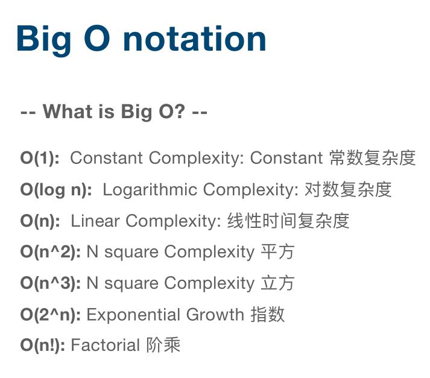
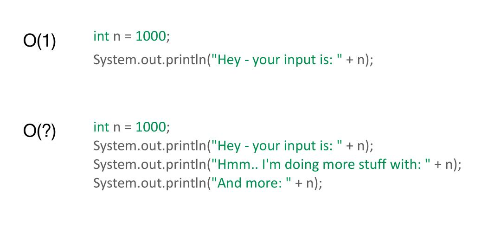
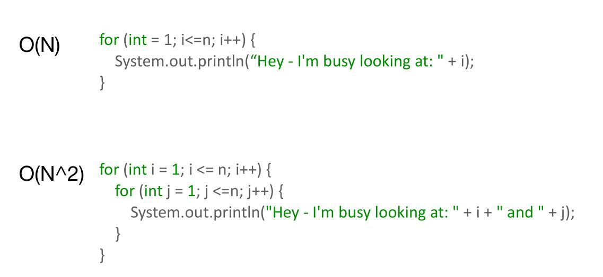
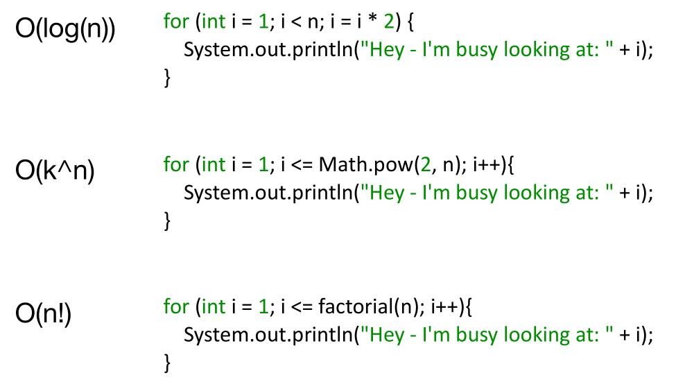
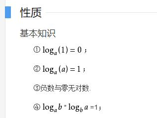
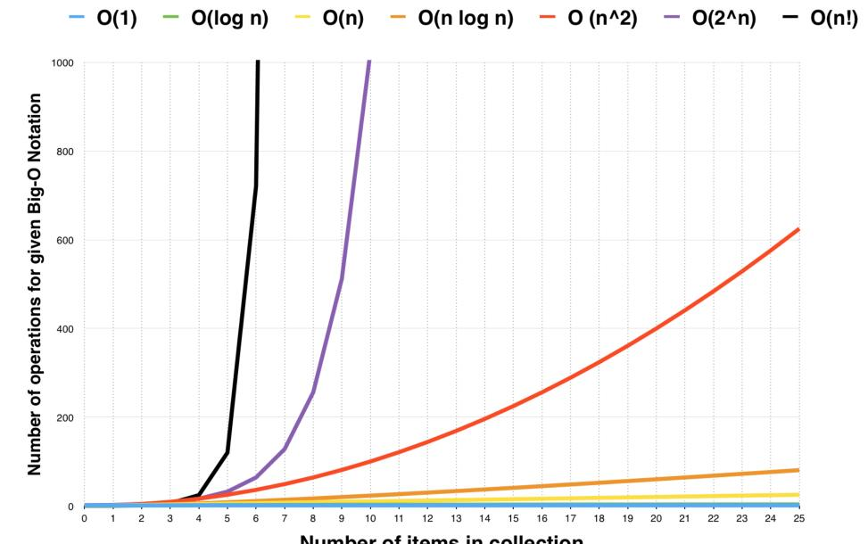
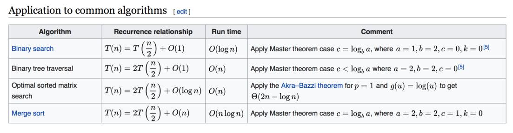

<div class="tip">
	来历：
				
	自身的特点：
		
	适合解决的问题：
		
	实际的应用场景：
		
</div>

## 时间复杂度 ##



<div class="tip">
注意：只看最高复杂度的运算。
		
</div>

## 如何计算 ##







### 常数复杂度 ###

```

	int sum = 0,n = 100;//执行一次
	sum = 1 + n;//执行一次
```
上面时间复杂度：O(1)

### 对数复杂度 ###

```

	int number = 1;
	while(number < n){
		//TODO	
	}
```
上面时间复杂度：O(logn)

<div class="tip">
	对数公式:
	对数公式是数学中的一种常见公式，如果a^x=N(a>0,且a≠1)，则x叫做以a为底N的对数,记做x=log(a)(N)，其中a要写于log右下。其中a叫做对数的底，N叫做真数。通常我们将以10为底的对数叫做常用对数，以e为底的对数称为自然对数。

	
</div>

### 线性复杂度 ###

```

	for(int i = 0;i < n;i++){
		//TODO
	}
```
上面时间复杂度：O(n)

### 平方复杂度 ###

```

	for(int i = 0;i < n;i++){
		for(int j = 0;j < n;j++){
			//TODO
		}
	}
```
上面时间复杂度：O(n^2)

## 时间复杂度的对比 ##



## 主定律 ##




### 参考wiki ###

[https://zh.wikipedia.org/wiki/%E4%B8%BB%E5%AE%9A%E7%90%86](https://zh.wikipedia.org/wiki/%E4%B8%BB%E5%AE%9A%E7%90%86 "https://zh.wikipedia.org/wiki/%E4%B8%BB%E5%AE%9A%E7%90%86")