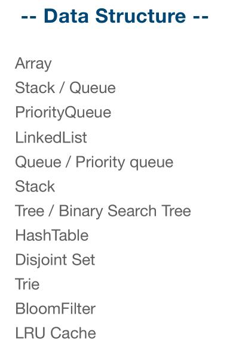
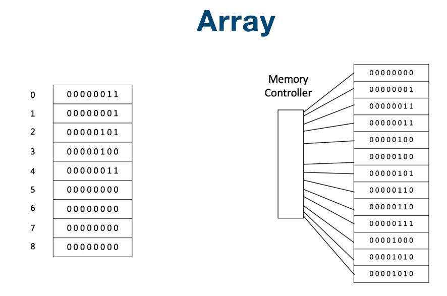
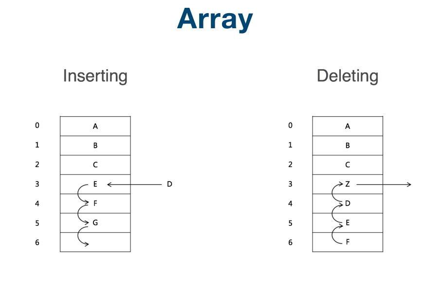
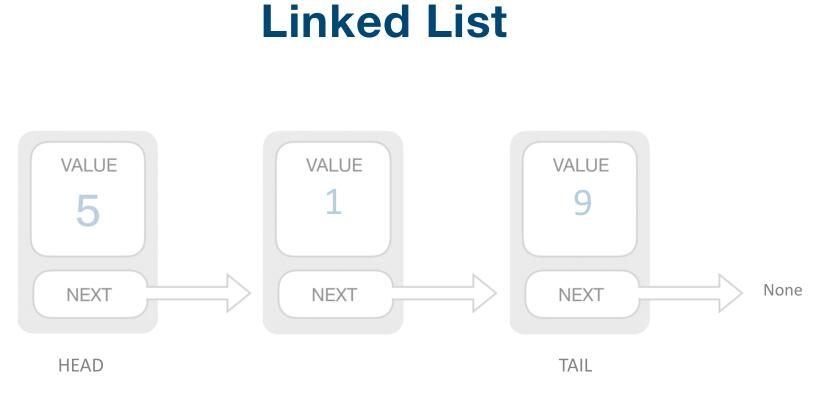
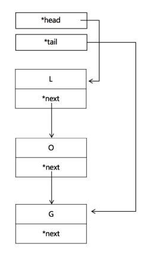
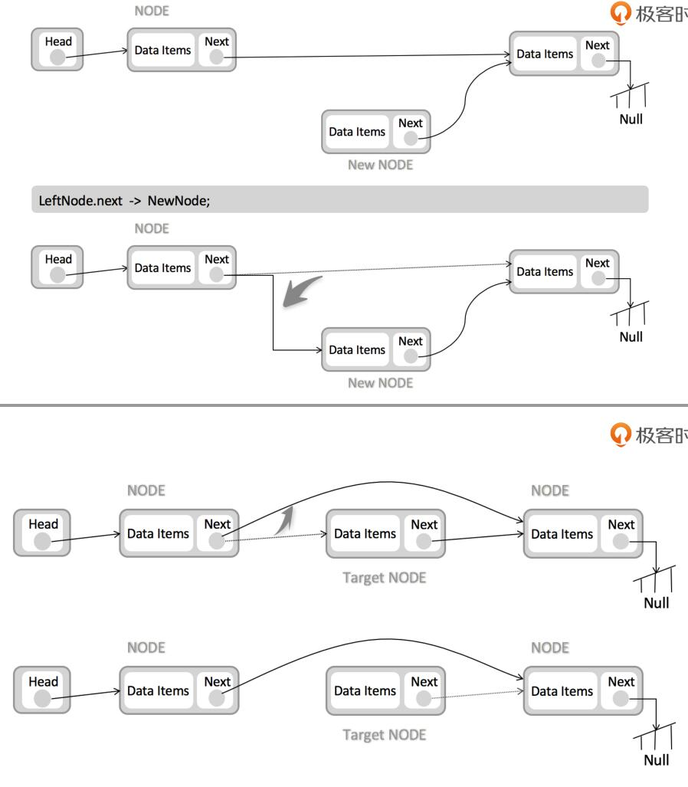
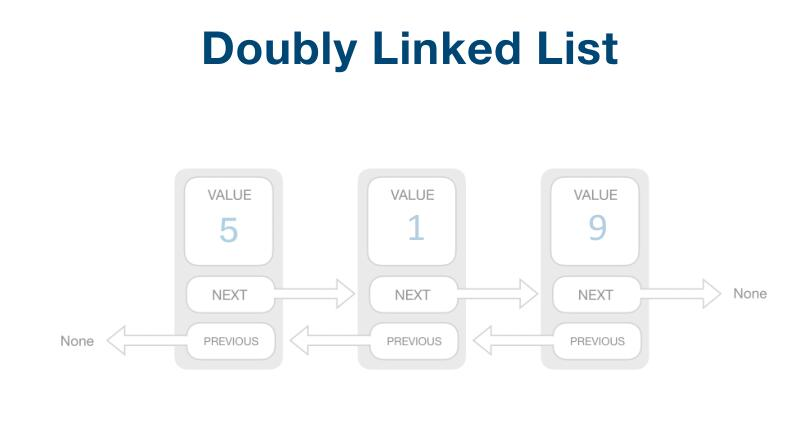

## 数据结构 ##

	简单的讲就是数据在计算机中的存储方式。

	常用的数据存储方式有两种：顺序存储，非顺序存储。顺序存储就是把数据存储在一块联系的存储介质（硬盘或内存等）中。反之就是非顺序存储咯。Java中的数组就是典型的顺序存储，链表就是非顺序存储。数组存储数据时会开辟出一块联系内存，按顺序存储。链表先不会开辟出一块内存来，而是只需要知道下一个节点存储的位置，就能把所以的数据连起来了。所以单向链表的最后一个节点是指向Null的。

### Array - 数组 ###

特点：
- 数据在数组中是连续的。
- 查找快速，插入删除繁琐。
- 查询Access:O(1)。
- 插入Insert:平均O(n)。
- 删除Delete:平均O(n)。

### Linked List - 链表 ###

特点：
- 数据在链表中是连续的，但是数据的存放位置是不连续的。
- 链表有指针指向上一个，下一个，头部或者尾部。
- 查找慢，插入删除快速。
- 查询Access:O(n)。
- 插入Insert:O(1)，头部插入prepend:O(1),尾部插入append:O(1)。
- 删除Delete:O(1)。
- 链表有单链表，双链表。

	在java中创建链表的过程和创建数组的过程不同，不会先划出一块连续的内存。因为链表中的数据并不是连续的，链表在存储数据的内存中有两块区域，一块区域用来存储数据，一块区域用来记录下一个数据保存在哪里（指向下一个数据的指针）。当有数据进入链表时候，会根据指针找到下一个存储数据的位置，然后把数据保存起来，然后再指向下一个存储数据的位置。这样链表就把一些碎片空间利用起来了，虽然链表是线性表，但是并不会按线性的顺序存储数据。

	参考：
	数据结构：数组、链表、栈、队列的理解：[https://www.cnblogs.com/jimoer/p/8783604.html](https://www.cnblogs.com/jimoer/p/8783604.html "https://www.cnblogs.com/jimoer/p/8783604.html")

### 数据结构包括：线性结构和非线性结构。

### 线性结构

1)线性结构作为最常用的数据结构，其特点是数据元素之间存在一对一的线性关系。

2)线性结构有两种不同的存储结构，即顺序存储结构和链式存储结构。顺序存储的线性表称为顺序表，顺序表中的存储元素是连续的。

3)链式存储的线性表称为链表，链表中的存储元素不一定是连续的，元素节点中存放数据元素以及相邻元素的地址信息。

4)线性结构常见的有：数组、队列、链表和栈，后面我们会详细讲解。

### 非线性结构

非线性结构包括：二维数组，多维数组，广义表，树结构，图结构。