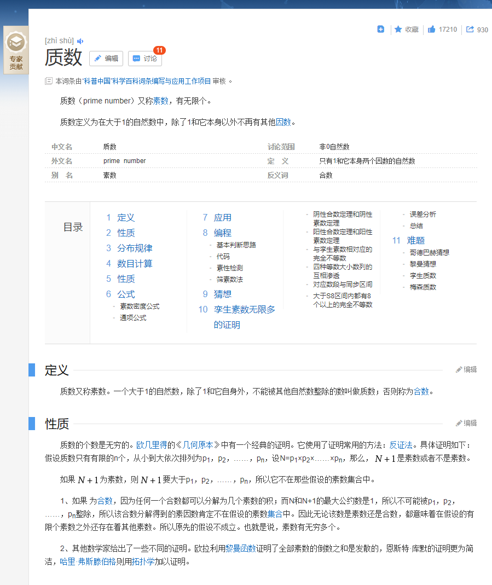
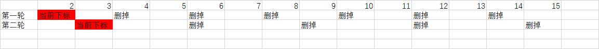

### 求100以内的素数（质数）



[BAD]:

```java
public static void main(String[] args) {

    boolean isFlag = true;//标识i是否被j除尽，一旦除尽，修改其值

    for(int i = 2;i <= 100;i++){//遍历100以内的自然数


        for(int j = 2;j < i;j++){//j:被i去除

            if(i % j == 0){ //i被j除尽
                isFlag = false;
            }

        }
        //
        if(isFlag == true){
            System.out.println(i);
        }
        //重置isFlag
        isFlag = true;

    }
}
```

[NOT BAD]:

```java
@Test
public void primeNumberTest(){
	int[] initList = new int[99];
	int value = 2;
	for (int i = 0; i < initList.length; i++) {
		initList[i] = value;
		value++;
	}
	Arrays.stream(primeNumberAction(initList)).forEach(System.out::println);
}

public int[] primeNumberAction(int[] initList){
	if(initList == null){
		return initList;
	}
	int minValue = 2,tempValue;
	for (int i = 0; i < initList.length; i++) {
		if(initList[i] != -1){
			tempValue = initList[i];
			while (true){

				if(tempValue * minValue > 100){
					minValue = 2;
					break;
				}else{
					initList[(tempValue * minValue) -2] = -1;
					minValue++;
				}
			}
		}
	}
	return Arrays.stream(initList).filter(i -> i > 0).toArray();
}
```



原理：获取当前值，将当前值按顺序相乘并在结果集中去掉，如此类推，知道遍历完结果集中所有的元素。

方法二：

```java
public static void main(String[] args) {

		boolean isFlag = true;//标识i是否被j除尽，一旦除尽，修改其值
		int count = 0;//记录质数的个数

		//获取当前时间距离1970-01-01 00:00:00 的毫秒数
		long start = System.currentTimeMillis();

		for(int i = 2;i <= 100000;i++){//遍历100000以内的自然数

			//优化二：对本身是质数的自然数是有效的。
//			for(int j = 2;j < i;j++){
			for(int j = 2;j <= Math.sqrt(i);j++){//j:被i去除

				if(i % j == 0){ //i被j除尽
					isFlag = false;
					break;//优化一：只对本身非质数的自然数是有效的。
				}

			}
			//
			if(isFlag == true){
				//System.out.println(i);
				count++;
			}
			//重置isFlag
			isFlag = true;

		}

		//获取当前时间距离1970-01-01 00:00:00 的毫秒数
		long end = System.currentTimeMillis();
		System.out.println("质数的个数为：" + count);
		System.out.println("所花费的时间为：" + (end - start));//17110 - 优化一：break:1546 - 优化二：13

	}
```

原理：获取当前值，将当前值开平方根，用此数来作为循环的次数并依次求出是否质数（理论上能找到在当前值开根前对应的除数而余为零的数）。

衍生思路：是否可以根据以获取的质数来遍历相除当前值，但是在操作中，貌似时间和空间复杂程度都没有方法2中的简单，日后日后再待商榷。