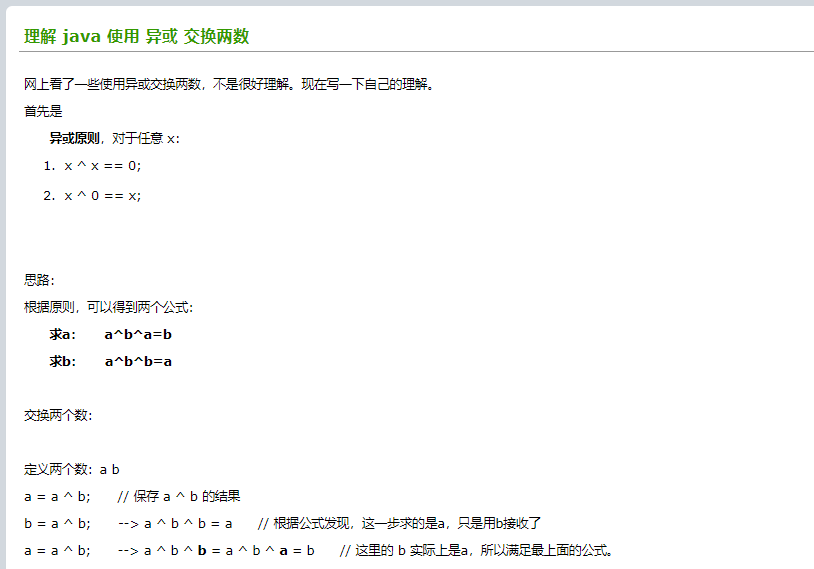

### 冒泡排序

```java
public static void main(String[] args) {
    int[] array = new int[]{1,2,3,2,5};
    Arrays.stream(bubbleSort(array)).forEach(System.out::println);
}

public static int[] bubbleSort(int[] array){
    if(array == null){
        return array;
    }
    int temp;
    for (int i = 0; i < array.length - 1; i++) {
        for (int j = 0; j < array.length - 1 - i; j++) {
            if(array[j] > array[j + 1]){
//                    两两交互，正常编写
//                    temp = array[j];
//                    array[j] = array[j+1];
//                    array[j + 1] = temp;

//                    两两交互，使用异或
                array[j + 1] = array[j + 1] ^ array[j];
                array[j] = array[j + 1] ^ array[j];
                array[j + 1] = array[j + 1] ^ array[j];
            }
        }
    }
    return array;
}
```



> 对应异或的理解，可以参考李梵博客园的理解 java 使用 异或 交换两数https://www.cnblogs.com/bg7c/p/7998935.html

### 快速排序

```java
    private static void swap(int[] data, int i, int j) {
//        int temp = data[i];
//        data[i] = data[j];
//        data[j] = temp;

        data[i] = data[i] ^ data[j];
        data[j] = data[i] ^ data[j];
        data[i] = data[i] ^ data[j];

    }

    private static void subSort(int[] data, int start, int end) {
        if (start < end) {
            int base = data[start];
            int low = start;
            int high = end + 1;
            while (true) {
                while (low < end && data[++low] - base <= 0) {
                }
                while (high > start && data[--high] - base >= 0) {
                }
                if (low < high) {
                    swap(data, low, high);
                } else {
                    break;
                }
            }
            swap(data, start, high);

            subSort(data, start, high - 1);//递归调用
            subSort(data, high + 1, end);
        }
    }

    public static void quickSort(int[] data) {
        //后面哨兵先走一步
        subSort(data, 0, data.length - 1);
    }


    public static void main(String[] args) {
//        int[] data = {10,7,2,4,7,62,3,4,2,1,8,9,19};
        int[] data = {10,7,2,4,7,62};
        quickSort(data);
        Arrays.stream(data).forEach(System.out::println);
    }
```

> 理解参考脚丫先生的CSDN的快速排序（java实现）https://blog.csdn.net/shujuelin/article/details/82423852