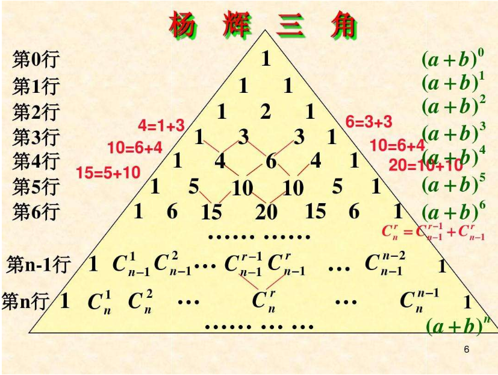

### 杨辉三角



通用公式：

```java
yanghui[i][j] = yanghui[i-1][j-1] + yanghui[i-1][j]
```

```java
public static void main(String[] args) {
	//1.声明并初始化二维数组
	int[][] yangHui = new int[10][];
	
	//2.给数组的元素赋值
	for(int i = 0;i < yangHui.length;i++){
		yangHui[i] = new int[i + 1];
		
		//2.1 给首末元素赋值
		yangHui[i][0] = yangHui[i][i] = 1;
		//2.2 给每行的非首末元素赋值
		//if(i > 1){
		for(int j = 1;j < yangHui[i].length - 1;j++){
			yangHui[i][j] = yangHui[i-1][j-1] + yangHui[i-1][j];
		}
		//}
	}
	
	//3.遍历二维数组
	for(int i = 0;i < yangHui.length;i++){
		for(int j = 0;j < yangHui[i].length;j++){
			System.out.print(yangHui[i][j] + "  ");
		}
		System.out.println();
	}
}
```

