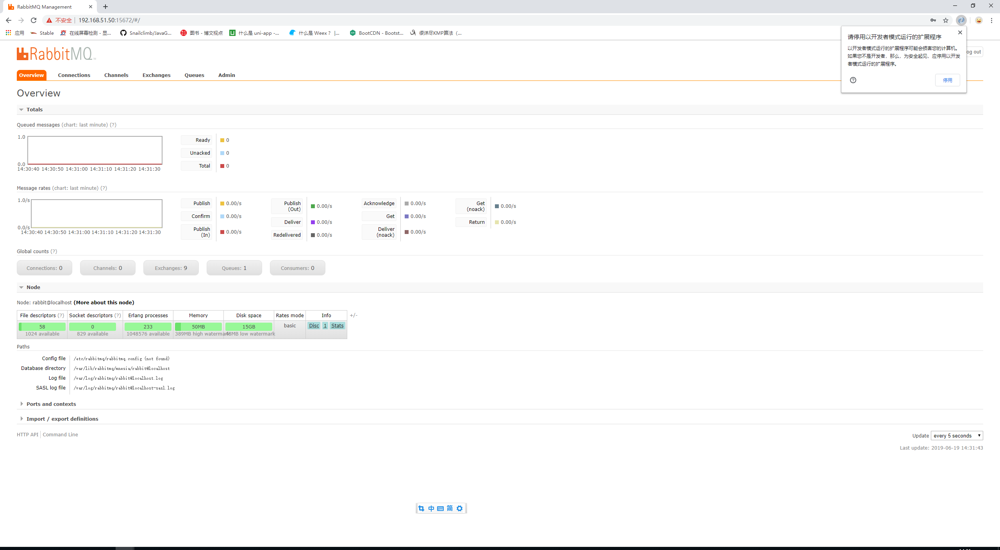

##### 准备

```shell
yum install build-essential openssl openssl-devel unixODBC unixODBC-devel make gcc gcc-c++ kernel-devel m4 ncurses-devel tk tc xz
```

##### 下载

```shell
wget www.rabbitmq.com/releases/erlang/erlang-18.3-1.el7.centos.x86_64.rpm
wget http://repo.iotti.biz/CentOS/7/x86_64/socat-1.7.3.2-5.el7.lux.x86_64.rpm
wget www.rabbitmq.com/releases/rabbitmq-server/v3.6.5/rabbitmq-server-3.6.5-1.noarch.rpm
```

##### 安装顺序

```shell
rpm -ivh erlang-18.3-1.el7.centos.x86_64.rpm
rpm -ivh socat-1.7.3.2-5.el7.lux.x86_64.rpm 
rpm -ivh rabbitmq-server-3.6.5-1.noarch.rpm 
```

3 配置 vim /etc/hosts 以及 /etc/hostname  (Linux防火墙)

3 配置文件：

```shell
vi /usr/lib/rabbitmq/lib/rabbitmq_server-3.6.5/ebin/rabbit.app
```

比如修改密码、配置等等，例如：loopback_users 中的 <<"guest">>,只保留guest

##### 最后

```
{loopback_users, [guest]},
```

##### 服务启动和停止

启动:

```shell
rabbitmq-server start &
```

停止:

````shell
rabbitmqctl app_stop
````

检查：

```shell
[root@localhost software]# lsof -i:5672
[root@localhost software]# rabbitmq-plugins list
```

##### 管理插件：rabbitmq-plugins enable rabbitmq_management

##### 访问地址：http://192.168.11.81:15672/

账号密码为guest

效果图如下图所示：

