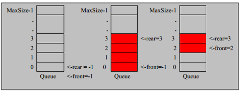

使用数组来模拟队列，之所以叫环形，是因为数组模拟队列的时候，是有序的、有效的更换值到达不浪费数组空间，能重复使用的效果，以下代码中留下留下了一个空余空间来作为约定。

```java
public class CircleArrayQueueDemo {
    public static void main(String[] args) {
        //说明设置4，其队列的有效数据最大是3.
        CircleArray arrayQueue = new CircleArray(4);

        char key = ' ';
        Scanner scanner = new Scanner(System.in);
        boolean loop = true;
        while(loop){
            System.out.println("s(show):显示队列");
            System.out.println("e(exit):退出队列");
            System.out.println("a(add):添加数据队列");
            System.out.println("g(g):从队列取出数据");
            System.out.println("h(head):查看队列头的数据");
            key = scanner.next().charAt(0);
            switch (key){
                case 's':
                    arrayQueue.showQueue();
                    break;
                case 'a':
                    System.out.println("输入一个数");
                    int value = scanner.nextInt();
                    arrayQueue.addQueue(value);
                    break;
                case 'g':
                    try {
                        int res = arrayQueue.getQueue();
                        System.out.printf("取出的数据是%d\n",res);
                    }catch (Exception e){
                        System.out.println(e.getMessage());
                    }
                    break;
                case 'h':
                    try {
                        int res = arrayQueue.headQueue();
                        System.out.printf("队列头的数据是%d\n",res);
                    }catch (Exception e){
                        System.out.println(e.getMessage());
                    }
                    break;
                case 'e':
                    scanner.close();
                    loop = false;
                    break;
                default:
                    break;
            }
        }
        System.out.println("程序退出");
    }
}

//使用数组模拟队列-编写一个ArrayQueue类

class CircleArray{
    //表示数组的最大容量
    private int maxSize;

    //队列头,默认为0
    private int front;

    //队列尾,默认为0
    private int rear;

    //该数组存放数据，模拟队列
    private int[] arr;

    //创建队列的构造器
    public CircleArray(int arrMaxSize){

        maxSize = arrMaxSize;

        arr = new int[maxSize];
    }

    //判断队列是否满
    public boolean isFull(){
        return (rear + 1) % maxSize == front;
    }

    //判断队列是否为空
    public boolean isEmpty(){
        return rear == front;
    }

    //添加数据到队列
    public void addQueue(int n){
        if(isFull()){
            System.out.println("队列满，不能添加数据~");
            return;
        }
        //直接将数据加入
        arr[rear] = n;
        //将rear后移，这里要考虑去模
        rear = (rear + 1) % maxSize;
    }

    //获取队列的数据，出队列
    public int getQueue(){
        //判断队列是否为空
        if(isEmpty()){
            //通过抛出异常来处理
            throw new RuntimeException("队列空，不能取数据");
        }
        //这里需要分析出front是指向队列的第一个元素
        //1.先把front的对应的值保持到一个临时变量。
        //2.将front后移
        //3.将临时保存的遍历返回
        int value = arr[front];
        front = (front + 1) % maxSize;
        return value;
    }

    //显示队列的所有数据
    public void showQueue(){
        //遍历
        if(isEmpty()){
            System.out.println("队列空的，没有数据~");
            return;
        }
        //思路：从front开始遍历，遍历多少个元素
        //1.
        for (int i = front; i < front + size() ; i++) {
            System.out.printf("arr[%d]=%d\n",i % maxSize,arr[i % maxSize]);
        }
    }

    //求出当前队列有效数据的个数
    public int size(){
        return (rear + maxSize - front) % maxSize;
    }

    //显示队列的头数据，注意不是取出数据
    public int headQueue(){
        if(isEmpty()){
            throw new RuntimeException("队列空，不能取数据");
        }
        return arr[front];
    }

}
```

