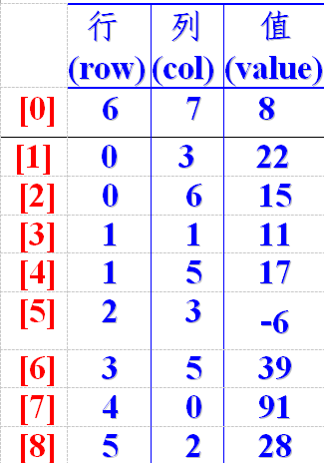

日常编程或许存储以上的数据会用到二维数组，但是如何能减轻存储的数量呢？这时候稀疏数组就能帮助到你。



```java
public class SparseArray {

    public static void main(String[] args) {
        //创建一个原始的二维数组11 * 11
        //0表示没有棋，1表示黑棋，2表示蓝棋
        int chessArr1[][] = new int[11][11];
        chessArr1[1][2] = 1;
        chessArr1[2][3] = 2;
        chessArr1[4][5] = 2;

        /**
         * 使用原始数组
         */
        for (int[] row : chessArr1) {
            for (int col : row) {
                System.out.printf("%d\t",col);
            }
            System.out.println();
        }

        /**
         * 使用稀疏数组
         */
        int sum = 0;
        for (int i = 0; i < chessArr1.length; i++) {
            for (int j = 0; j < chessArr1.length; j++) {
                if(chessArr1[i][j] != 0){
                    sum++;
                }
            }
        }
//        System.out.println("sum=" + sum);
        //创建对应的稀疏数组
        int sparseArr[][] = new int[sum+1][3];
        //给稀疏数组赋值
        sparseArr[0][0] = 11;
        sparseArr[0][1] = 11;
        sparseArr[0][2] = sum;

        //遍历二维数组，将非0的值存放到稀疏数组
        int total = 0;
        for (int i = 0; i < chessArr1.length; i++) {
            for (int j = 0; j < chessArr1.length; j++) {
                if(chessArr1[i][j] != 0){
                    total++;
                    sparseArr[total][0] = i;
                    sparseArr[total][1] = j;
                    sparseArr[total][2] = chessArr1[i][j];
                }
            }
        }

        //输出稀疏数组的形式
        System.out.println();
        System.out.println("得到的稀疏数组如下：");
        for (int i = 0; i < sparseArr.length; i++) {
            System.out.printf("%d\t%d\t%d\t\n",sparseArr[i][0],sparseArr[i][1],sparseArr[i][2]);
        }

        //将稀疏数组恢复原始二维数组
        // 1.先读稀疏数组第一行，获取原始数据的二维数组
        // 2.获取稀疏数组后几行，获取数据即可

        System.out.println("将稀疏数组恢复原始二维数组如下：");
        int chessArr2[][] = new int[sparseArr[0][0]][sparseArr[0][1]];
        for (int i = 1; i < sparseArr.length; i++) {
            chessArr2[sparseArr[i][0]][sparseArr[i][1]] = sparseArr[i][2];
        }
        for (int[] row : chessArr2) {
            for (int col : row) {
                System.out.printf("%d\t",col);
            }
            System.out.println();
        }
    }
}
```

