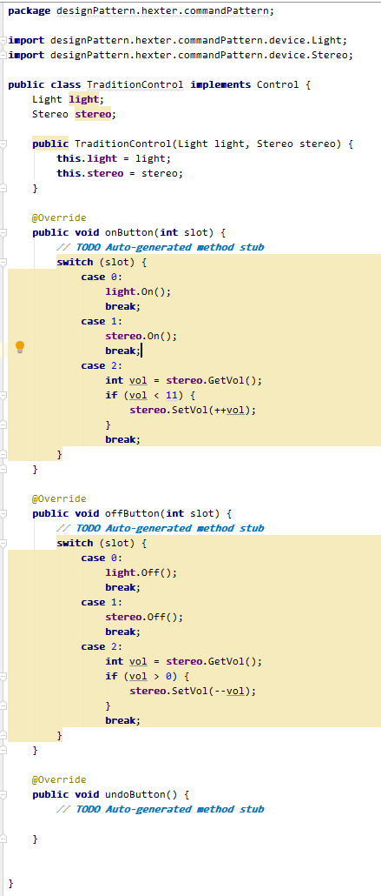

### 感想 ###

命令模式：将请求、命令、动作等封装成对象，这样可以让项目使用这些对象来参数化其他对象。是的命令的请求者和执行者解耦。

例子以一行2个按钮的遥控器作示范。

如下图所示，若添加新的设备，则需要在该类中添加新的成员变量，及实现的方法中添加更多的代码，使得代码耦合度高，相互依赖大，影响后期的维护以及开发。



1.将请求、命令、动作等分类为一个接口，可以当作为执行命令，如下：

```
    public interface Command {
        public void execute();
        public void undo();
    }
```

2.设备类，如下：

```
    public class Light {

        String loc = "";

        public Light(String loc) {
            this.loc = loc;
        }

        public void On() {

            System.out.println(loc + " On");
        }

        public void Off() {

            System.out.println(loc + " Off");
        }

    }
```

```
    public class Stereo {
        static int volume = 0;

        public void On() {
            System.out.println("Stereo On");
        }

        public void Off() {
            System.out.println("Stereo Off");
        }

        public void SetCd() {
            System.out.println("Stereo SetCd");
        }

        public void SetVol(int vol) {
            volume = vol;
            System.out.println("Stereo volume=" + volume);
        }

        public int GetVol() {
            return volume;
        }

        public void Start() {
            System.out.println("Stereo Start");
        }
    }
```

3.将遥控器上面的按钮划分为3种，如下：

```
    public interface Control {

        public void onButton(int slot);

        public void offButton(int slot);

        public void undoButton();
    }
```

4.设置设备的命令，如灯的开关，音响的开关，设置音响的大小声量，如下：

```
    public class LightOffCommand implements Command {
        private Light light;

        public LightOffCommand(Light light) {
            this.light = light;
        }

        @Override
        public void execute() {
            // TODO Auto-generated method stub
            light.Off();
        }

        @Override
        public void undo() {
            // TODO Auto-generated method stub
            light.On();
        }

    }
```

```
    public class LightOffCommand implements Command {
        private Light light;

        public LightOffCommand(Light light) {
            this.light = light;
        }

        @Override
        public void execute() {
            // TODO Auto-generated method stub
            light.Off();
        }

        @Override
        public void undo() {
            // TODO Auto-generated method stub
            light.On();
        }

    }
```

```
    public class StereoAddVolCommand implements Command {
        private Stereo setreo;

        public StereoAddVolCommand(Stereo setreo) {
            this.setreo = setreo;
        }

        @Override
        public void execute() {
            // TODO Auto-generated method stub
            int vol = setreo.GetVol();
            if (vol < 11) {
                setreo.SetVol(++vol);
            }

        }

        @Override
        public void undo() {
            // TODO Auto-generated method stub
            int vol = setreo.GetVol();
            if (vol > 0) {
                setreo.SetVol(--vol);
            }

        }

    }
```

```
    public class StereoOffCommand implements Command {
        private Stereo setreo;

        public StereoOffCommand(Stereo setreo) {
            this.setreo = setreo;
        }

        @Override
        public void execute() {
            // TODO Auto-generated method stub
            setreo.Off();
        }

        @Override
        public void undo() {
            // TODO Auto-generated method stub
            setreo.On();
            setreo.SetCd();
        }

    }
```

```
    public class StereoOnCommand implements Command {
        private Stereo setreo;

        public StereoOnCommand(Stereo setreo) {
            this.setreo = setreo;
        }

        @Override
        public void execute() {
            // TODO Auto-generated method stub
            setreo.On();
            setreo.SetCd();

        }

        @Override
        public void undo() {
            // TODO Auto-generated method stub
            setreo.Off();
        }

    }
```

```
    public class StereoSubVolCommand implements Command {
        private Stereo setreo;

        public StereoSubVolCommand(Stereo setreo) {
            this.setreo = setreo;
        }

        @Override
        public void execute() {
            // TODO Auto-generated method stub
            int vol = setreo.GetVol();
            if (vol > 0) {
                setreo.SetVol(--vol);
            }

        }

        @Override
        public void undo() {
            // TODO Auto-generated method stub
            int vol = setreo.GetVol();
            if (vol < 11) {
                setreo.SetVol(++vol);
            }

        }

    }
```

5.可以设置按钮为空命令模式，如下：

```
    public class NoCommand implements Command {

        @Override
        public void execute() {
            // TODO Auto-generated method stub

        }

        @Override
        public void undo() {
            // TODO Auto-generated method stub

        }

    }
```

6.可以设置组合键，如下：

```
    public class MarcoCommand implements Command {

        private Command[] commands;

        public MarcoCommand(Command[] commands) {
            this.commands = commands;
        }

        @Override
        public void execute() {
            // TODO Auto-generated method stub
            for (int i = 0, len = commands.length; i < len; i++) {
                commands[i].execute();
            }
        }

        @Override
        public void undo() {
            // TODO Auto-generated method stub
            for (int i = commands.length - 1; i >= 0; i--) {
                commands[i].undo();

            }
        }

    }
```

7.实现遥控器，如下：

```
    public class CommandModeControl implements Control {
        private Command[] onCommands;
        private Command[] offCommands;
        private Stack<Command> stack = new Stack<Command>();

        public CommandModeControl() {
            //设置6行的按钮，每行按钮有2个
            onCommands = new Command[5];
            offCommands = new Command[5];

            Command noCommand = new NoCommand();

            //默认初始化的时候按钮处于空命令模式，此处的作用用于不用在onButton，offButton和undoButton中判断对象。
            for (int i = 0, len = onCommands.length; i < len; i++) {
                onCommands[i] = noCommand;
                offCommands[i] = noCommand;
            }

        }

        //设置每行按钮的需要执行的命令，此处每行有2个按钮，则需要传递2个命令以及对于的行数
        public void setCommand(int slot, Command onCommand, Command offCommand) {
            onCommands[slot] = onCommand;
            offCommands[slot] = offCommand;

        }

        @Override
        public void onButton(int slot) {

            onCommands[slot].execute();
            stack.push(onCommands[slot]);
        }

        @Override
        public void offButton(int slot) {

            offCommands[slot].execute();
            stack.push(offCommands[slot]);
        }

        @Override
        public void undoButton() {
            // TODO Auto-generated method stub
            stack.pop().undo();
        }

    }
```

8.遥控器的使用，如下：

```
    public class ControlTest {

        public static void main(String[] args) {
            CommandModeControl control = new CommandModeControl();

            //组合键
            MarcoCommand onmarco, offmarco;

            //不同设备
            Light bedroomlight = new Light("BedRoom");
            Light kitchlight = new Light("Kitch");
            Stereo stereo = new Stereo();

            //灯的命令
            LightOnCommand bedroomlighton = new LightOnCommand(bedroomlight);
            LightOffCommand bedroomlightoff = new LightOffCommand(bedroomlight);
            LightOnCommand kitchlighton = new LightOnCommand(kitchlight);
            LightOffCommand kitchlightoff = new LightOffCommand(kitchlight);

            //灯具有组合使用
            Command[] oncommands = {bedroomlighton, kitchlighton};
            Command[] offcommands = {bedroomlightoff, kitchlightoff};

            onmarco = new MarcoCommand(oncommands);
            offmarco = new MarcoCommand(offcommands);

            //音响的命令
            StereoOnCommand stereoOn = new StereoOnCommand(stereo);
            StereoOffCommand stereoOff = new StereoOffCommand(stereo);
            StereoAddVolCommand stereoaddvol = new StereoAddVolCommand(stereo);
            StereoSubVolCommand stereosubvol = new StereoSubVolCommand(stereo);

            //将灯设置在遥控上，一行2个按钮
            control.setCommand(0, bedroomlighton, bedroomlightoff);
            control.setCommand(1, kitchlighton, kitchlightoff);
            control.setCommand(2, stereoOn, stereoOff);
            control.setCommand(3, stereoaddvol, stereosubvol);
            control.setCommand(4, onmarco, offmarco);

            //使用遥控器
            control.onButton(0);
            control.undoButton();
            //control.offButton(0);
            control.onButton(1);
            control.offButton(1);
            control.onButton(2);
            control.onButton(3);

            control.offButton(3);
            control.undoButton();
            control.offButton(2);
            control.undoButton();
            control.onButton(4);
            control.offButton(4);
        }

    }
```

最后，通过接口的统一并实现接口内的方法，使遥控器中的控制更加容易及规范，加上遥控器中对排列的设计以及记录命令执行的顺序，添加了遥控器的功能，该命令模式在其中运用合理。