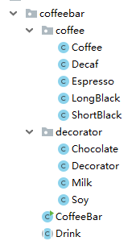

### 感想 ###

引用在网上搜索的资料：


装饰者模式:动态的将新功能附加到对象上。在对象功能扩展方面，它比继承更有弹性 。

意图： 动态地给一个对象添加一些额外的职责。就增加功能来说， Decorator模式相比生成子类更为灵活。该模式以对客 户端透明的方式扩展对象的功能。
	
适用环境：

（1）在不影响其他对象的情况下，以动态、透明的方式给单个对象添加职责。
（2）处理那些可以撤消的职责。
（3）当不能采用生成子类的方法进行扩充时。一种情况是，可能有大量独立的扩展，为支持每一种组合将产生大量的 子类，使得子类数目呈爆炸性增长。另一种情况可能是因为类定义被隐藏，或类定义不能用于生成子类。

参与者：

1.Component（被装饰对象的基类）：定义一个对象接口，可以给这些对象动态地添加职责。

2.ConcreteComponent（具体被装饰对象）：定义一个对象，可以给这个对象添加一些职责。

3.Decorator（装饰者抽象类）：维持一个指向Component实例的引用，并定义一个与Component接口一致的接口。

4.ConcreteDecorator（具体装饰者）：具体的装饰对象，给内部持有的具体被装饰对象，增加具体的职责。


1.模式结构



2.关键在于Coffee，Decorator，Drink，代码如下：

Coffee：
```java
public class Coffee extends Drink {

	@Override
	public float cost() {
		return super.getPrice();
	}
}
```

Decaf：
```java
public class Decaf extends Coffee {

	public Decaf() {
		super.setDescription("Decaf");
		super.setPrice(3.0f);
	}
}
```

Espresso：
```java
public class Espresso extends Coffee {

	public Espresso() {
		super.setDescription("Espresso");
		super.setPrice(4.0f);
	}

}
```

LongBlack：
```java
public class LongBlack extends Coffee {

	public LongBlack() {
		super.setDescription("LongBlack");
		super.setPrice(6.0f);
	}

}
```

ShortBlack：
```java
public class ShortBlack extends Coffee {

	public ShortBlack() {
		super.setDescription("ShortBlack");
		super.setPrice(5.0f);
	}

}
```

Chocolate：
```java
public class Chocolate extends Decorator {

	public Chocolate(Drink Obj) {		
		super(Obj);
		super.setDescription("Chocolate");
		super.setPrice(3.0f);
	}

}
```

Decorator：
```java
public class Decorator extends Drink {

	private Drink Obj;

	public Decorator(Drink Obj) {
		this.Obj = Obj;
	}

	@Override
	public float cost() {
		return super.getPrice() + Obj.cost();
	}

	@Override
	public String getDescription() {
		return super.description + "-" + super.getPrice() + "&&" + Obj.getDescription();
	}

}
```

Milk：
```java
public class Milk extends Decorator {

	public Milk(Drink Obj) {		
		super(Obj);
		super.setDescription("Milk");
		super.setPrice(2.0f);
	}

}
```

Soy：
```java
public class Soy extends Decorator {

	public Soy(Drink Obj) {		
		super(Obj);
		super.setDescription("Soy");
		super.setPrice(1.5f);
	}

}
```

CoffeeBar：
```java
public class CoffeeBar {
	public static void main(String[] args) {

		Drink order;
		order = new Decaf();
		System.out.println("order1 price:" + order.cost());
		System.out.println("order1 desc:" + order.getDescription());

		System.out.println("****************");
		order = new LongBlack();
		order = new Milk(order);
		order = new Chocolate(order);
		order = new Chocolate(order);
		System.out.println("order2 price:" + order.cost());
		System.out.println("order2 desc:" + order.getDescription());

	}
}
```

Drink：
```java
public abstract class Drink {

	public String description = "";
	private float price = 0f;

	public void setDescription(String description) {
		this.description = description;
	}

	public String getDescription() {
		return description + "-" + this.getPrice();
	}

	public float getPrice() {
		return price;
	}

	public void setPrice(float price) {
		this.price = price;
	}

	public abstract float cost();

}
```

