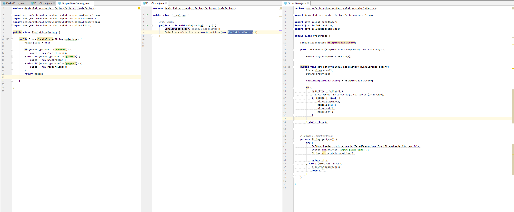
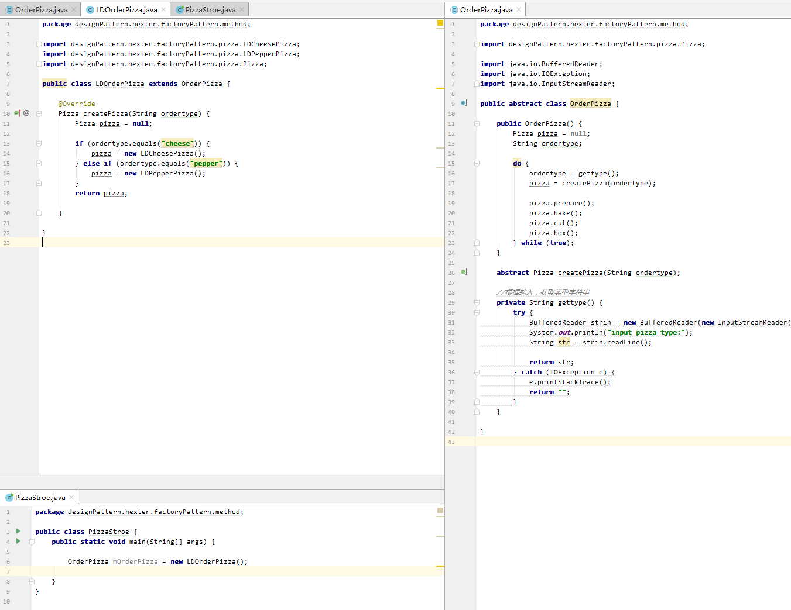
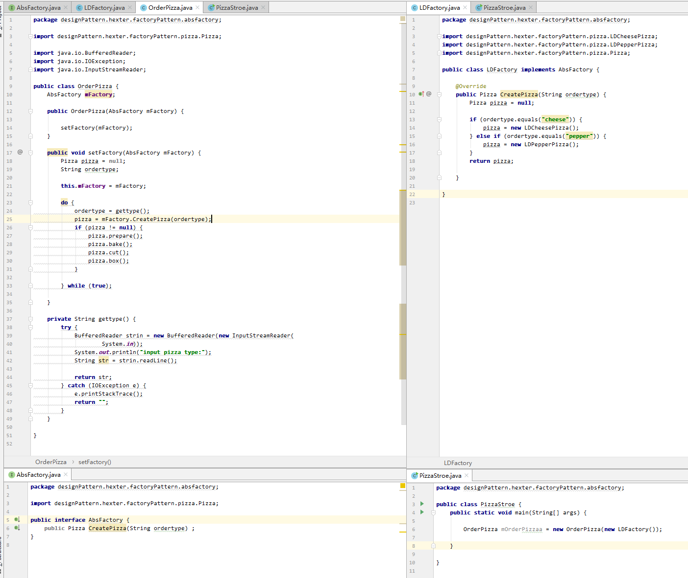

### 感想 ###

这里主要有2种工厂模式：

1. 简单工厂模式
2. 抽象工厂模式

#### 简单工厂模式

这里引用鹏鹏的博客为例子（https://www.cnblogs.com/liaoweipeng/p/5768197.html）：

简单工厂模式的概念:
建立一个工厂类，对实现了同一接口的一些类进行实例的创建。简单工厂模式的实质是由一个工厂类根据传入的参数，动态决定应该创建哪一个产品类（这些产品类继承自一个父类或接口）的实例。
	
学习简单工厂模式的时候我用的是一个与人类有相关的例子。人类在世界分为男人和女人，首先定义一个Human产品的抽象接口。

```
    /**
     * 产品的抽象接口  人类
     * @author liaowp
     *
     */
    public interface Human {

        public void say();

    }
```

然后定义男人和女人，同样都有说话的方法。

```
    /**
     * man  男人
     * @author liaowp
     *
     */
    public class Man implements Human {

        /* say method
         * @see com.roc.factory.Human#say()
         */
        @Override
        public void say() {
            System.out.println("男人");
        }

    }
```

```
    /**女人
     * @author liaowp
     *
     */
    public class Woman implements Human {

        /* say method
         * @see com.roc.factory.Human#say()
         */
        @Override
        public void say() {
            System.out.println("女人");
        }

    }
```

最后写一个工厂类，用来创造男人和女人。第一种方式是使用逻辑判断的方式实现的。

```
    /**
     * 简单工厂
     * @author liaowp
     *
     */
    public class SampleFactory {
        public static Human makeHuman(String type){
            if(type.equals("man")){
                Human man = new Man();
                return man;
            }else if(type.equals("womman")){
                Human woman = new Woman();
                return woman;
            }else{
                System.out.println("生产不出来");
                return null;
            }            
        }
    }
```

第二方式是使用java的放射实现的，我觉得这一类的实现方式比较好。

```
    /**
     * 简单工厂放射实现
     * @author liaowp
     *
     */
    public class SampleFactory1 {
        public static Human makeHuman(Class c){
            Human human = null;
            try {
                human = (Human) Class.forName(c.getName()).newInstance();
            } catch (InstantiationException e) {
                // TODO Auto-generated catch block
                System.out.println("不支持抽象类或接口");
                e.printStackTrace();
            } catch (IllegalAccessException e) {
                // TODO Auto-generated catch block
                e.printStackTrace();
                System.out.println("没有足够权限，即不能访问私有对象");
            } catch (ClassNotFoundException e) {
                // TODO Auto-generated catch block
                System.out.println("类不存在");
                e.printStackTrace();
            }    
            return human;
        }
    }
```

客户端的代码:

```
    public class Client {
        public static void main(String[] args) {
    //        Human man = SampleFactory.makeHuman("man");
    //        man.say();
    //        Human womman = SampleFactory.makeHuman("womman");
    //        womman.say();
    //        Human test = SampleFactory.makeHuman("tttt");

            Human man = SampleFactory1.makeHuman(Man.class);
            man.say();
            Human woman = SampleFactory1.makeHuman(Woman.class);
            woman.say();
        }
    }
```

另外一个例子如下，如下图：



简单工厂模式：定义了一个创建对象的类，由这个类来封装实例化对象行为。

随着业务的增长，会发现简单工厂模式会出现一些问题，在工厂内所有实例化的对象在操作的时候都无法进行特殊化的自定义，若是可以能把实例化对象的操作单独独立起来，能自己实现就更加自由，此时工厂方法模式正满足你这样的需求。

工厂方法模式，如下图：



工厂方法模式：定义了一个创建对象的抽象方法（createPizza(String ordertype)），由子类决定要实例化的类。工厂方法模式将对象的实例化推迟到子类。

工厂方法模式像更换生产线从而到达自由切换实例化不同的对象的效果，那么能不能通过切换工厂而达到相同的效果能，答案是能，可以使用抽象工厂模式。

抽象工厂模式，如下图：



抽象工厂模式：定义了一个接口用于创建相关或有依赖关系的对象族，而无需明确指定具体类。