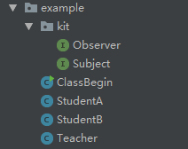
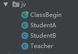

### 感想 ###

引用runoob.com上面的一句话：一个对象（目标对象）的状态发生改变，所有的依赖对象（观察者对象）都将得到通知，进行广播通知。

以下以老师讲解答案为例子，分析观察者模式。

1.模式结构



2.1创建kit包，并在其下创建Observer接口，代码如下：
```java
public interface Observer {
	public void update(String answer);
}
```

2.2创建kit包，并在其下创建Subject接口，代码如下：
```java
public interface Subject {
	/**
	 * 注册
	 * @param o
	 */
	public void registerObserver(Observer o);

	/**
	 * 移除
	 * @param o
	 */
	public void removeObserver(Observer o);

	/**
	 * 通知
	 */
	public void notifyObserver();
}
```

2.3创建ClassBegin类，代码如下：
```java
public class ClassBegin {
	public static void main(String[] args) {

		//老师开始对答案
		Teacher teacher = new Teacher();
		StudentA studentA = new StudentA();
		StudentB studentB = new StudentB();

		teacher.registerObserver(studentA);
		teacher.registerObserver(studentB);

		//答案1
		teacher.setAnswer("1");

		//同学B上洗手间
		teacher.removeObserver(studentB);

		System.out.println("同学B上洗手间");

		//答案5
		teacher.setAnswer("5");
	}
}
```

2.4创建StudentA类，代码如下：
```java
public class StudentA implements Observer {

	private String answer;

	public void check(){
		System.out.println("同学A - 答案：" + answer);
	}

	@Override
	public void update(String answer) {
		this.answer = answer;
		check();
	}
}
```

2.5创建StudentB类，代码如下：
```java
public class StudentB implements Observer {

	private String answer;

	public void check(){
		System.out.println("同学B - 答案：" + answer);
	}

	@Override
	public void update(String answer) {
		this.answer = answer;
		check();
	}
}
```

2.6创建Teacher类，代码如下：
```java
public class Teacher implements Subject {

	private ArrayList<Observer> classList;
	private String answer;

	public String getAnswer() {
		return answer;
	}

	public Teacher() {
		classList = new ArrayList<>();
	}

	public void setAnswer(String answer){
		this.answer = answer;
		answerChange();
	}

	public void answerChange(){
		notifyObserver();
	}

	@Override
	public void registerObserver(Observer student) {
		classList.add(student);
	}

	@Override
	public void removeObserver(Observer student) {
		if(classList.contains(student)){
			classList.remove(student);
		}
	}

	@Override
	public void notifyObserver() {
		for (Observer student : classList) {
			student.update(getAnswer());
			System.out.println("1");
		}
	}
}
```

2.7运行ClassBegin中的main方法，结果如下：

```
同学A - 答案：1
同学B - 答案：1
同学B上洗手间
同学A - 答案：5
```

接下来，我我们尝试用java内置的观察者模式来模拟上面的例子。

3.1模式结构：



3.2创建ClassBegin类，代码如下：
```java
public class ClassBegin {
	public static void main(String[] args) {
		Teacher teacher = new Teacher();
		StudentA studentA = new StudentA();
		StudentB studentB = new StudentB();

		teacher.addObserver(studentA);
		teacher.addObserver(studentB);

		//答案1
		teacher.setAnswer("1");

		//同学B上洗手间
		teacher.deleteObserver(studentB);

		System.out.println("同学B上洗手间");

		//答案5
		teacher.setAnswer("5");
	}
}
```

3.3创建StudentA类，代码如下：
```java
/**
 * @author:porschan
 * @description:
 * @date: Created in 8:24 2019/3/10
 * @modified By:
 */

public class StudentA implements Observer {

	private String answer;

	public void check(){
		System.out.println("同学A - 答案：" + answer);
	}

	@Override
	public void update(Observable o, Object arg) {
		this.answer = (String)arg;
		check();
	}
}
```

3.4创建StudentB类，代码如下：
```java
/**
 * @author:porschan
 * @description:
 * @date: Created in 8:24 2019/3/10
 * @modified By:
 */

public class StudentB implements Observer {
	private String answer;

	public void check() {
		System.out.println("同学B - 答案：" + answer);
	}

	@Override
	public void update(Observable o, Object arg) {
		this.answer = (String) arg;
		check();
	}
}
```

3.5创建Teacher类，代码如下：
```java
/**
 * @author:porschan
 * @description:
 * @date: Created in 18:22 2019/3/9
 * @modified By:
 */

public class Teacher extends Observable {

	private String answer;

	public String getAnswer() {
		return answer;
	}

	public void setAnswer(String answer){
		this.answer = answer;
		answerChange();
	}

	public void answerChange(){
		this.setChanged();//设置变量
		this.notifyObservers(getAnswer());
	}

}
```

2.7运行ClassBegin中的main方法，结果如下：

```
同学B - 答案：1
同学A - 答案：1
同学B上洗手间
同学A - 答案：5
```

由此可见，java内置的观察者模式能直接用，但是Observable是一个对象并不是接口，继承不能多个，因此在选择是选择java内置的，还是自己自定义的都要认真考虑，内置的模式还需要设置setChanged(),以反馈给需要真正放出通知，不然不会通知给各个Observer，通知的顺序是先进后出的模式。