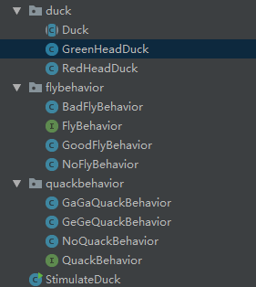

### 感想 ###

我们对可变的东西规划为一种接口，实现变化则实现接口，并在抽象对象中，添加可变的接口，以到达继承抽象类的时候，能够灵活的调整而无需进行大规模的调整。

1.模式结构



2.对可变的规划为接口，代码如下：

```java
public interface FlyBehavior {
	void fly();
}
```

2.对接口进行实现，代码如下：

飞得慢的行为：

```java
public class BadFlyBehavior implements FlyBehavior {
	@Override
	public void fly() {
		System.out.println("--BadFly--");
	}
}
```

飞得好的行为：

```java
public class GoodFlyBehavior implements FlyBehavior {
	@Override
	public void fly() {
		System.out.println("--GoodFly--");
	}
}
```

不会飞的行为：

```java
public class NoFlyBehavior implements FlyBehavior {
	@Override
	public void fly() {
		System.out.println("--NoFly--");
	}
}
```

4.再抽象对象中添加可变的接口，并附带有Set方法，代码如下：

```java
public abstract class Duck {

	FlyBehavior mFlyBehavior;
	QuackBehavior mQuackBehavior;

	public Duck() {}

	public void Fly() {
		mFlyBehavior.fly();
	}

	public void Quack() {
		mQuackBehavior.quack();
	}

	public abstract void display();

	public void swim() {
		System.out.println("~~im swim~~");
	}

	public void SetQuackBehavoir(QuackBehavior qb) {
		mQuackBehavior = qb;
	}

	public void SetFlyBehavoir(FlyBehavior fb) {
		mFlyBehavior = fb;
	}

}
```

4.继承抽象对象，并实现抽象方法并可添加实现接口的方法，代码如下：

实现1：

```java
public class GreenHeadDuck extends Duck {

	public GreenHeadDuck() {
		mFlyBehavior = new GoodFlyBehavior();
		mQuackBehavior = new GaGaQuackBehavior();
	}

	@Override
	public void display() {
		System.out.println("**GreenHead**");
	}

}
```

实现2：

```java
public class RedHeadDuck extends Duck {

	public RedHeadDuck() {
		mFlyBehavior = new BadFlyBehavior();
		mQuackBehavior = new GeGeQuackBehavior();
	}

	@Override
	public void display() {
		System.out.println("**RedHead**");
	}

}
```

5.使用，代码如下：

```java
public class StimulateDuck {

	//策略模式
	public static void main(String[] args) {

		Duck mGreenHeadDuck = new GreenHeadDuck();
		Duck mRedHeadDuck = new RedHeadDuck();

		mGreenHeadDuck.display();
		mGreenHeadDuck.Fly();
		mGreenHeadDuck.Quack();
		mGreenHeadDuck.swim();

		mRedHeadDuck.display();
		mRedHeadDuck.Fly();
		mRedHeadDuck.Quack();
		mRedHeadDuck.swim();
		mRedHeadDuck.display();
		mRedHeadDuck.SetFlyBehavoir(new NoFlyBehavior());
		mRedHeadDuck.Fly();
		mRedHeadDuck.SetQuackBehavoir(new NoQuackBehavior());
		mRedHeadDuck.Quack();
	}

}
```