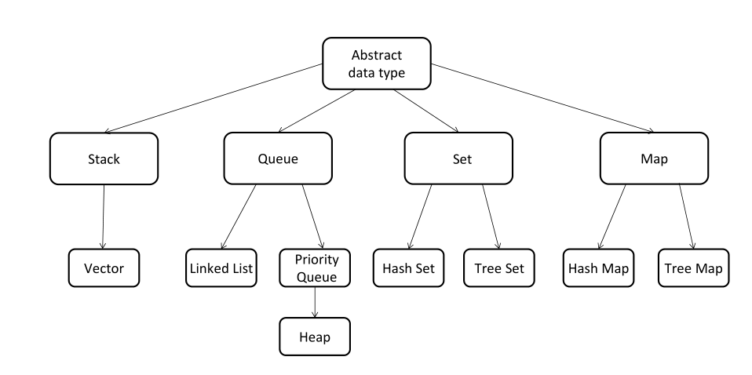
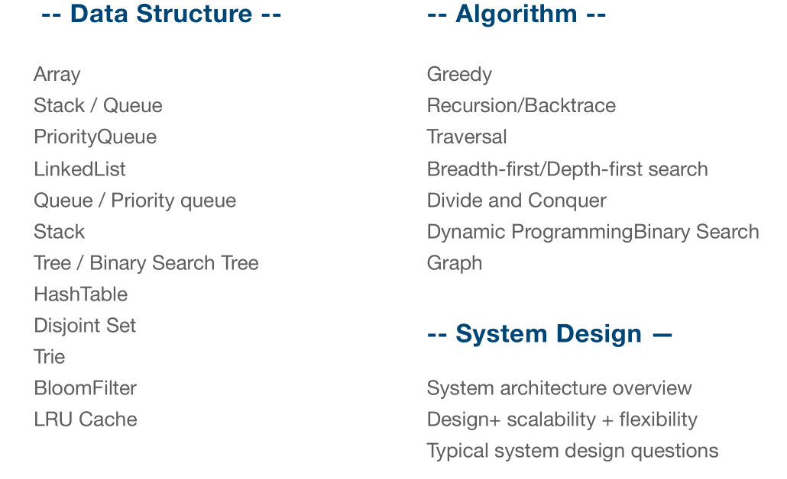
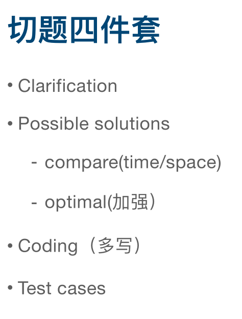

最近在买了一个课题，就是我一直想接触的数据结构和算法。课题是在极客时间中的《算法面试通关40讲》，讲师是覃超。

对课程做了一下笔记：

### 为什么要掌握算法与数据结构 ###

1. 编程的内功修炼
2. 去国内一流互联网公司的必要条件
3. 硅谷互联网公司面试更是要求当场写算法题目
4. 算法和数据结构是有趣且实用的 

### 常用的电话面试 ###

1. [collabedit.com](collabedit.com "collabedit.com")
2. [coderpad.io](coderpad.io "coderpad.io")

### 去硅谷工作的路径图 ###

### 精通一个领域 ###

- Chunk it up（切碎知识点）
- Deliberate practicing（刻意练习）
- Feedback（获得反馈）

### 摘要的数据类型 ###

### 数据结果 & 算法 & 系统设计 ###

### 切题四件套 ###

