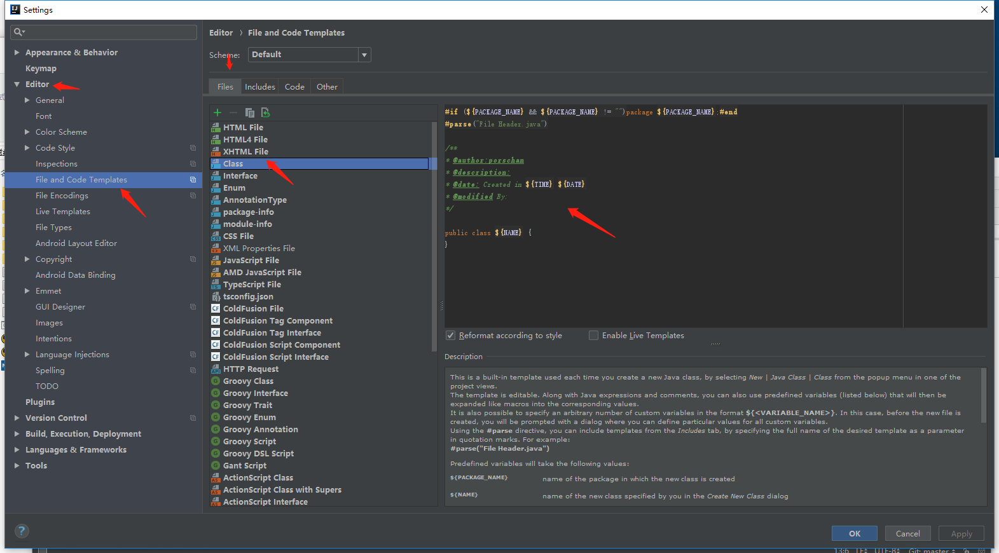
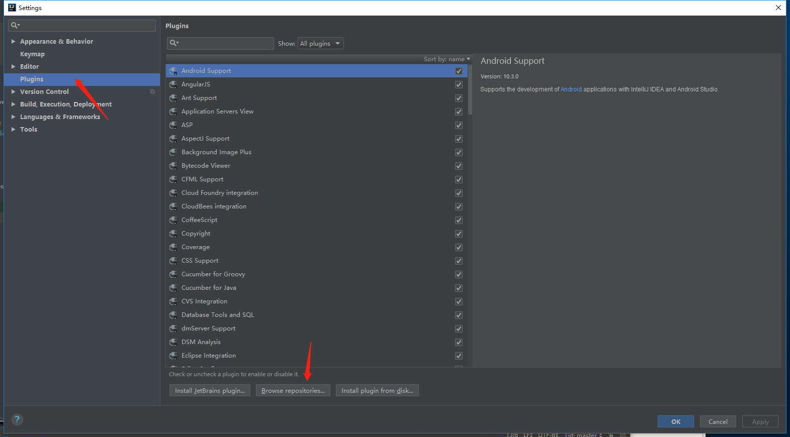
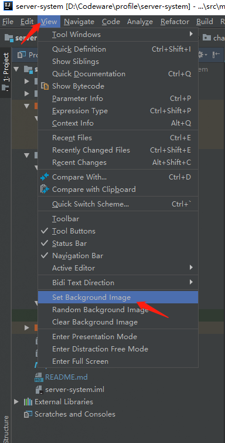
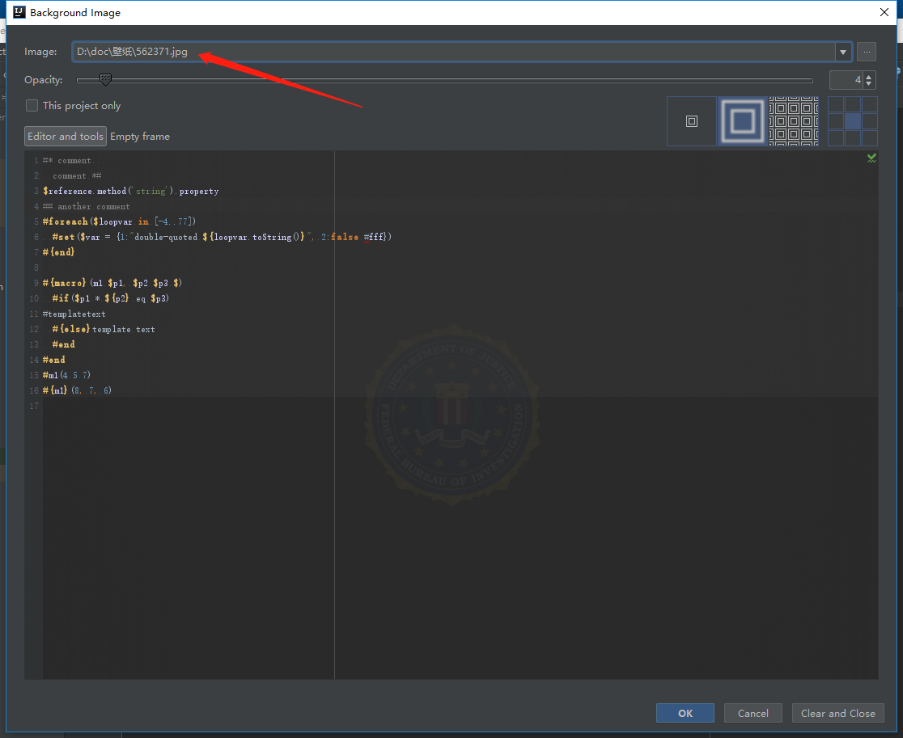
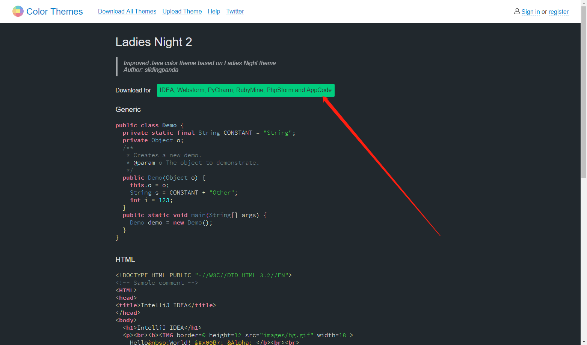

### 设置idea的类注释快捷键

File -> Settings -> Live Templates

```

	1.右边的 + -> Templates Group -> 输入：LTModel
	2.右边的 + -> Live Templates -> 为Abbreviation输入：pClassNote，为Description输入：自定义类注释

	Template text:

	/**
	* @author:porschan
	* @description:
	* @date: Created in $TIME$ $DATE$
	* @modified By:
	*/

	3.设置变量，点击右侧的Edit variables
	Name	Expression	Default value	Skip if defined
	TIME	time()								□
	DATE	date()								□

```

### 设置idea的类注释

File -> Settings -> Editor -> File and Code Templates ,如图：



```
	/**
	* @author:porschan
	* @description:
	* @date: Created in ${TIME} ${DATE}
	* @modified By:
	*/
```

### 设置idea的背景图

1.open IDEA -> File -> Settings -> Plugins ，如图



2.搜索Background Image Plus,安装并重启idea.

3.选择图片 ，如图






如果连快捷键都无法熟练的使用，那你应该熟练一下哈哈哈哈。

### 设置水平、上下分屏

```
	File -> Settings -> Keymap，搜索（注意大小写）： 
	
	水平分屏.Split Vertically
	
	垂直分屏.Split Horizontally
	
	直接双击对应的，会出现Edit Shortcuts弹窗，点击Add Keyboard Shortcut，输入快捷键点击OK即可。
````

### 设置选择项目进入IDEA

```
	File -> Settings -> Appearance & Behavior -> System Settings
	
	去掉默认选择的Reopen last project on startup选项即可。
```

### 整理代码快捷键：

ctrl + alt + L

### 更换idea的颜色主题：

1.点击[Color Themes 网站](http://color-themes.com/?view=index)，并下载主题包，如下图所示：



2.根据公网提供的修改过程如下：

```

	How to install a theme?
	Select «File» → «Import Setting» from the main menu and follow the instructions. After the IDE restarted go to the Preferences, expand «Editor» → «Colors and fonts» tab and choose the installed theme.
```

我在用Obsidian主题。

### 更换idea的字体：

```
	File -> Settings -> Editor -> Font 
	在Font项中，选择字体即可。
````