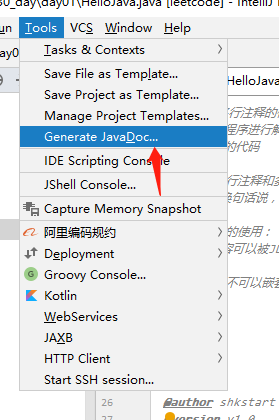
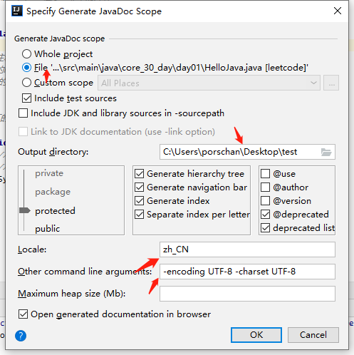

> 以下例子引用了vbirdbest的例子：[Javadoc 使用详解](https://blog.csdn.net/vbirdbest/article/details/80296136)

1.点击头顶菜单栏Tools,选择Generate JavaDoc...，操作如下：

2.在Specify Generate JavaDoc Scope 弹窗中操作如下：

3.在指定的文件夹内即可完成。