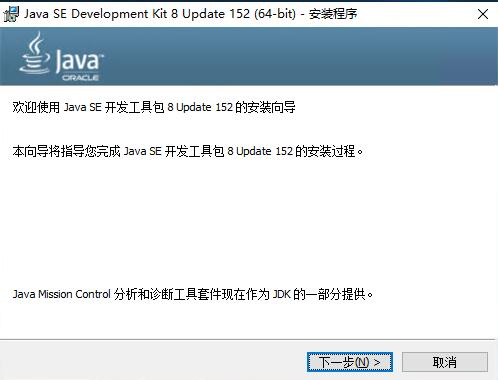
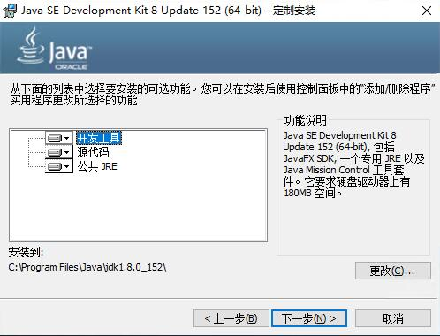
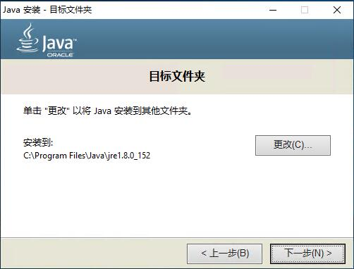
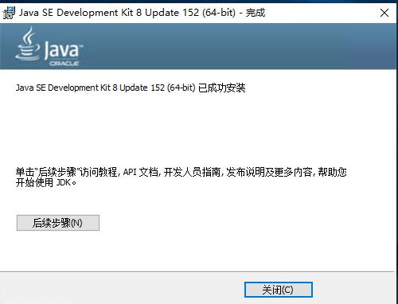
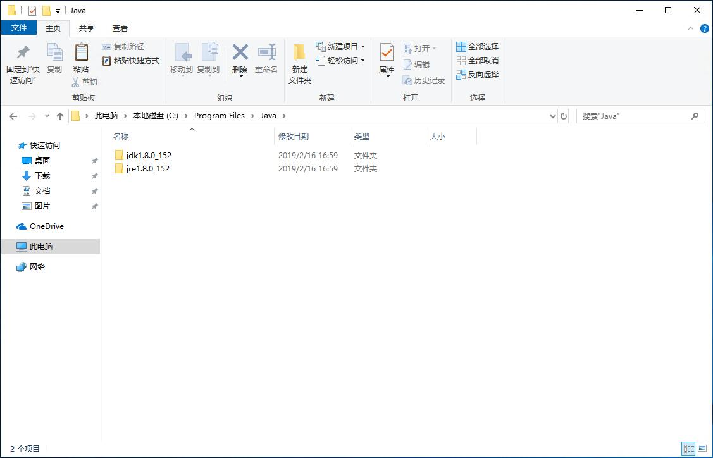
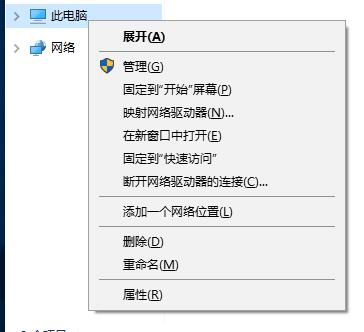
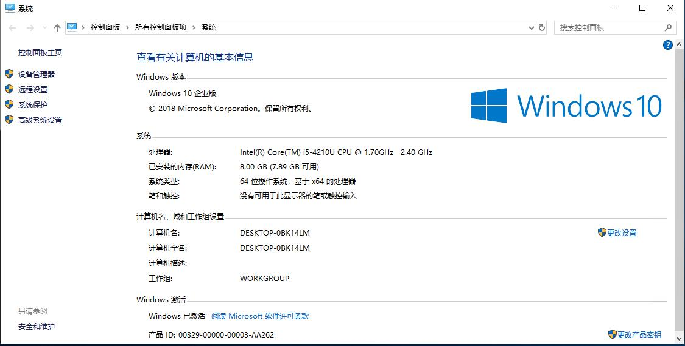
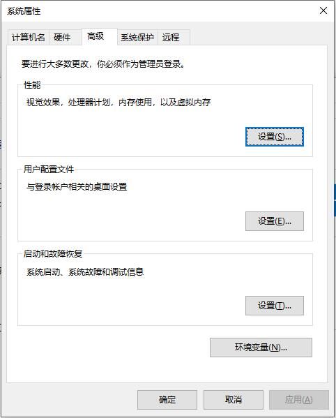
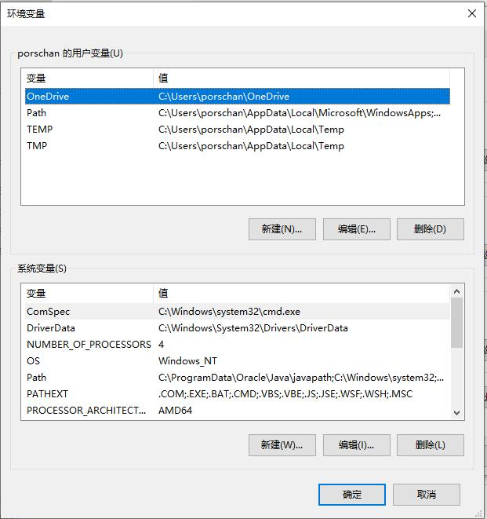
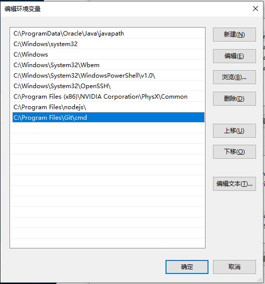

<div class="tip">
	来历：
				
	自身的特点：
		
	适合解决的问题：
		
	实际的应用场景：
		
</div>

### windows上面的安装包为jdk-8u152-windows-x64.exe ###

1.获取安装包，并安装步骤如下：









2.查找到默认的安装路径，如下图：



3.右键我的电脑，点击属性，如下图：



4.选择左边导航栏的高级系统设置，如下图：



5.选择底部的环境变量，如下图：



6.在"系统变量"中设置3项属性，JAVA_HOME,PATH,CLASSPATH(大小写无所谓),若已存在则点击"编辑"，不存在则点击"新建"，操作如下图：

变量设置参数如下：

```

	变量名：JAVA_HOME
	变量值：C:\Program Files (x86)\Java\jdk1.8.0_91        // 要根据自己的实际路径配置
	变量名：CLASSPATH
	变量值：.;%JAVA_HOME%\lib\dt.jar;%JAVA_HOME%\lib\tools.jar;         //记得前面有个"."
	变量名：Path
	变量值：%JAVA_HOME%\bin;%JAVA_HOME%\jre\bin;

```





<div class="tip">
	参考W3CSCHOOL的JAVA开发环境配置：[https://www.w3cschool.cn/java/java-environment-setup.html](https://www.w3cschool.cn/java/java-environment-setup.html "https://www.w3cschool.cn/java/java-environment-setup.html")		
</div>