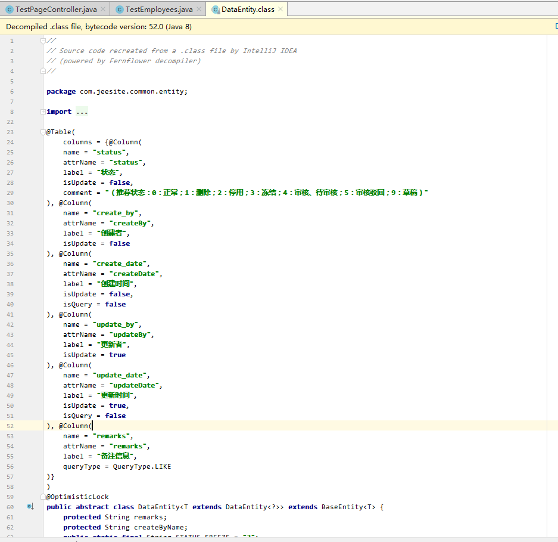

#### 1.jeesite为什么需要在表中添加那特别的5个字段？



#### 2.jeesite的dataGrid怎么在请求中附带参数?


#### 3.jeesite如何进行junit的测试？

```java
import com.jeesite.common.tests.BaseInitDataTests;
import com.jeesite.modules.Application;
import com.jeesite.modules.test.entity.TestEmployees;
import com.jeesite.modules.test.service.TestEmployeesService;
import org.junit.Test;
import org.springframework.beans.factory.annotation.Autowired;
import org.springframework.boot.test.context.SpringBootTest;
import org.springframework.test.annotation.Rollback;
import org.springframework.test.context.ActiveProfiles;

@ActiveProfiles("test")
@SpringBootTest(classes=Application.class)
@Rollback(false)
public class TestPageTest extends BaseInitDataTests {

    /**
     * java.lang.RuntimeException: 为了防止误操作，请运行时增加 -Djeesite.initdata=true 参数。
     */

    public TestPageTest() {}

    @Autowired
    private TestEmployeesService testEmployeesService;

    @Test
    public void initCoreData() throws Exception{
        TestEmployees testEmployees = new TestEmployees();

        testEmployees.setName("20190709");

        testEmployeesService.save(testEmployees);
        System.out.println(testEmployees.getId());
    }

}
```

