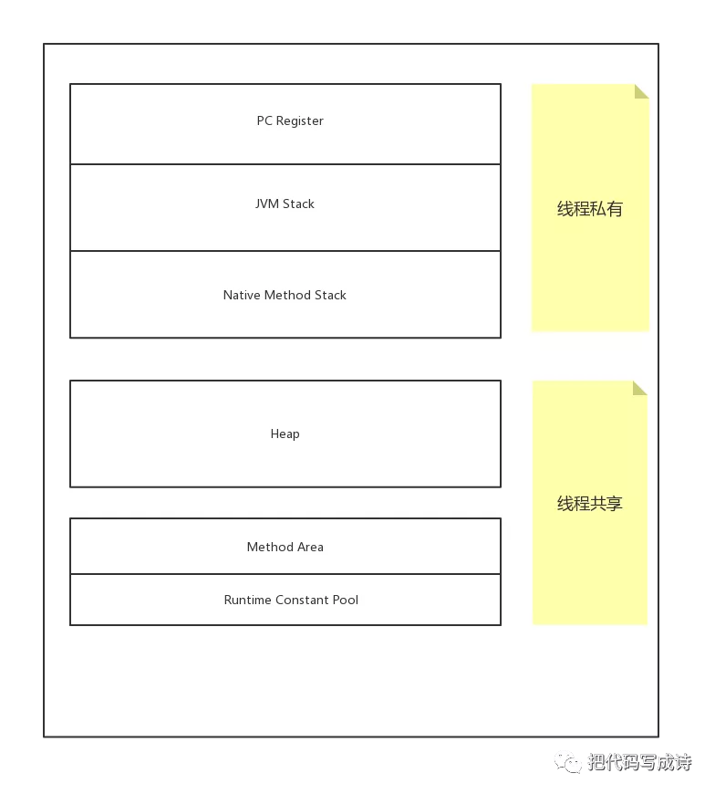

> 引自于 把代码写成诗的[JVM内存管理机制](https://mp.weixin.qq.com/s?__biz=MzIwNjE1Njc4MA==&amp;mid=2247483854&amp;idx=1&amp;sn=d761309ba4b91e0e73109c7a695d7ee7&amp;chksm=9724a74da0532e5bd2885f941263df5ffac15f6d1862143758ff31028cd5350c164ab4dc1d82&amp;mpshare=1&amp;scene=1&amp;srcid=&amp;key=330e2f6795e558a925de06900a199676f5fa1f2b765060fbe191514f2828a753b7f964b44ffaba600dde4c90f25f9c4fa16b748e1f8eccdced71d21a6ee4cb1bf125c188238bff863c95a9f51595c0c0&amp;ascene=1&amp;uin=NjI4MjYzOTE4&amp;devicetype=Windows+10&amp;version=62060833&amp;lang=zh_CN&amp;pass_ticket=N5Y%2BnUyirQVn4BFiZ0jeC%2F%2BKA2BlOttQQzaS7AzIO0sBoJzYXXll3q7j8TugBn7q)

#### 导语

> JVM把管理的内存分为若干区域，每个区域的作用不同，存储的内容也不同。每个区域的生命周期也有区别，了解虚拟机的内存管理有助于大家更清晰的编码以及问题排查...

# **内存模型**

- JVM主要管理两种类型的内存，堆和非堆（heap&non－heap），堆是运行时的内存区域，所有实例和数组的内存都从这里分配。堆的创建是JVM启动时就创建的，堆是Java代码可及的内存，是开发人员可以分配的。非堆是虚拟机留给自己使用的内存。
- 方法区，运行时常量池都在非堆内存中。

# **方法区**

- 方法区也称永久代，属于非堆。属于线程共享内存。
- 用于存储类信息，常量，静态变量。默认最小16mb，最大值为64mb。可以通过-xx：permSize和-xx：maxpermSize 参数限制方法区的大小。

# **运行时常量池**

- 运行时常量池属于方法区的一部分。class除了类版本，字段，方法，接口信息外，还有一部分内存用于生产各种符号的引用。这部分内容加载到运行时常量池中。
- string类型常量就是放在这块空间。

# **虚拟机栈（JVM Stack）**

- Java方法运行时的内存模型，是线程私有的，生命周期与线程相同。
- 每个方法执行时都会创建一个“栈帧”用于存储局部变量（包括参数），操作栈，方法出口等信息。方法被调用到执行完的过程中对应着一个栈帧在虚拟机栈从入栈到出栈的过程。
- 局部变量表存放了基本类型（boolean，byte，char，short，int，float，long，double），对象引用（引用指针，并非对象本身）。

# **本地方法栈（Native Method Stack）**

- 与虚拟机栈类似，区别在于虚拟机栈存储的是虚拟机执行的java方法，而本地方法栈是存储的native方法。

# **Java堆**

- Java堆也叫GC堆，是java虚拟机所管理的内存中最大的一块区域，属于各个线程共享的区域。生命周期在JVM启动时创建。
- 该内存区域存放了对象实例以及数组（所有new的对象）。
- 其大小通过-xms（最小值）和xmx（最大值）参数设置，xms为jvm启动时的申请最小的最小内存，默认为操作系统物理内存的1/64但小于1G，-xmx为jvm可申请的最大内存，默认为物理内存的1/4但小于1G。

# **程序计数器**

- 是一块最小的内存区域，作用是当前线程所执行的字节码的行号指示器，在虚拟机模型里，字节码解释器的工作就是通过改变这个计数器的值来选取下一条的字节码指令。分支，循环，异常处理，线程恢复都需要依赖计数器来完成。

# **直接内存**

- 直接内存不属于虚拟机的一部分，也不是Java虚拟机规范中定义的内存区域。直接内存就是本机内存，它不会影响堆内存的大小。