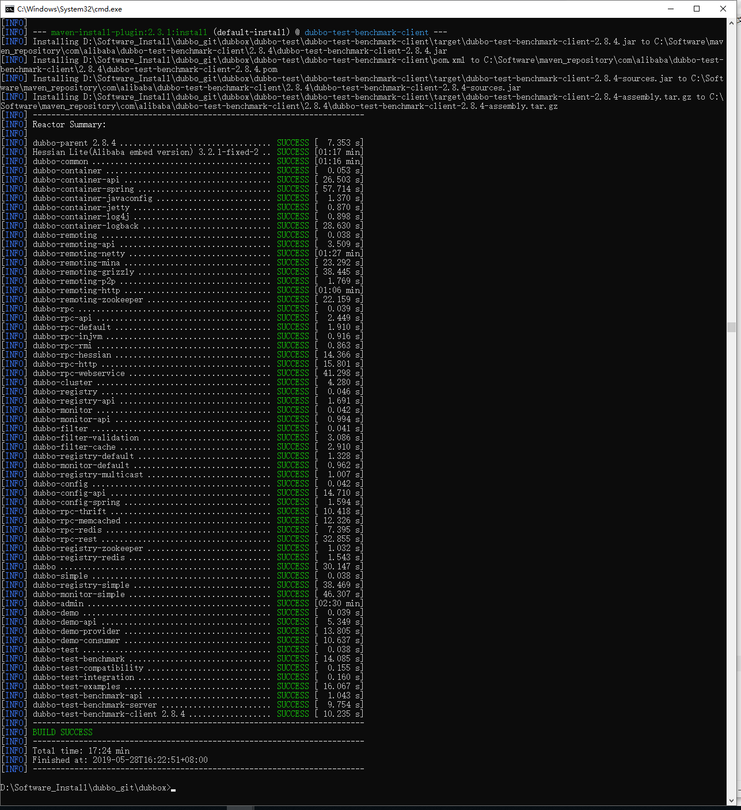
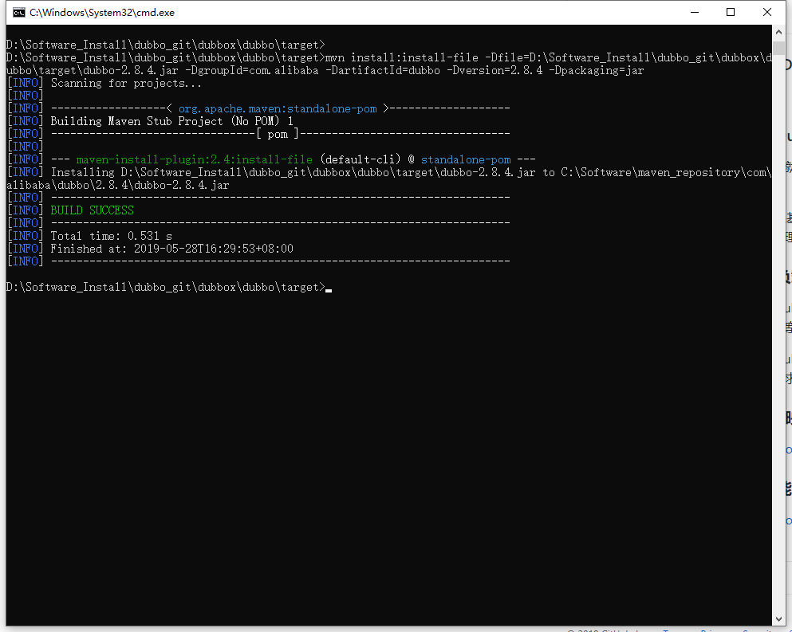

### dubbo-2.8.4.jar

> 引用云栖社区中的一段话作为开言：
>
> Dubbox前身是阿里巴巴的Dubbo项目，阿里巴巴解散了Dubbo团队后，由当当网继续维护此项目，改名为Dubbox，但是没有提交到Maven中央仓库
> (突然发现阿里巴巴又开始进行dubbo维护了，停止维护时的版本是2.5.3，现在是2.6.4)

根据网上的方法1：

```shell
git clone https://github.com/dangdangdotcom/dubbox.git
```

```powershell
D:\Software_Install\dubbo_git\dubbox>mvn install -Dmaven.test.skip=true
```



根据网上的方法2，找到对应的jar的位置，输入以下的命令行：

a.找到对应的jar的位置，输入以下的命令行：

```powershell
D:\Software_Install\dubbo_git\dubbox\dubbo\target>mvn install:install-file -Dfile=D:\Software_Install\dubbo_git\dubbox\dubbo\target\dubbo-2.8.4.jar -DgroupId=com.alibaba -DartifactId=dubbo -Dversion=2.8.4 -Dpackaging=jar
```



> 参考 Maven本地jar包部署与安装：dubbox-2.8.4.jar：https://yq.aliyun.com/articles/662535
> 参考 dubbo 2.8.4（dubbox）从git下载到安装至maven本地仓库：https://blog.csdn.net/jfqqqqq/article/details/79559036
> 参考 Maven本地jar包部署与安装：dubbox-2.8.4.jar：https://yq.aliyun.com/articles/662535