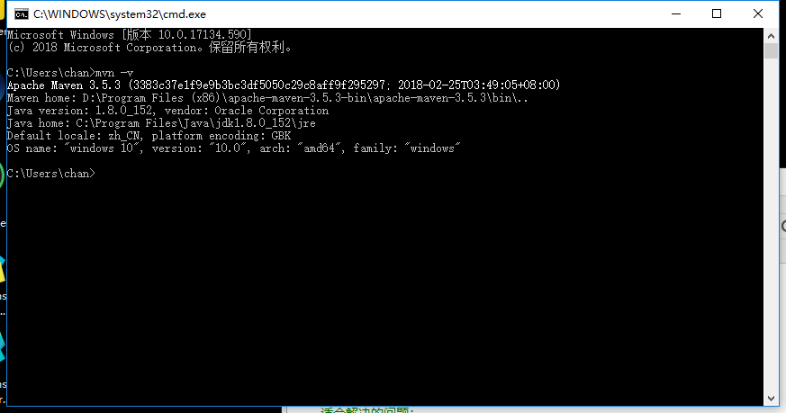
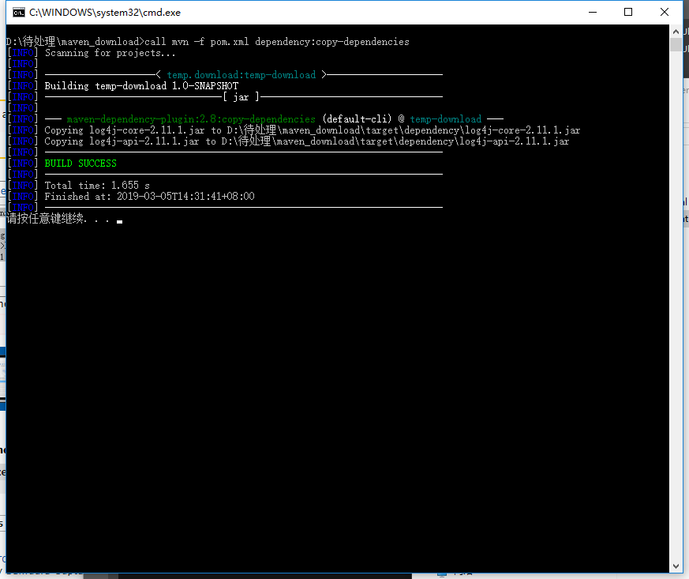
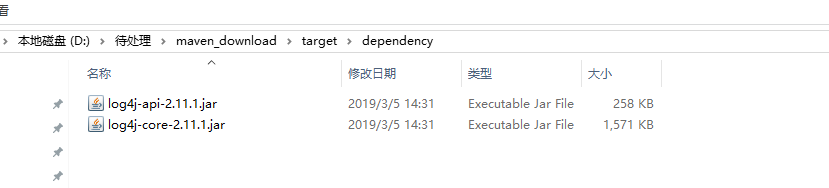

1.确认在系统中安装完成maven，如下图：



2.创建一个文件夹夹，在文件夹里创建toJar.bat 和 pom.xml。

3.toJar.bat的代码如下：

```
	call mvn -f pom.xml dependency:copy-dependencies
	@pause

```

4.pom.xml的代码如下：

```
	<?xml version="1.0"?>
	<project xmlns="http://maven.apache.org/POM/4.0.0" xmlns:xsi="http://www.w3.org/2001/XMLSchema-instance" xsi:schemaLocation="http://maven.apache.org/POM/4.0.0 http://maven.apache.org/xsd/maven-4.0.0.xsd">
	    <modelVersion>4.0.0</modelVersion>
	    <groupId>temp.download</groupId>
	    <artifactId>temp-download</artifactId>
	    <version>1.0-SNAPSHOT</version>
	    <dependencies>
	
		    <!-- 需要下载什么jar包 添加相应依赖 其余部分无需在意-->
		    
				<!-- https://mvnrepository.com/artifact/org.apache.logging.log4j/log4j-core -->
				<dependency>
				    <groupId>org.apache.logging.log4j</groupId>
				    <artifactId>log4j-core</artifactId>
				    <version>2.11.1</version>
				</dependency>
				
	    </dependencies>
	</project>
```

5.运行toJar.bat文件，如下图：



6.查看该文件夹下target，则pom.xml里的关联jar包下载完成。

