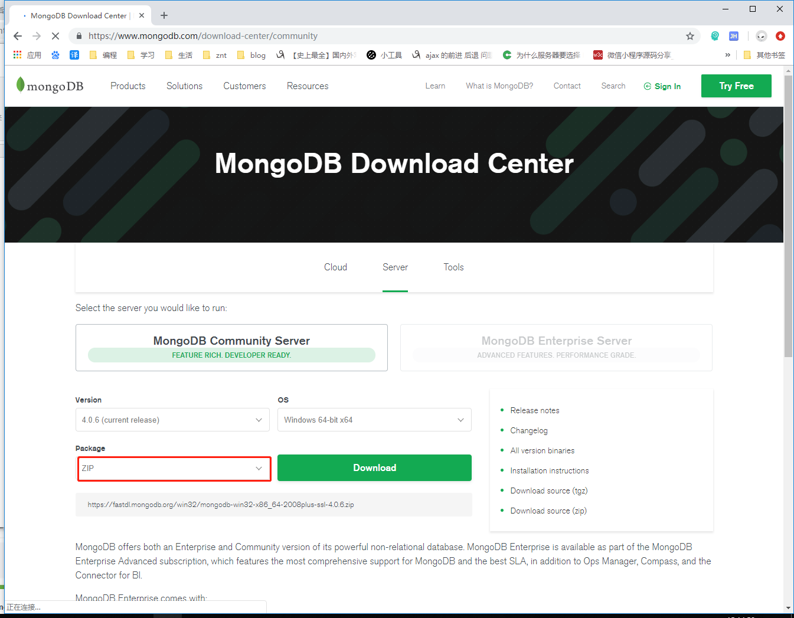
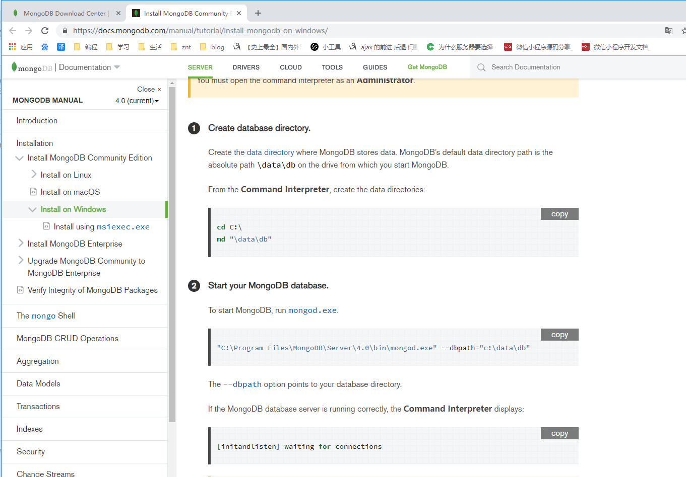
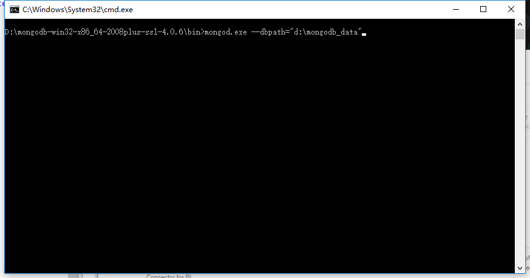
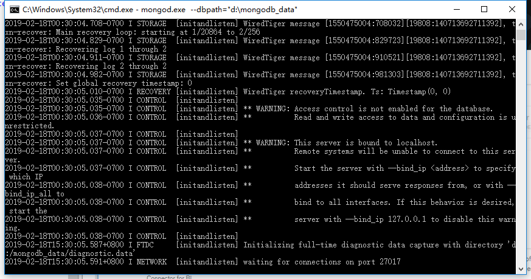

1.在浏览器中输入：[https://www.mongodb.com/download-center/community](https://www.mongodb.com/download-center/community "https://www.mongodb.com/download-center/community")



2.如上图所示，Package选择Zip，点击Download按钮，即可下载mongodb-win32-x86_64-2008plus-ssl-4.0.6.zip。

3.mongodb-win32-x86_64-2008plus-ssl-4.0.6.zip解压并在D盘创建mongodb_data文件夹。

5.参考官方文档可知启动过程，如下图：



4.进入mongodb-win32-x86_64-2008plus-ssl-4.0.6\bin，打开终端，启动命令如下图：

```

	mongod.exe --dbpath="d:\mongodb_data"

```



5.运行效果图，如下图：



6.使用NoSQL Manager for MongoDB测试是否运行正常，若能正常打开本地的mongodDB，则运行成功，如下图：


7.或使用自带的mongo.exe测试是否运行正常，若能正常打开本地的mongodDB，则运行成功，如下图：

直接打开bin/mongo.exe

