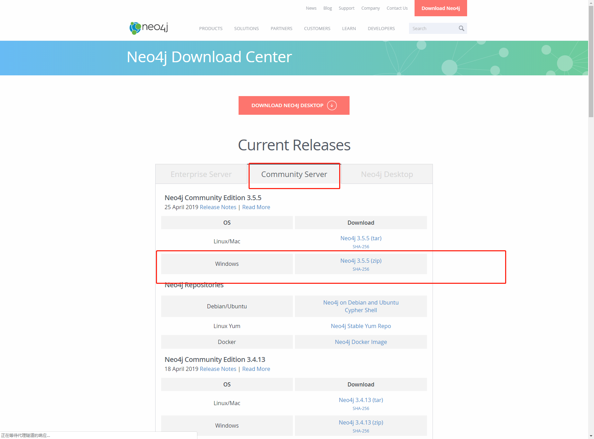
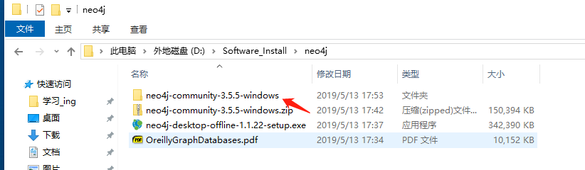
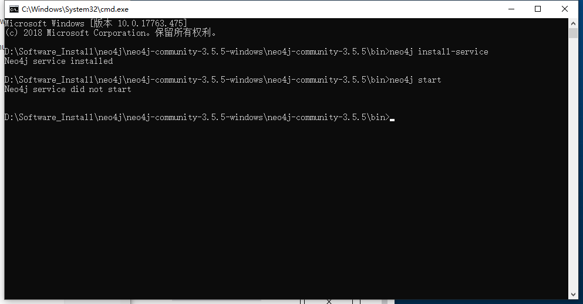
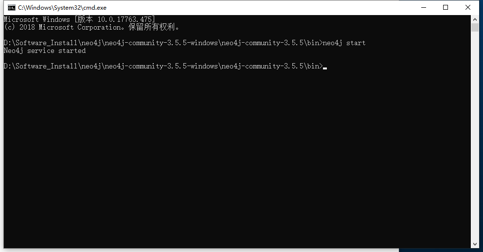
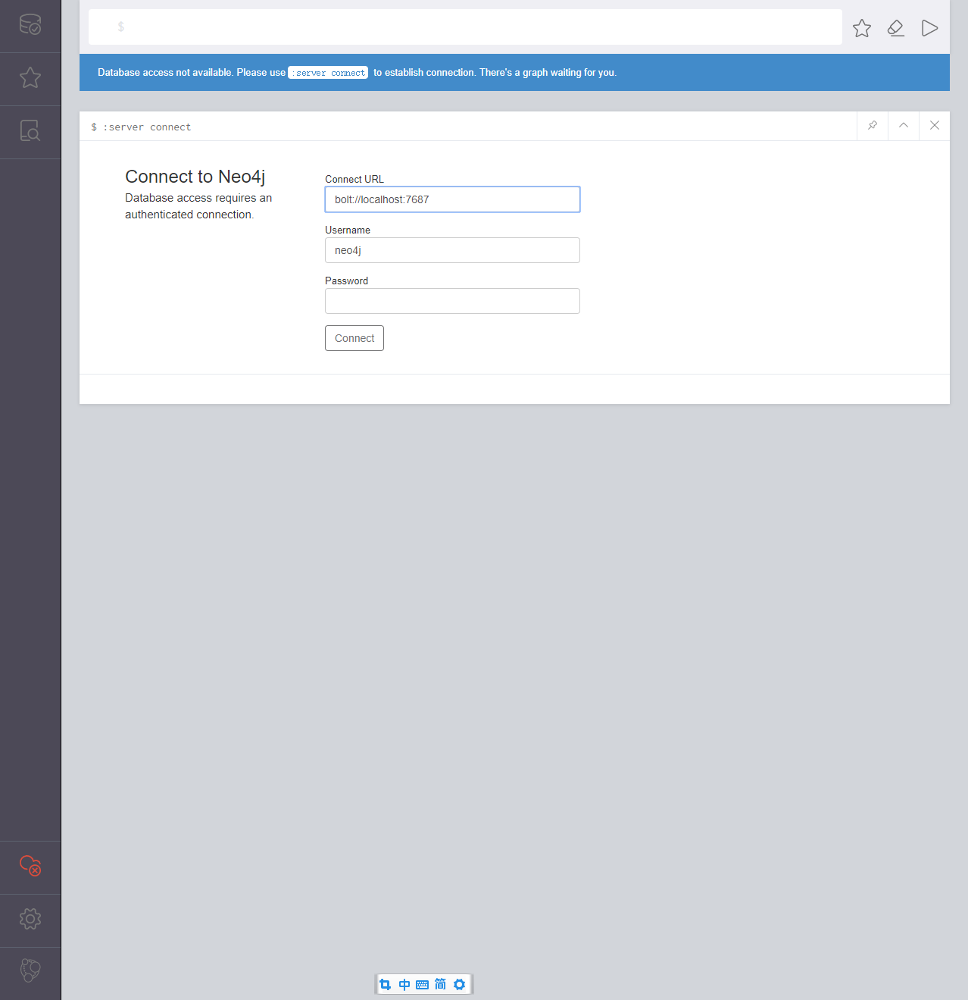
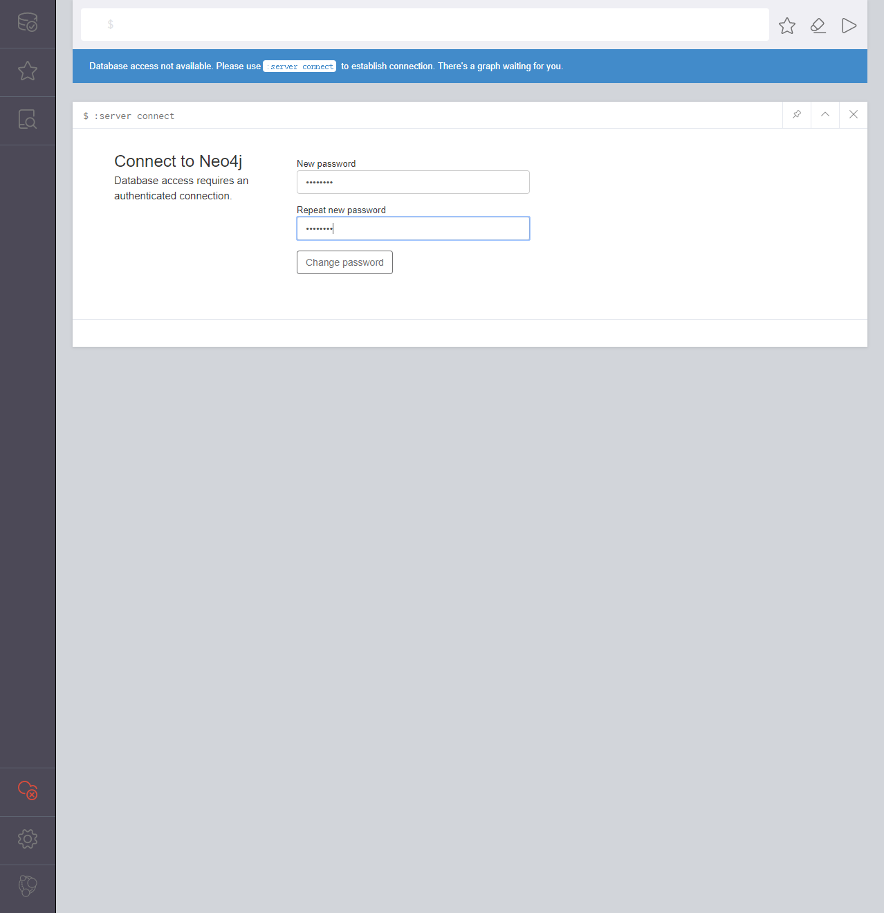
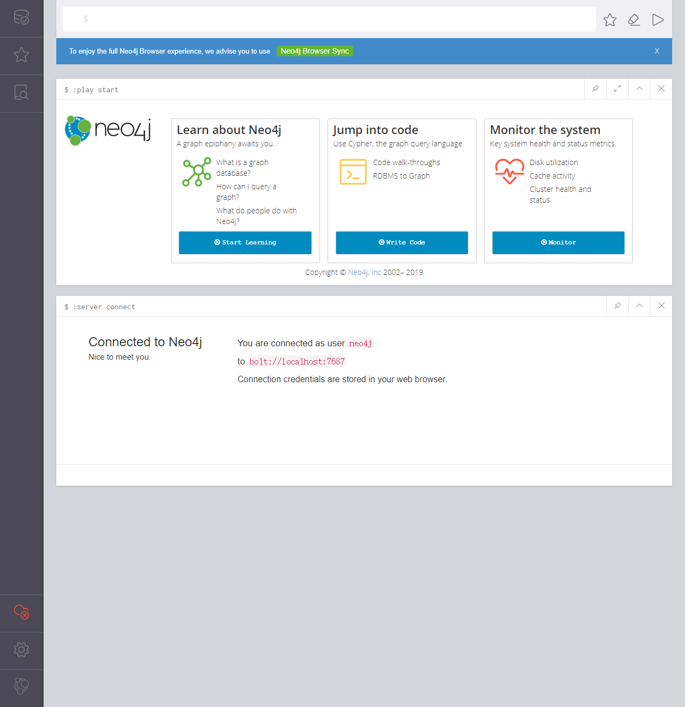

1.下载neo4j。

> neo4j官网：[neo4j官网](https://neo4j.com/download-center/#releases)

2.选择如下图所示：



3.下载完成后，解压压缩包，如下图：



4.使用CMD目录进入bin目录中：

```
C:\Windows\System32\cmd.exe
```

5.安装neo4j服务，如下图：

```
安装服务：
neo4j install-service

开启服务：
neo4j start
```

注意：如上图所示，出现Neo4j service did not start消息，可以关闭窗口，重新进入再运行开启服务目录即可。



6.开启服务之后，再次敲neo4j start目录，会出现如下：



7.打开浏览器输入http://localhost:7474 ，默认用户名和密码均为neo4j。首次登录后要求修改密码。





8.修改密码之后，即可得到如下图的主页面：



在网上搜索到笔记：

```
停止neo4j
如果希望停止neo4j，可执行：
C:\Windows\system32>neo4j stop

卸载neo4j服务
如果不想用了，可以将neo4j服务卸载了。如下：
C:\Windows\system32>neo4j uninstall-service
```