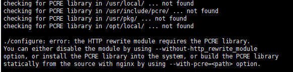
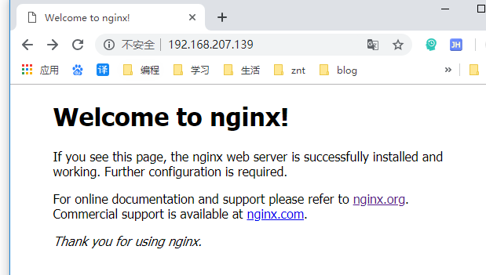

### 本系统的版本为Ubuntu 16.04.3 LTS ###

1.最近在跟学nginx，运行./configure的时候，发现出现如下报错，然后通过百度搜索引擎，参考了底部的博客，找到适合我的预先安装好环境的教程如下：



2.安装gcc:

```

	$ sudo apt-get install gcc

```

3.安装zlib:

```

	$ sudo apt-get install zlib1g-dev

```

4.安装pcre:

```

	$ sudo apt-get install libpcre3 libpcre3-dev 

```

5.安装openssl:

```

	$ sudo apt-get install openssl libssl-dev   

```

6.下载nginx:

```

	$ wget http://nginx.org/download/nginx-1.14.2.tar.gz 

```

7.解压并进入目录:

```

	$ tar -zxvf nginx-1.14.2.tar.gz
	$ cd nginx-1.14.2/

```

8.安装编译：

```

	$ ./configure --prefix=/home/geek/nginx
	$ sudo make
	$ sudo make install

```

9.查看nginx版本：

```

	$  /home/geek/nginx/sbin/nginx -v

```

10.启动nginx：

```

	$ sudo  /home/geek/nginx/sbin/nginx

```
11.查看是否启动成功，在浏览器中输入nginx目标服务ip即可，如下图：



<div class="tip">
	参考：
	1.ubuntu安装nginx及常见问题解决：[https://blog.csdn.net/Giving_bestself/article/details/78040322](https://blog.csdn.net/Giving_bestself/article/details/78040322 "https://blog.csdn.net/Giving_bestself/article/details/78040322")
	2.ubuntu下编译安装nginx：[https://blog.csdn.net/hu_feng903/article/details/80297821](https://blog.csdn.net/hu_feng903/article/details/80297821 "https://blog.csdn.net/hu_feng903/article/details/80297821")
</div>