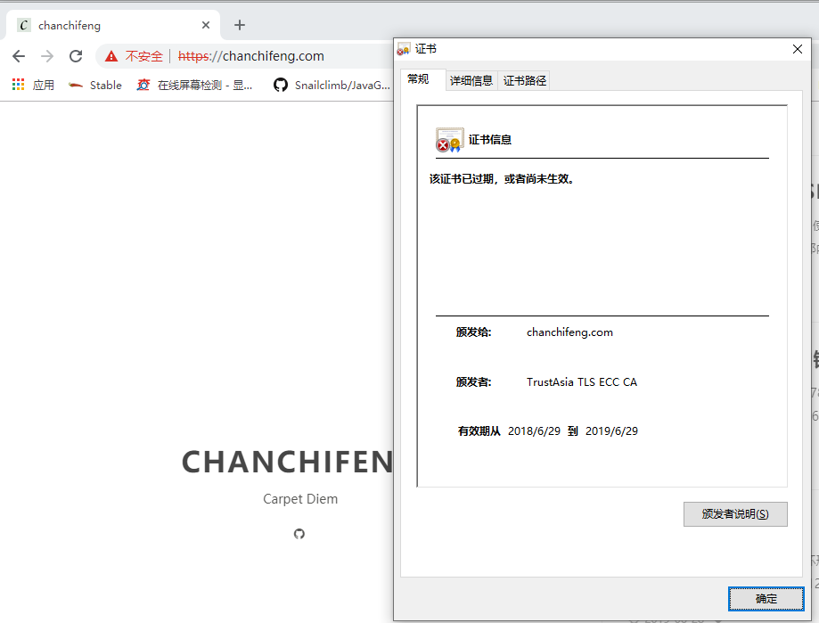
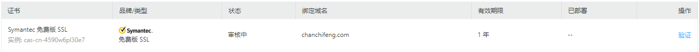
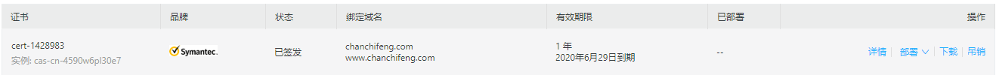
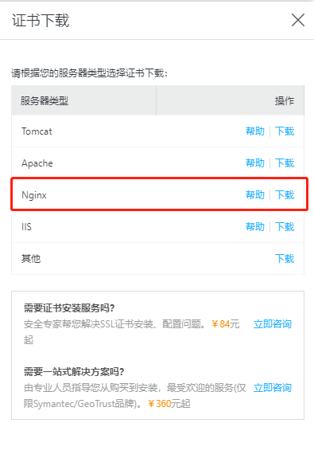
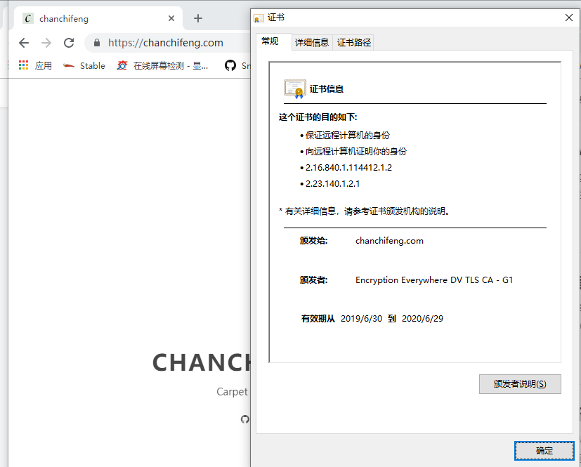

今天突然发现我网站的ssl证书无效，如下图所示：



然后去了阿里云申请ssl证书如下：



审核通过之后，如下图所示：



点击下载，这里提供多种类型的证书下载，选择nginx，如下图所示：



查看nginx的配置文件，并替换新的证书，具体配置文件代码如下：

```conf
  ssl on;
  ssl_certificate /etc/ssl/private/full_chain.pem;
  ssl_certificate_key /etc/ssl/private/private.key;
```

替换完成后，重启nginx：

```shell
root@porschan:/etc/nginx/conf.d# service nginx restart 
 * Restarting nginx nginx                                                                                                                                               [ OK ] 
root@porschan:/etc/nginx/conf.d# 
```

查看网站是否成功，如下图所示：



至此大功告成！