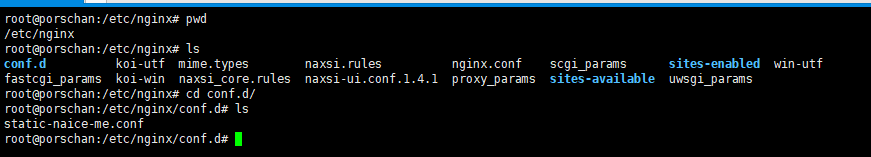
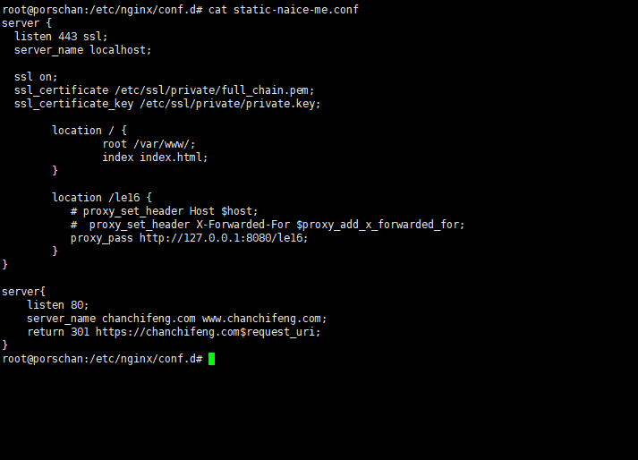

<div class="tip">
	来历：
		
	自身的特点：
		
	适合解决的问题：
		解决了一个服务器中多个项目用同一个端口的问题。
	实际的应用场景:
		
</div>

### 找到对应Nginx的位置 ###



### 直接post配置文件（static-naice-me.conf） ###



### 常用的nginx的命令 ###

```
	查看出错原因：
	sudo nginx -t

	查看nginx版本号：
	nginx -v

	启动nginx:
	sudo service nginx start

	暂停nginx:
	sudo service nginx stop

```

<div class="tip">
	经过测试，由于我的nginx版本为1.4.6，启动的时候不会报错，所以要检查是否配置文件出问题。
</div>