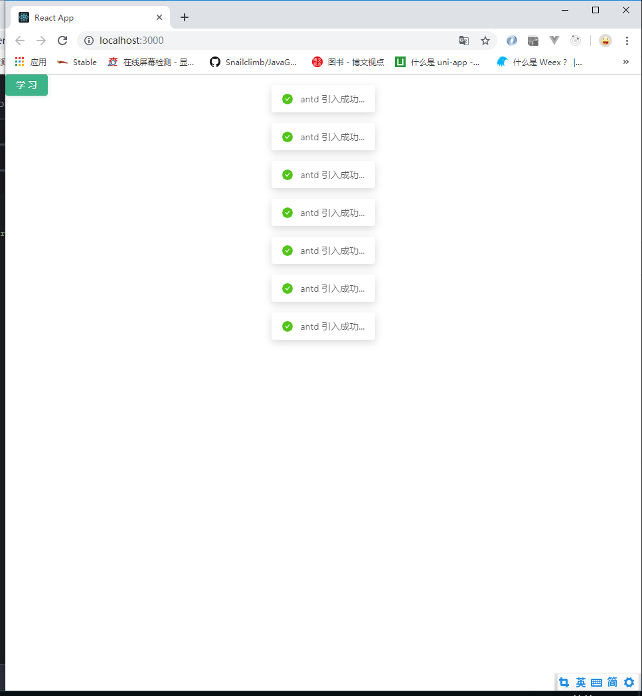

> 有关如何创建react项目的请参考：
>
> - [使用 VS 创建 React 的 Hello world项目](/2019/07/08/react-helloworld/ "使用 VS 创建 React 的 Hello world项目")
>
> 这里主要参考Ant Design的官方文档：
>
> - [在 create-react-app 中使用](https://ant.design/docs/react/use-with-create-react-app-cn "在 create-react-app 中使用")

1.现在从 yarn 或 npm 安装并引入 antd。

```shell
$ yarn add antd
```

2.引入 react-app-rewired 并修改 package.json 里的启动配置。由于新的 [react-app-rewired@2.x](https://github.com/timarney/react-app-rewired#alternatives) 版本的关系，你还需要安装 [customize-cra](https://github.com/arackaf/customize-cra)。

```shell
$ yarn add react-app-rewired customize-cra
```

3.[babel-plugin-import](https://github.com/ant-design/babel-plugin-import) 是一个用于按需加载组件代码和样式的 babel 插件（[原理](https://ant.design/docs/react/getting-started-cn#%E6%8C%89%E9%9C%80%E5%8A%A0%E8%BD%BD)），现在我们尝试安装它并修改 `config-overrides.js` 文件。

```shell
$ yarn add babel-plugin-import
```

4.按照 [配置主题](https://ant.design/docs/react/customize-theme-cn) 的要求，自定义主题需要用到 less 变量覆盖功能。我们可以引入 `customize-cra` 中提供的 less 相关的函数 [addLessLoader](https://github.com/arackaf/customize-cra#addlessloaderloaderoptions) 来帮助加载 less 样式，同时修改 `config-overrides.js` 文件如下。

```shell
$ yarn add less less-loader
```

5.src/App.js

```js
import React, {Component} from 'react'
import {Button, message} from 'antd'

/*
应用的根组件
 */
export default class App extends Component {

    handleClick = () => {
        message.success(' antd 引入成功...');
    }

    render() {
        return (
        <Button type='primary' onClick={this.handleClick}>学习</Button>
        )
    }
}
```

6.src/index.js

```js
/*
入口js
 */
import React from 'react'
import ReactDOM from 'react-dom'

import App from './App'

// 将App组件标签渲染到index页面的div上
ReactDOM.render(<App />, document.getElementById('root'))
```

7.根目录下config-overrides.js

```js
const {override, fixBabelImports, addLessLoader} = require('customize-cra');

module.exports = override(
    // 针对ant 实现按需打包：根据import来打包（使用babel-plugin-import）
    fixBabelImports('import',{
        libraryName:'antd',
        libraryDirectory:'es',
        style:true,//自动打包相关的样式
    }),
    // 使用less-loader对源码中的less的变量进行重新指定
    addLessLoader({
        javascriptEnabled:true,
        modifyVars:{'@primary-color':'#1DA57A'},
    }),
);
```

8.package.json

```json
{
  "name": "my-app",
  "version": "0.1.0",
  "private": true,
  "dependencies": {
    "antd": "^3.20.1",
    "babel-plugin-import": "^1.12.0",
    "customize-cra": "^0.2.14",
    "less": "^3.9.0",
    "less-loader": "^5.0.0",
    "react": "^16.8.6",
    "react-app-rewired": "^2.1.3",
    "react-dom": "^16.8.6",
    "react-scripts": "3.0.1"
  },
  "scripts": {
    "start": "react-app-rewired start",
    "build": "react-app-rewired build",
    "test": "react-app-rewired test",
    "eject": "react-scripts eject"
  },
  "eslintConfig": {
    "extends": "react-app"
  },
  "browserslist": {
    "production": [
      ">0.2%",
      "not dead",
      "not op_mini all"
    ],
    "development": [
      "last 1 chrome version",
      "last 1 firefox version",
      "last 1 safari version"
    ]
  }
}
```

9`npm start`启动项目，项目的效果图如下图所示：

