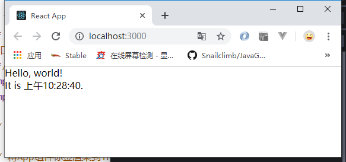

> 参考<https://react.docschina.org/docs/rendering-elements.html>文章。

1.src/index.js代码片段如下图：

```js
/*
入口js
 */
import React from 'react'
import ReactDOM from 'react-dom'

// import App from './App'

// 将App组件标签渲染到index页面的div上
// ReactDOM.render(<App />, document.getElementById('root'))

function tick() {
    const element = (
        <div>
        <h1>Hello, world!</h1>
        <h2>It is {new Date().toLocaleTimeString()}.</h2>
        </div>
    );
    ReactDOM.render(element, document.getElementById('root'));
}

setInterval(tick, 1000);
```

2.效果图如下图所示：

