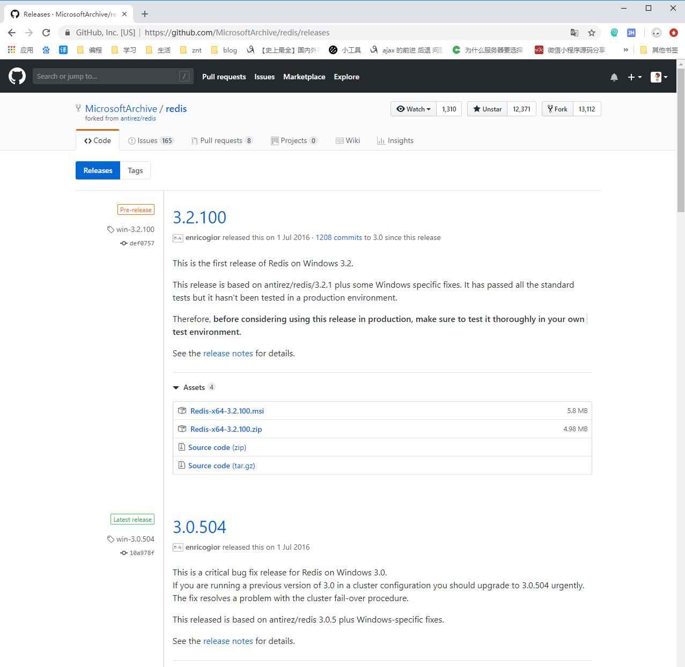
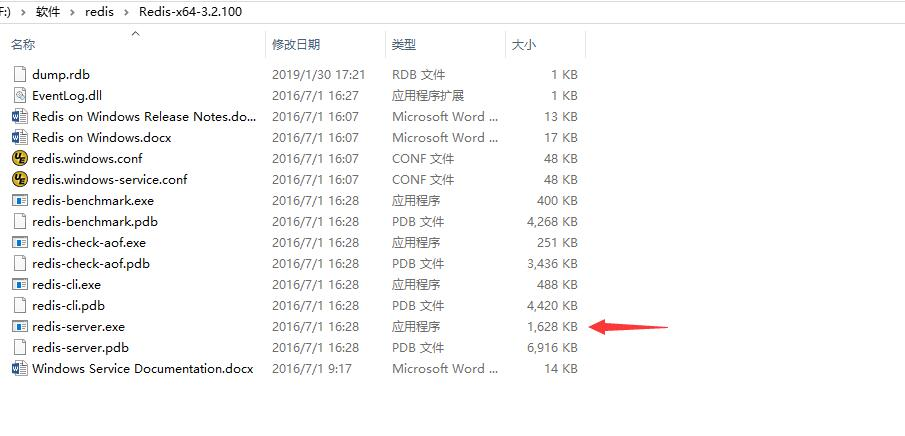
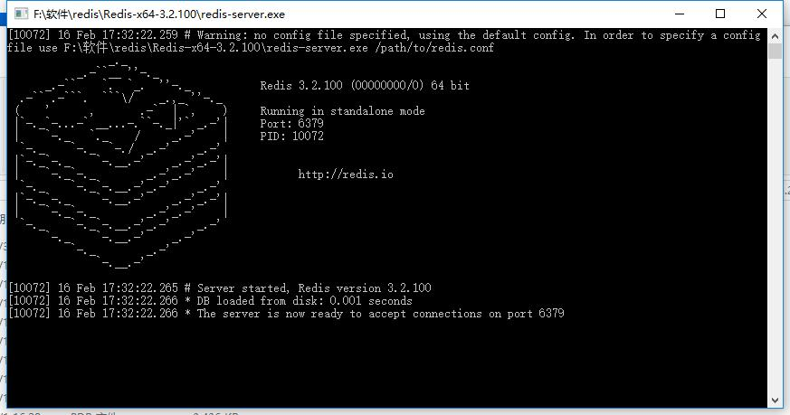
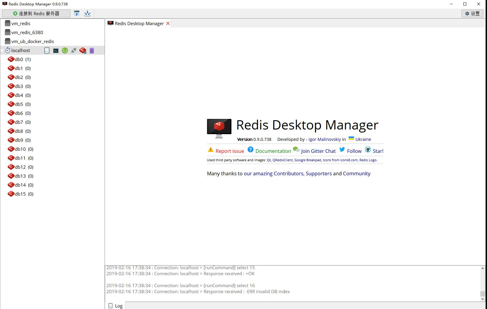

	来历：
				
	自身的特点：
		
	适合解决的问题：
		
	实际的应用场景：
		

1.在浏览器中输入：[https://github.com/MicrosoftArchive/redis/releases](https://github.com/MicrosoftArchive/redis/releases "https://github.com/MicrosoftArchive/redis/releases")

2.我们这里选用最新的redis（3.2.100），但是在服务器中，必须选择稳定版本！！！下载完成后，并解压，如下图：

3.打开redis-server.exe，如下图：

4.使用RedisDesktopManager测试是否运行正常，若能正常打开本地的redis，则运行成功，如下图：

