1.新建一个空项目，这里使用Maven创建一个空的Maven项目。

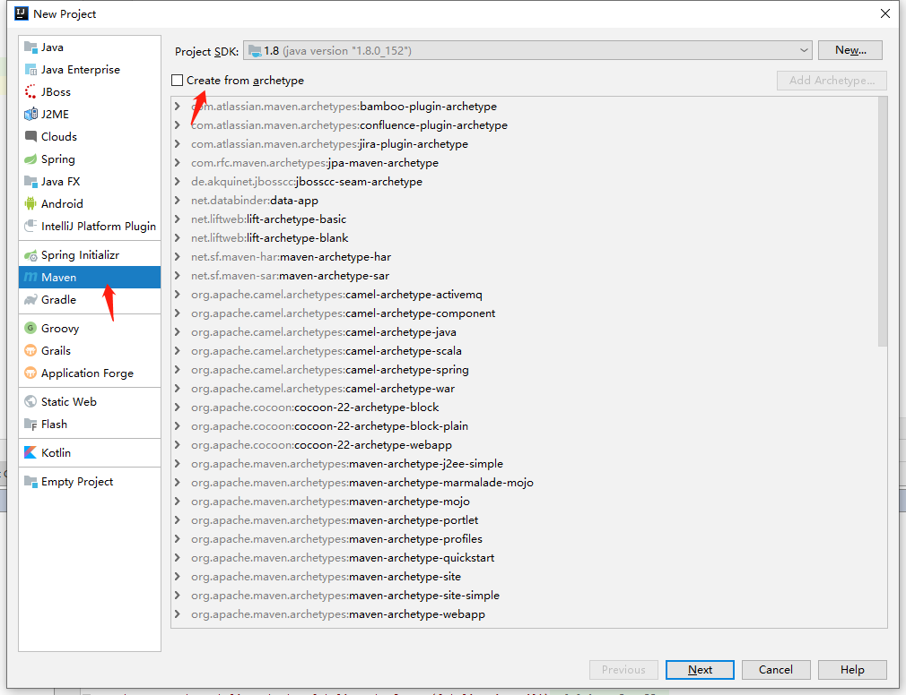

2.填写GroupId和ArtifactId。

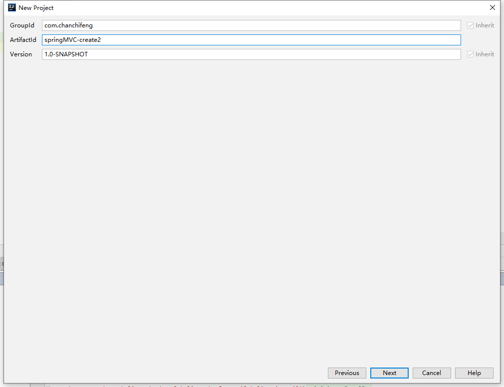

3.填写Project name。

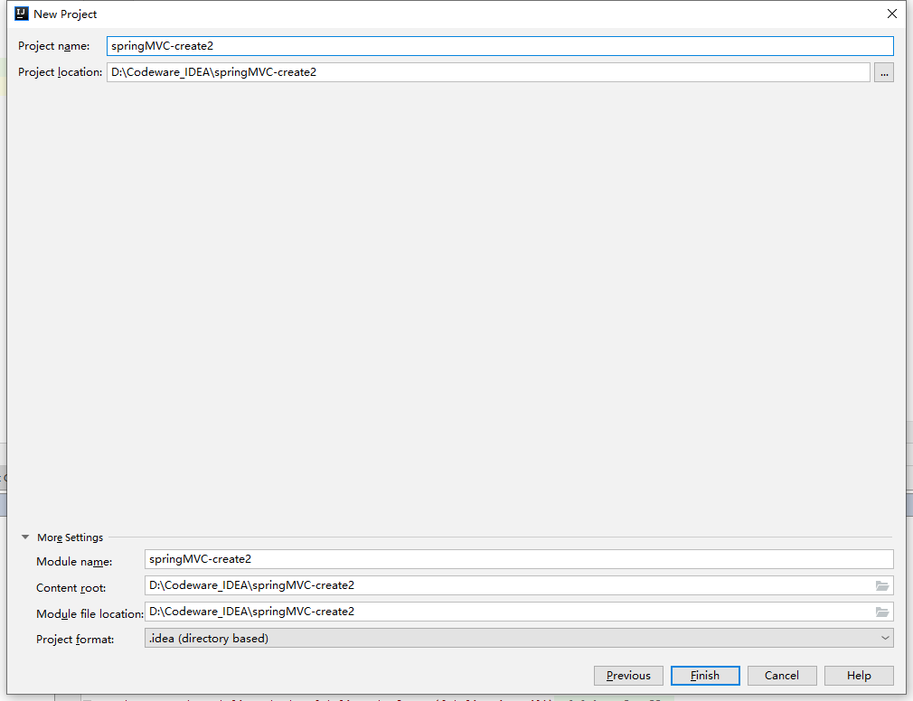

4.创建一个目录，名叫webapp。

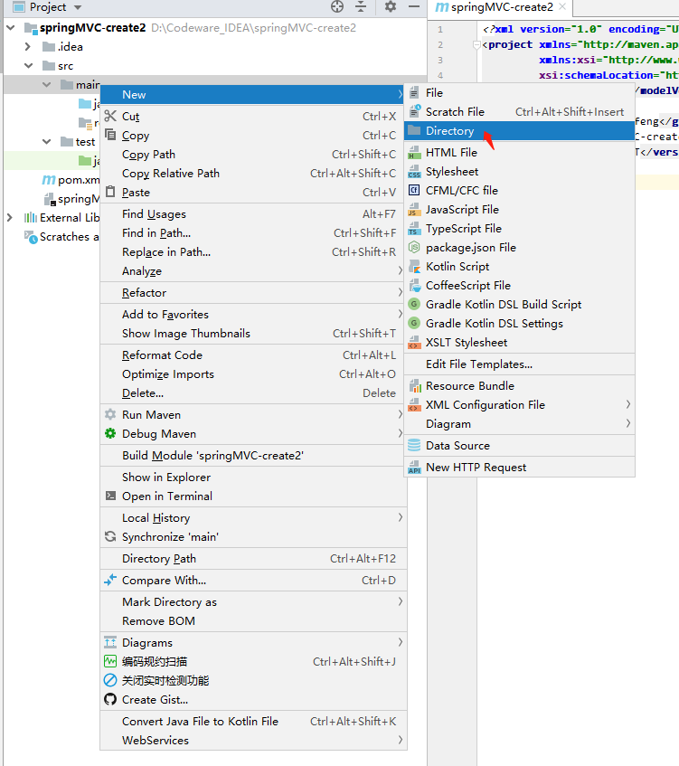

5.在项目结构下设置web,先添加web。

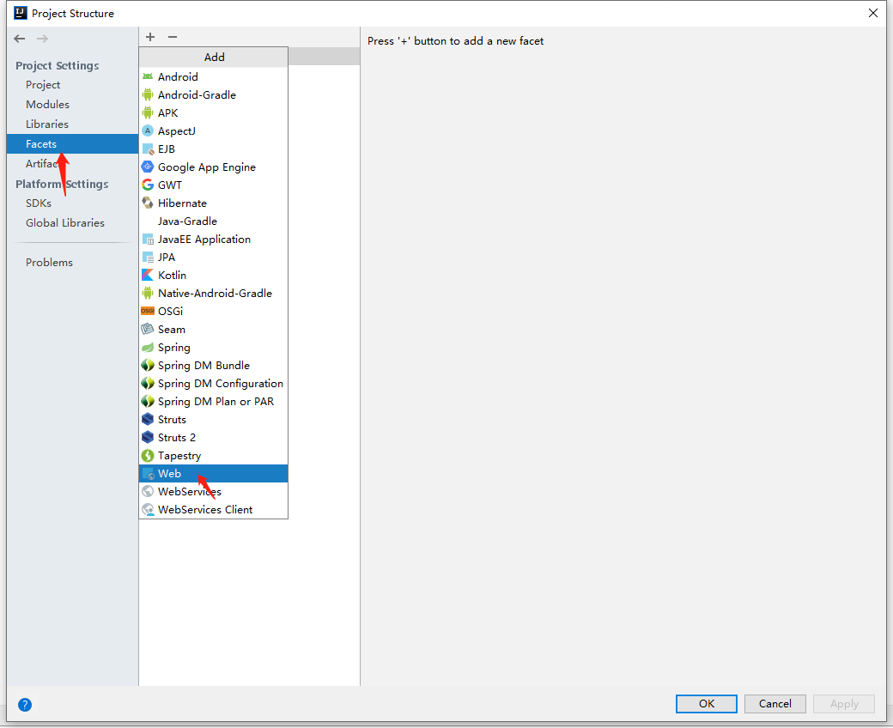

6.选中springMVC-create2。

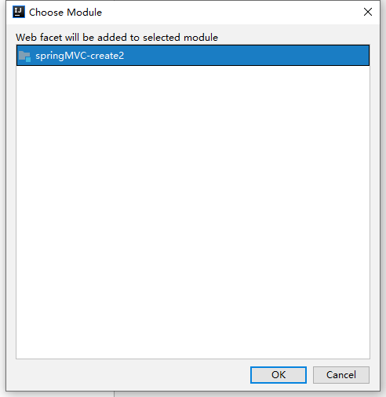

7.在Web Resource Directories中选择第一行，修改为对应的web项目路径。

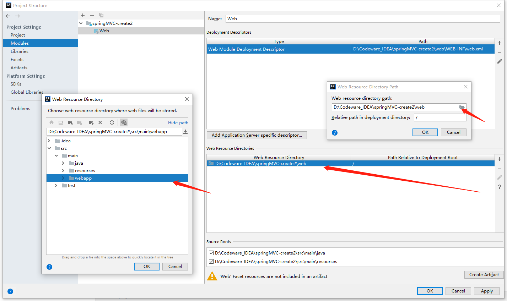

8.同理，在Deployment Descriptors中，修改web.xml的路径。

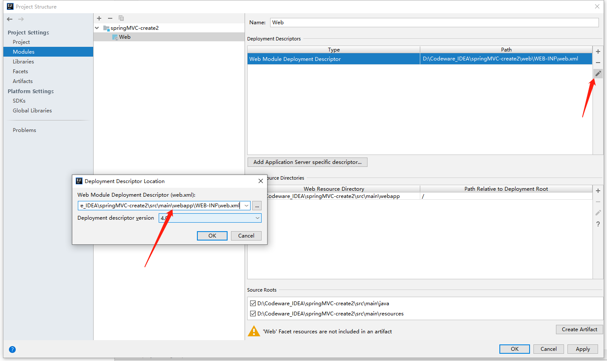

9.此时，就能看到webapp下，自动生成WEB-INF，自动生成WEB-INF的web.xml。

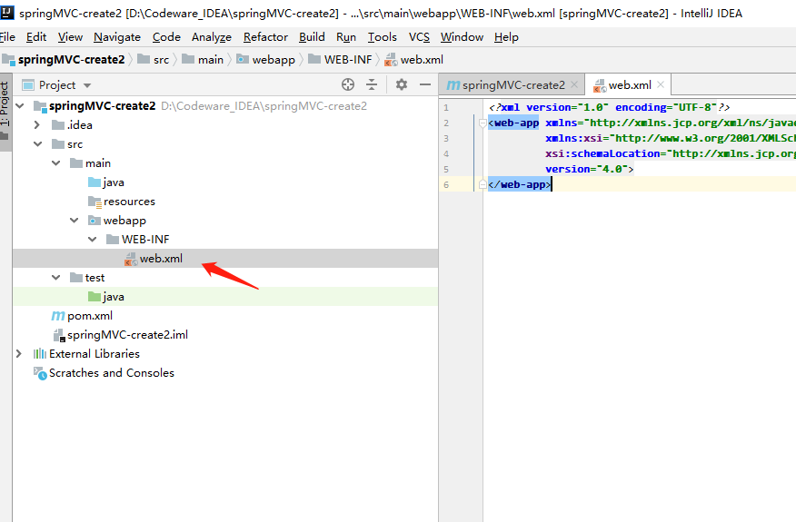

10.在src/main/java中创建com.chanchifeng.controller包，在该包下创建ItemsController的Java文件，代码如下：

```
    @Controller
    @RequestMapping("/queryItems")
    public class ItemsController {

        @RequestMapping("/say")
        public String say(Model model) {
            model.addAttribute("name","porschan");
            return "items/itemsList";
        }

    }
```

11.在src/main/resources下创建applicationContext.xml和dispatcher-servlet.xml。

11.1.applicationContext.xml代码如下：

```
    <?xml version="1.0" encoding="UTF-8"?>
    <beans xmlns="http://www.springframework.org/schema/beans"
           xmlns:xsi="http://www.w3.org/2001/XMLSchema-instance"
           xmlns:context="http://www.springframework.org/schema/context"
           xsi:schemaLocation="http://www.springframework.org/schema/beans http://www.springframework.org/schema/beans/spring-beans.xsd http://www.springframework.org/schema/context http://www.springframework.org/schema/context/spring-context.xsd">


    </beans>
```

11.2.dispatcher-servlet.xml代码如下：

```
    <?xml version="1.0" encoding="UTF-8"?>
    <beans xmlns="http://www.springframework.org/schema/beans"
           xmlns:xsi="http://www.w3.org/2001/XMLSchema-instance"
           xmlns:context="http://www.springframework.org/schema/context"
           xsi:schemaLocation="http://www.springframework.org/schema/beans http://www.springframework.org/schema/beans/spring-beans.xsd http://www.springframework.org/schema/context http://www.springframework.org/schema/context/spring-context.xsd">

        <context:component-scan base-package="com.chanchifeng.controller"/>

        <!--指定视图解析器-->
        <bean class="org.springframework.web.servlet.view.InternalResourceViewResolver">
            <!-- 视图的路径 -->
            <property name="prefix" value="/WEB-INF/jsp/"/>
            <!-- 视图名称后缀  -->
            <property name="suffix" value=".jsp"/>
        </bean>

    </beans>
```

12.在src/webapp/WEB-INF中创建jsp文件夹，在该文件夹下再创建items的文件夹，在items文件夹里创建itemsList.jsp,代码如下：

```
    <%@ page contentType="text/html;charset=UTF-8" language="java" %>
    <html>
    <head>
        <title>Title</title>
    </head>
    <body>
    This is ItemsList.jsp from ${name}
    </body>
    </html>
```

13.在src/webapp中创建index.jsp，代码如下：

```
    <%@ page contentType="text/html;charset=UTF-8" language="java" %>
    <html>
    <head>
        <title>Title</title>
    </head>
    <body>
    Hello SpringMVC !!!

    <br/>

    <a href="queryItems/say.action">to itemList.jsp</a>
    </body>
    </html>
```

14.最后需要编写web.xml,代码如下：

```
<?xml version="1.0" encoding="UTF-8"?>
<web-app xmlns="http://xmlns.jcp.org/xml/ns/javaee"
         xmlns:xsi="http://www.w3.org/2001/XMLSchema-instance"
         xsi:schemaLocation="http://xmlns.jcp.org/xml/ns/javaee http://xmlns.jcp.org/xml/ns/javaee/web-app_4_0.xsd"
         version="4.0">

    <context-param>
        <param-name>contextConfigLocation</param-name>
        <param-value>classpath:applicationContext.xml</param-value>
    </context-param>

    <listener>
        <listener-class>org.springframework.web.context.ContextLoaderListener</listener-class>
    </listener>

    <servlet>
        <servlet-name>dispatcher</servlet-name>
        <servlet-class>org.springframework.web.servlet.DispatcherServlet</servlet-class>
        <!--        <load-on-startup>1</load-on-startup>-->
        <!-- contextConfigLocation配置springmvc加载的配置文件(配置处理器映射器、适配器等等)
          若不配置，默认加载WEB-INF/servlet名称-servlet(springmvc-servlet.xml)
        -->
        <init-param>
            <param-name>contextConfigLocation</param-name>
            <param-value>classpath:dispatcher-servlet.xml</param-value>
        </init-param>
    </servlet>

    <servlet-mapping>
        <servlet-name>dispatcher</servlet-name>
        <!--
        第一种:*.action,访问以.action结尾，由DispatcherServlet进行解析
        第二种:/,所有访问的地址由DispatcherServlet进行解析，对静态文件的解析需要配置不让DispatcherServlet进行解析，
                使用此种方式和实现RESTful风格的url
        第三种:/*,这样配置不对，使用这种配置，最终要转发到一个jsp页面时，仍然会由DispatcherServlet解析jsp地址，
                不能根据jsp页面找到handler，会报错
        -->
        <!--        <url-pattern>*.action</url-pattern>-->
        <url-pattern>*.action</url-pattern>
    </servlet-mapping>

</web-app>

```

15.pom.xml文件代码如下：

```
<?xml version="1.0" encoding="UTF-8"?>
<project xmlns="http://maven.apache.org/POM/4.0.0"
         xmlns:xsi="http://www.w3.org/2001/XMLSchema-instance"
         xsi:schemaLocation="http://maven.apache.org/POM/4.0.0 http://maven.apache.org/xsd/maven-4.0.0.xsd">
    <modelVersion>4.0.0</modelVersion>

    <groupId>com.chanchifeng</groupId>
    <artifactId>springMVC-create2</artifactId>
    <version>1.0-SNAPSHOT</version>
    <packaging>war</packaging>

    <dependencies>
        <dependency>
            <groupId>org.springframework</groupId>
            <artifactId>spring-webmvc</artifactId>
            <version>4.2.4.RELEASE</version>
        </dependency>
    </dependencies>

    <build>
        <finalName>springmvc-1st-1.0-SNAPSHOT</finalName>
    </build>


</project>
```

16.为项目添加Tomcat。

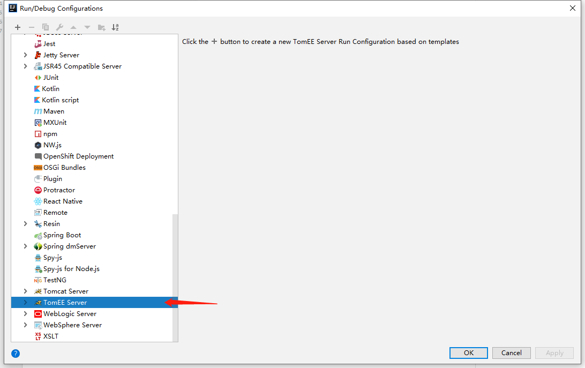

17.设置项目的Tomcat配置信息。

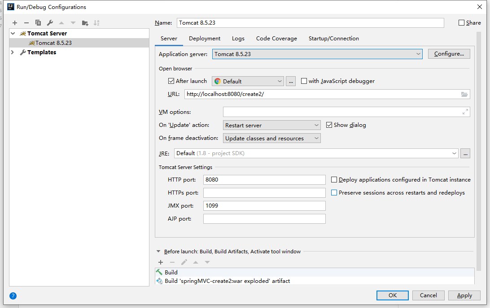

18.设置项目的Tomcat配置信息。

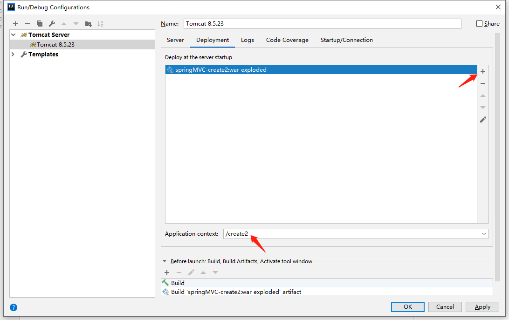

19.项目运行效果，这里就完成了springMVC的搭建了。

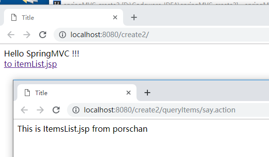