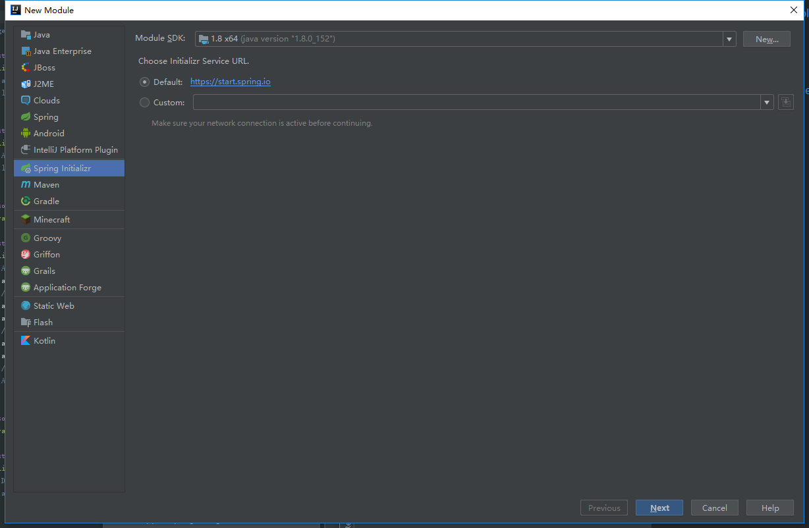
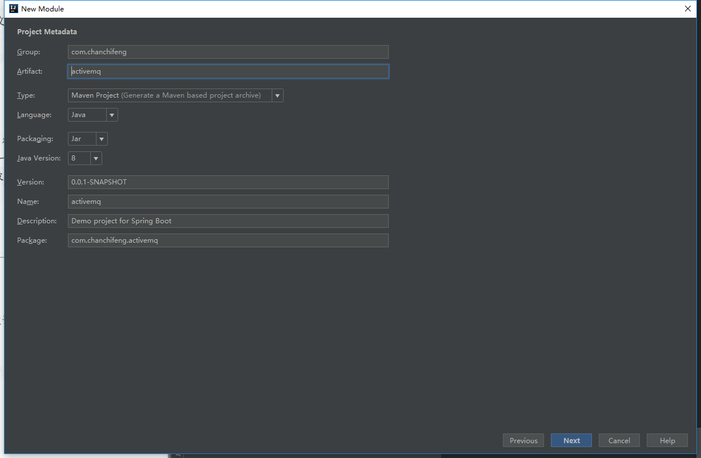
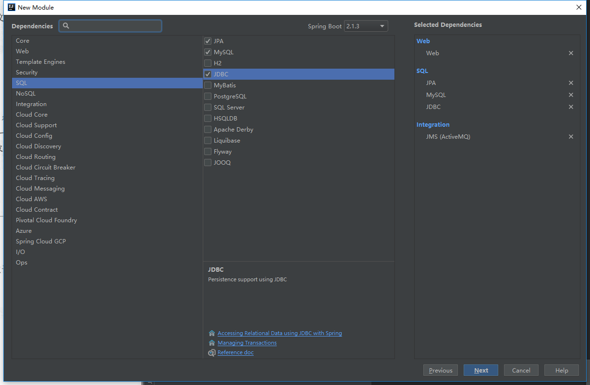
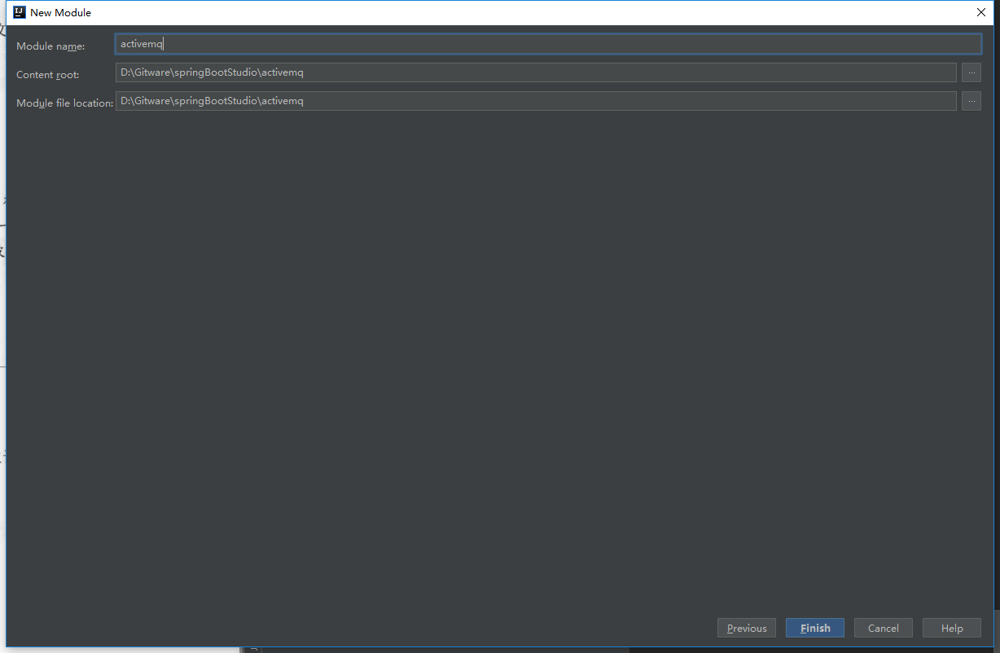
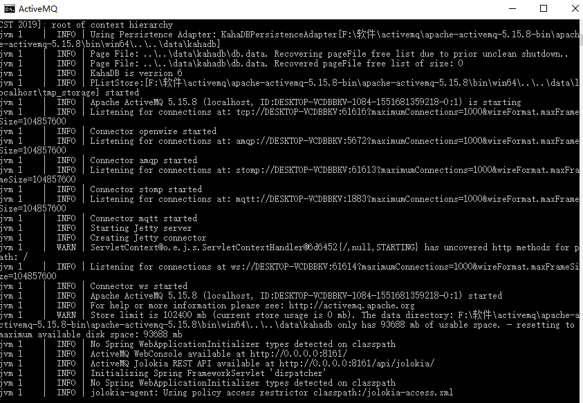
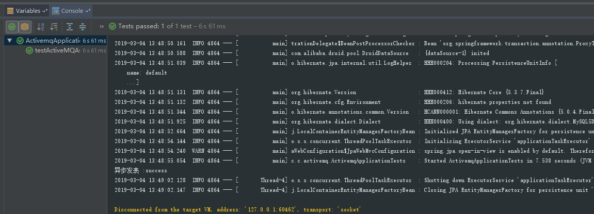
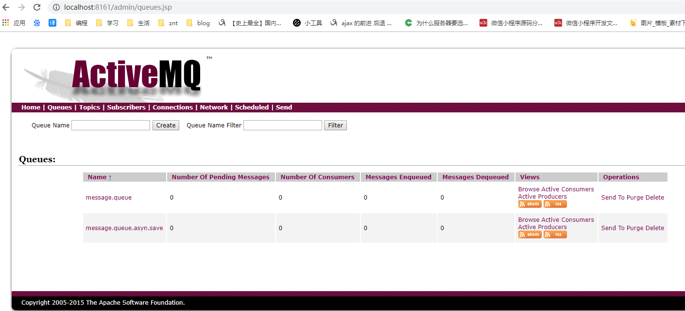
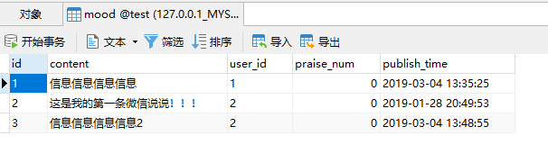

<div class="tip">
	来历：
				
	自身的特点：
		
	适合解决的问题：
		
	实际的应用场景：
		
</div>

1.在springBootStudio项目中添加Module。

2.选择Spring Initializr，点击next。



3.Group填写com.chanchifeng，Artifact填写activemq。



4.勾选如下图所示，点击next。



5.Content_root和Module file location选择springBootStudio项目路径。



6.修改pom.xml，添加druid和修改mysql版本号，核心代码如下：

```
	<dependencies>
        <dependency>
            <groupId>org.springframework.boot</groupId>
            <artifactId>spring-boot-starter-activemq</artifactId>
        </dependency>

        <dependency>
            <groupId>org.springframework.boot</groupId>
            <artifactId>spring-boot-starter-data-jpa</artifactId>
        </dependency>

        <dependency>
            <groupId>org.springframework.boot</groupId>
            <artifactId>spring-boot-starter-jdbc</artifactId>
        </dependency>

        <dependency>
            <groupId>org.springframework.boot</groupId>
            <artifactId>spring-boot-starter-web</artifactId>
        </dependency>

        <dependency>
            <groupId>mysql</groupId>
            <artifactId>mysql-connector-java</artifactId>
            <version>5.1.46</version>
            <scope>runtime</scope>
        </dependency>

        <!-- druid -->
        <dependency>
            <groupId>com.alibaba</groupId>
            <artifactId>druid</artifactId>
            <version>1.1.10</version>
        </dependency>

        <dependency>
            <groupId>org.springframework.boot</groupId>
            <artifactId>spring-boot-starter-test</artifactId>
            <scope>test</scope>
        </dependency>

    </dependencies>

```

7.修改application.properties，代码如下：

```
	###  MySQL 连接信息
	spring.datasource.url = jdbc:mysql://127.0.0.1:3306/test?useSSL=true
	spring.datasource.username = root
	spring.datasource.password = 1qaz2wsx
	spring.datasource.driver-class-name = com.mysql.jdbc.Driver
	
	###  数据源类别
	spring.datasource.type=com.alibaba.druid.pool.DruidDataSource
	### 初始化大小，最小，最大
	spring.datasource.initialSize=5
	spring.datasource.minIdle=5
	spring.datasource.maxActive=20
	### 配置获取连接等待超时的时间，单位是毫秒
	spring.datasource.maxWait=60000
	### 配置间隔多久才进行一次检测，检测需要关闭的空闲连接，单位是毫秒
	spring.datasource.timeBetweenEvictionRunsMillis=60000
	### 配置一个连接在池中最小生存的时间，单位是毫秒
	spring.datasource.minEvictableIdleTimeMillis=300000
	spring.datasource.validationQuery=SELECT 1 FROM DUAL
	spring.datasource.testWhileIdle=true
	spring.datasource.testOnBorrow=false
	spring.datasource.testOnReturn=false
	### 打开PSCache，并且指定每个连接上PSCache的大小
	spring.datasource.poolPreparedStatements=true
	spring.datasource.maxPoolPreparedStatementPerConnectionSize=20
	### 配置监控统计拦截的filters，去掉后监控界面sql无法统计，'wall'用于防火墙
	spring.datasource.filters=stat,wall,log4j
	### 通过connectProperties属性来打开mergeSql功能；慢SQL记录
	spring.datasource.connectionProperties=druid.stat.mergeSql=true;druid.stat.slowSqlMillis=5000
	### 合并多个DruidDataSource的监控数据
	#spring.datasource.useGlobalDataSourceStat=true
	
	### activemq
	spring.activemq.broker-url=tcp://localhost:61616
	spring.activemq.in-memory=true
	spring.activemq.pool.enabled=false
	spring.activemq.packages.trust-all=true

```

8.在MySQL中创建一张mood表。

```
	CREATE TABLE `mood` (
	  `id` varchar(32) NOT NULL,
	  `content` varchar(256) DEFAULT NULL,
	  `user_id` varchar(32) DEFAULT NULL,
	  `praise_num` int(11) DEFAULT NULL,
	  `publish_time` datetime DEFAULT NULL,
	  PRIMARY KEY (`id`),
	  KEY `mood_user_id_index` (`user_id`) USING BTREE
	) ENGINE=InnoDB DEFAULT CHARSET=utf8;

```

9.在项目中创建model包，在其下创建Mood类，代码如下：

```
	@Entity
	@Table(name = "mood")
	public class Mood implements Serializable {
	
	    /**
	     * 主键
	     */
	    @Id
	    private String id;
	    /**
	     * 说说内容
	     */
	    private String content;
	    /**
	     * 用户id
	     */
	    private String userId;
	    /**
	     * 点赞数量
	     */
	    private Integer praiseNum;
	    /**
	     * 发表时间
	     */
	    private Date publishTime;
	
	    @Override
	    public String toString() {
	        return "AyMood{" +
	                "id='" + id + '\'' +
	                ", content='" + content + '\'' +
	                ", userId='" + userId + '\'' +
	                ", praiseNum=" + praiseNum +
	                ", publishTime=" + publishTime +
	                '}';
	    }
	
	    public String getId() {
	        return id;
	    }
	
	    public void setId(String id) {
	        this.id = id;
	    }
	
	    public String getContent() {
	        return content;
	    }
	
	    public void setContent(String content) {
	        this.content = content;
	    }
	
	    public String getUserId() {
	        return userId;
	    }
	
	    public void setUserId(String userId) {
	        this.userId = userId;
	    }
	
	    public Integer getPraiseNum() {
	        return praiseNum;
	    }
	
	    public void setPraiseNum(Integer praiseNum) {
	        this.praiseNum = praiseNum;
	    }
	
	    public Date getPublishTime() {
	        return publishTime;
	    }
	
	    public void setPublishTime(Date publishTime) {
	        this.publishTime = publishTime;
	    }
	}

```

10.在项目中创建consumer包，在其下创建MoodConsumer类，代码如下：

```
	@Component
	public class MoodConsumer {
	
	    @JmsListener(destination = "message.queue")
	    public void receiveQueue(String text) {
	        System.out.println("用户发表【" + text + "】成功");
	    }
	
	    @Resource
	    private MoodService moodService;
	
	    @JmsListener(destination = "message.queue.asyn.save")
	    public void receiveQueue(Mood mood){
	        moodService.save(mood);
	    }
	}

```

11.在项目中创建producer包，在其下创建MoodProducer类，代码如下：

```
	@Service
	public class MoodProducer {
	
	    @Resource
	    private JmsMessagingTemplate jmsMessagingTemplate;
	
	    public void sendMessage(Destination destination, final String message) {
	        jmsMessagingTemplate.convertAndSend(destination, message);
	    }
	
	    public void sendMessage(Destination destination, final Mood mood) {
	        jmsMessagingTemplate.convertAndSend(destination, mood);
	    }
	
	}

```

12.在项目中创建repository包，在其下创建MoodRepository类，代码如下：

```
	public interface MoodRepository extends JpaRepository<Mood,String> {
	}

```

13.在项目中创建service.impl包，在其下创建MoodServiceImpl类，代码如下：

```

	@Service
	public class MoodServiceImpl implements MoodService {
	    @Resource
	    private MoodRepository moodRepository;
	
	    @Override
	    public Mood save(Mood mood) {
	        return moodRepository.save(mood);
	    }
	
	    /**
	     * 队列
	     */
	    private static Destination destination = new ActiveMQQueue("message.queue.asyn.save");
	
	    @Resource
	    private MoodProducer moodProducer;
	
	    @Override
	    public String asynSave(Mood mood) {
	        //往队列ay.queue.asyn.save推送消息，消息内容为说说实体
	        moodProducer.sendMessage(destination,mood);
	        return "success";
	    }
	}
```

14.在项目中创建service包，在其下创建MoodService类，代码如下：

```

	public interface MoodService {
	    Mood save(Mood ayMood);
	    String asynSave(Mood mood);
	}

```

16.启动ActiveMQ，如下图所示：



15.编写测试，核心代码如下：

```
	@RunWith(SpringRunner.class)
	@SpringBootTest
	public class ActivemqApplicationTests {
	
	    @Resource
	    private MoodService moodService;
	
	    /**
	     * 普通的jpa保存至数据库
	     */
	    @Test
	    public void testAyMood(){
	        Mood mood = new Mood();
	        mood.setId("1");
	        //用户阿毅id为1
	        mood.setUserId("1");
	        mood.setPraiseNum(0);
	        //说说内容
	        mood.setContent("信息信息信息信息");
	        mood.setPublishTime(new Date());
	        Mood save = moodService.save(mood);
	    }
	
	    @Resource
	    private MoodProducer moodProducer;
	
	    /**
	     * 测试是否启动activeMQ
	     */
	    @Test
	    public void testActiveMQ() {
	        Destination destination = new ActiveMQQueue("message.queue");
	        moodProducer.sendMessage(destination, "hello,activeMQ!!!");
	    }
	
	    /**
	     * 测试异步消息
	     */
	    @Test
	    public void testActiveMQAsynSave() {
	        Mood ayMood = new Mood();
	        ayMood.setId("3");
	        ayMood.setUserId("2");
	        ayMood.setPraiseNum(0);
	        ayMood.setContent("信息信息信息信息2");
	        ayMood.setPublishTime(new Date());
	        String msg = moodService.asynSave(ayMood);
	        System.out.println("异步发表 :" + msg);
	
	    }
	}

```

16.测试结果：





