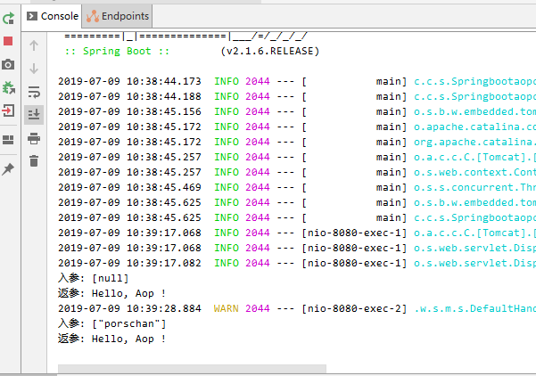

> 参考[如何优雅地在 Spring Boot 中使用自定义注解，AOP 切面统一打印出入参日志 | 修订版](<https://mp.weixin.qq.com/s?__biz=MzA3ODQ0Mzg2OA==&mid=2649049700&idx=1&sn=bdf966758028aabe2d264ac6e9deb2f7&chksm=87534e57b024c741cf762b3b048606e1ebbfa10f8db3f3825fa8248dac2c5a379e4617181558&scene=0&xtrack=1&key=6f7c97b70c0a4e5c6c5378d20afe99fb56d0d845ac8b90ea3e0eebdbe025f66ab5cf6417c0c991e992cc6849dcfa3c1bb1b4d8fb70e271ce0c8fb0025ccecdc5b20ccbb06a57ee54fe34b46d840dd37b&ascene=14&uin=NjI4MjYzOTE4&devicetype=Windows+10&version=62060833&lang=zh_CN&pass_ticket=MwptHzZzo0dn%2FtaJ8Qn6EMNSO06fxm3570faB4nfkdngiUeVAG4WLsIPPxDs6Qba>)

1.com.chanchifeng.springbootaopclasslog.config.AOPConfig

```java
import com.alibaba.fastjson.JSONObject;
import org.aspectj.lang.ProceedingJoinPoint;
import org.aspectj.lang.annotation.Around;
import org.aspectj.lang.annotation.Aspect;
import org.springframework.context.annotation.Configuration;

import java.util.Arrays;

@Configuration
@Aspect
public class AOPConfig {

    @Around("@within(org.springframework.web.bind.annotation.RestController)")
    public Object simpleAop(final ProceedingJoinPoint proceedingJoinPoint) throws Throwable {
        Object[] args = proceedingJoinPoint.getArgs();
        System.out.println("入参: " + JSONObject.toJSONString(Arrays.asList(args)));
        // 调用原有的方法
        Object object = proceedingJoinPoint.proceed();
        System.out.println("返参: " + object);
        return object;
    }
}
```

2.com.chanchifeng.springbootaopclasslog.controller.TestController

```java
import com.chanchifeng.springbootaopclasslog.form.UserForm;
import org.springframework.web.bind.annotation.GetMapping;
import org.springframework.web.bind.annotation.PostMapping;
import org.springframework.web.bind.annotation.RequestBody;
import org.springframework.web.bind.annotation.RestController;

@RestController
public class TestController {

    @GetMapping("/test")
    public String test(String name) {
        return "Hello, Aop !";
    }

    @PostMapping("/login")
    public String login(@RequestBody UserForm userForm) {
        return "Hello, Aop2 !";
    }

}
```

3.com.chanchifeng.springbootaopclasslog.form.UserForm

```java
import java.io.Serializable;

public class UserForm implements Serializable {
    /**
     * 用户名
     */
    private String username;
    /**
     * 密码
     */
    private String password;

    public String getUsername() {
        return username;
    }

    public void setUsername(String username) {
        this.username = username;
    }

    public String getPassword() {
        return password;
    }

    public void setPassword(String password) {
        this.password = password;
    }
}
```

4.com.chanchifeng.springbootaopclasslog.SpringbootaopclasslogApplication

```java
import org.springframework.boot.SpringApplication;
import org.springframework.boot.autoconfigure.SpringBootApplication;

@SpringBootApplication
public class SpringbootaopclasslogApplication {

    public static void main(String[] args) {
        SpringApplication.run(SpringbootaopclasslogApplication.class, args);
    }

}
```

5.application.properties

```java
spring.profiles.active=dev
```

6.pom.xml

```xml
<?xml version="1.0" encoding="UTF-8"?>
<project xmlns="http://maven.apache.org/POM/4.0.0" xmlns:xsi="http://www.w3.org/2001/XMLSchema-instance"
         xsi:schemaLocation="http://maven.apache.org/POM/4.0.0 http://maven.apache.org/xsd/maven-4.0.0.xsd">
    <modelVersion>4.0.0</modelVersion>
    <parent>
        <groupId>org.springframework.boot</groupId>
        <artifactId>spring-boot-starter-parent</artifactId>
        <version>2.1.6.RELEASE</version>
        <relativePath/> <!-- lookup parent from repository -->
    </parent>
    <groupId>com.chanchifeng</groupId>
    <artifactId>springbootaopclasslog</artifactId>
    <version>0.0.1-SNAPSHOT</version>
    <name>springbootaopclasslog</name>
    <description>Demo project for Spring Boot</description>

    <properties>
        <java.version>1.8</java.version>
    </properties>

    <dependencies>
        <dependency>
            <groupId>org.springframework.boot</groupId>
            <artifactId>spring-boot-starter-web</artifactId>
        </dependency>

        <dependency>
            <groupId>org.springframework.boot</groupId>
            <artifactId>spring-boot-starter-test</artifactId>
            <scope>test</scope>
        </dependency>

        <dependency>
            <groupId>org.springframework.boot</groupId>
            <artifactId>spring-boot-starter-aop</artifactId>
        </dependency>

        <dependency>
            <groupId>com.alibaba</groupId>
            <artifactId>fastjson</artifactId>
            <version>1.2.31</version>
        </dependency>

    </dependencies>

    <build>
        <plugins>
            <plugin>
                <groupId>org.springframework.boot</groupId>
                <artifactId>spring-boot-maven-plugin</artifactId>
            </plugin>
        </plugins>
    </build>

</project>

```

7.运行效果如下：



> 项目的Github地址：<https://github.com/porschan/springBootStudio/tree/master/springboot-aop-class-log>