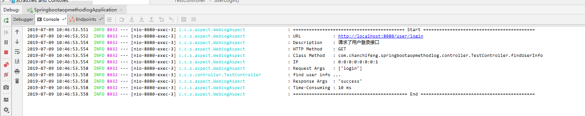

> 参考[如何优雅地在 Spring Boot 中使用自定义注解，AOP 切面统一打印出入参日志 | 修订版](<https://mp.weixin.qq.com/s?__biz=MzA3ODQ0Mzg2OA==&mid=2649049700&idx=1&sn=bdf966758028aabe2d264ac6e9deb2f7&chksm=87534e57b024c741cf762b3b048606e1ebbfa10f8db3f3825fa8248dac2c5a379e4617181558&scene=0&xtrack=1&key=6f7c97b70c0a4e5c6c5378d20afe99fb56d0d845ac8b90ea3e0eebdbe025f66ab5cf6417c0c991e992cc6849dcfa3c1bb1b4d8fb70e271ce0c8fb0025ccecdc5b20ccbb06a57ee54fe34b46d840dd37b&ascene=14&uin=NjI4MjYzOTE4&devicetype=Windows+10&version=62060833&lang=zh_CN&pass_ticket=MwptHzZzo0dn%2FtaJ8Qn6EMNSO06fxm3570faB4nfkdngiUeVAG4WLsIPPxDs6Qba>)

1.com.chanchifeng.springbootaopmethodlog.aspect.WebLog

```java
import java.lang.annotation.*;

@Retention(RetentionPolicy.RUNTIME)
@Target({ElementType.METHOD})
@Documented
public @interface WebLog {
    /**
     * 日志描述信息
     *
     * @return
     */
    String description() default "";

}
```

2.com.chanchifeng.springbootaopmethodlog.aspect.WebLogAspect

```java
import com.google.gson.Gson;
import org.aspectj.lang.JoinPoint;
import org.aspectj.lang.ProceedingJoinPoint;
import org.aspectj.lang.annotation.*;
import org.slf4j.Logger;
import org.slf4j.LoggerFactory;
import org.springframework.context.annotation.Profile;
import org.springframework.stereotype.Component;
import org.springframework.web.context.request.RequestContextHolder;
import org.springframework.web.context.request.ServletRequestAttributes;

import javax.servlet.http.HttpServletRequest;
import java.lang.reflect.Method;

@Aspect
@Component
@Profile({"dev", "test"})
public class WebLogAspect {

    private final static Logger logger = LoggerFactory.getLogger(WebLogAspect.class);
    /**
     * 换行符
     */
    private static final String LINE_SEPARATOR = System.lineSeparator();

    /**
     * 以自定义 @WebLog 注解为切点
     */
    @Pointcut("@annotation(com.chanchifeng.springbootaopmethodlog.aspect.WebLog)")
    public void webLog() {
    }

    /**
     * 在切点之前织入
     *
     * @param joinPoint
     * @throws Throwable
     */
    @Before("webLog()")
    public void doBefore(JoinPoint joinPoint) throws Throwable {
        // 开始打印请求日志
        ServletRequestAttributes attributes = (ServletRequestAttributes) RequestContextHolder.getRequestAttributes();
        HttpServletRequest request = attributes.getRequest();

        // 获取 @WebLog 注解的描述信息
        String methodDescription = getAspectLogDescription(joinPoint);

        // 打印请求相关参数
        logger.info("========================================== Start ==========================================");
        // 打印请求 url
        logger.info("URL            : {}", request.getRequestURL().toString());
        // 打印描述信息
        logger.info("Description    : {}", methodDescription);
        // 打印 Http method
        logger.info("HTTP Method    : {}", request.getMethod());
        // 打印调用 controller 的全路径以及执行方法
        logger.info("Class Method   : {}.{}", joinPoint.getSignature().getDeclaringTypeName(), joinPoint.getSignature().getName());
        // 打印请求的 IP
        logger.info("IP             : {}", request.getRemoteAddr());
        // 打印请求入参
        logger.info("Request Args   : {}", new Gson().toJson(joinPoint.getArgs()));
    }

    /**
     * 在切点之后织入
     *
     * @throws Throwable
     */
    @After("webLog()")
    public void doAfter() throws Throwable {
        // 接口结束后换行，方便分割查看
        logger.info("=========================================== End ===========================================" + LINE_SEPARATOR);
    }

    /**
     * 环绕
     *
     * @param proceedingJoinPoint
     * @return
     * @throws Throwable
     */
    @Around("webLog()")
    public Object doAround(ProceedingJoinPoint proceedingJoinPoint) throws Throwable {
        long startTime = System.currentTimeMillis();
        Object result = proceedingJoinPoint.proceed();
        // 打印出参
        logger.info("Response Args  : {}", new Gson().toJson(result));
        // 执行耗时
        logger.info("Time-Consuming : {} ms", System.currentTimeMillis() - startTime);
        return result;
    }


    /**
     * 获取切面注解的描述
     *
     * @param joinPoint 切点
     * @return 描述信息
     * @throws Exception
     */
    public String getAspectLogDescription(JoinPoint joinPoint)
            throws Exception {
        String targetName = joinPoint.getTarget().getClass().getName();
        String methodName = joinPoint.getSignature().getName();
        Object[] arguments = joinPoint.getArgs();
        Class targetClass = Class.forName(targetName);
        Method[] methods = targetClass.getMethods();
        StringBuilder description = new StringBuilder("");
        for (Method method : methods) {
            if (method.getName().equals(methodName)) {
                Class[] clazzs = method.getParameterTypes();
                if (clazzs.length == arguments.length) {
                    description.append(method.getAnnotation(WebLog.class).description());
                    break;
                }
            }
        }
        return description.toString();
    }

}
```

3.com.chanchifeng.springbootaopmethodlog.controller.TestController

```java
import com.chanchifeng.springbootaopmethodlog.aspect.WebLog;
import com.chanchifeng.springbootaopmethodlog.entity.User;
import org.slf4j.Logger;
import org.slf4j.LoggerFactory;
import org.springframework.web.bind.annotation.*;
import org.springframework.web.multipart.MultipartFile;

@RestController
public class TestController {

    private final static Logger logger = LoggerFactory.getLogger(TestController.class);

    /**
     * POST 方式接口测试
     *
     * @param user
     * @return
     */
    @PostMapping("/user/login")
    @WebLog(description = "请求了用户登录接口")
    public User userLogin(@RequestBody User user) {
        logger.info("user login ...");
        return user;
    }

    /**
     * GET 方式接口测试
     *
     * @return
     */
    @GetMapping("/user/{id}")
    @WebLog(description = "请求了用户登录接口")
    public String findUserInfo(@PathVariable("id") String userId) {
        logger.info("find user info ...");
        return "success";
    }

    /**
     * GET 方式接口测试
     *
     * @return
     */
    @GetMapping("/test")
    public String test() {
        logger.info("testGet ...");
        return "success";
    }

    /**
     * 单文件上传接口测试
     *
     * @return
     */
    @PostMapping("/file/upload")
    public String testFileUpload(@RequestParam("file") MultipartFile file) {
        logger.info("testFileUpload ...");
        return "success";
    }

    /**
     * 多文件上传接口测试
     *
     * @return
     */
    @PostMapping("/multiFile/upload")
    public String testMultiFileUpload(@RequestParam("file") MultipartFile[] file) {
        logger.info("testMultiFileUpload ...");
        return "success";
    }
}
```

4.com.chanchifeng.springbootaopmethodlog.entity.User

```java
import java.io.Serializable;
import java.util.Date;

public class User implements Serializable {
    /**
     * 用户名
     */
    private String username;
    /**
     * 密码
     */
    private String password;
    /**
     * 创建时间
     */
    private Date createTime;

    public String getUsername() {
        return username;
    }

    public void setUsername(String username) {
        this.username = username;
    }

    public String getPassword() {
        return password;
    }

    public void setPassword(String password) {
        this.password = password;
    }

    public Date getCreateTime() {
        return createTime;
    }

    public void setCreateTime(Date createTime) {
        this.createTime = createTime;
    }
}
```

5.com.chanchifeng.springbootaopmethodlog.SpringbootaopmethodlogApplication

```java
@SpringBootApplication
public class SpringbootaopmethodlogApplication {

    public static void main(String[] args) {
        SpringApplication.run(SpringbootaopmethodlogApplication.class, args);
    }

}
```

6.application.properties

```properties
spring.profiles.active=dev
logging.config=classpath:logback-spring.xml
```

7.logback-spring.xml

```xml
<?xml version="1.0" encoding="UTF-8"?>
<configuration >
    <jmxConfigurator/>
    <include resource="org/springframework/boot/logging/logback/defaults.xml" />

    <property scope="context" name="appName" value="test" />
    <property name="LOG_FILE" value="/app/logs/${appName}/${appName}.%d{yyyy-MM-dd}"/>
    <property name="FILE_LOG_PATTERN" value="%d{yyyy-MM-dd HH:mm:ss.SSS} [%thread] %-5level %logger{50} - %msg%n"/>
    <!--<property name="CONSOLE_LOG_PATTERN" value="${FILE_LOG_PATTERN}"/>-->

    <!-- 按照每天生成日志文件 -->
    <appender name="FILE" class="ch.qos.logback.core.rolling.RollingFileAppender">
        <rollingPolicy class="ch.qos.logback.core.rolling.TimeBasedRollingPolicy">
        <!--日志文件输出的文件名-->
        <FileNamePattern>${LOG_FILE}-%i.log</FileNamePattern>
        <!--日志文件保留天数-->
        <MaxHistory>30</MaxHistory>
        <!--日志文件最大的大小-->
        <TimeBasedFileNamingAndTriggeringPolicy class="ch.qos.logback.core.rolling.SizeAndTimeBasedFNATP">
        <maxFileSize>10MB</maxFileSize>
        </TimeBasedFileNamingAndTriggeringPolicy>
        </rollingPolicy>
        <encoder class="ch.qos.logback.classic.encoder.PatternLayoutEncoder">
        <!--格式化输出：%d表示日期，%thread表示线程名，%-5level：级别从左显示5个字符宽度%errorMessage：日志消息，%n是换行符-->
        <pattern>${FILE_LOG_PATTERN}</pattern>
        </encoder>
    </appender>

    <springProfile name="dev">
        <include resource="org/springframework/boot/logging/logback/console-appender.xml" />
        <root level="info">
            <appender-ref ref="CONSOLE" />
        </root>
    </springProfile>

    <springProfile name="prod">
        <include resource="org/springframework/boot/logging/logback/console-appender.xml" />
        <root level="INFO">
            <appender-ref ref="FILE" />
        </root>
    </springProfile>
</configuration>
```

8.pom.xml

````xml
<?xml version="1.0" encoding="UTF-8"?>
<project xmlns="http://maven.apache.org/POM/4.0.0" xmlns:xsi="http://www.w3.org/2001/XMLSchema-instance"
         xsi:schemaLocation="http://maven.apache.org/POM/4.0.0 http://maven.apache.org/xsd/maven-4.0.0.xsd">
    <modelVersion>4.0.0</modelVersion>
    <parent>
        <groupId>org.springframework.boot</groupId>
        <artifactId>spring-boot-starter-parent</artifactId>
        <version>2.1.6.RELEASE</version>
        <relativePath/> <!-- lookup parent from repository -->
    </parent>
    <groupId>com.chanchifeng</groupId>
    <artifactId>springbootaopmethodlog</artifactId>
    <version>0.0.1-SNAPSHOT</version>
    <name>springbootaopmethodlog</name>
    <description>Demo project for Spring Boot</description>

    <properties>
        <java.version>1.8</java.version>
    </properties>

    <dependencies>
        <dependency>
            <groupId>org.springframework.boot</groupId>
            <artifactId>spring-boot-starter-web</artifactId>
        </dependency>

        <dependency>
            <groupId>org.springframework.boot</groupId>
            <artifactId>spring-boot-starter-test</artifactId>
            <scope>test</scope>
        </dependency>

        <dependency>
            <groupId>org.springframework.boot</groupId>
            <artifactId>spring-boot-starter-aop</artifactId>
        </dependency>

        <!-- 用于日志切面中，以 json 格式打印出入参 -->
        <dependency>
            <groupId>com.google.code.gson</groupId>
            <artifactId>gson</artifactId>
            <version>2.8.5</version>
        </dependency>

    </dependencies>

    <build>
        <plugins>
            <plugin>
                <groupId>org.springframework.boot</groupId>
                <artifactId>spring-boot-maven-plugin</artifactId>
            </plugin>
        </plugins>
    </build>

</project>
````

9.运行效果如下：



> 项目的Github地址：<https://github.com/porschan/springBootStudio/tree/master/springboot-aop-method-log>

在配置 AOP 切面之前，我们需要了解下 `aspectj` 相关注解的作用：

- **@Aspect**：声明该类为一个注解类；
- **@Pointcut**：定义一个切点，后面跟随一个表达式，表达式可以定义为切某个注解，也可以切某个 package 下的方法；

切点定义好后，就是围绕这个切点做文章了：

- **@Before**: 在切点之前，织入相关代码；
- **@After**: 在切点之后，织入相关代码;
- **@AfterReturning**: 在切点返回内容后，织入相关代码，一般用于对返回值做些加工处理的场景；
- **@AfterThrowing**: 用来处理当织入的代码抛出异常后的逻辑处理;
- **@Around**: 环绕，可以在切入点前后织入代码，并且可以自由的控制何时执行切点；