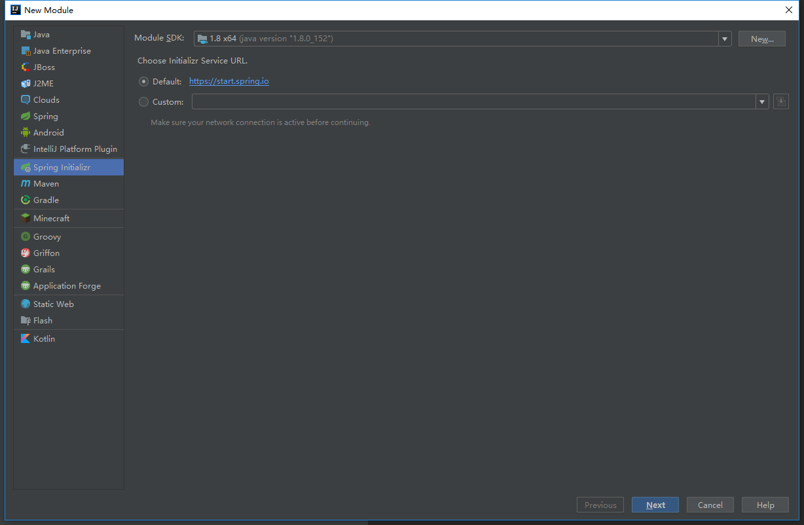
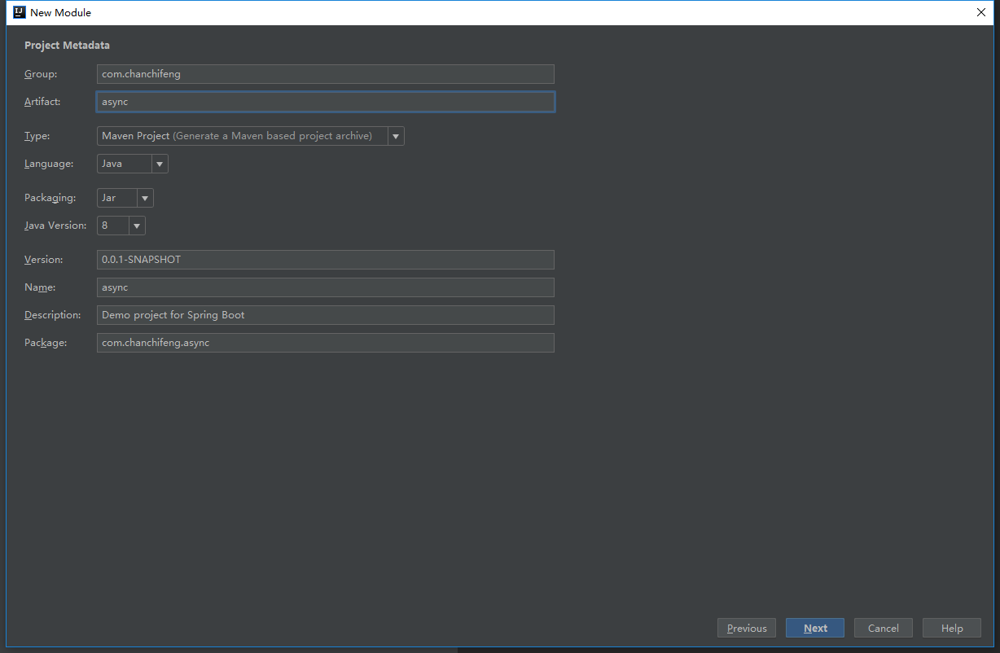
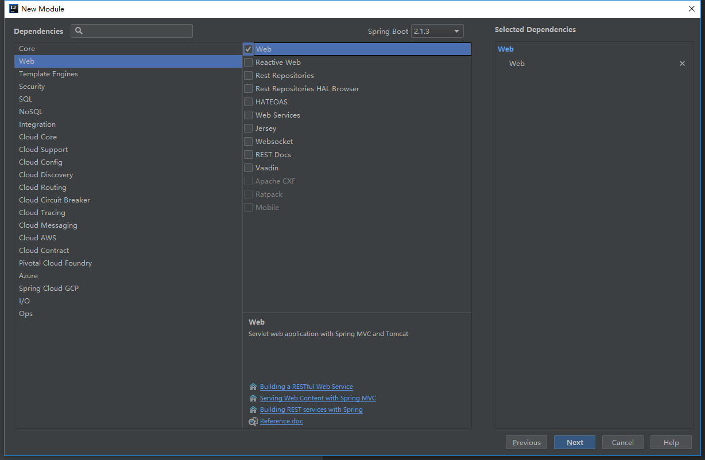
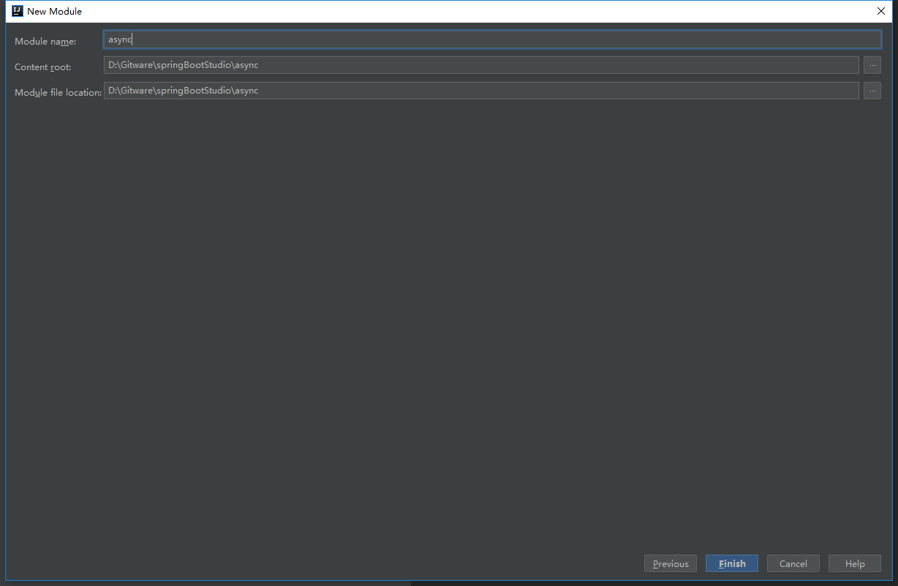
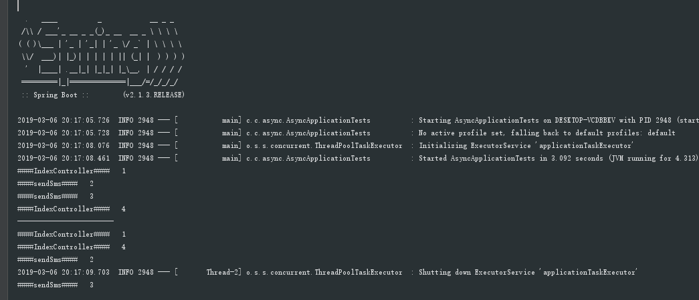

<div class="tip">
	来历：
				
	自身的特点：
		
	适合解决的问题：
		
	实际的应用场景：
		
</div>

1.在springBootStudio项目中添加Module。

2.选择Spring Initializr，点击next。



3.Group填写com.chanchifeng，Artifact填写async。



4.勾选SQL中的Web，点击next。



5.Content_root和Module file location选择springBootStudio项目路径。



6.在项目中创建service.impl包，在其下创建UserServiceImpl类，代码如下：

```
	@Service
	public class UserServiceImpl implements UserService {
	
	    @Override
	    public void sendSms() {
	        System.out.println("####sendSms####   2");
	        try {
	            Thread.sleep(1000);
	        } catch (InterruptedException e) {
	        }
	        System.out.println("####sendSms####   3");
	    }
	
	
	    @Async
	    @Override
	    public void sendSmsAsync(){
	        System.out.println("####sendSms####   2");
	        try {
	            Thread.sleep(1000);
	        } catch (InterruptedException e) {
	        }
	        System.out.println("####sendSms####   3");
	    }
	
	}

```

7.在项目中创建service包，在其下创建UserService类，代码如下：

```
	public interface UserService {
	
	    void sendSms();
	    void sendSmsAsync();
	}

```

8.需要再入口类添加注解@EnableAsync开启异步调用，代码如下：

```
	@EnableAsync
	@SpringBootApplication
	public class AsyncApplication {
	
	    public static void main(String[] args) {
	        SpringApplication.run(AsyncApplication.class, args);
	    }
	
	}

```

9.编写测试用例，代码如下：

```
	@RunWith(SpringRunner.class)
	@SpringBootTest
	public class AsyncApplicationTests {
	
	    @Autowired
	    UserService userService;
	
	    @Test
	    public void contextLoads() {
	        System.out.println("####IndexController####   1");
	        userService.sendSms();
	        System.out.println("####IndexController####   4");
	
	        System.out.println("------------------------");
	//
	        System.out.println("####IndexController####   1");
	        userService.sendSmsAsync();
	        System.out.println("####IndexController####   4");
	
	    }
	
	}

```
10.运行时的结果，如下图：



<div class="tip">
	参考：springboot之异步调用@Async[https://www.cnblogs.com/xuwenjin/p/8858050.html](https://www.cnblogs.com/xuwenjin/p/8858050.html "https://www.cnblogs.com/xuwenjin/p/8858050.html")
		
</div>