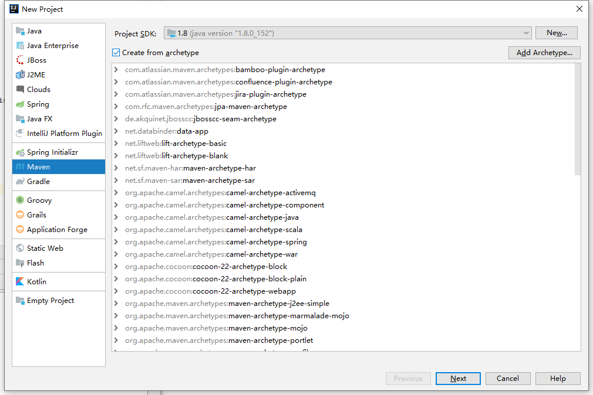
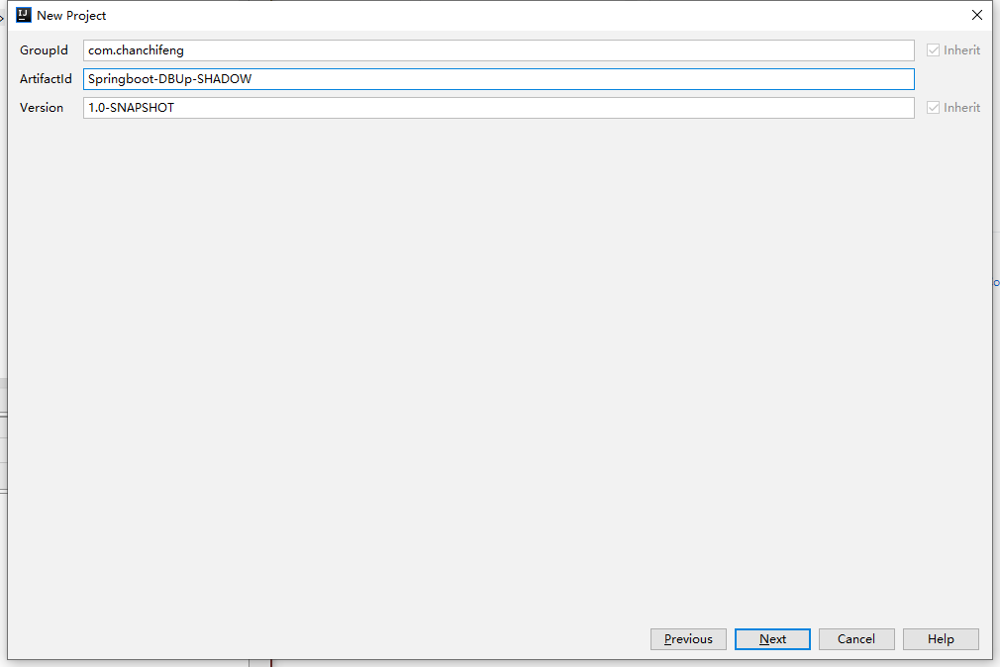
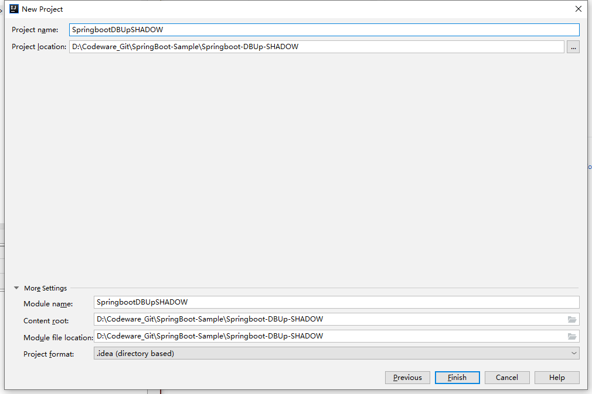
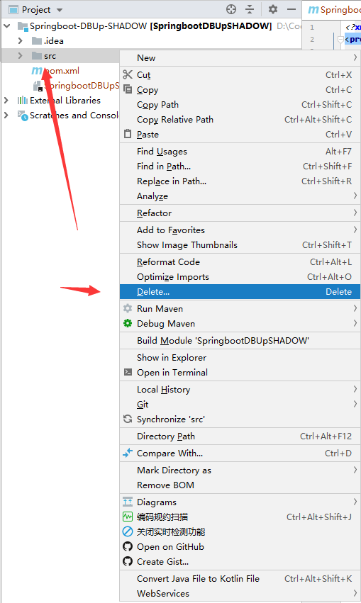
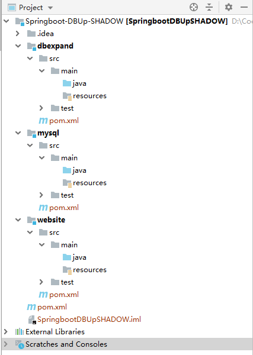
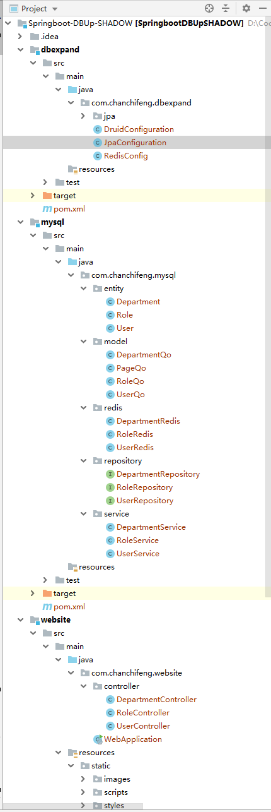
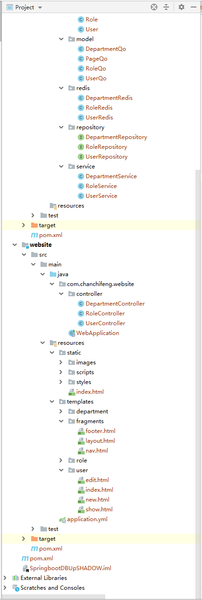
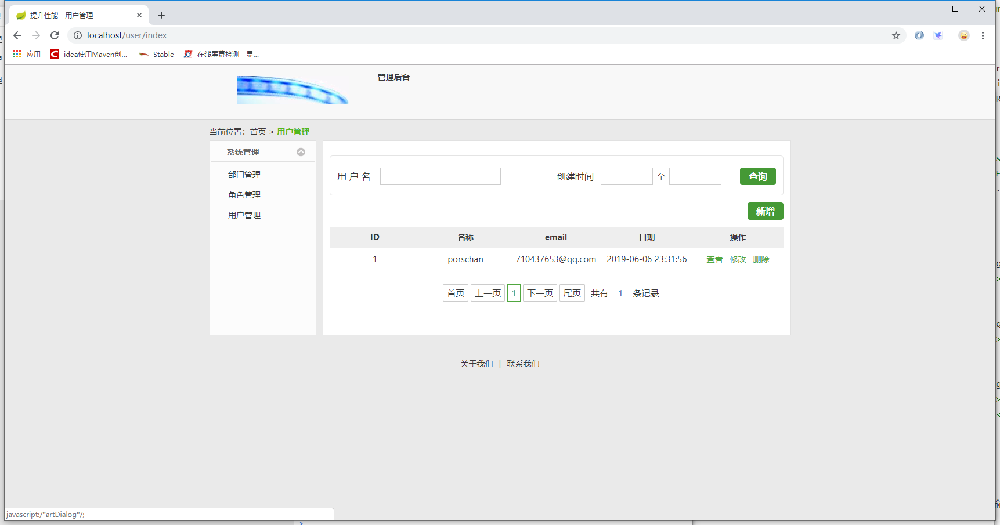
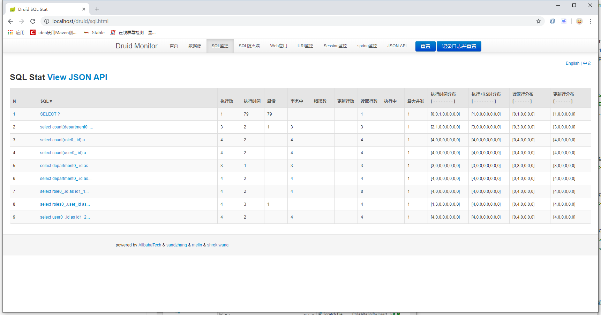

1.创建maven的空白工程，如下图所示：



2.GroupID和ArtifactId命名为com.chanchifeng和Springboot-DBUp-SHADOW,如下图所示：



3.设置项目的电脑位置，如下图所示：



4.将src删除，操作如下图所示：



5.分别创建3个模块，分别为dbexpand、mysql和website,创建完成后目录结构：



6.项目的整体结构如下图所示：





7.dbexpand/com.chanchifeng.dbexpand.DruidConfiguration:

```java
import com.alibaba.druid.support.http.StatViewServlet;
import com.alibaba.druid.support.http.WebStatFilter;
import org.springframework.boot.context.embedded.FilterRegistrationBean;
import org.springframework.boot.context.embedded.ServletRegistrationBean;
import org.springframework.context.annotation.Bean;
import org.springframework.context.annotation.Configuration;

@Configuration
public class DruidConfiguration {
    @Bean
    public ServletRegistrationBean statViewServle(){
        ServletRegistrationBean servletRegistrationBean = new ServletRegistrationBean(new StatViewServlet(),"/druid/*");
        //白名单：
        servletRegistrationBean.addInitParameter("allow","192.168.1.218,127.0.0.1");
        //IP黑名单 (存在共同时，deny优先于allow) : 如果满足deny的即提示:Sorry, you are not permitted to view this page.
        servletRegistrationBean.addInitParameter("deny","192.168.1.100");
        //登录查看信息的账号密码.
        servletRegistrationBean.addInitParameter("loginUsername","druid");
        servletRegistrationBean.addInitParameter("loginPassword","12345678");
        //是否能够重置数据.
        servletRegistrationBean.addInitParameter("resetEnable","false");
        return servletRegistrationBean;
    }

    @Bean
    public FilterRegistrationBean statFilter(){
        FilterRegistrationBean filterRegistrationBean = new FilterRegistrationBean(new WebStatFilter());
        //添加过滤规则.
        filterRegistrationBean.addUrlPatterns("/*");
        //添加不需要忽略的格式信息.
        filterRegistrationBean.addInitParameter("exclusions","*.js,*.gif,*.jpg,*.png,*.css,*.ico,/druid/*");
        return filterRegistrationBean;
    }
}
```

8.dbexpand/com.chanchifeng.dbexpand.JpaConfiguration:

```java
import com.chanchifeng.dbexpand.jpa.repository.ExpandJpaRepositoryFactoryBean;
import org.springframework.boot.orm.jpa.EntityScan;
import org.springframework.context.annotation.Bean;
import org.springframework.context.annotation.Configuration;
import org.springframework.core.Ordered;
import org.springframework.core.annotation.Order;
import org.springframework.dao.annotation.PersistenceExceptionTranslationPostProcessor;
import org.springframework.data.jpa.repository.config.EnableJpaRepositories;
import org.springframework.transaction.annotation.EnableTransactionManagement;

@Order(Ordered.HIGHEST_PRECEDENCE)
@Configuration
@EnableTransactionManagement(proxyTargetClass = true)
@EnableJpaRepositories(basePackages = "com.**.repository",repositoryFactoryBeanClass = ExpandJpaRepositoryFactoryBean.class)
@EntityScan(basePackages = "com.**.entity")
public class JpaConfiguration {
    @Bean
    PersistenceExceptionTranslationPostProcessor persistenceExceptionTranslationPostProcessor(){
        return new PersistenceExceptionTranslationPostProcessor();
    }
}
```

9.dbexpand/com.chanchifeng.dbexpand.RedisConfig:

```java
import java.lang.reflect.InvocationTargetException;
import java.lang.reflect.Method;

@Configuration
@EnableCaching
public class RedisConfig extends CachingConfigurerSupport {

    @Bean
    public KeyGenerator simpleKey(){
        return new KeyGenerator() {
            @Override
            public Object generate(Object target, Method method, Object... params) {
                StringBuilder sb = new StringBuilder();
                sb.append(target.getClass().getName()+":");
                for (Object obj : params) {
                    sb.append(obj.toString());
                }
                return sb.toString();
            }
        };
    }

    @Bean
    public KeyGenerator objectId(){
        return new KeyGenerator() {
            @Override
            public Object generate(Object target, Method method, Object... params){
                StringBuilder sb = new StringBuilder();
                sb.append(target.getClass().getName()+":");
                try {
                    sb.append(params[0].getClass().getMethod("getId", null).invoke(params[0], null).toString());
                }catch (NoSuchMethodException no){
                    no.printStackTrace();
                }catch(IllegalAccessException il){
                    il.printStackTrace();
                }catch(InvocationTargetException iv){
                    iv.printStackTrace();
                }
                return sb.toString();
            }
        };
    }

    @Bean
    public CacheManager cacheManager(@SuppressWarnings("rawtypes") RedisTemplate redisTemplate) {
        RedisCacheManager manager = new RedisCacheManager(redisTemplate);
        manager.setDefaultExpiration(30);//30秒
        manager.setUsePrefix(true);
        return manager;
    }

    @Bean
    public RedisTemplate<String, String> redisTemplate(
            RedisConnectionFactory factory) {
        StringRedisTemplate template = new StringRedisTemplate(factory);
        Jackson2JsonRedisSerializer jackson2JsonRedisSerializer = new Jackson2JsonRedisSerializer(Object.class);
        ObjectMapper om = new ObjectMapper();
        om.setVisibility(PropertyAccessor.ALL, JsonAutoDetect.Visibility.ANY);
        om.enableDefaultTyping(ObjectMapper.DefaultTyping.NON_FINAL);
        jackson2JsonRedisSerializer.setObjectMapper(om);
        template.setValueSerializer(jackson2JsonRedisSerializer);
        template.afterPropertiesSet();
        return template;
    }

}
```

10.dbexpand/pom.xml:

```xml
<?xml version="1.0" encoding="UTF-8"?>
<project xmlns="http://maven.apache.org/POM/4.0.0"
         xmlns:xsi="http://www.w3.org/2001/XMLSchema-instance"
         xsi:schemaLocation="http://maven.apache.org/POM/4.0.0 http://maven.apache.org/xsd/maven-4.0.0.xsd">
    <parent>
        <artifactId>Springboot-DBUp-SHADOW</artifactId>
        <groupId>com.chanchifeng</groupId>
        <version>1.0-SNAPSHOT</version>
    </parent>
    <modelVersion>4.0.0</modelVersion>

    <artifactId>dbexpand</artifactId>
    <packaging>jar</packaging>

    <dependencies>
        <dependency>
            <groupId>org.springframework.boot</groupId>
            <artifactId>spring-boot-starter-data-jpa</artifactId>
        </dependency>
        <dependency>
            <groupId>mysql</groupId>
            <artifactId>mysql-connector-java</artifactId>
            <scope>runtime</scope>
        </dependency>
        <dependency>
            <groupId>org.springframework.boot</groupId>
            <artifactId>spring-boot-starter-redis</artifactId>
        </dependency>
        <dependency>
            <groupId>org.springframework.boot</groupId>
            <artifactId>spring-boot-configuration-processor</artifactId>
            <optional>true</optional>
        </dependency>

        <dependency>
            <groupId>com.alibaba</groupId>
            <artifactId>druid</artifactId>
            <version>1.0.18</version>
        </dependency>
        <dependency>
            <groupId>org.apache.commons</groupId>
            <artifactId>commons-lang3</artifactId>
            <version>3.4</version>
        </dependency>
        <dependency>
            <groupId>org.springframework.boot</groupId>
            <artifactId>spring-boot-starter-web</artifactId>
        </dependency>
    </dependencies>

</project>
```

11.mysql/com.chanchifeng.mysql.entity.Department:

```java
import org.springframework.format.annotation.DateTimeFormat;

import javax.persistence.*;
import java.util.Date;

@Entity
@Table(name = "department")
public class Department implements java.io.Serializable{
    @Id
    @GeneratedValue(strategy = GenerationType.IDENTITY)
    private Long id;
    private String name;
    @DateTimeFormat(pattern = "yyyy-MM-dd HH:mm:ss")
    private Date createdate;

    public Department() {
    }

    public Long getId() {
        return id;
    }

    public void setId(Long id) {
        this.id = id;
    }

    public String getName() {
        return name;
    }

    public void setName(String name) {
        this.name = name;
    }

    public Date getCreatedate() {
        return createdate;
    }

    public void setCreatedate(Date createdate) {
        this.createdate = createdate;
    }
}
```

12.mysql/com.chanchifeng.mysql.entity.Role:

```java
import org.springframework.format.annotation.DateTimeFormat;

import javax.persistence.*;
import java.util.Date;

@Entity
@Table(name = "role")
public class Role implements java.io.Serializable{
    @Id
    @GeneratedValue(strategy = GenerationType.IDENTITY)
    private Long id;
    private String name;
    @DateTimeFormat(pattern = "yyyy-MM-dd HH:mm:ss")
    private Date createdate;

    public Role() {
    }

    public Long getId() {
        return id;
    }

    public void setId(Long id) {
        this.id = id;
    }

    public String getName() {
        return name;
    }

    public void setName(String name) {
        this.name = name;
    }

    public Date getCreatedate() {
        return createdate;
    }

    public void setCreatedate(Date createdate) {
        this.createdate = createdate;
    }
}
```

13.mysql/com.chanchifeng.mysql.entity.User:

```java
import com.fasterxml.jackson.annotation.JsonBackReference;
import org.springframework.format.annotation.DateTimeFormat;

import javax.persistence.*;
import java.util.Date;
import java.util.List;

@Entity
@Table(name = "user")
public class User implements java.io.Serializable{
    @Id
    @GeneratedValue(strategy = GenerationType.IDENTITY)
    private Long id;
    private String name;
    private String email;
    private Integer sex;
    @DateTimeFormat(pattern = "yyyy-MM-dd HH:mm:ss")
    private Date createdate;

    @ManyToOne
    @JoinColumn(name = "did")
    @JsonBackReference
    private Department department;

    @ManyToMany
    @JoinTable(name = "user_role",
            joinColumns = {@JoinColumn(name = "user_id")},
            inverseJoinColumns = {@JoinColumn(name = "roles_id")})
    //@JsonIgnore
    private List<Role> roles;

    public User() {
    }

    public Long getId() {
        return id;
    }

    public void setId(Long id) {
        this.id = id;
    }

    public String getName() {
        return name;
    }

    public void setName(String name) {
        this.name = name;
    }

    public String getEmail() {
        return email;
    }

    public void setEmail(String email) {
        this.email = email;
    }

    public Integer getSex() {
        return sex;
    }

    public void setSex(Integer sex) {
        this.sex = sex;
    }

    public Date getCreatedate() {
        return createdate;
    }

    public void setCreatedate(Date createdate) {
        this.createdate = createdate;
    }

    public Department getDepartment() {
        return department;
    }

    public void setDepartment(Department department) {
        this.department = department;
    }

    public List<Role> getRoles() {
        return roles;
    }

    public void setRoles(List<Role> roles) {
        this.roles = roles;
    }
}
```

14.mysql/com.chanchifeng.mysql.model.DepartmentQo:

```java
public class DepartmentQo extends PageQo{
    private Long id;
    private String name;

    public DepartmentQo() {
    }

    public Long getId() {
        return id;
    }

    public void setId(Long id) {
        this.id = id;
    }

    public String getName() {
        return name;
    }

    public void setName(String name) {
        this.name = name;
    }

}
```

15.mysql/com.chanchifeng.mysql.model.PageQo:

```java
public class PageQo {
    private Integer page = 0;
    private Integer size = 10;

    public Integer getPage() {
        return page;
    }

    public void setPage(Integer page) {
        this.page = page;
    }

    public Integer getSize() {
        return size;
    }

    public void setSize(Integer size) {
        this.size = size;
    }
}
```

16.mysql/com.chanchifeng.mysql.model.RoleQo:

```java
public class RoleQo extends PageQo{
    private Long id;
    private String name;

    public RoleQo() {
    }

    public Long getId() {
        return id;
    }

    public void setId(Long id) {
        this.id = id;
    }

    public String getName() {
        return name;
    }

    public void setName(String name) {
        this.name = name;
    }

}
```

17.mysql/com.chanchifeng.mysql.model.UserQo:

```java
import org.springframework.format.annotation.DateTimeFormat;

import java.util.Date;

public class UserQo extends PageQo{
    private Long id;
    private String name;
    private String email;
    private Integer sex;
    @DateTimeFormat(pattern = "yyyy-MM-dd")
    private Date createdate;

    @DateTimeFormat(pattern = "yyyy-MM-dd")
    private Date createdateStart;
    @DateTimeFormat(pattern = "yyyy-MM-dd")
    private Date createdateEnd;

    public UserQo() {
    }

    public Long getId() {
        return id;
    }

    public void setId(Long id) {
        this.id = id;
    }

    public String getName() {
        return name;
    }

    public void setName(String name) {
        this.name = name;
    }

    public String getEmail() {
        return email;
    }

    public void setEmail(String email) {
        this.email = email;
    }

    public Integer getSex() {
        return sex;
    }

    public void setSex(Integer sex) {
        this.sex = sex;
    }

    public Date getCreatedate() {
        return createdate;
    }

    public void setCreatedate(Date createdate) {
        this.createdate = createdate;
    }

    public Date getCreatedateStart() {
        return createdateStart;
    }

    public void setCreatedateStart(Date createdateStart) {
        this.createdateStart = createdateStart;
    }

    public Date getCreatedateEnd() {
        return createdateEnd;
    }

    public void setCreatedateEnd(Date createdateEnd) {
        this.createdateEnd = createdateEnd;
    }
}
```

18.mysql/com.chanchifeng.mysql.redis.DepartmentRedis:

```
import com.chanchifeng.mysql.entity.Department;
import com.google.gson.Gson;
import com.google.gson.reflect.TypeToken;
import org.springframework.beans.factory.annotation.Autowired;
import org.springframework.data.redis.core.RedisTemplate;
import org.springframework.stereotype.Repository;
import org.springframework.util.StringUtils;

import java.util.List;
import java.util.concurrent.TimeUnit;

@Repository
public class DepartmentRedis {
    @Autowired
    private RedisTemplate<String, String> redisTemplate;


    public void add(String key, Long time, List<Department> deparments) {
        Gson gson = new Gson();
        redisTemplate.opsForValue().set(key, gson.toJson(deparments), time, TimeUnit.MINUTES);
    }


    public List<Department> getList(String key) {
        Gson gson = new Gson();
        List<Department> ts = null;
        String listJson = redisTemplate.opsForValue().get(key);
        if(!StringUtils.isEmpty(listJson)) {
            ts = gson.fromJson(listJson, new TypeToken<List<Department>>(){}.getType());
        }
        return ts;
    }

    public void delete(String key){
        redisTemplate.opsForValue().getOperations().delete(key);
    }
}
```

19.mysql/com.chanchifeng.mysql.redis.RoleRedis:

```java
import com.chanchifeng.mysql.entity.Role;
import com.google.gson.Gson;
import com.google.gson.reflect.TypeToken;
import org.springframework.beans.factory.annotation.Autowired;
import org.springframework.data.redis.core.RedisTemplate;
import org.springframework.stereotype.Repository;
import org.springframework.util.StringUtils;

import java.util.List;
import java.util.concurrent.TimeUnit;

@Repository
public class RoleRedis {
    @Autowired
    private RedisTemplate<String, String> redisTemplate;


    public void add(String key, Long time, List<Role> roles) {
        Gson gson = new Gson();
        redisTemplate.opsForValue().set(key, gson.toJson(roles), time, TimeUnit.MINUTES);
    }


    public List<Role> getList(String key) {
        Gson gson = new Gson();
        List<Role> ts = null;
        String listJson = redisTemplate.opsForValue().get(key);
        if(!StringUtils.isEmpty(listJson)) {
            ts = gson.fromJson(listJson, new TypeToken<List<Role>>(){}.getType());
        }
        return ts;
    }

    public void delete(String key){
        redisTemplate.opsForValue().getOperations().delete(key);
    }
}
```

20.mysql/com.chanchifeng.mysql.redis.UserRedis:

```java
import com.chanchifeng.mysql.entity.User;
import com.google.gson.Gson;
import com.google.gson.reflect.TypeToken;
import org.springframework.beans.factory.annotation.Autowired;
import org.springframework.data.redis.core.RedisTemplate;
import org.springframework.stereotype.Repository;
import org.springframework.util.StringUtils;

import java.util.List;
import java.util.concurrent.TimeUnit;

@Repository
public class UserRedis {
    @Autowired
    private RedisTemplate<String, String> redisTemplate;


    public void add(String key, Long time, User user) {
        Gson gson = new Gson();
        redisTemplate.opsForValue().set(key, gson.toJson(user), time, TimeUnit.MINUTES);
    }

    public void add(String key, Long time, List<User> users) {
        Gson gson = new Gson();
        redisTemplate.opsForValue().set(key, gson.toJson(users), time, TimeUnit.MINUTES);
    }


    public User get(String key) {
        Gson gson = new Gson();
        User user = null;
        String json = redisTemplate.opsForValue().get(key);
        if(!StringUtils.isEmpty(json)) {
            user = gson.fromJson(json, User.class);
        }
        return user;
    }

    public List<User> getList(String key) {
        Gson gson = new Gson();
        List<User> ts = null;
        String listJson = redisTemplate.opsForValue().get(key);
        if(!StringUtils.isEmpty(listJson)) {
            ts = gson.fromJson(listJson, new TypeToken<List<User>>(){}.getType());
        }
        return ts;
    }

    public void delete(String key){
        redisTemplate.opsForValue().getOperations().delete(key);
    }
}
```

21.mysql/com.chanchifeng.mysql.repository.DepartmentRepository:

```java
import com.chanchifeng.dbexpand.jpa.repository.ExpandJpaRepository;
import com.chanchifeng.mysql.entity.Department;
import org.springframework.stereotype.Repository;

@Repository
public interface DepartmentRepository extends ExpandJpaRepository<Department, Long> {
}
```

22.mysql/com.chanchifeng.mysql.repository.RoleRepository:

```java
import com.chanchifeng.dbexpand.jpa.repository.ExpandJpaRepository;
import com.chanchifeng.mysql.entity.Role;
import org.springframework.stereotype.Repository;

@Repository
public interface RoleRepository extends ExpandJpaRepository<Role, Long> {

}
```

23.mysql/com.chanchifeng.mysql.repository.UserRepository:

```java
import com.chanchifeng.dbexpand.jpa.repository.ExpandJpaRepository;
import com.chanchifeng.mysql.entity.User;
import org.springframework.data.domain.Page;
import org.springframework.data.domain.Pageable;
import org.springframework.data.jpa.repository.Query;
import org.springframework.data.repository.query.Param;
import org.springframework.stereotype.Repository;

@Repository
public interface UserRepository extends ExpandJpaRepository<User, Long> {
    @Query("select t from User t where t.name =?1 and t.email =?2")
    User findByNameAndEmail(String name, String email);

    @Query("select t from User t where t.name like :name")
    Page<User> findByName(@Param("name") String name, Pageable pageRequest);
}
```

24.mysql/com.chanchifeng.mysql.service.DepartmentService:

```java
import com.chanchifeng.dbexpand.jpa.parameter.LinkEnum;
import com.chanchifeng.dbexpand.jpa.parameter.Operator;
import com.chanchifeng.dbexpand.jpa.parameter.PredicateBuilder;
import com.chanchifeng.mysql.entity.Department;
import com.chanchifeng.mysql.model.DepartmentQo;
import com.chanchifeng.mysql.redis.DepartmentRedis;
import com.chanchifeng.mysql.repository.DepartmentRepository;
import org.springframework.beans.factory.annotation.Autowired;
import org.springframework.cache.annotation.CacheEvict;
import org.springframework.cache.annotation.CachePut;
import org.springframework.cache.annotation.Cacheable;
import org.springframework.data.domain.Page;
import org.springframework.data.domain.PageRequest;
import org.springframework.data.domain.Pageable;
import org.springframework.data.domain.Sort;
import org.springframework.stereotype.Service;
import org.springframework.util.StringUtils;

import java.util.List;

@Service
public class DepartmentService {
    @Autowired
    private DepartmentRepository departmentRepository;
    @Autowired
    private DepartmentRedis departmentRedis;


    @Cacheable(value = "mysql:findById:deparment", keyGenerator = "simpleKey")
    public Department findById(Long id) {
        return departmentRepository.findOne(id);
    }

    @CachePut(value = "mysql:findById:deparment", keyGenerator = "objectId")
    public Department create(Department deparment) {
        return departmentRepository.save(deparment);
    }

    @CachePut(value = "mysql:findById:deparment", keyGenerator = "objectId")
    public Department update(Department role) {
        return departmentRepository.save(role);
    }

    @CacheEvict(value = "mysql:findById:deparment", keyGenerator = "simpleKey")
    public void delete(Long id) {
        departmentRepository.delete(id);
    }

    public List<Department> findAll(){
        List<Department> deparments = departmentRedis.getList("mysql:findAll:deparment");
        if(deparments == null) {
            deparments = departmentRepository.findAll();
            if(deparments != null) {
                departmentRedis.add("mysql:findAll:deparment", 5L, deparments);
            }
        }
        return deparments;
    }

    public Page<Department> findPage(DepartmentQo deparmentQo){
        Pageable pageable = new PageRequest(deparmentQo.getPage(), deparmentQo.getSize(), new Sort(Sort.Direction.ASC, "id"));

        PredicateBuilder pb  = new PredicateBuilder();

        if (!StringUtils.isEmpty(deparmentQo.getName())) {
            pb.add("name","%" + deparmentQo.getName() + "%", LinkEnum.LIKE);
        }

        Page<Department> pages = departmentRepository.findAll(pb.build(), Operator.AND, pageable);
        return pages;
    }

}
```

25.mysql/com.chanchifeng.mysql.service.RoleService:

```java
import com.chanchifeng.dbexpand.jpa.parameter.LinkEnum;
import com.chanchifeng.dbexpand.jpa.parameter.Operator;
import com.chanchifeng.dbexpand.jpa.parameter.PredicateBuilder;
import com.chanchifeng.mysql.entity.Role;
import com.chanchifeng.mysql.model.RoleQo;
import com.chanchifeng.mysql.redis.RoleRedis;
import com.chanchifeng.mysql.repository.RoleRepository;
import org.springframework.beans.factory.annotation.Autowired;
import org.springframework.cache.annotation.CacheEvict;
import org.springframework.cache.annotation.CachePut;
import org.springframework.cache.annotation.Cacheable;
import org.springframework.data.domain.Page;
import org.springframework.data.domain.PageRequest;
import org.springframework.data.domain.Pageable;
import org.springframework.data.domain.Sort;
import org.springframework.stereotype.Service;
import org.springframework.util.StringUtils;

import java.util.List;

@Service
public class RoleService {
    @Autowired
    private RoleRepository roleRepository;
    @Autowired
    private RoleRedis roleRedis;


    @Cacheable(value = "mysql:findById:role", keyGenerator = "simpleKey")
    public Role findById(Long id) {
        return roleRepository.findOne(id);
    }

    @CachePut(value = "mysql:findById:role", keyGenerator = "objectId")
    public Role create(Role role) {
        return roleRepository.save(role);
    }

    @CachePut(value = "mysql:findById:role", keyGenerator = "objectId")
    public Role update(Role role) {
        return roleRepository.save(role);
    }

    @CacheEvict(value = "mysql:findById:role", keyGenerator = "simpleKey")
    public void delete(Long id) {
        roleRepository.delete(id);
    }

    public List<Role> findAll(){
        List<Role> roleList = roleRedis.getList("mysql:findAll:role");
        if(roleList == null) {
            roleList = roleRepository.findAll();
            if(roleList != null) {
                roleRedis.add("mysql:findAll:role", 5L, roleList);
            }
        }
        return roleList;
    }

    public Page<Role> findPage(RoleQo roleQo){
        Pageable pageable = new PageRequest(roleQo.getPage(), roleQo.getSize(), new Sort(Sort.Direction.ASC, "id"));

        PredicateBuilder pb  = new PredicateBuilder();

        if (!StringUtils.isEmpty(roleQo.getName())) {
            pb.add("name","%" + roleQo.getName() + "%", LinkEnum.LIKE);
        }

        Page<Role> pages = roleRepository.findAll(pb.build(), Operator.AND, pageable);
        return pages;
    }

}
```

26.mysql/com.chanchifeng.mysql.service.UserService:

```java
import com.chanchifeng.dbexpand.jpa.parameter.LinkEnum;
import com.chanchifeng.dbexpand.jpa.parameter.Operator;
import com.chanchifeng.dbexpand.jpa.parameter.PredicateBuilder;
import com.chanchifeng.mysql.entity.User;
import com.chanchifeng.mysql.model.UserQo;
import com.chanchifeng.mysql.redis.UserRedis;
import com.chanchifeng.mysql.repository.UserRepository;
import org.springframework.beans.factory.annotation.Autowired;
import org.springframework.data.domain.Page;
import org.springframework.data.domain.PageRequest;
import org.springframework.data.domain.Pageable;
import org.springframework.data.domain.Sort;
import org.springframework.stereotype.Service;
import org.springframework.util.StringUtils;

@Service
public class UserService {
    @Autowired
    private UserRepository userRepository;
    @Autowired
    private UserRedis userRedis;
    private static final String keyHead = "mysql:get:user:";

    public User findById(Long id) {
        User user = userRedis.get(keyHead + id);
        if(user == null){
            user = userRepository.findOne(id);
            if(user != null) {
                userRedis.add(keyHead + id, 30L, user);
            }
        }
        return user;
    }

    public User create(User user) {
        User newUser = userRepository.save(user);
        if(newUser != null) {
            userRedis.add(keyHead + newUser.getId(), 30L, newUser);
        }
        return newUser;
    }

    public User update(User user) {
        if(user != null) {
            userRedis.delete(keyHead + user.getId());
            userRedis.add(keyHead + user.getId(), 30L, user);
        }
        return userRepository.save(user);
    }

    public void delete(Long id) {
        userRedis.delete(keyHead + id);
        userRepository.delete(id);
    }

    public Page<User> findPage(UserQo userQo){
        Pageable pageable = new PageRequest(userQo.getPage(), userQo.getSize(), new Sort(Sort.Direction.ASC, "id"));

        PredicateBuilder pb  = new PredicateBuilder();

        if (!StringUtils.isEmpty(userQo.getName())) {
            pb.add("name","%" + userQo.getName() + "%", LinkEnum.LIKE);
        }
        if (!StringUtils.isEmpty(userQo.getCreatedateStart())) {
            pb.add("createdate",userQo.getCreatedateStart(), LinkEnum.GE);
        }
        if (!StringUtils.isEmpty(userQo.getCreatedateEnd())) {
            pb.add("createdate",userQo.getCreatedateEnd(), LinkEnum.LE);
        }

        return userRepository.findAll(pb.build(), Operator.AND, pageable);
    }
}
```

27.mysql/pom.xml:

```xml
<?xml version="1.0" encoding="UTF-8"?>
<project xmlns="http://maven.apache.org/POM/4.0.0"
         xmlns:xsi="http://www.w3.org/2001/XMLSchema-instance"
         xsi:schemaLocation="http://maven.apache.org/POM/4.0.0 http://maven.apache.org/xsd/maven-4.0.0.xsd">
    <parent>
        <artifactId>Springboot-DBUp-SHADOW</artifactId>
        <groupId>com.chanchifeng</groupId>
        <version>1.0-SNAPSHOT</version>
    </parent>
    <modelVersion>4.0.0</modelVersion>

    <artifactId>mysql</artifactId>
    <packaging>jar</packaging>

    <dependencies>
        <dependency>
            <groupId>com.chanchifeng</groupId>
            <artifactId>dbexpand</artifactId>
            <version>${project.version}</version>
        </dependency>

        <dependency>
            <groupId>com.google.code.gson</groupId>
            <artifactId>gson</artifactId>
            <version>2.6.2</version>
        </dependency>
    </dependencies>

</project>
```

28.website/com.chanchifeng.website.controller.DepartmentController:

```java
import com.chanchifeng.mysql.entity.Department;
import com.chanchifeng.mysql.model.DepartmentQo;
import com.chanchifeng.mysql.service.DepartmentService;
import org.slf4j.Logger;
import org.slf4j.LoggerFactory;
import org.springframework.beans.factory.annotation.Autowired;
import org.springframework.data.domain.Page;
import org.springframework.stereotype.Controller;
import org.springframework.ui.ModelMap;
import org.springframework.web.bind.annotation.PathVariable;
import org.springframework.web.bind.annotation.RequestMapping;
import org.springframework.web.bind.annotation.RequestMethod;
import org.springframework.web.bind.annotation.ResponseBody;

@Controller
@RequestMapping("/deparment")
public class DepartmentController {
    private static Logger logger = LoggerFactory.getLogger(DepartmentController.class);

    @Autowired
    private DepartmentService departmentService;

    @RequestMapping("/index")
    public String index() throws Exception{
        return "department/index";
    }

    @RequestMapping(value="/{id}")
    public String show(ModelMap model, @PathVariable Long id) {
        Department department = departmentService.findById(id);
        model.addAttribute("department",department);
        return "department/show";
    }

    @RequestMapping(value = "/list")
    @ResponseBody
    public Page<Department> getList(DepartmentQo departmentQo) {
        try {
            return departmentService.findPage(departmentQo);
        }catch (Exception e){
            e.printStackTrace();
        }
        return null;
    }

    @RequestMapping("/new")
    public String create(){
        return "department/new";
    }

    @RequestMapping(value="/save", method = RequestMethod.POST)
    @ResponseBody
    public String save(Department department) throws Exception{
        departmentService.create(department);
        logger.info("新增->ID="+department.getId());
        return "1";
    }

    @RequestMapping(value="/edit/{id}")
    public String update(ModelMap model,@PathVariable Long id){
        Department department = departmentService.findById(id);
        model.addAttribute("department",department);
        return "department/edit";
    }

    @RequestMapping(method = RequestMethod.POST, value="/update")
    @ResponseBody
    public String update(Department department) throws Exception{
        departmentService.update(department);
        logger.info("修改->ID="+department.getId());
        return "1";
    }

    @RequestMapping(value="/delete/{id}",method = RequestMethod.GET)
    @ResponseBody
    public String delete(@PathVariable Long id) throws Exception{
        departmentService.delete(id);
        logger.info("删除->ID="+id);
        return "1";
    }

}
```

29.website/com.chanchifeng.website.controller.RoleController:

```java
import com.chanchifeng.mysql.entity.Role;
import com.chanchifeng.mysql.model.RoleQo;
import com.chanchifeng.mysql.service.RoleService;
import org.slf4j.Logger;
import org.slf4j.LoggerFactory;
import org.springframework.beans.factory.annotation.Autowired;
import org.springframework.data.domain.Page;
import org.springframework.stereotype.Controller;
import org.springframework.ui.ModelMap;
import org.springframework.web.bind.annotation.PathVariable;
import org.springframework.web.bind.annotation.RequestMapping;
import org.springframework.web.bind.annotation.RequestMethod;
import org.springframework.web.bind.annotation.ResponseBody;

@Controller
@RequestMapping("/role")
public class RoleController {

    private static Logger logger = LoggerFactory.getLogger(RoleController.class);

    @Autowired
    private RoleService roleService;

    @RequestMapping("/index")
    public String index() throws Exception{
        return "role/index";
    }

    @RequestMapping(value="/{id}")
    public String show(ModelMap model, @PathVariable Long id) {
        Role role = roleService.findById(id);
        model.addAttribute("role",role);
        return "role/show";
    }

    @RequestMapping(value = "/list")
    @ResponseBody
    public Page<Role> getList(RoleQo roleQo) {
        try {
            return roleService.findPage(roleQo);
        }catch (Exception e){
            e.printStackTrace();
        }
        return null;
    }

    @RequestMapping("/new")
    public String create(){
        return "role/new";
    }

    @RequestMapping(value="/save", method = RequestMethod.POST)
    @ResponseBody
    public String save(Role role) throws Exception{
        roleService.create(role);
        logger.info("新增->ID="+role.getId());
        return "1";
    }

    @RequestMapping(value="/edit/{id}")
    public String update(ModelMap model,@PathVariable Long id){
        Role role = roleService.findById(id);
        model.addAttribute("role",role);
        return "role/edit";
    }

    @RequestMapping(method = RequestMethod.POST, value="/update")
    @ResponseBody
    public String update(Role role) throws Exception{
        roleService.update(role);
        logger.info("修改->ID="+role.getId());
        return "1";
    }

    @RequestMapping(value="/delete/{id}",method = RequestMethod.GET)
    @ResponseBody
    public String delete(@PathVariable Long id) throws Exception{
        roleService.delete(id);
        logger.info("删除->ID="+id);
        return "1";
    }

}
```

30.website/com.chanchifeng.website.controller.UserController:

```java
import com.chanchifeng.mysql.entity.Department;
import com.chanchifeng.mysql.entity.Role;
import com.chanchifeng.mysql.entity.User;
import com.chanchifeng.mysql.model.UserQo;
import com.chanchifeng.mysql.service.DepartmentService;
import com.chanchifeng.mysql.service.RoleService;
import com.chanchifeng.mysql.service.UserService;
import org.slf4j.Logger;
import org.slf4j.LoggerFactory;
import org.springframework.beans.factory.annotation.Autowired;
import org.springframework.data.domain.Page;
import org.springframework.stereotype.Controller;
import org.springframework.ui.ModelMap;
import org.springframework.web.bind.annotation.PathVariable;
import org.springframework.web.bind.annotation.RequestMapping;
import org.springframework.web.bind.annotation.RequestMethod;
import org.springframework.web.bind.annotation.ResponseBody;

import java.util.ArrayList;
import java.util.List;

@Controller
@RequestMapping("/user")
public class UserController {
    private static Logger logger = LoggerFactory.getLogger(UserController.class);

    @Autowired
    private UserService userService;
    @Autowired
    private DepartmentService departmentService;
    @Autowired
    private RoleService roleService;

    @RequestMapping("/index")
    public String index() throws Exception{
        return "user/index";
    }

    @RequestMapping(value="/{id}")
    public String show(ModelMap model, @PathVariable Long id) {
        User user = userService.findById(id);
        model.addAttribute("user",user);
        return "user/show";
    }

    @RequestMapping(value = "/list")
    @ResponseBody
    public Page<User> getList(UserQo userQo) {
        try {
            return userService.findPage(userQo);
        }catch (Exception e){
            e.printStackTrace();
        }
        return null;
    }

    @RequestMapping("/new")
    public String create(ModelMap model,User user){
        List<Department> departments = departmentService.findAll();
        List<Role> roles = roleService.findAll();

        model.addAttribute("departments",departments);
        model.addAttribute("roles", roles);
        model.addAttribute("user", user);
        return "user/new";
    }

    @RequestMapping(value="/save", method = RequestMethod.POST)
    @ResponseBody
    public String save(User user) throws Exception{
        userService.create(user);
        logger.info("新增->ID="+user.getId());
        return "1";
    }

    @RequestMapping(value="/edit/{id}")
    public String update(ModelMap model,@PathVariable Long id){
        User user = userService.findById(id);

        List<Department> departments = departmentService.findAll();
        List<Role> roles = roleService.findAll();

        List<Long> rids = new ArrayList<Long>();
        for(Role role : user.getRoles()){
            rids.add(role.getId());
        }

        model.addAttribute("user",user);
        model.addAttribute("departments",departments);
        model.addAttribute("roles", roles);
        model.addAttribute("rids", rids);
        return "user/edit";
    }

    @RequestMapping(method = RequestMethod.POST, value="/update")
    @ResponseBody
    public String update(User user) throws Exception{
        userService.update(user);
        logger.info("修改->ID="+user.getId());
        return "1";
    }

    @RequestMapping(value="/delete/{id}",method = RequestMethod.GET)
    @ResponseBody
    public String delete(@PathVariable Long id) throws Exception{
        userService.delete(id);
        logger.info("删除->ID="+id);
        return "1";
    }
}
```

31.website/com.chanchifeng.website.WebApplication:

```java
import org.springframework.boot.SpringApplication;
import org.springframework.boot.autoconfigure.SpringBootApplication;
import org.springframework.context.annotation.ComponentScan;

@SpringBootApplication
@ComponentScan(basePackages = "com.chanchifeng")
public class WebApplication {
    public static void main(String[] args) {
        SpringApplication.run(WebApplication.class, args);
    }
}
```

32.website/application.yml:

```yml
server:
  port: 80
  tomcat:
    uri-encoding: UTF-8

spring:
  datasource:
    type: com.alibaba.druid.pool.DruidDataSource
    driver-class-name: com.mysql.jdbc.Driver
    url: jdbc:mysql://localhost:3306/test?characterEncoding=utf8&useSSL=false
    username: root
    password: 1qaz2wsx
    # 初始化大小，最小，最大
    initialSize: 5
    minIdle: 5
    maxActive: 20
    # 配置获取连接等待超时的时间
    maxWait: 60000
    # 配置间隔多久才进行一次检测，检测需要关闭的空闲连接，单位是毫秒
    timeBetweenEvictionRunsMillis: 60000
    # 配置一个连接在池中最小生存的时间，单位是毫秒
    minEvictableIdleTimeMillis: 300000
    validationQuery: SELECT 1 FROM DUAL
    testWhileIdle: true
    testOnBorrow: false
    testOnReturn: false
    # 打开PSCache，并且指定每个连接上PSCache的大小
    poolPreparedStatements: true
    maxPoolPreparedStatementPerConnectionSize: 20
    # 配置监控统计拦截的filters，去掉后监控界面sql无法统计，'wall'用于防火墙
    filters: stat,wall,log4j
    # 通过connectProperties属性来打开mergeSql功能；慢SQL记录
    connectionProperties: druid.stat.mergeSql=true;druid.stat.slowSqlMillis=5000
    # 合并多个DruidDataSource的监控数据
    #useGlobalDataSourceStat=true

  jpa:
    database: MYSQL
    show-sql: true
  ## Hibernate ddl auto (validate|create|create-drop|update)
    hibernate:
      ddl-auto: update
      naming-strategy: org.hibernate.cfg.ImprovedNamingStrategy
    properties:
      hibernate:
        dialect: org.hibernate.dialect.MySQL5Dialect
   ## redis
  redis:
#    host: 192.168.1.214
    host: 127.0.0.1
    port: 6379
    pool:
      max-idle: 8
      min-idle: 0
      max-active: 8
      max-wait: -1
```

33.website/pom.xml:

```xml
<?xml version="1.0" encoding="UTF-8"?>
<project xmlns="http://maven.apache.org/POM/4.0.0"
         xmlns:xsi="http://www.w3.org/2001/XMLSchema-instance"
         xsi:schemaLocation="http://maven.apache.org/POM/4.0.0 http://maven.apache.org/xsd/maven-4.0.0.xsd">
    <parent>
        <artifactId>Springboot-DBUp-SHADOW</artifactId>
        <groupId>com.chanchifeng</groupId>
        <version>1.0-SNAPSHOT</version>
    </parent>
    <modelVersion>4.0.0</modelVersion>

    <artifactId>website</artifactId>

    <packaging>jar</packaging>
    <dependencies>
        <dependency>
            <groupId>org.springframework.boot</groupId>
            <artifactId>spring-boot-starter-web</artifactId>
        </dependency>
        <dependency>
            <groupId>org.springframework.boot</groupId>
            <artifactId>spring-boot-starter-thymeleaf</artifactId>
        </dependency>
        <dependency>
            <groupId>com.chanchifeng</groupId>
            <artifactId>mysql</artifactId>
            <version>${project.version}</version>
        </dependency>
    </dependencies>

    <build>
        <plugins>
            <plugin>
                <groupId>org.springframework.boot</groupId>
                <artifactId>spring-boot-maven-plugin</artifactId>
                <executions>
                    <execution>
                        <goals>
                            <goal>repackage</goal>
                        </goals>
                    </execution>
                </executions>
            </plugin>
        </plugins>
    </build>

</project>
```

34.根目录下的pom.xml:

```xml
<?xml version="1.0" encoding="UTF-8"?>
<project xmlns="http://maven.apache.org/POM/4.0.0"
         xmlns:xsi="http://www.w3.org/2001/XMLSchema-instance"
         xsi:schemaLocation="http://maven.apache.org/POM/4.0.0 http://maven.apache.org/xsd/maven-4.0.0.xsd">
    <modelVersion>4.0.0</modelVersion>

    <groupId>com.chanchifeng</groupId>
    <artifactId>Springboot-DBUp-SHADOW</artifactId>
    <packaging>pom</packaging>
    <version>1.0-SNAPSHOT</version>
    <modules>
        <module>website</module>
        <module>dbexpand</module>
        <module>mysql</module>
    </modules>

    <parent>
        <groupId>org.springframework.boot</groupId>
        <artifactId>spring-boot-starter-parent</artifactId>
        <version>1.3.2.RELEASE</version>
    </parent>

    <properties>
        <project.build.sourceEncoding>UTF-8</project.build.sourceEncoding>
        <java.version>1.8</java.version>
    </properties>

    <dependencies>
        <dependency>
            <groupId>org.springframework.boot</groupId>
            <artifactId>spring-boot-starter</artifactId>
        </dependency>
        <dependency>
            <groupId>org.springframework.boot</groupId>
            <artifactId>spring-boot-starter-actuator</artifactId>
        </dependency>
        <dependency>
            <groupId>org.springframework.boot</groupId>
            <artifactId>spring-boot-starter-test</artifactId>
            <scope>test</scope>
        </dependency>
    </dependencies>
</project>
```

35.运行项目后可以在浏览器中输入<http://localhost/user/index>，测试项目的功能，效果如下图所示：



36.运行项目后可以在浏览器中输入<http://localhost/druid/>，账号密码分别为druid和123456（dbexpand/com.chanchifeng.dbexpand.DruidConfiguration），效果如下图所示：



> Github : (SpringBoot-Sample/Springboot-DBUp-SHADOW)[https://github.com/porschan/SpringBoot-Sample]