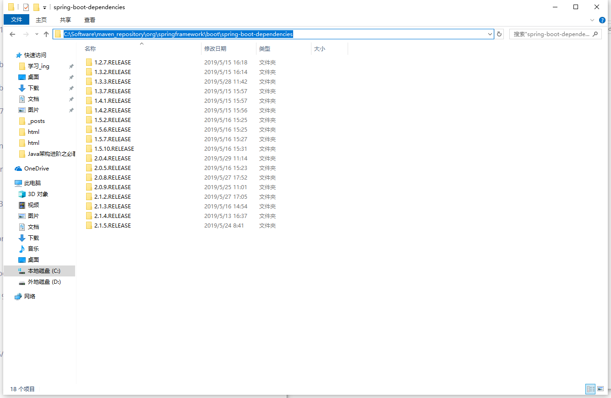
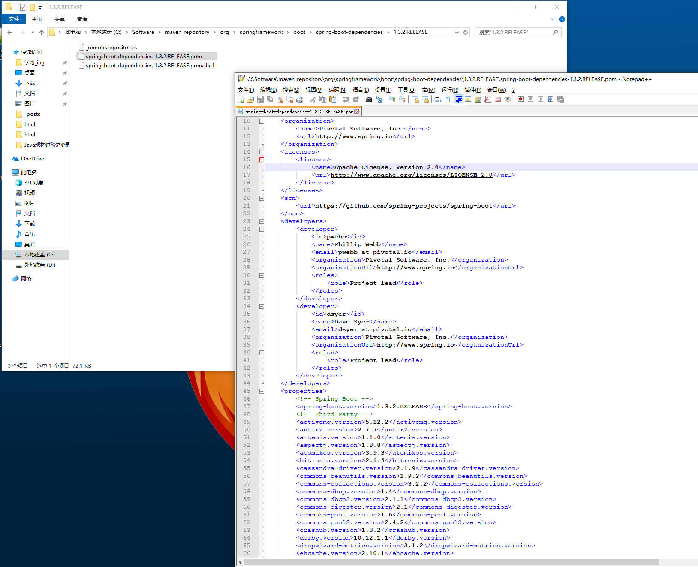

#### 如何查看Springboot版本的各个依赖的版本

1. 进入你的maven本地仓库。
2. 找到org\springframework\boot\spring-boot-dependencies的路径。
3. 根据你想获得的版本查看pom即可。

如下图所示：

> 参考博客园的听说这是最长的名字了的[SpringBoot | 查看默认版本配置](https://www.cnblogs.com/jj81/p/9936227.html)

