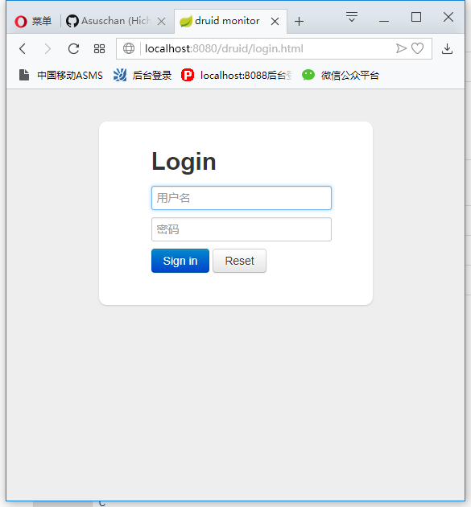
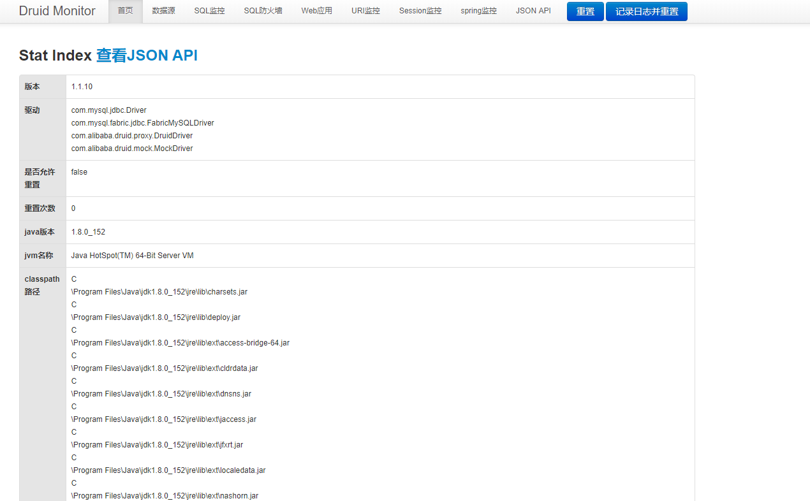

## 注意 ##

我们使用上一篇文件中的mysql项目，进行整合Druid。

1.修改pom.xml，核心代码如下：

```

    <dependencies>

        <dependency>
            <groupId>org.springframework.boot</groupId>
            <artifactId>spring-boot-starter-jdbc</artifactId>
        </dependency>

        <dependency>
            <groupId>org.springframework.boot</groupId>
            <artifactId>spring-boot-starter-web</artifactId>
        </dependency>

        <dependency>
            <groupId>mysql</groupId>
            <artifactId>mysql-connector-java</artifactId>
            <version>5.1.46</version>
            <scope>runtime</scope>
        </dependency>

        <!-- druid -->
        <dependency>
            <groupId>com.alibaba</groupId>
            <artifactId>druid</artifactId>
            <version>1.1.10</version>
        </dependency>

        <dependency>
            <groupId>org.springframework.boot</groupId>
            <artifactId>spring-boot-starter-test</artifactId>
            <scope>test</scope>
        </dependency>
        
    </dependencies>

```

3.修改application.properties，代码如下：

```

	###  MySQL 连接信息
	spring.datasource.url = jdbc:mysql://127.0.0.1:3306/test?useSSL=true
	spring.datasource.username = root
	spring.datasource.password = 1qaz2wsx
	spring.datasource.driver-class-name = com.mysql.jdbc.Driver
	
	###  数据源类别
	spring.datasource.type=com.alibaba.druid.pool.DruidDataSource
	### 初始化大小，最小，最大
	spring.datasource.initialSize=5
	spring.datasource.minIdle=5
	spring.datasource.maxActive=20
	### 配置获取连接等待超时的时间，单位是毫秒
	spring.datasource.maxWait=60000
	### 配置间隔多久才进行一次检测，检测需要关闭的空闲连接，单位是毫秒
	spring.datasource.timeBetweenEvictionRunsMillis=60000
	### 配置一个连接在池中最小生存的时间，单位是毫秒
	spring.datasource.minEvictableIdleTimeMillis=300000
	spring.datasource.validationQuery=SELECT 1 FROM DUAL
	spring.datasource.testWhileIdle=true
	spring.datasource.testOnBorrow=false
	spring.datasource.testOnReturn=false
	### 打开PSCache，并且指定每个连接上PSCache的大小
	spring.datasource.poolPreparedStatements=true
	spring.datasource.maxPoolPreparedStatementPerConnectionSize=20
	### 配置监控统计拦截的filters，去掉后监控界面sql无法统计，'wall'用于防火墙
	spring.datasource.filters=stat,wall,log4j
	### 通过connectProperties属性来打开mergeSql功能；慢SQL记录
	spring.datasource.connectionProperties=druid.stat.mergeSql=true;druid.stat.slowSqlMillis=5000
	### 合并多个DruidDataSource的监控数据
	#spring.datasource.useGlobalDataSourceStat=true

```

4.在mysql项目中创建filter包，在其下创建DruidConfiguration类，代码如下：

```

	@Configuration
	public class DruidConfiguration {
	
	    @Bean
	    public ServletRegistrationBean druidStatViewServle() {
	        //ServletRegistrationBean提供类的进行注册.
	        ServletRegistrationBean servletRegistrationBean
	                = new ServletRegistrationBean(new StatViewServlet(), "/druid/*");
	        //添加初始化参数：initParams
	        //白名单：
	        servletRegistrationBean.addInitParameter("allow", "127.0.0.1");
	        //IP黑名单 (存在共同时，deny优先于allow)
	        // 如果满足deny的话提示:Sorry, you are not permitted to view this page.
	        servletRegistrationBean.addInitParameter("deny", "192.168.1.73");
	        //登录查看信息的账号和密码.
	        servletRegistrationBean.addInitParameter("loginUsername", "admin");
	        servletRegistrationBean.addInitParameter("loginPassword", "123456");
	        //是否能够重置数据.
	        servletRegistrationBean.addInitParameter("resetEnable", "false");
	        return servletRegistrationBean;
	    }
	
	    @Bean
	    public FilterRegistrationBean druidStatFilter() {
	        FilterRegistrationBean filterRegistrationBean = new FilterRegistrationBean(new WebStatFilter());
	
	        //添加过滤规则.
	        filterRegistrationBean.addUrlPatterns("/*");
	        //添加需要忽略的格式信息.
	        filterRegistrationBean.addInitParameter("exclusions",
	                "*.js,*.gif,*.jpg,*.png,*.css,*.ico,/druid/*");
	        return filterRegistrationBean;
	    }
	
	}

```

5.运行项目。

6.在浏览器中输入http://localhost:8080/druid/login.html，账号为admin,密码为123456，即可登录。



7.登录成功后，如下图所示：

