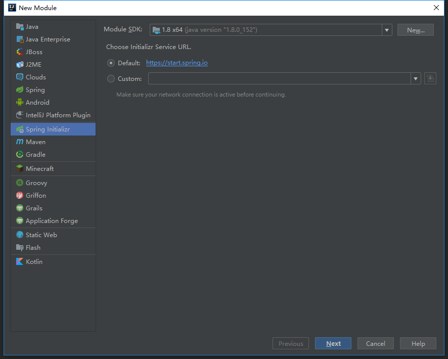
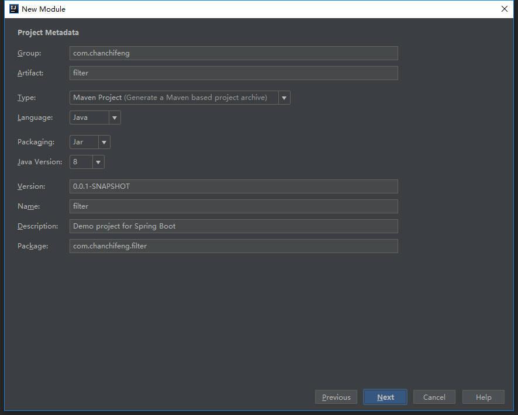
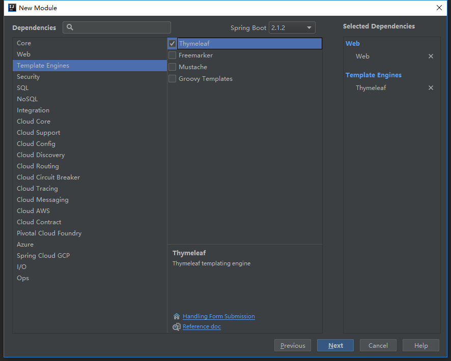
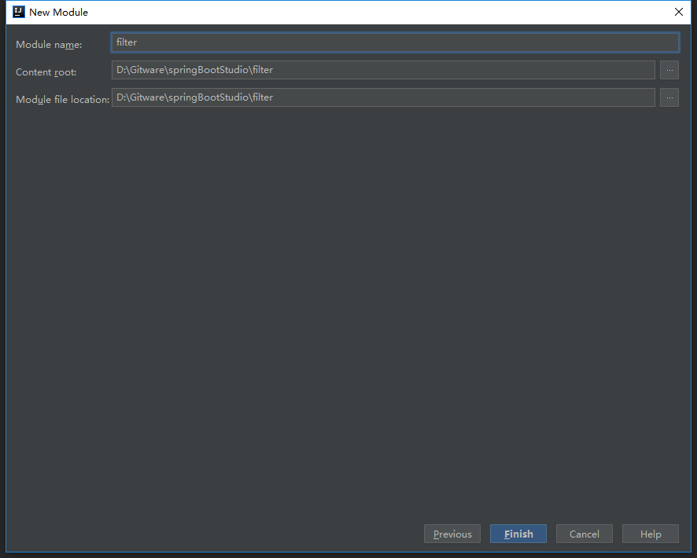
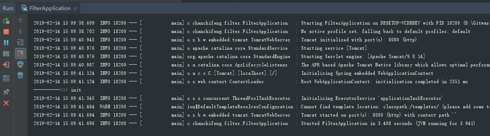
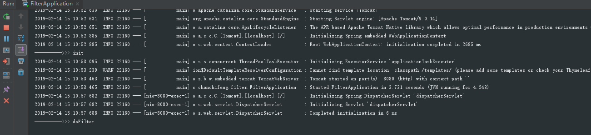

1.在springBootStudio项目中添加Module。

2.选择Spring Initializr，点击next。



3.Group填写com.chanchifeng，Artifact填写filter。



4.勾选SQL中的Web和Thymeleaf，点击next。



5.Content_root和Module file location选择springBootStudio项目路径。



6.在项目中创建一个controller包，在其下创建UserController的类，代码如下：

```

	@RestController
	public class UserController {
	
	    @RequestMapping("/home")
	    public String home(){
	        return "test Filter";
	    }
	
	}

```

7.在项目中创建一个filter包，在其下创建UserController的类，代码如下：

```

	@WebFilter(filterName = "userFilter", urlPatterns = "/*")
	public class UserFilter implements Filter {
	    @Override
	    public void init(FilterConfig filterConfig) throws ServletException {
	        System.out.println("---------->>> init");
	    }
	
	    @Override
	    public void doFilter(ServletRequest servletRequest, ServletResponse servletResponse, FilterChain filterChain) throws IOException, ServletException {
	        System.out.println("---------->>> doFilter");
	        filterChain.doFilter(servletRequest,servletResponse);
	    }
	
	    @Override
	    public void destroy() {
	        System.out.println("---------->>> destory");
	    }
	}

```

8.追加FilterApplication，代码如下：

```

	@ServletComponentScan

```

9.运行项目，即可看到控制台打印init如下：



10.当用浏览器访问http://localhost:8080/home的时候，可以观察到控制台打印doFilter如下：

