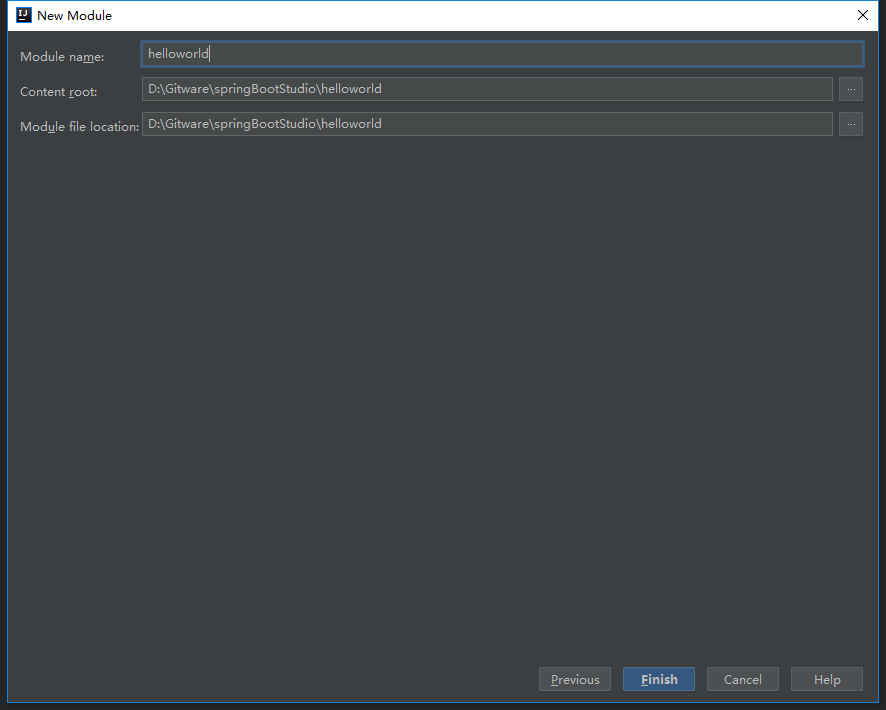
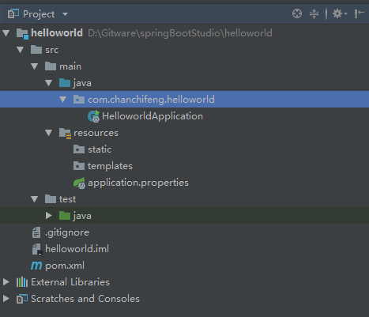

<div class="tip">
	来历：
				
	自身的特点：
		
	适合解决的问题：
		
	实际的应用场景：
		
</div>

1.新建一个空项目。


2.Project name填写springBootStudio。


3.新建一个项目，选择Spring Initializr，点击next。


4.Group填写com.chanchifeng，Artifact填写helloworld，点击next。


5.勾选Web中的Web，这里选择Spring Boot 2.1.2，点击next。


6.Project name填写mySpringBootSpace，Project location填写自己存放代码的磁盘位置。



7.进入项目，将.mvn，mvnw和mvnw.cmd，三个文件删除。


8.在项目中创建controller包，在其下创建HelloController，代码如下：

```

	package com.chanchifeng.helloworld.controller;
	
	import org.springframework.web.bind.annotation.RequestMapping;
	import org.springframework.web.bind.annotation.RestController;
	
	/**
	 * @author:porschan
	 * @description:
	 * @date: Created in 11:24 2019/1/31
	 * @modified By:
	 */
	@RestController
	public class HelloController {
	
	    @RequestMapping("/hello")
	    public String index(){
	        return "Hello World!";
	    }
	    
	}

```



9.新建项目右下角会提醒Maven是否自动导入，选择Enable Auto-Import。


10.启动项目，点击下图中的绿色开启按钮。


11.看到控制台打印SpringBoot项目启动的信息，查看项目启动的端口，默认为8080，如下图：


12.在浏览器中输入localhost:8080/hello。

