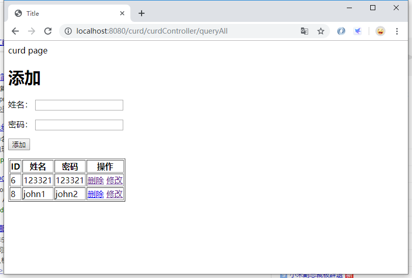

> 项目的搭建以在上节完成：[使用 IDEA 中创建 SpringBoot-JPA 的 web 项目](https://chanchifeng.com/2019/05/24/springboot-jpa-curd/)

1.搭建的构成这里不详细讲，详情参考上述文章。

2.CurdController：

```java
import com.chanchifeng.curd.model.User;
import com.chanchifeng.curd.service.UserService;
import org.springframework.stereotype.Controller;
import org.springframework.ui.Model;
import org.springframework.web.bind.annotation.GetMapping;
import org.springframework.web.bind.annotation.PathVariable;
import org.springframework.web.bind.annotation.RequestMapping;
import org.springframework.web.servlet.ModelAndView;

import javax.annotation.Resource;
import java.util.List;

@Controller
@RequestMapping("/curdController")
public class CurdController {

    @Resource
    private UserService userService;

    @GetMapping("/queryAll")
    public String queryAll(Model model) {
        ModelAndView modelAndView = new ModelAndView("index");

        List<User> userList =  userService.findAll();
        System.out.println(userList.size() + "!!");
//        modelAndView.add

        model.addAttribute("users",userList);

        return "curd/index";
    }

    @RequestMapping("/delete/{userId}")
    public String delete(Model model,@PathVariable("userId") Integer userId){

        //删除

        userService.delete(userId);

        return "redirect:/curdController/queryAll";
    }

    @RequestMapping(value = "/add")
    public String add(User user) {
//        employeeDao.save(employee);

        System.out.println(user.getId() + "!!");

        User save = userService.save(user);

        System.out.println("new ? id :" + save.getId());

        return "redirect:/curdController/queryAll";
    }

    @RequestMapping("/queryById/{userId}")
    public String queryById(Model model,@PathVariable("userId") Integer userId){

        System.out.println("queryById!!");

        model.addAttribute("user",userService.findById(userId));

        return "curd/update";
    }

    @RequestMapping(value = "/update")
    public String update(User user) {

        System.out.println(user.getId() + "!!");

        userService.save(user);

        return "redirect:/curdController/queryAll";
    }

}
```

3.在controller包中创建DefaultController：

```java
import org.springframework.stereotype.Controller;
import org.springframework.ui.Model;
import org.springframework.web.bind.annotation.RequestMapping;

@Controller
public class DefaultController {

    @RequestMapping("/")
    public String index(Model model) {
        return "/index";
    }
}
```

4.在templates中创建index.html：

```html
<!DOCTYPE html>
<html lang="en" xmlns:th="http://www.w3.org/1999/xhtml">
<head>
    <meta charset="UTF-8">
    <title>Title</title>
</head>
<body>
Hello page

<br/><hr/>

<a href="curdController/queryAll"> to curd page</a>

</body>
</html>
```

5.在templates中创建curd文件夹，在curd文件夹内创建index.html:

```html
<!DOCTYPE html>
<html lang="en" xmlns:th="http://www.w3.org/1999/xhtml">
<head>
    <meta charset="UTF-8">
    <title>Title</title>
</head>
<body>
curd page

<h1>添加</h1>

<form action="add" method="post">
    <p>
        <label>姓名：</label>
        <input type="text" name="name" id="name"/>
    </p>
    <p>
        <label>密码：</label>
        <input type="password" name="password" id="password"/>
    </p>


    <p>
        <input type="submit" value="添加">
    </p>
</form>

<table border="1">
    <tr>
        <th>ID</th>
        <th>姓名</th>
        <th>密码</th>
        <th>操作</th>
    </tr>


    <tr th:each="user : ${users}">
        <td th:text="${user.id}"></td>
        <td th:text="${user.name}"></td>
        <td th:text="${user.password}"></td>
        <td>
            <a th:href="@{delete/} + ${user.id}">删除</a>
            <a th:href="@{queryById/} + ${user.id}">修改</a>
        </td>
    </tr>

</table>
</body>
</html>
```

6.在templates中的curd文件夹内创建update.html:

```html
<!DOCTYPE html>
<html lang="en" xmlns:th="http://www.w3.org/1999/xhtml">
<head>
    <meta charset="UTF-8">
    <title>Title</title>
</head>
<body>

update

<form action="../update" method="post" th:object="${user}">

    <p>
        <label>姓名：</label>
        <input type="text" name="name" value="" id="name" th:field="*{name}"/>
    </p>
    <p>
        <label>密码：</label>
        <input type="text" name="password" value="" id="password" th:field="*{password}"/>
    </p>
    <p>
        <input type="hidden" name="id" value="" id="id" th:field="*{id}"/>
        <input type="submit" value="修改">
    </p>
</form>

</body>
</html>
```

7.在浏览器中输入<http://localhost:8080/curd/curdController/queryAll>，测试功能：



> Github：[SpringBoot-JPA/curd](https://github.com/porschan/SpringBoot-JPA)