1.新建一个空项目。

2.选择Spring Initializr,操作如下图所示：

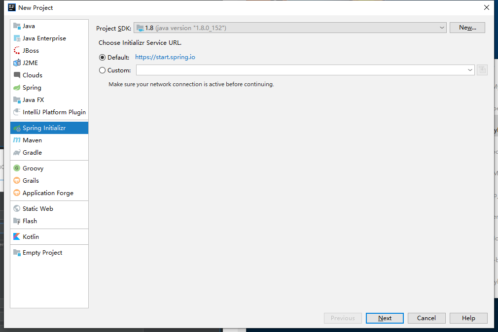

3.在Group 和Atrifact 分别填写com.chanchifeng和demo，如下图所示：

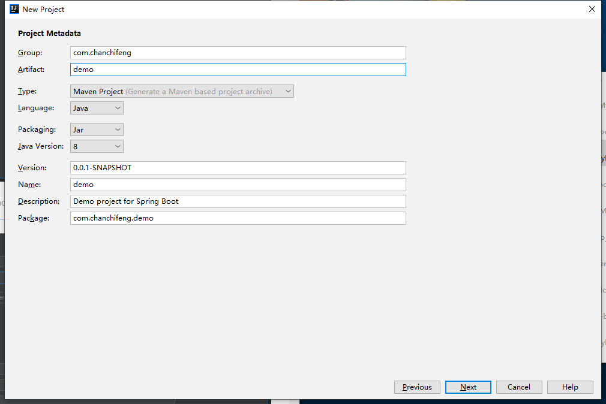

4.选择下图需要的依赖，如下图所示：

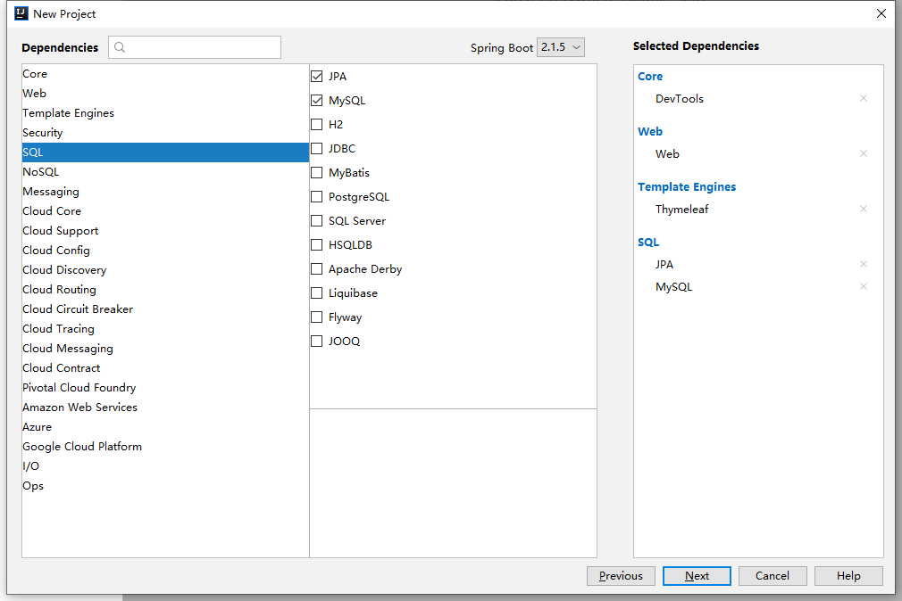

5.在Project name和Project location中分别填写demo和对于的项目路径，如下图所示：

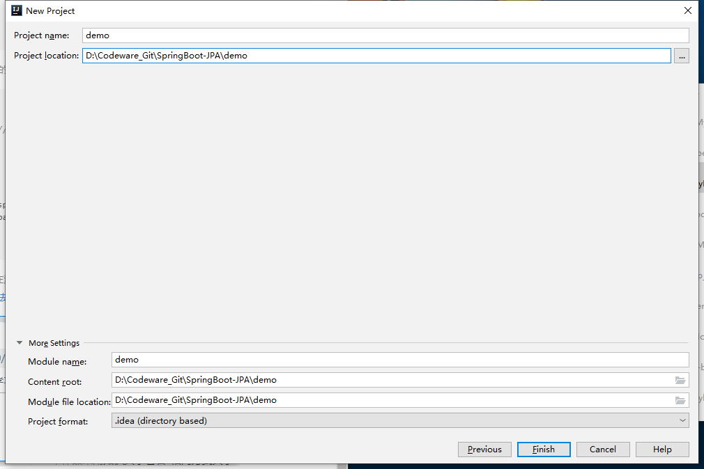

6.删除maven自动生成的文件，如下图所示：

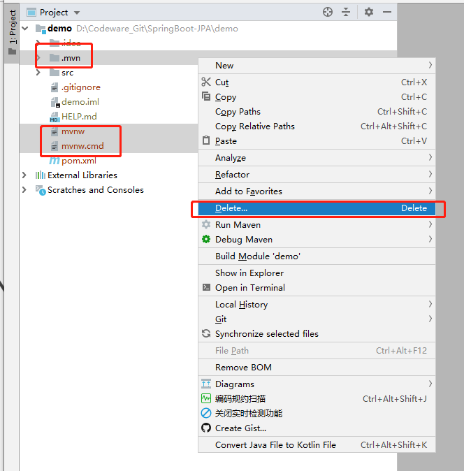

7.建立com.chanchifeng.demo下的包，结构如下图所示：


8.先创建sjpademo的数据库，再创建user表，SQL语句如下：

```sql
SET NAMES utf8mb4;
SET FOREIGN_KEY_CHECKS = 0;

-- ----------------------------
-- Table structure for user
-- ----------------------------
DROP TABLE IF EXISTS `user`;
CREATE TABLE `user`  (
  `id` int(32) NOT NULL AUTO_INCREMENT COMMENT '主键',
  `name` varchar(10) CHARACTER SET utf8 COLLATE utf8_general_ci NULL DEFAULT NULL COMMENT '用户名',
  `password` varchar(32) CHARACTER SET utf8 COLLATE utf8_general_ci NULL DEFAULT NULL COMMENT '密码',
  PRIMARY KEY (`id`) USING BTREE
) ENGINE = InnoDB AUTO_INCREMENT = 4 CHARACTER SET = utf8 COLLATE = utf8_general_ci ROW_FORMAT = Dynamic;

-- ----------------------------
-- Records of user
-- ----------------------------
INSERT INTO `user` VALUES (1, '李四', 'e10adc3949ba59abbe56e057f20f883e');
INSERT INTO `user` VALUES (2, '张三', 'e10adc3949ba59abbe56e057f20f883e');
INSERT INTO `user` VALUES (3, '阿华', 'e10adc3949ba59abbe56e057f20f883e');

SET FOREIGN_KEY_CHECKS = 1;
```

9.连接MySQL数据库，操作如下图所示：

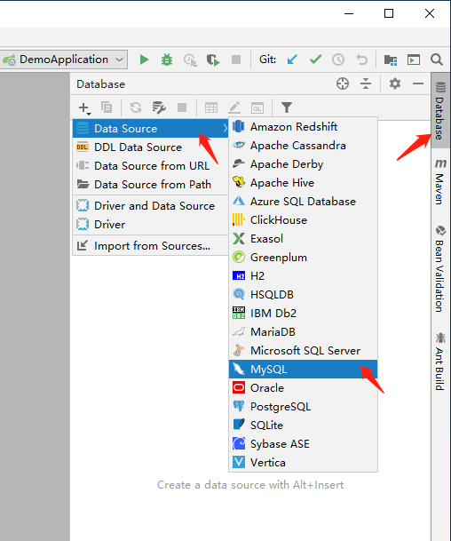

10.在窗口中填写必须的信息，由于我MySQL较新，选择了驱动为Mysql for 5.1,操作如下图所示：

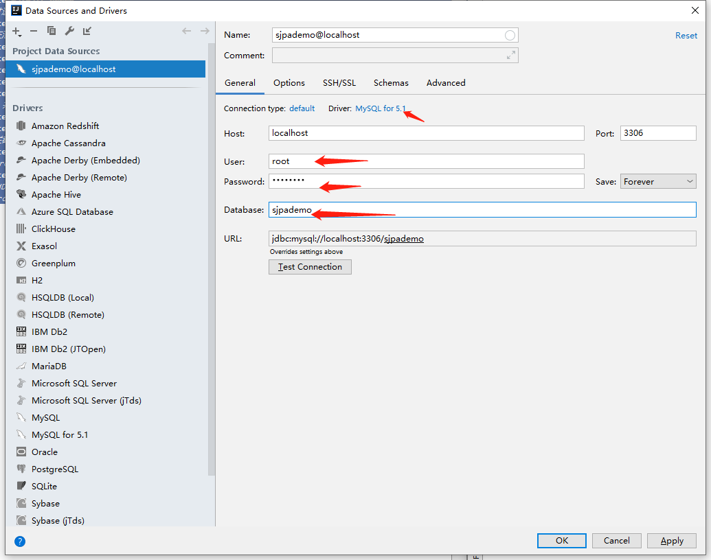

11.配置项目中jpa,操作如下图所示：

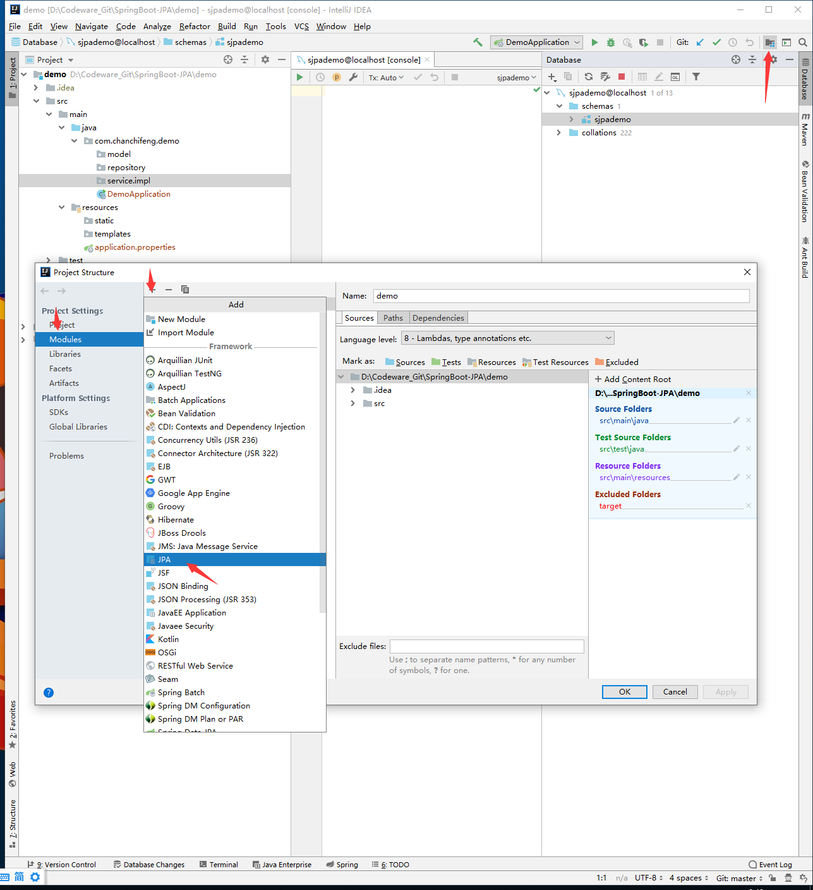

12.添加完成后，点击Apply和OK，操作如下图所示：

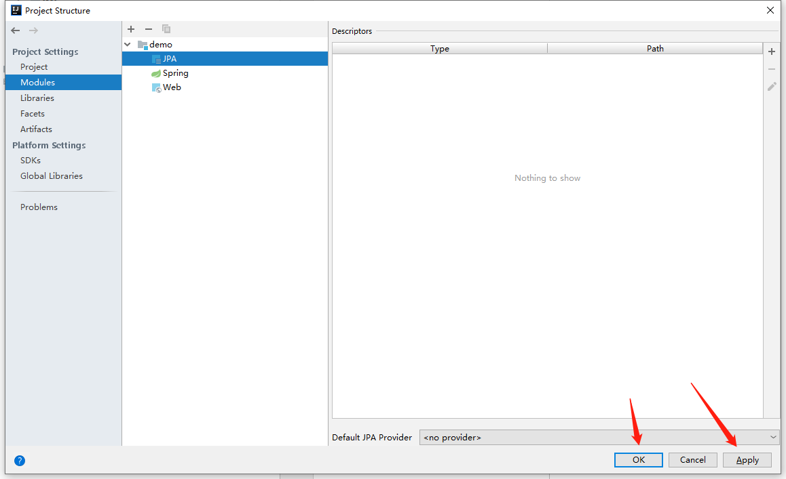

13.生成user的model类，操作如下图所示：

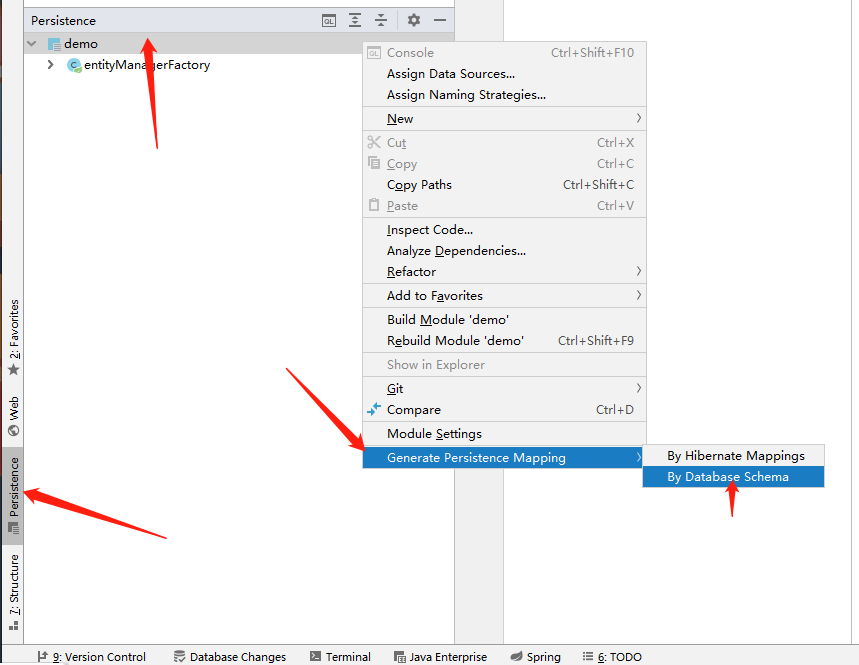

14.在窗口中填写如下图所示的信息：

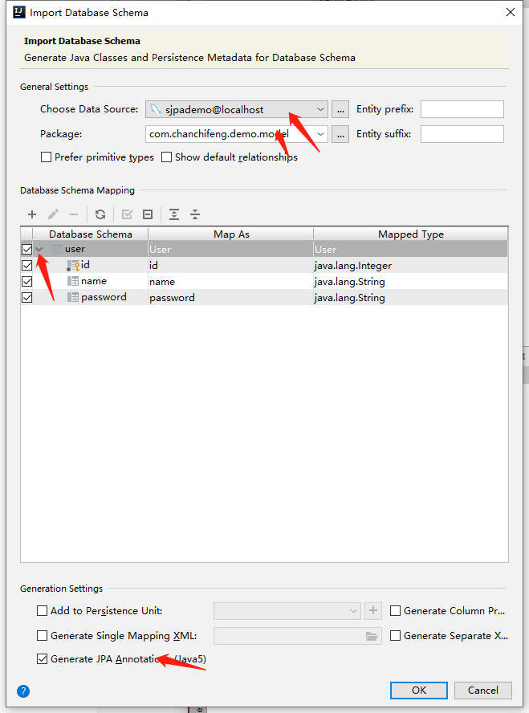

15.需要补全User中的信息，在GetId方法头添加

```java
@GeneratedValue(strategy = GenerationType.IDENTITY)
```

16.指定数据源，操作如下图所示：

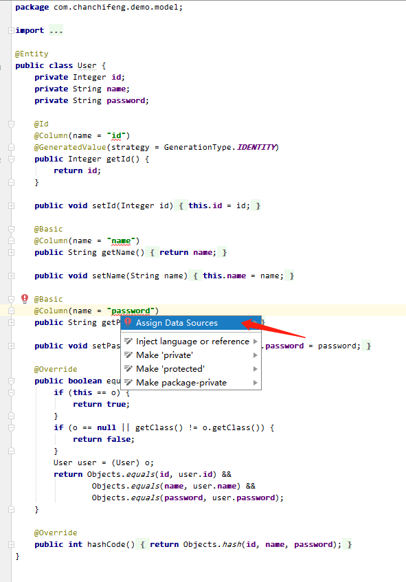

17.选择数据源，操作如下图所示：

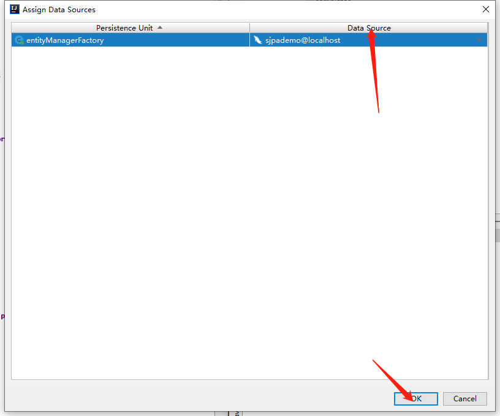

18.User：

```java
import javax.persistence.*;
import java.util.Objects;

@Entity
public class User {
    private Integer id;
    private String name;
    private String password;

    @Id
    @Column(name = "id")
    @GeneratedValue(strategy = GenerationType.IDENTITY)
    public Integer getId() {
        return id;
    }

    public void setId(Integer id) {
        this.id = id;
    }

    @Basic
    @Column(name = "name")
    public String getName() {
        return name;
    }

    public void setName(String name) {
        this.name = name;
    }

    @Basic
    @Column(name = "password")
    public String getPassword() {
        return password;
    }

    public void setPassword(String password) {
        this.password = password;
    }

    @Override
    public boolean equals(Object o) {
        if (this == o) {
            return true;
        }
        if (o == null || getClass() != o.getClass()) {
            return false;
        }
        User user = (User) o;
        return Objects.equals(id, user.id) &&
                Objects.equals(name, user.name) &&
                Objects.equals(password, user.password);
    }

    @Override
    public int hashCode() {
        return Objects.hash(id, name, password);
    }
}
```

19.UserRepository:

```java
import com.chanchifeng.demo.model.User;
import org.springframework.data.jpa.repository.JpaRepository;

import java.util.Collection;
import java.util.List;

public interface UserRepository extends JpaRepository<User,Integer> {
    /**
     * 描述：通过名字相等查询，参数为 name
     * 相当于：select u from ay_user u where u.name = ?1
     */
    List<User> findByName(String name);

    /**
     * 描述：通过名字like查询，参数为 name
     * 相当于：select u from ay_user u where u.name like ?1
     */
    List<User> findByNameLike(String name);

    /**
     * 描述：通过主键id集合查询，参数为 id集合
     * 相当于：select u from ay_user u where id in(?,?,?)
     * @param ids
     */
    List<User> findByIdIn(Collection<Integer> ids);
}
```

20.UserServiceImpl:

```java
import com.chanchifeng.demo.model.User;
import com.chanchifeng.demo.repository.UserRepository;
import com.chanchifeng.demo.service.UserService;
import org.springframework.data.domain.Page;
import org.springframework.data.domain.Pageable;
import org.springframework.stereotype.Service;

import javax.annotation.Resource;
import java.util.Collection;
import java.util.List;

@Service
public class UserServiceImpl implements UserService {

    @Resource
    private UserRepository userRepository;

    @Override
    public User findById(Integer id) {
        return userRepository.findById(id).get();
    }

    @Override
    public List<User> findAll() {
        return userRepository.findAll();
    }

    @Override
    public User save(User ayUser) {
        return userRepository.save(ayUser);
    }


    @Override
    public void delete(Integer id) {
        userRepository.deleteById(id);
        System.out.println("userId:" + id + "用户被删除");
    }

    @Override
    public Page<User> findAll(Pageable pageable) {
        return userRepository.findAll(pageable);
    }

    @Override
    public List<User> findByName(String name){
        return userRepository.findByName(name);
    }
    @Override
    public List<User> findByNameLike(String name){
        return userRepository.findByNameLike(name);
    }
    @Override
    public List<User> findByIdIn(Collection<Integer> ids){
        return userRepository.findByIdIn(ids);
    }
}
```

21.UserService:

```java
import com.chanchifeng.demo.model.User;
import org.springframework.data.domain.Page;
import org.springframework.data.domain.Pageable;

import java.util.Collection;
import java.util.List;

public interface UserService {
    User findById(Integer id);
    List<User> findAll();
    User save(User ayUser);
    void delete(Integer id);

    //分页
    Page<User> findAll(Pageable pageable);

    List<User> findByName(String name);
    List<User> findByNameLike(String name);
    List<User> findByIdIn(Collection<Integer> ids);
}
```

22.application.properties:

```properties
###  MySQL 连接信息
spring.datasource.url = jdbc:mysql://127.0.0.1:3306/sjpademo?useSSL=true
spring.datasource.username = root
spring.datasource.password = 1qaz2wsx
spring.datasource.driver-class-name = com.mysql.jdbc.Driver

###  数据源类别
spring.datasource.type=com.alibaba.druid.pool.DruidDataSource
### 初始化大小，最小，最大
spring.datasource.initialSize=5
spring.datasource.minIdle=5
spring.datasource.maxActive=20
### 配置获取连接等待超时的时间，单位是毫秒
spring.datasource.maxWait=60000
### 配置间隔多久才进行一次检测，检测需要关闭的空闲连接，单位是毫秒
spring.datasource.timeBetweenEvictionRunsMillis=60000
### 配置一个连接在池中最小生存的时间，单位是毫秒
spring.datasource.minEvictableIdleTimeMillis=300000
spring.datasource.validationQuery=SELECT 1 FROM DUAL
spring.datasource.testWhileIdle=true
spring.datasource.testOnBorrow=false
spring.datasource.testOnReturn=false
### 打开PSCache，并且指定每个连接上PSCache的大小
spring.datasource.poolPreparedStatements=true
spring.datasource.maxPoolPreparedStatementPerConnectionSize=20
### 配置监控统计拦截的filters，去掉后监控界面sql无法统计，'wall'用于防火墙
spring.datasource.filters=stat,wall,log4j
### 通过connectProperties属性来打开mergeSql功能；慢SQL记录
spring.datasource.connectionProperties=druid.stat.mergeSql=true;druid.stat.slowSqlMillis=5000
### 合并多个DruidDataSource的监控数据
#spring.datasource.useGlobalDataSourceStat=true
```

23.DemoApplicationTests:

```java
import com.chanchifeng.demo.model.User;
import com.chanchifeng.demo.service.UserService;
import org.junit.Test;
import org.junit.runner.RunWith;
import org.springframework.boot.test.context.SpringBootTest;
import org.springframework.data.domain.Page;
import org.springframework.data.domain.PageRequest;
import org.springframework.test.context.junit4.SpringRunner;
import org.springframework.util.Assert;

import javax.annotation.Resource;
import java.util.ArrayList;
import java.util.List;

@RunWith(SpringRunner.class)
@SpringBootTest
public class DemoApplicationTests {

    /* 测试jpa */
    @Resource
    private UserService userService;

    @Test
    public void testRepository(){
        //查询所有数据
        List<User> userList =  userService.findAll();
        System.out.println("findAll() :" + userList.size());
        //通过name查询数据
        List<User> userList2 = userService.findByName("李四");
        System.out.println("findByName() :" + userList2.size());
        Assert.isTrue(userList2.get(0).getName().equals("李四"),"data error!");
        //通过name模糊查询数据
        List<User> userList3 = userService.findByNameLike("%四%");
        System.out.println("findByNameLike() :" + userList3.size());
        Assert.isTrue(userList3.get(0).getName().equals("李四"),"data error!");
        //通过id列表查询数据
        List<Integer> ids = new ArrayList<>();
        ids.add(1);
        ids.add(2);
        List<User> userList4 = userService.findByIdIn(ids);
        System.out.println("findByIdIn() :" + userList4.size());
        //分页查询数据
        PageRequest pageRequest = new PageRequest(0,10);
        Page<User> userList5 =  userService.findAll(pageRequest);
        System.out.println("page findAll():" + userList5.getTotalPages() + "/" + userList5.getSize());
        //新增数据
        User ayUser = new User();
//        ayUser.setId(4);
        ayUser.setName("刘六");
        ayUser.setPassword("e10adc3949ba59abbe56e057f20f883e");
        userService.save(ayUser);
        //删除数据
        userService.delete(4);
    }

}
```

24.运行测试案例，输入结果如下图所示：

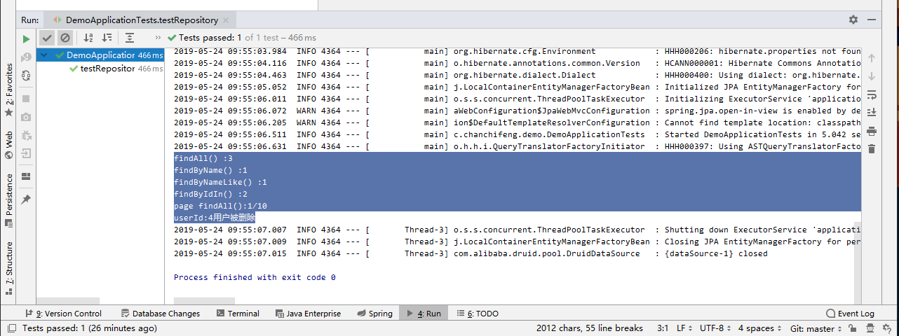

> Github：[SpringBoot-JPA/demo](https://github.com/porschan/SpringBoot-JPA)