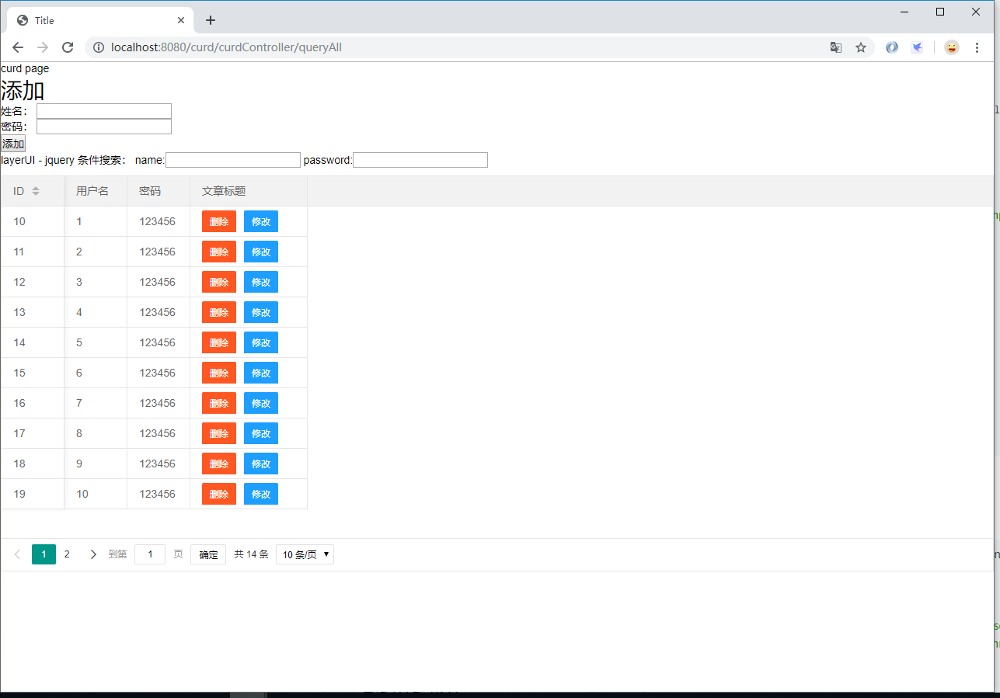

### 模糊搜索 和 分页

> 以下例子主要使用了秀川在csdn上面的例子：[springboot jpa 多条件查询（多表）](https://www.cnblogs.com/arrrrrya/p/7865090.html)

1.在controller包中创建了DefaultController：

```java
import org.springframework.stereotype.Controller;
import org.springframework.ui.Model;
import org.springframework.web.bind.annotation.RequestMapping;

@Controller
public class DefaultController {

    @RequestMapping("/")
    public String index(Model model) {
        return "/index";
    }

}
```

2.CurdController：

```java
import com.chanchifeng.curd.model.User;
import com.chanchifeng.curd.service.UserService;
import org.springframework.data.domain.Page;
import org.springframework.stereotype.Controller;
import org.springframework.ui.Model;
import org.springframework.web.bind.annotation.*;
import org.springframework.web.servlet.ModelAndView;

import javax.annotation.Resource;
import java.util.List;

@Controller
@RequestMapping("/curdController")
public class CurdController {

    @Resource
    private UserService userService;

    @GetMapping("/queryAll")
    public String queryAll(Model model) {
        ModelAndView modelAndView = new ModelAndView("index");

        List<User> userList =  userService.findAll();
        System.out.println(userList.size() + "!!");
//        modelAndView.add

        model.addAttribute("users",userList);

        return "curd/index";
    }

    @RequestMapping("/delete/{userId}")
    public String delete(Model model,@PathVariable("userId") Integer userId){

        //删除

        userService.delete(userId);

        return "redirect:/curdController/queryAll";
    }

    @RequestMapping(value = "/add")
    public String add(User user) {
//        employeeDao.save(employee);

        System.out.println(user.getId() + "!!");

        User save = userService.save(user);

        System.out.println("new ? id :" + save.getId());

        return "redirect:/curdController/queryAll";
    }

    @RequestMapping("/queryById/{userId}")
    public String queryById(Model model,@PathVariable("userId") Integer userId){

        System.out.println("queryById!!");

        model.addAttribute("user",userService.findById(userId));

        return "curd/update";
    }

    @RequestMapping(value = "/update")
    public String update(User user) {

        System.out.println(user.getId() + "!!");

        userService.save(user);

        return "redirect:/curdController/queryAll";
    }

    /* START 模糊搜索 + 分页*/

    @RequestMapping(value="/findAllJSON")
    @ResponseBody
    public Page<User> findAllJson(User user, @RequestParam("page") Integer page, @RequestParam("limit") Integer limit){
        System.out.println();
        Page<User> all = userService.findAll(page, limit, user);

        return all;
    }
    /* END 模糊搜索 + 分页*/

}
```

3.UserRepository

```java
import com.chanchifeng.curd.model.User;
import org.springframework.data.domain.Page;
import org.springframework.data.domain.Pageable;
import org.springframework.data.jpa.domain.Specification;
import org.springframework.data.jpa.repository.JpaRepository;
import org.springframework.data.jpa.repository.JpaSpecificationExecutor;

import java.util.Collection;
import java.util.List;

public interface UserRepository extends JpaRepository<User,Integer>, JpaSpecificationExecutor<User> {
    /**
     * 描述：通过名字相等查询，参数为 name
     * 相当于：select u from ay_user u where u.name = ?1
     */
    List<User> findByName(String name);

    /**
     * 描述：通过名字like查询，参数为 name
     * 相当于：select u from ay_user u where u.name like ?1
     */
    List<User> findByNameLike(String name);

    /**
     * 描述：通过主键id集合查询，参数为 id集合
     * 相当于：select u from ay_user u where id in(?,?,?)
     * @param ids
     */
    List<User> findByIdIn(Collection<Integer> ids);

    /* START 带模糊搜索的分页功能 */

    Page<User> findAll(Specification<User> specification, Pageable pageable);

    /* END 带模糊搜索的分页功能 */

}
```

4.UserServiceImpl:

```java
import com.chanchifeng.curd.model.User;
import com.chanchifeng.curd.repository.UserRepository;
import com.chanchifeng.curd.service.UserService;
import org.springframework.data.domain.Page;
import org.springframework.data.domain.PageRequest;
import org.springframework.data.domain.Pageable;
import org.springframework.data.jpa.domain.Specification;
import org.springframework.stereotype.Service;

import javax.annotation.Resource;
import javax.persistence.criteria.CriteriaBuilder;
import javax.persistence.criteria.CriteriaQuery;
import javax.persistence.criteria.Predicate;
import javax.persistence.criteria.Root;
import java.util.ArrayList;
import java.util.Collection;
import java.util.List;

@Service
public class UserServiceImpl implements UserService {

    @Resource
    private UserRepository userRepository;

    @Override
    public User findById(Integer id) {
        return userRepository.findById(id).get();
    }

    @Override
    public List<User> findAll() {
        return userRepository.findAll();
    }

    @Override
    public User save(User ayUser) {
        return userRepository.save(ayUser);
    }


    @Override
    public void delete(Integer id) {
        userRepository.deleteById(id);
        System.out.println("userId:" + id + "用户被删除");
    }

    @Override
    public Page<User> findAll(Pageable pageable) {
        return userRepository.findAll(pageable);
    }

    @Override
    public List<User> findByName(String name){
        return userRepository.findByName(name);
    }
    @Override
    public List<User> findByNameLike(String name){
        return userRepository.findByNameLike(name);
    }
    @Override
    public List<User> findByIdIn(Collection<Integer> ids){
        return userRepository.findByIdIn(ids);
    }

    @Override
    public Page<User> findAll(int pageNum, int pageSize, User user) {
        Pageable pageable = PageRequest.of(pageNum - 1, pageSize);
        Page<User> all = userRepository.findAll(new Specification<User>() {
            @Override
            public Predicate toPredicate(Root<User> root, CriteriaQuery<?> query, CriteriaBuilder criteriaBuilder) {
                List<Predicate> predicates = new ArrayList<>();
                if (user.getName() != null && !user.getName().equals("")) {
                    System.out.println("user.getName():" + user.getName());
                    predicates.add(criteriaBuilder.like(root.get("name").as(String.class), "%" + user.getName() + "%"));
                }
                if (user.getPassword() != null && !user.getPassword().equals("")) {
                    System.out.println("user.getPassword():" + user.getPassword());
                    predicates.add(criteriaBuilder.like(root.get("password").as(String.class), "%" + user.getPassword() + "%"));
                }
                Predicate[] pre = new Predicate[predicates.size()];

                System.out.println(predicates.toArray(pre).toString());

                query.where(predicates.toArray(pre));
                return criteriaBuilder.and(predicates.toArray(pre));
            }
        }, pageable);
        return all;
    }
}
```

5.UserService:

```java
import com.chanchifeng.curd.model.User;
import org.springframework.data.domain.Page;
import org.springframework.data.domain.Pageable;

import java.util.Collection;
import java.util.List;

public interface UserService {
    User findById(Integer id);
    List<User> findAll();
    User save(User ayUser);
    void delete(Integer id);

    //分页
    Page<User> findAll(Pageable pageable);

    List<User> findByName(String name);
    List<User> findByNameLike(String name);
    List<User> findByIdIn(Collection<Integer> ids);

    Page<User> findAll(int pageNum, int pageSize, User user);
}
```

6.修改在templates中的curd文件夹中的index.html

```html
<!DOCTYPE html>
<html lang="en" xmlns:th="http://www.w3.org/1999/xhtml">
<head>
    <meta charset="UTF-8">
    <title>Title</title>
    <link rel="stylesheet" th:href="@{/common/layerui/css/layui.css}" media="all">
</head>
<body>
curd page

<h1>添加</h1>

<form action="add" method="post">
    <p>
        <label>姓名：</label>
        <input type="text" name="name" id="name"/>
    </p>
    <p>
        <label>密码：</label>
        <input type="password" name="password" id="password"/>
    </p>


    <p>
        <input type="submit" value="添加">
    </p>
</form>

<!--<table border="1">-->
<!--    <tr>-->
<!--        <th>ID</th>-->
<!--        <th>姓名</th>-->
<!--        <th>密码</th>-->
<!--        <th>操作</th>-->
<!--    </tr>-->


<!--    <tr th:each="user : ${users}">-->
<!--        <td th:text="${user.id}"></td>-->
<!--        <td th:text="${user.name}"></td>-->
<!--        <td th:text="${user.password}"></td>-->
<!--        <td>-->
<!--            <a th:href="@{delete/} + ${user.id}">删除</a>-->
<!--            <a th:href="@{queryById/} + ${user.id}">修改</a>-->
<!--        </td>-->
<!--    </tr>-->

<!--</table>-->

layerUI - jquery

条件搜索：
name:<input type="text" id="searchName" value="">
password:<input type="text" id="searchPassword" value="">

<table id="demo" lay-filter="test"></table>

<script th:src="@{/js/jquery-3.4.1.min.js}"></script><!-- 你必须先引入jQuery1.8或以上版本 -->
<script th:src="@{/common/layerui/layui.js}"></script>

<script th:inline="none">


    layui.use('table', function(){
        var table = layui.table;

        //第一个实例
        table.render({
            elem: '#demo'
            ,height:510
            ,url: 'findAllJSON' //数据接口
            ,where:{
                name:$("#searchName").val()
                ,password:$("#searchPassword").val()
            }
            ,parseData: function(res){ //res 即为原始返回的数据
                return {
                    "code": 0 //解析接口状态
                    ,"count": res.totalElements //解析数据长度
                    ,"data": res.content //解析数据列表
                };
            }
            ,page: true //开启分页
            ,limit: 10
            ,cols: [[ //表头
                {field: 'id', title: 'ID', width:80, sort: true, fixed: 'left'}
                ,{field: 'name', title: '用户名', width:80}
                ,{field: 'password', title: '密码', width:80}

                ,{field:'title', title: '文章标题', width: 150
                    ,templet: function(d){
                        return '<a class="layui-btn layui-btn-sm layui-btn-danger" href="delete/' + d.id + '">删除</a>' +
                            '<a class="layui-btn layui-btn-sm layui-btn-normal" href="queryById/' + d.id + '">修改</a>'
                    }
                }
            ]]
        });

    });
</script>
</body>
</html>
```

7.修改在templates下的index.html:

```html
<!DOCTYPE html>
<html lang="en" xmlns:th="http://www.w3.org/1999/xhtml">
<head>
    <meta charset="UTF-8">
    <title>Title</title>
</head>
<body>
Hello page

<br/><hr/>

<a href="curdController/queryAll"> to curd page</a>

<br/><hr/>

<a href="uploadAction/uploadPage"> to curd page</a>

</body>
</html>
```

8.在浏览器中输入<http://localhost:8080/curd/curdController/queryAll>，测试功能模块，效果图如下：



### 上传文件

> 以下例子主要使用了gnail_oug在csdn上面的例子：[Spring Boot教程(十三)：Spring Boot文件上传](https://blog.csdn.net/gnail_oug/article/details/80324120)

a.在controller包中创建UploadAction：

```java
import org.springframework.stereotype.Controller;
import org.springframework.web.bind.annotation.*;
import org.springframework.web.multipart.MultipartFile;

import java.io.File;
import java.io.IOException;

@Controller
@RequestMapping("/uploadAction")
public class UploadAction {

    @GetMapping("/uploadPage")
    public String upload() {
        return "file/index";
    }

    @PostMapping("/upload")
    @ResponseBody
    public String upload(@RequestParam("file") MultipartFile file) {
        if (file.isEmpty()) {
            return "上传失败，请选择文件";
        }

        String fileName = file.getOriginalFilename();
        String filePath = "D:/";
        File dest = new File(filePath + fileName);
        try {
            file.transferTo(dest);
            System.out.println("上传成功");
            return "上传成功";
        } catch (IOException e) {
            System.err.println(e.toString());
        }
        return "上传失败！";
    }
}
```
b.templates下创建file文件夹，在其内创建index.html

```html
<!DOCTYPE html>
<html>
<head>
    <title>Title</title>
</head>
<body>
<!-- 注意！表单必须添加 enctype 属性，值为"multipart/form-data" -->
<form action="upload" method="post" enctype="multipart/form-data">
    <input type="file" name="file" />
    <input type="submit" value="上传"/>
</form>
</body>
</html>
```

> github：[SpringBoot-JPA](https://github.com/porschan/SpringBoot-JPA)
