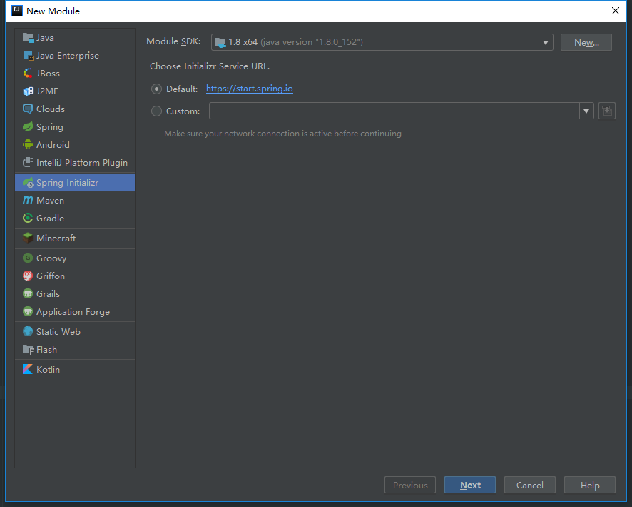
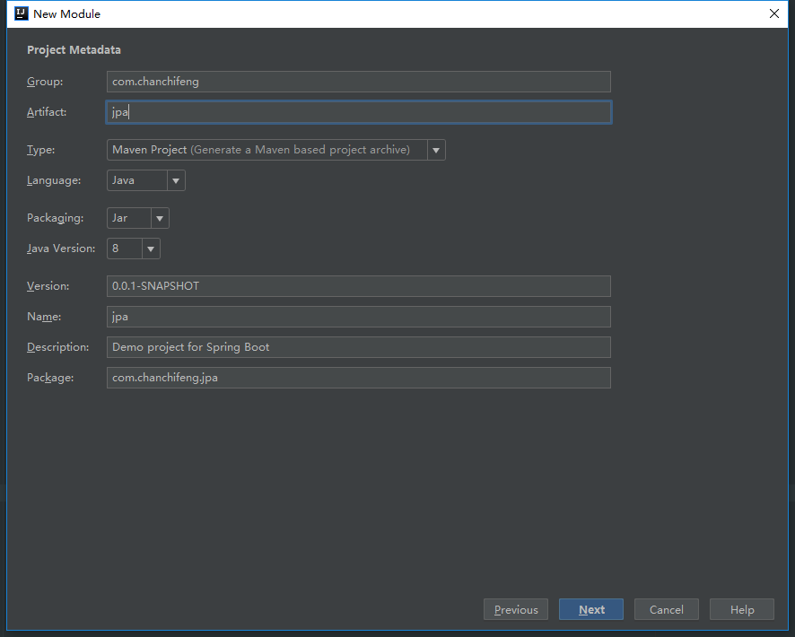
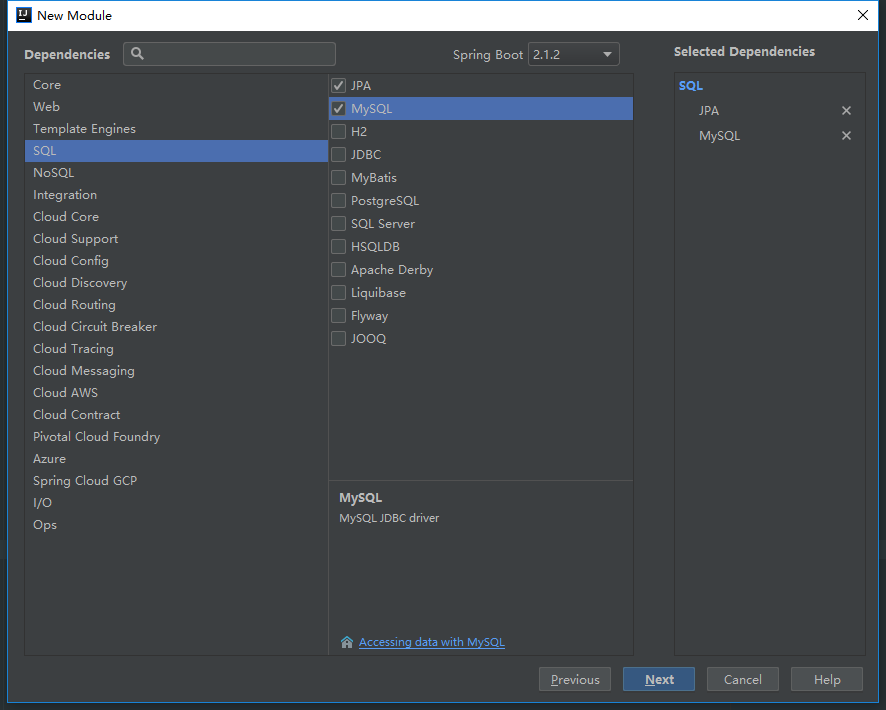
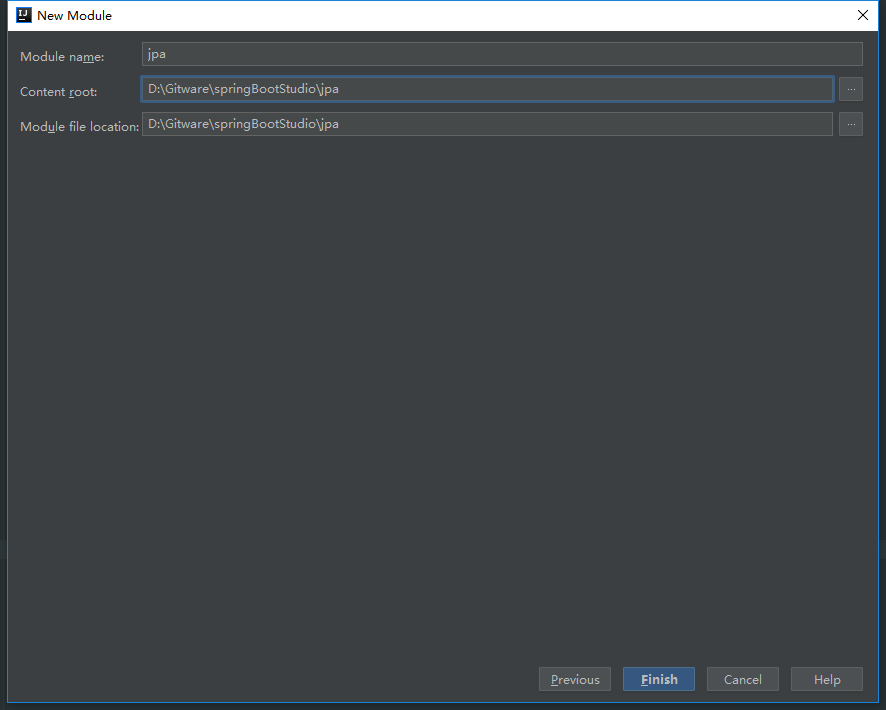
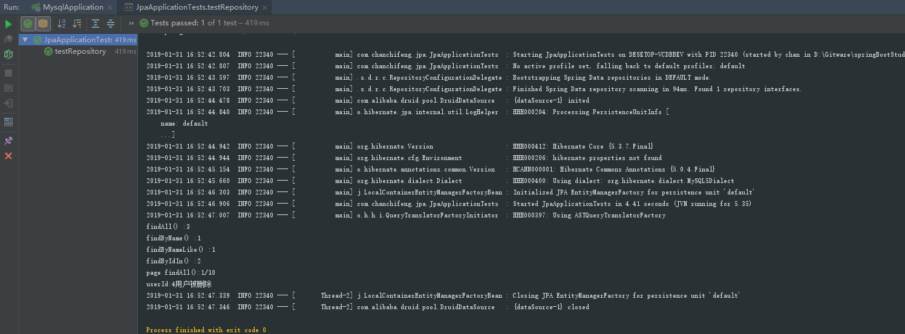

1.在springBootStudio项目中添加Module。

2.选择Spring Initializr，点击next。



3.Group填写com.chanchifeng，Artifact填写jpa。



4.勾选SQL中的MySQL和JPA，点击next。



5.Content_root和Module file location选择springBootStudio项目路径。



6.修改pom.xml，核心代码如下：

```
    <dependency>
        <groupId>org.springframework.boot</groupId>
        <artifactId>spring-boot-starter-test</artifactId>
        <scope>test</scope>
    </dependency>

    <dependency>
        <groupId>org.springframework.boot</groupId>
        <artifactId>spring-boot-starter-data-jpa</artifactId>
    </dependency>

    <!-- MySQL -->
    <dependency>
        <groupId>org.springframework.boot</groupId>
        <artifactId>spring-boot-starter-jdbc</artifactId>
    </dependency>

    <dependency>
        <groupId>mysql</groupId>
        <artifactId>mysql-connector-java</artifactId>
        <version>5.1.46</version>
        <scope>runtime</scope>
    </dependency>

    <!-- druid -->
    <dependency>
        <groupId>com.alibaba</groupId>
        <artifactId>druid</artifactId>
        <version>1.1.10</version>
    </dependency>

```

7.修改application.properties，代码如下：

```

	###  MySQL 连接信息
	spring.datasource.url = jdbc:mysql://127.0.0.1:3306/test?useSSL=true
	spring.datasource.username = root
	spring.datasource.password = 1qaz2wsx
	spring.datasource.driver-class-name = com.mysql.jdbc.Driver
	
	###  数据源类别
	spring.datasource.type=com.alibaba.druid.pool.DruidDataSource
	### 初始化大小，最小，最大
	spring.datasource.initialSize=5
	spring.datasource.minIdle=5
	spring.datasource.maxActive=20
	### 配置获取连接等待超时的时间，单位是毫秒
	spring.datasource.maxWait=60000
	### 配置间隔多久才进行一次检测，检测需要关闭的空闲连接，单位是毫秒
	spring.datasource.timeBetweenEvictionRunsMillis=60000
	### 配置一个连接在池中最小生存的时间，单位是毫秒
	spring.datasource.minEvictableIdleTimeMillis=300000
	spring.datasource.validationQuery=SELECT 1 FROM DUAL
	spring.datasource.testWhileIdle=true
	spring.datasource.testOnBorrow=false
	spring.datasource.testOnReturn=false
	### 打开PSCache，并且指定每个连接上PSCache的大小
	spring.datasource.poolPreparedStatements=true
	spring.datasource.maxPoolPreparedStatementPerConnectionSize=20
	### 配置监控统计拦截的filters，去掉后监控界面sql无法统计，'wall'用于防火墙
	spring.datasource.filters=stat,wall,log4j
	### 通过connectProperties属性来打开mergeSql功能；慢SQL记录
	spring.datasource.connectionProperties=druid.stat.mergeSql=true;druid.stat.slowSqlMillis=5000
	### 合并多个DruidDataSource的监控数据
	#spring.datasource.useGlobalDataSourceStat=true

```

8.在MySQL中创建一张user表。

```

	SET NAMES utf8mb4;
	SET FOREIGN_KEY_CHECKS = 0;
	
	-- ----------------------------
	-- Table structure for user
	-- ----------------------------
	DROP TABLE IF EXISTS `user`;
	CREATE TABLE `user`  (
	  `id` int(32) NOT NULL AUTO_INCREMENT COMMENT '主键',
	  `name` varchar(10) CHARACTER SET utf8 COLLATE utf8_general_ci NULL DEFAULT NULL COMMENT '用户名',
	  `password` varchar(32) CHARACTER SET utf8 COLLATE utf8_general_ci NULL DEFAULT NULL COMMENT '密码',
	  PRIMARY KEY (`id`) USING BTREE
	) ENGINE = InnoDB AUTO_INCREMENT = 4 CHARACTER SET = utf8 COLLATE = utf8_general_ci ROW_FORMAT = Dynamic;
	
	-- ----------------------------
	-- Records of user
	-- ----------------------------
	INSERT INTO `user` VALUES (1, '李四', 'e10adc3949ba59abbe56e057f20f883e');
	INSERT INTO `user` VALUES (2, '张三', 'e10adc3949ba59abbe56e057f20f883e');
	INSERT INTO `user` VALUES (3, '阿华', 'e10adc3949ba59abbe56e057f20f883e');
	
	SET FOREIGN_KEY_CHECKS = 1;

```

9.在项目中创建model包，在其下创建User类，代码如下：

```

	@Entity
	@Table(name = "user")
	public class User {
	    @Id
	    private String id;
	    private String name;
	    private String password;
	
	    public String getId() {
	        return id;
	    }
	
	    public void setId(String id) {
	        this.id = id;
	    }
	
	    public String getName() {
	        return name;
	    }
	
	    public void setName(String name) {
	        this.name = name;
	    }
	
	    public String getPassword() {
	        return password;
	    }
	
	    public void setPassword(String password) {
	        this.password = password;
	    }
	
	    @Override
	    public String toString() {
	        return "AyUser{" +
	                "id='" + id + '\'' +
	                ", name='" + name + '\'' +
	                ", password='" + password + '\'' +
	                '}';
	    }
	}

```

10.创建repository包，在其下创建UserRepository接口，代码如下：

```

	public interface UserRepository extends JpaRepository<User,String> {
	    /**
	     * 描述：通过名字相等查询，参数为 name
	     * 相当于：select u from ay_user u where u.name = ?1
	     */
	    List<User> findByName(String name);
	
	    /**
	     * 描述：通过名字like查询，参数为 name
	     * 相当于：select u from ay_user u where u.name like ?1
	     */
	    List<User> findByNameLike(String name);
	
	    /**
	     * 描述：通过主键id集合查询，参数为 id集合
	     * 相当于：select u from ay_user u where id in(?,?,?)
	     * @param ids
	     */
	    List<User> findByIdIn(Collection<String> ids);
	}

```

11.创建service包，在其下创建UserService接口，代码如下：

```

	public interface UserService {
	    User findById(String id);
	    List<User> findAll();
	    User save(User ayUser);
	    void delete(String id);
	
	    //分页
	    Page<User> findAll(Pageable pageable);
	
	    List<User> findByName(String name);
	    List<User> findByNameLike(String name);
	    List<User> findByIdIn(Collection<String> ids);
	    
	}

```

12.创建service.impl包，在其下创建UserServiceImpl类，代码如下：

```

	@Service
	public class UserServiceImpl implements UserService {
	
	    @Resource
	    private UserRepository userRepository;
	
	    @Override
	    public User findById(String id) {
	        return userRepository.findById(id).get();
	    }
	
	    @Override
	    public List<User> findAll() {
	        return userRepository.findAll();
	    }
	
	    @Override
	    public User save(User ayUser) {
	        return userRepository.save(ayUser);
	    }
	
	    @Override
	    public void delete(String id) {
	        userRepository.deleteById(id);
	        System.out.println("userId:" + id + "用户被删除");
	    }
	
	    @Override
	    public Page<User> findAll(Pageable pageable) {
	        return userRepository.findAll(pageable);
	    }
	
	    @Override
	    public List<User> findByName(String name){
	        return userRepository.findByName(name);
	    }
	    @Override
	    public List<User> findByNameLike(String name){
	        return userRepository.findByNameLike(name);
	    }
	    @Override
	    public List<User> findByIdIn(Collection<String> ids){
	        return userRepository.findByIdIn(ids);
	    }
	}

```

13.在com.chanchifeng.jpa.JpaApplicationTests编写测试，核心代码如下：

```

	/* 测试jpa */
	@Resource
	private UserService userService;
	
	@Test
	public void testRepository(){
	    //查询所有数据
	    List<User> userList =  userService.findAll();
	    System.out.println("findAll() :" + userList.size());
	    //通过name查询数据
	    List<User> userList2 = userService.findByName("李四");
	    System.out.println("findByName() :" + userList2.size());
	    Assert.isTrue(userList2.get(0).getName().equals("李四"),"data error!");
	    //通过name模糊查询数据
	    List<User> userList3 = userService.findByNameLike("%四%");
	    System.out.println("findByNameLike() :" + userList3.size());
	    Assert.isTrue(userList3.get(0).getName().equals("李四"),"data error!");
	    //通过id列表查询数据
	    List<String> ids = new ArrayList<String>();
	    ids.add("1");
	    ids.add("2");
	    List<User> userList4 = userService.findByIdIn(ids);
	    System.out.println("findByIdIn() :" + userList4.size());
	    //分页查询数据
	    PageRequest pageRequest = new PageRequest(0,10);
	    Page<User> userList5 =  userService.findAll(pageRequest);
	    System.out.println("page findAll():" + userList5.getTotalPages() + "/" + userList5.getSize());
	    //新增数据
	    User ayUser = new User();
	    ayUser.setId("4");
	    ayUser.setName("刘六");
	    ayUser.setPassword("e10adc3949ba59abbe56e057f20f883e");
	    userService.save(ayUser);
	    //删除数据
	    userService.delete("4");
	}

```

14.测试类的输出结果如下：

