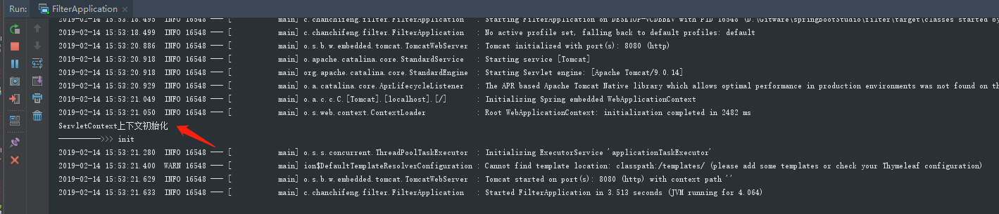

### 在原本的项目中使用listener监听器 ###

具体项目搭建参考：springboot - 使用 filter 过滤器([https://chanchifeng.com/2019/01/31/springboot-filter/](https://chanchifeng.com/2019/01/31/springboot-filter/ "https://chanchifeng.com/2019/01/31/springboot-filter/"))

1.在项目中创建一个listener包，在其下创建UserListener的类，代码如下：

```

	@WebListener
	public class UserListener implements ServletContextListener {
	
	    @Override
	    public void contextInitialized(ServletContextEvent servletContextEvent) {
	        System.out.println("ServletContext上下文初始化");
	    }
	
	    @Override
	    public void contextDestroyed(ServletContextEvent servletContextEvent) {
	        System.out.println("ServletContext上下文销毁");
	    }
	
	}

```

2.运行项目，即可看到控制台打印如下：

