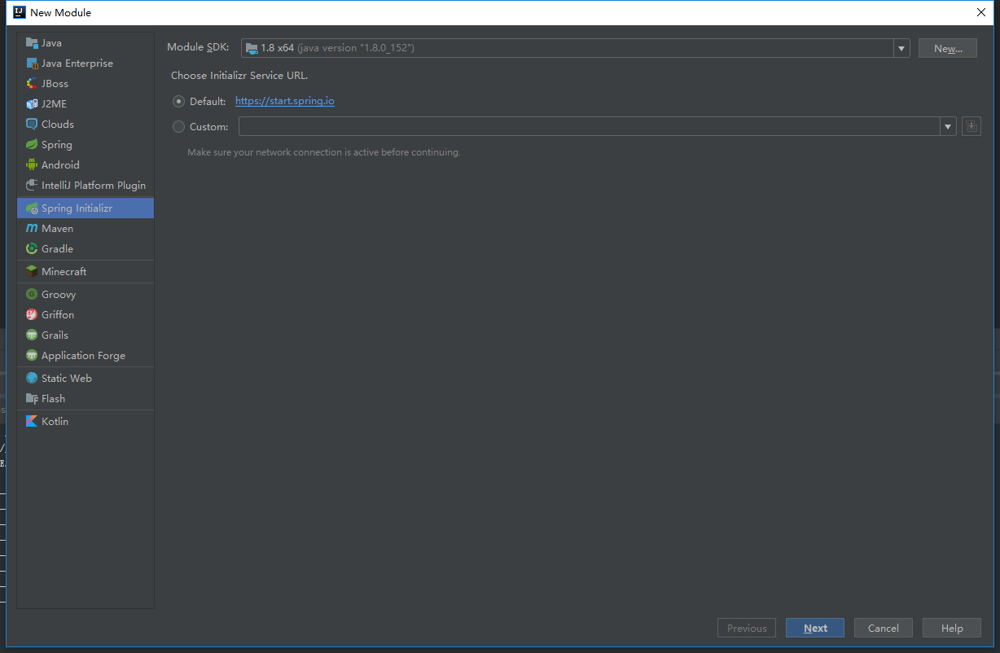
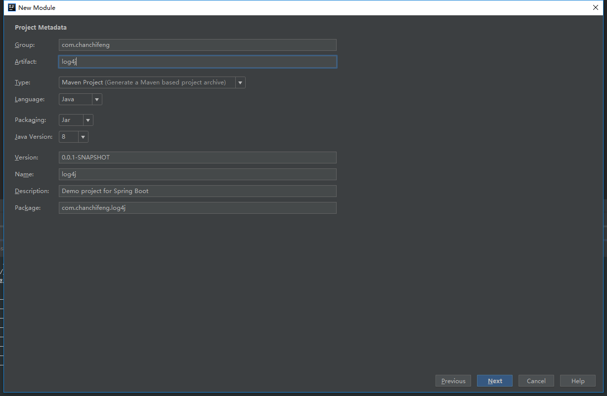
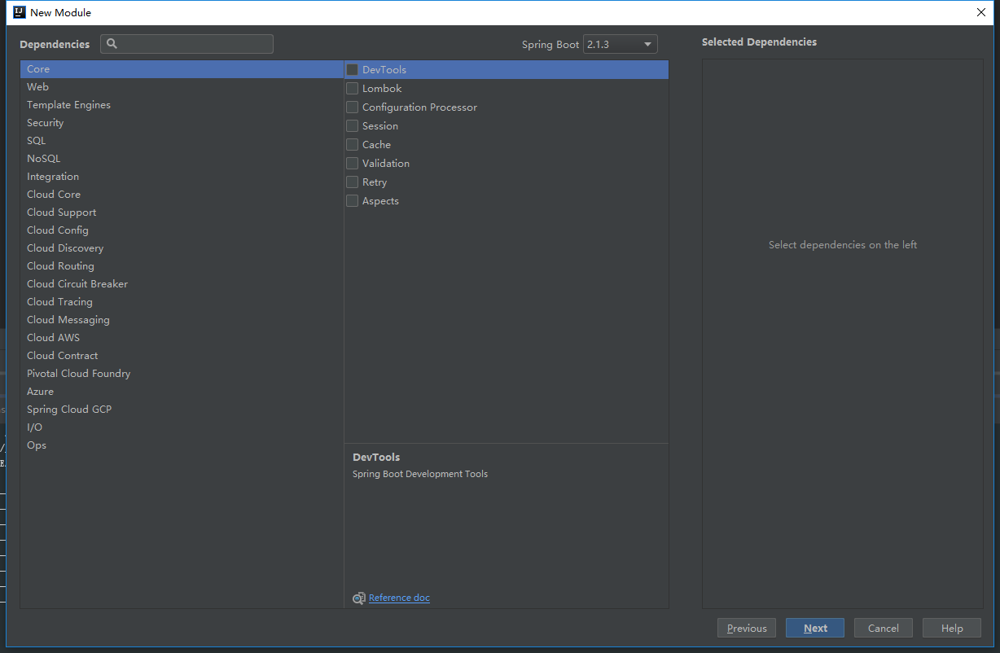
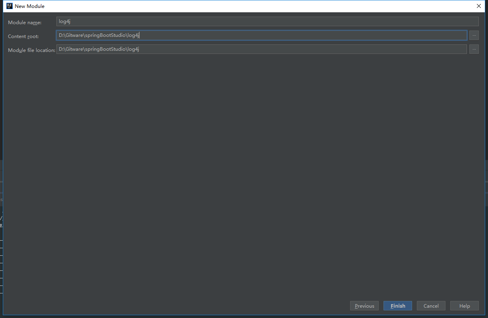
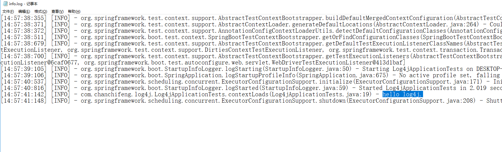

1.在springBootStudio项目中添加Module。

2.选择Spring Initializr，点击next。



3.Group填写com.chanchifeng，Artifact填写log4j。



4.点击next。



5.Content_root和Module file location选择springBootStudio项目路径。



6.修改pom.xml的添加log4j2，核心代码如下：

```

	<dependencies>
	
		<dependency>
		    <groupId>org.springframework.boot</groupId>
		    <artifactId>spring-boot-starter-web</artifactId>
		</dependency>
		
		<dependency>
		    <groupId>org.springframework.boot</groupId>
		    <artifactId>spring-boot-starter-test</artifactId>
		    <scope>test</scope>
		</dependency>
		
		<!-- log4j -->
		<dependency>
		    <groupId>org.springframework.boot</groupId>
		    <artifactId>spring-boot-starter</artifactId>
		    <exclusions>
		        <exclusion>
		            <groupId>org.springframework.boot</groupId>
		            <artifactId>spring-boot-starter-logging</artifactId>
		        </exclusion>
		    </exclusions>
		</dependency>
		
		<dependency>
		    <groupId>org.springframework.boot</groupId>
		    <artifactId>spring-boot-starter-log4j2</artifactId>
		</dependency>
	
	</dependencies>

```

7.修改application.properties，核心代码如下：

```

	###log4j配置
	logging.config=classpath:log4j2.xml

```

8.在resources下添加log4j2.xml，代码如下：

```

	<?xml version="1.0" encoding="UTF-8"?>
	<Configuration status="WARN">
	    <appenders>
	        <Console name="Console" target="SYSTEM_OUT">
	            <!-- 设置日志输出的格式 -->
	            <PatternLayout pattern="[%d{HH:mm:ss:SSS}] [%p] - %l - %m%n"/>
	        </Console>
	        <RollingFile name="RollingFileInfo" fileName="D:/info.log"
	                     filePattern="D:/$${date:yyyy-MM}/info-%d{yyyy-MM-dd}-%i.log">
	            <Filters>
	                <ThresholdFilter level="INFO"/>
	            </Filters>
	            <PatternLayout pattern="[%d{HH:mm:ss:SSS}] [%p] - %l - %m%n"/>
	            <Policies>
	                <TimeBasedTriggeringPolicy/>
	                <SizeBasedTriggeringPolicy size="100 MB"/>
	            </Policies>
	        </RollingFile>
	    </appenders>
	
	    <loggers>
	        <root level="info">
	            <appender-ref ref="Console"/>
	            <appender-ref ref="RollingFileInfo"/>
	        </root>
	    </loggers>
	
	</Configuration>

```

9.编写测试类Log4jApplicationTests，并查看日志文件是否正常输出，代码如下：

```

    private static Logger logger = LoggerFactory.getLogger(PageController.class);

    @Test
    public void contextLoads() {
        logger.info("hello log4j.");
    }

```

10.查看日志，如下图：

