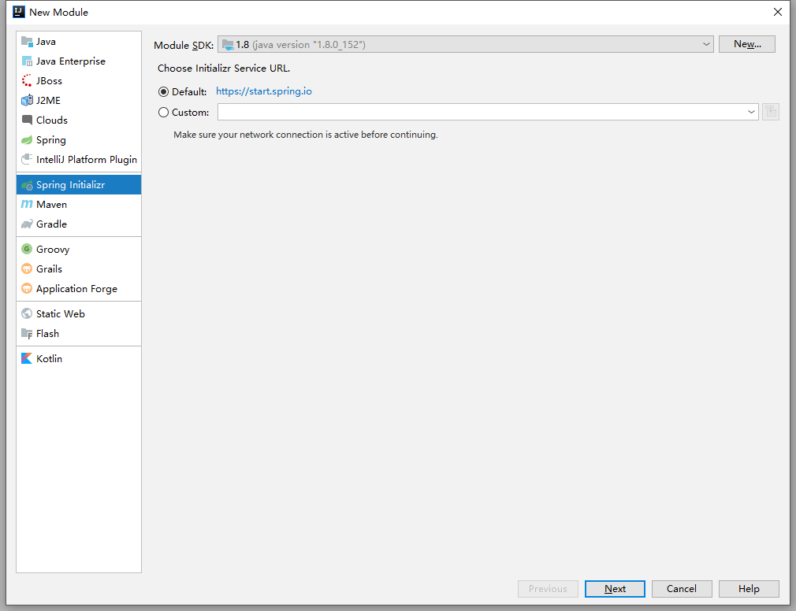
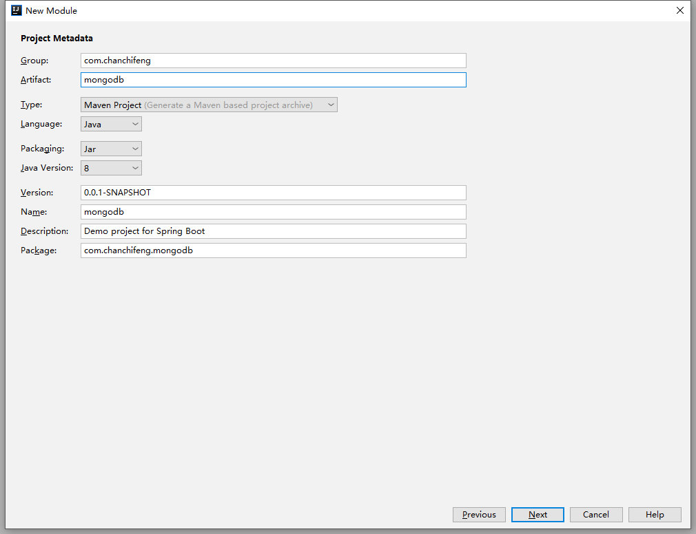
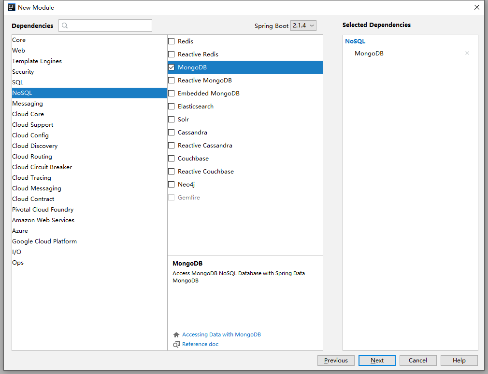
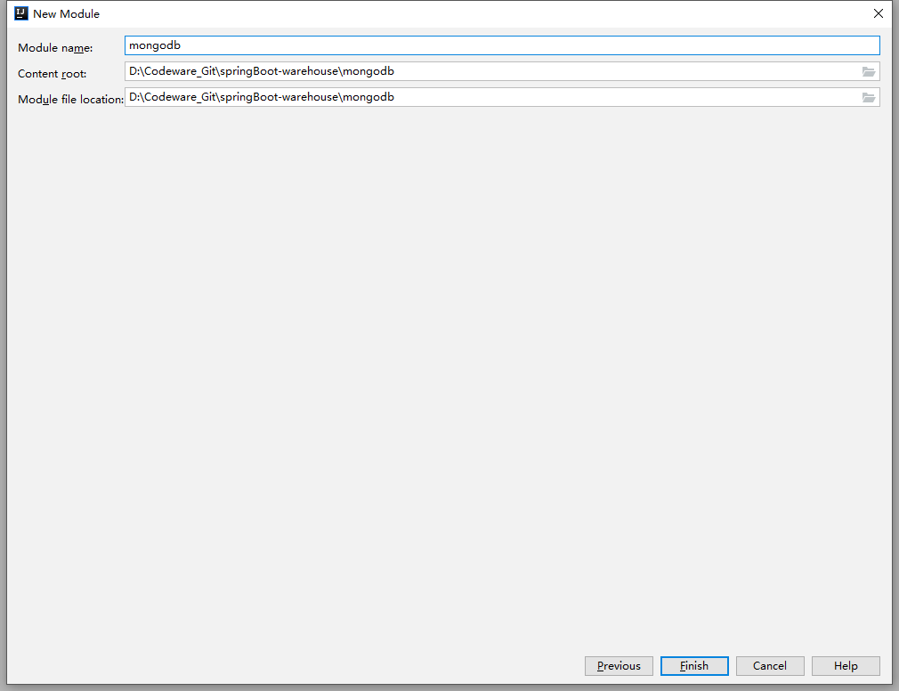
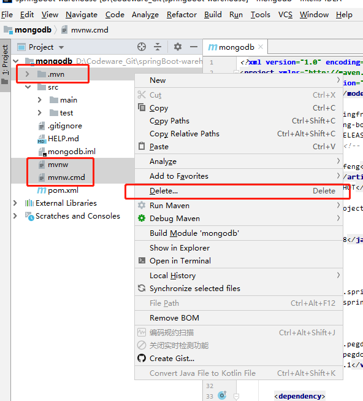
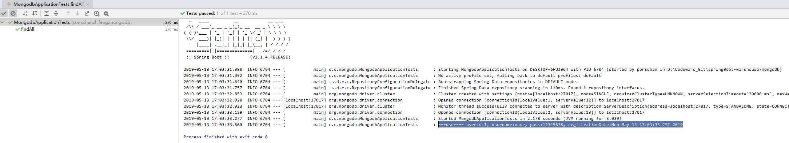

1.关于mongodb在windows系统如何安装，可以参考以下。

> MongoDB - Windows系统安装：[MongoDB - Windows系统安装](https://chanchifeng.com/2019/02/18/mongodb-install/)

2.在springBoot-warehouse项目中添加Module。

3.选择Spring Initializr，点击next。



4.Group填写com.chanchifeng，Artifact填写mongodb。



5.勾选SQL中的mongoDB，点击next。



6.Content_root和Module file location选择springBoot-warehouse项目路径。



7.删除自动生成的mvn：



8.项目结构：


9.在pom.xml添加依赖：

```
<dependencies>
    <dependency>
        <groupId>org.springframework.boot</groupId>
        <artifactId>spring-boot-starter-data-mongodb</artifactId>
    </dependency>

    <dependency>
        <groupId>org.pegdown</groupId>
        <artifactId>pegdown</artifactId>
        <version>1.4.1</version>
    </dependency>

    <dependency>
        <groupId>org.springframework.boot</groupId>
        <artifactId>spring-boot-starter-hateoas</artifactId>
    </dependency>

    <dependency>
        <groupId>com.fasterxml.jackson.core</groupId>
        <artifactId>jackson-annotations</artifactId>
        <version>2.9.0</version>
    </dependency>

    <dependency>
        <groupId>org.springframework.boot</groupId>
        <artifactId>spring-boot-starter-test</artifactId>
        <scope>test</scope>
    </dependency>
</dependencies>
```

10.在resources下创建mongoDB的配置文件：

```
# MongoDB
mongo.username=test
mongo.password=test
mongo.host=localhost
mongo.name=test
mongo.port=27017
```

11.创建config包，在其下创建DataSourceConfig：

```java
import com.mongodb.MongoClient;
import com.mongodb.MongoCredential;
import com.mongodb.ServerAddress;
import org.springframework.beans.factory.annotation.Autowired;
import org.springframework.context.annotation.Bean;
import org.springframework.context.annotation.Configuration;
import org.springframework.context.annotation.PropertySource;
import org.springframework.core.env.Environment;
import org.springframework.data.mongodb.config.AbstractMongoConfiguration;
import org.springframework.data.mongodb.repository.config.EnableMongoRepositories;

import java.util.ArrayList;
import java.util.List;

@Configuration
@PropertySource({"classpath:data-source.properties"})
@EnableMongoRepositories(basePackages = "com.chanchifeng.mongodb.repositories")
public class DataSourceConfig extends AbstractMongoConfiguration {

    @Autowired
    private Environment env;

    @Override
    @Bean
    public MongoClient mongoClient() {
        ServerAddress serverAddress = new ServerAddress(env.getRequiredProperty("mongo.host"));
        List<MongoCredential> credentials = new ArrayList<>();
        return new MongoClient(serverAddress, credentials);
    }

    @Override
    protected String getDatabaseName() {
        return env.getRequiredProperty("mongo.name");
    }
}
```

12.创建models包，在其下创建User：

```java
import org.springframework.data.annotation.Id;
import org.springframework.data.annotation.PersistenceConstructor;
import org.springframework.data.mongodb.core.index.Indexed;
import org.springframework.data.mongodb.core.mapping.Document;

import javax.validation.constraints.NotNull;
import java.util.Date;
import java.util.HashSet;
import java.util.Set;

@Document(collection = "user")
public class User {

    @Id
    private String userId;

    @NotNull
    @Indexed(unique = true)
    private String username;

    @NotNull
    private String password;

    @NotNull
    private String name;

    @NotNull
    private String email;

    @NotNull
    private Date registrationDate = new Date();

    private Set<String> roles = new HashSet<>();

    public User() {
    }

    @PersistenceConstructor
    public User(String userId, String username, String password, String name, String email,
                Date registrationDate, Set<String> roles) {
        this.userId = userId;
        this.username = username;
        this.password = password;
        this.name = name;
        this.email = email;
        this.registrationDate = registrationDate;
        this.roles = roles;

    }

    public String getUserId() {
        return userId;
    }

    public void setUserId(String userId) {
        this.userId = userId;
    }

    public String getUsername() {
        return username;
    }

    public void setUsername(String username) {
        this.username = username;
    }

    public String getPassword() {
        return password;
    }

    public void setPassword(String password) {
        this.password = password;
    }

    public String getName() {
        return name;
    }

    public void setName(String name) {
        this.name = name;
    }

    public String getEmail() {
        return email;
    }

    public void setEmail(String email) {
        this.email = email;
    }

    public Date getRegistrationDate() {
        return registrationDate;
    }

    public void setRegistrationDate(Date registrationDate) {
        this.registrationDate = registrationDate;
    }

    public Set<String> getRoles() {
        return roles;
    }

    public void setRoles(Set<String> roles) {
        this.roles = roles;
    }

    @Override
    public String toString() {
        return "User{" +
                "userId=" + userId +
                ", username='" + username + '\'' +
                ", password='" + password + '\'' +
                ", name='" + name + '\'' +
                ", email='" + email + '\'' +
                ", registrationDate=" + registrationDate +
                ", roles=" + roles +
                '}';
    }
}
```

13.创建repositories包，在其下创建UserRepository：

```java
import com.chanchifeng.mongodb.models.User;
import org.springframework.data.mongodb.repository.MongoRepository;

public interface UserRepository extends MongoRepository<User, String> {

    User findByUsername(String username);

}
```

14.[测试]在test包下创建resources文件夹，在其下创建data-source.properties：

```
# MongoDB
mongo.username=test
mongo.password=test
mongo.host=localhost
mongo.name=test
mongo.port=27017
```

15.[测试]创建DataSourceConfig：

```java
import com.mongodb.MongoClient;
import com.mongodb.MongoCredential;
import com.mongodb.ServerAddress;
import org.springframework.beans.factory.annotation.Autowired;
import org.springframework.context.annotation.Configuration;
import org.springframework.context.annotation.PropertySource;
import org.springframework.core.env.Environment;
import org.springframework.data.mongodb.config.AbstractMongoConfiguration;
import org.springframework.data.mongodb.repository.config.EnableMongoRepositories;

import java.util.ArrayList;
import java.util.List;

@Configuration
@EnableMongoRepositories(basePackages = "com.chanchifeng.mongodb.repositories")
@PropertySource("classpath:data-source.properties")
public class DataSourceConfig extends AbstractMongoConfiguration {

    @Autowired private Environment env;

    @Override
    public MongoClient mongoClient() {
        ServerAddress serverAddress = new ServerAddress(env.getRequiredProperty("mongo.host"));
        List<MongoCredential> credentials = new ArrayList<>();
        return new MongoClient(serverAddress, credentials);
    }

    @Override
    protected String getDatabaseName() {
        return env.getRequiredProperty("mongo.name");
    }
}
```

16.[测试]在MongodbApplicationTests编写测试案例：

```java
import com.chanchifeng.mongodb.models.User;
import com.chanchifeng.mongodb.repositories.UserRepository;
import org.junit.Before;
import org.junit.FixMethodOrder;
import org.junit.Test;
import org.junit.runner.RunWith;
import org.slf4j.Logger;
import org.slf4j.LoggerFactory;
import org.springframework.beans.factory.annotation.Autowired;
import org.springframework.boot.test.context.SpringBootTest;
import org.springframework.test.context.ContextConfiguration;
import org.springframework.test.context.junit4.SpringRunner;
import org.springframework.util.Assert;

import java.util.Date;
import java.util.HashSet;
import java.util.List;
import java.util.Set;

@RunWith(SpringRunner.class)
@SpringBootTest
@ContextConfiguration(classes = {DataSourceConfig.class})
@FixMethodOrder
public class MongodbApplicationTests {

    private static Logger logger = LoggerFactory.getLogger(MongodbApplicationTests.class);

    @SuppressWarnings("SpringJavaAutowiringInspection")
    @Autowired
    UserRepository userRepository;

    @Before
    public void setup() {
        Set<String> roles = new HashSet<>();
        roles.add("manage");
        User user = new User("1", "user", "12345678", "name", "email@com.cn", new Date(), roles);
        userRepository.save(user);
    }

    @Test
    public void findAll() {
        List<User> users = userRepository.findAll();
        Assert.notNull(users);
        for (User user : users) {
            logger.info("===user=== userid:{}, username:{}, pass:{}, registrationDate:{}",
                    user.getUserId(), user.getName(), user.getPassword(), user.getRegistrationDate());
        }
    }

}
```

17.测试结果：

