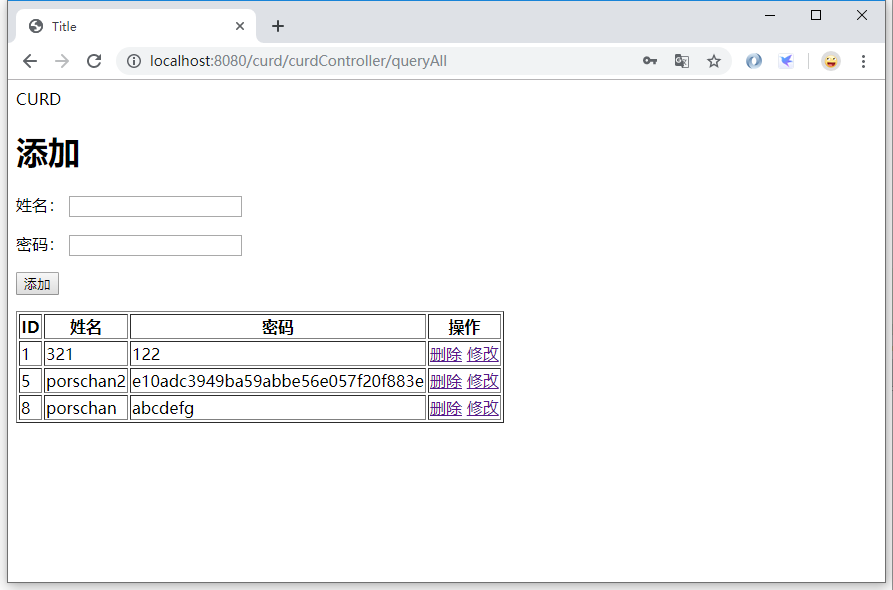

> 项目的搭建以在上节完成：[使用 IDEA 中创建 SPRINGBOOT-MYBATIS 的 WEB 项目](https://chanchifeng.com/2019/05/25/springboot-mybatis-demo/)

1.搭建的构成这里不详细讲，详情参考上述文章。

2.在controller中创建CurdController:

```java
import com.chanchifeng.curd.model.SysUser;
import com.chanchifeng.curd.service.SysUserService;
import org.springframework.stereotype.Controller;
import org.springframework.ui.Model;
import org.springframework.web.bind.annotation.GetMapping;
import org.springframework.web.bind.annotation.PathVariable;
import org.springframework.web.bind.annotation.RequestMapping;

import javax.annotation.Resource;
import java.util.List;

@Controller
@RequestMapping("/curdController")
public class CurdController {

    @Resource
    private SysUserService sysUserService;


    @GetMapping("/queryAll")
    public String queryAll(Model model) {

        List<SysUser> sysUsers = sysUserService.queryAll();
        System.out.println(sysUsers.size() + "!!");

        model.addAttribute("users",sysUsers);

        return "curd/index";
    }

    @RequestMapping("/delete/{userId}")
    public String delete(Model model,@PathVariable("userId") Long userId){

        //删除
        sysUserService.deleteByPrimaryKey(userId);

        return "redirect:/curdController/queryAll";
    }

    @RequestMapping("/queryById/{userId}")
    public String queryById(Model model,@PathVariable("userId") Long userId){

        model.addAttribute("user",sysUserService.selectByPrimaryKey(userId));

        return "curd/update";
    }

    @RequestMapping(value = "/update")
    public String update(SysUser sysUser) {

        System.out.println(sysUser.getSysUserId() + "!!");

        sysUserService.updateByPrimaryKeySelective(sysUser);

        return "redirect:/curdController/queryAll";
    }

    @RequestMapping(value = "/add")
    public String add(SysUser sysUser) {

        System.out.println(sysUser.getSysUserId() + "!!");

        sysUserService.insertSelective(sysUser);

        return "redirect:/curdController/queryAll";
    }
}
```

3.DefaultController:

```java
@Controller
public class DefaultController {

    @RequestMapping("/")
    public String index(Model model) {
        return "/index";
    }
}
```

4.SysUserMapper:

```java
import com.chanchifeng.curd.model.SysUser;

import java.util.List;

public interface SysUserMapper {
    /**
     * This method was generated by MyBatis Generator.
     * This method corresponds to the database table sys_user
     *
     * @mbg.generated
     */
    int deleteByPrimaryKey(Long sysUserId);

    /**
     * This method was generated by MyBatis Generator.
     * This method corresponds to the database table sys_user
     *
     * @mbg.generated
     */
    int insert(SysUser record);

    /**
     * This method was generated by MyBatis Generator.
     * This method corresponds to the database table sys_user
     *
     * @mbg.generated
     */
    int insertSelective(SysUser record);

    /**
     * This method was generated by MyBatis Generator.
     * This method corresponds to the database table sys_user
     *
     * @mbg.generated
     */
    SysUser selectByPrimaryKey(Long sysUserId);

    /**
     * This method was generated by MyBatis Generator.
     * This method corresponds to the database table sys_user
     *
     * @mbg.generated
     */
    int updateByPrimaryKeySelective(SysUser record);

    /**
     * This method was generated by MyBatis Generator.
     * This method corresponds to the database table sys_user
     *
     * @mbg.generated
     */
    int updateByPrimaryKey(SysUser record);

    List<SysUser> queryAll();
}
```

5.SysUserServiceImpl:

```java
import com.chanchifeng.curd.mapper.SysUserMapper;
import com.chanchifeng.curd.model.SysUser;
import com.chanchifeng.curd.service.SysUserService;
import org.springframework.stereotype.Service;

import javax.annotation.Resource;
import java.util.List;

@Service
public class SysUserServiceImpl implements SysUserService {

    @Resource
    private SysUserMapper sysUserMapper;

    @Override
    public SysUser getById(Long id) {
        return sysUserMapper.selectByPrimaryKey(id);
    }

    /* START CURD */

    @Override
    public List<SysUser> queryAll() {
        return sysUserMapper.queryAll();
    }

    @Override
    public SysUser selectByPrimaryKey(Long sysUserId) {
        return sysUserMapper.selectByPrimaryKey(sysUserId);
    }

    @Override
    public int deleteByPrimaryKey(Long sysUserId) {
        return sysUserMapper.deleteByPrimaryKey(sysUserId);
    }

    @Override
    public int updateByPrimaryKeySelective(SysUser sysUser) {
        return sysUserMapper.updateByPrimaryKeySelective(sysUser);
    }

    @Override
    public int insertSelective(SysUser record) {
        return sysUserMapper.insertSelective(record);
    }
    /* END CURD */

}
```

6.SysUserService:

```java
import com.chanchifeng.curd.model.SysUser;

import java.util.List;

public interface SysUserService {
    SysUser getById(Long id);

    /* START CURD */
    List<SysUser> queryAll();
    SysUser selectByPrimaryKey(Long sysUserId);
    int deleteByPrimaryKey(Long sysUserId);
    int updateByPrimaryKeySelective(SysUser sysUser);
    int insertSelective(SysUser record);
    /* END CURD */

}
```

7.SysUserMapper.xml:

```xml
<?xml version="1.0" encoding="UTF-8"?>
<!DOCTYPE mapper PUBLIC "-//mybatis.org//DTD Mapper 3.0//EN" "http://mybatis.org/dtd/mybatis-3-mapper.dtd">
<mapper namespace="com.chanchifeng.curd.mapper.SysUserMapper">
  <resultMap id="BaseResultMap" type="com.chanchifeng.curd.model.SysUser">
    <!--
      WARNING - @mbg.generated
      This element is automatically generated by MyBatis Generator, do not modify.
    -->
    <id column="sys_user_id" jdbcType="BIGINT" property="sysUserId" />
    <result column="sys_user_login_name" jdbcType="VARCHAR" property="sysUserLoginName" />
    <result column="sys_user_login_password" jdbcType="VARCHAR" property="sysUserLoginPassword" />
    <result column="sys_user_status" jdbcType="VARCHAR" property="sysUserStatus" />
    <result column="sys_user_is_delete" jdbcType="VARCHAR" property="sysUserIsDelete" />
    <result column="sys_user_register_datetime" jdbcType="TIMESTAMP" property="sysUserRegisterDatetime" />
    <result column="sys_user_register_source" jdbcType="VARCHAR" property="sysUserRegisterSource" />
    <result column="sys_user_type" jdbcType="VARCHAR" property="sysUserType" />
    <result column="sys_user_sex" jdbcType="VARCHAR" property="sysUserSex" />
    <result column="sys_user_is_email_active" jdbcType="VARCHAR" property="sysUserIsEmailActive" />
    <result column="sys_user_is_mobile_active" jdbcType="VARCHAR" property="sysUserIsMobileActive" />
    <result column="sys_user_register_type" jdbcType="VARCHAR" property="sysUserRegisterType" />
    <result column="sys_user_pay_passwrod" jdbcType="VARCHAR" property="sysUserPayPasswrod" />
    <result column="sys_user_icon" jdbcType="VARCHAR" property="sysUserIcon" />
    <result column="sys_user_real_name" jdbcType="VARCHAR" property="sysUserRealName" />
    <result column="sys_user_email" jdbcType="VARCHAR" property="sysUserEmail" />
    <result column="sys_user_mobile" jdbcType="VARCHAR" property="sysUserMobile" />
    <result column="sys_user_weibo_id" jdbcType="VARCHAR" property="sysUserWeiboId" />
    <result column="sys_user_qq_id" jdbcType="VARCHAR" property="sysUserQqId" />
  </resultMap>
  <sql id="Base_Column_List">
    <!--
      WARNING - @mbg.generated
      This element is automatically generated by MyBatis Generator, do not modify.
    -->
    sys_user_id, sys_user_login_name, sys_user_login_password, sys_user_status, sys_user_is_delete, 
    sys_user_register_datetime, sys_user_register_source, sys_user_type, sys_user_sex, 
    sys_user_is_email_active, sys_user_is_mobile_active, sys_user_register_type, sys_user_pay_passwrod, 
    sys_user_icon, sys_user_real_name, sys_user_email, sys_user_mobile, sys_user_weibo_id, 
    sys_user_qq_id
  </sql>

  <select id="queryAll" parameterType="java.lang.Long" resultMap="BaseResultMap">
    <!--
      WARNING - @mbg.generated
      This element is automatically generated by MyBatis Generator, do not modify.
    -->
    select
    <include refid="Base_Column_List" />
    from sys_user
  </select>


  <select id="selectByPrimaryKey" parameterType="java.lang.Long" resultMap="BaseResultMap">
    <!--
      WARNING - @mbg.generated
      This element is automatically generated by MyBatis Generator, do not modify.
    -->
    select 
    <include refid="Base_Column_List" />
    from sys_user
    where sys_user_id = #{sysUserId,jdbcType=BIGINT}
  </select>
  <delete id="deleteByPrimaryKey" parameterType="java.lang.Long">
    <!--
      WARNING - @mbg.generated
      This element is automatically generated by MyBatis Generator, do not modify.
    -->
    delete from sys_user
    where sys_user_id = #{sysUserId,jdbcType=BIGINT}
  </delete>
  <insert id="insert" parameterType="com.chanchifeng.curd.model.SysUser">
    <!--
      WARNING - @mbg.generated
      This element is automatically generated by MyBatis Generator, do not modify.
    -->
    insert into sys_user (sys_user_id, sys_user_login_name, sys_user_login_password, 
      sys_user_status, sys_user_is_delete, sys_user_register_datetime, 
      sys_user_register_source, sys_user_type, sys_user_sex, 
      sys_user_is_email_active, sys_user_is_mobile_active, 
      sys_user_register_type, sys_user_pay_passwrod, 
      sys_user_icon, sys_user_real_name, sys_user_email, 
      sys_user_mobile, sys_user_weibo_id, sys_user_qq_id
      )
    values (#{sysUserId,jdbcType=BIGINT}, #{sysUserLoginName,jdbcType=VARCHAR}, #{sysUserLoginPassword,jdbcType=VARCHAR}, 
      #{sysUserStatus,jdbcType=VARCHAR}, #{sysUserIsDelete,jdbcType=VARCHAR}, #{sysUserRegisterDatetime,jdbcType=TIMESTAMP}, 
      #{sysUserRegisterSource,jdbcType=VARCHAR}, #{sysUserType,jdbcType=VARCHAR}, #{sysUserSex,jdbcType=VARCHAR}, 
      #{sysUserIsEmailActive,jdbcType=VARCHAR}, #{sysUserIsMobileActive,jdbcType=VARCHAR}, 
      #{sysUserRegisterType,jdbcType=VARCHAR}, #{sysUserPayPasswrod,jdbcType=VARCHAR}, 
      #{sysUserIcon,jdbcType=VARCHAR}, #{sysUserRealName,jdbcType=VARCHAR}, #{sysUserEmail,jdbcType=VARCHAR}, 
      #{sysUserMobile,jdbcType=VARCHAR}, #{sysUserWeiboId,jdbcType=VARCHAR}, #{sysUserQqId,jdbcType=VARCHAR}
      )
  </insert>
  <insert id="insertSelective" parameterType="com.chanchifeng.curd.model.SysUser">
    <!--
      WARNING - @mbg.generated
      This element is automatically generated by MyBatis Generator, do not modify.
    -->
    insert into sys_user
    <trim prefix="(" suffix=")" suffixOverrides=",">
      <if test="sysUserId != null">
        sys_user_id,
      </if>
      <if test="sysUserLoginName != null">
        sys_user_login_name,
      </if>
      <if test="sysUserLoginPassword != null">
        sys_user_login_password,
      </if>
      <if test="sysUserStatus != null">
        sys_user_status,
      </if>
      <if test="sysUserIsDelete != null">
        sys_user_is_delete,
      </if>
      <if test="sysUserRegisterDatetime != null">
        sys_user_register_datetime,
      </if>
      <if test="sysUserRegisterSource != null">
        sys_user_register_source,
      </if>
      <if test="sysUserType != null">
        sys_user_type,
      </if>
      <if test="sysUserSex != null">
        sys_user_sex,
      </if>
      <if test="sysUserIsEmailActive != null">
        sys_user_is_email_active,
      </if>
      <if test="sysUserIsMobileActive != null">
        sys_user_is_mobile_active,
      </if>
      <if test="sysUserRegisterType != null">
        sys_user_register_type,
      </if>
      <if test="sysUserPayPasswrod != null">
        sys_user_pay_passwrod,
      </if>
      <if test="sysUserIcon != null">
        sys_user_icon,
      </if>
      <if test="sysUserRealName != null">
        sys_user_real_name,
      </if>
      <if test="sysUserEmail != null">
        sys_user_email,
      </if>
      <if test="sysUserMobile != null">
        sys_user_mobile,
      </if>
      <if test="sysUserWeiboId != null">
        sys_user_weibo_id,
      </if>
      <if test="sysUserQqId != null">
        sys_user_qq_id,
      </if>
    </trim>
    <trim prefix="values (" suffix=")" suffixOverrides=",">
      <if test="sysUserId != null">
        #{sysUserId,jdbcType=BIGINT},
      </if>
      <if test="sysUserLoginName != null">
        #{sysUserLoginName,jdbcType=VARCHAR},
      </if>
      <if test="sysUserLoginPassword != null">
        #{sysUserLoginPassword,jdbcType=VARCHAR},
      </if>
      <if test="sysUserStatus != null">
        #{sysUserStatus,jdbcType=VARCHAR},
      </if>
      <if test="sysUserIsDelete != null">
        #{sysUserIsDelete,jdbcType=VARCHAR},
      </if>
      <if test="sysUserRegisterDatetime != null">
        #{sysUserRegisterDatetime,jdbcType=TIMESTAMP},
      </if>
      <if test="sysUserRegisterSource != null">
        #{sysUserRegisterSource,jdbcType=VARCHAR},
      </if>
      <if test="sysUserType != null">
        #{sysUserType,jdbcType=VARCHAR},
      </if>
      <if test="sysUserSex != null">
        #{sysUserSex,jdbcType=VARCHAR},
      </if>
      <if test="sysUserIsEmailActive != null">
        #{sysUserIsEmailActive,jdbcType=VARCHAR},
      </if>
      <if test="sysUserIsMobileActive != null">
        #{sysUserIsMobileActive,jdbcType=VARCHAR},
      </if>
      <if test="sysUserRegisterType != null">
        #{sysUserRegisterType,jdbcType=VARCHAR},
      </if>
      <if test="sysUserPayPasswrod != null">
        #{sysUserPayPasswrod,jdbcType=VARCHAR},
      </if>
      <if test="sysUserIcon != null">
        #{sysUserIcon,jdbcType=VARCHAR},
      </if>
      <if test="sysUserRealName != null">
        #{sysUserRealName,jdbcType=VARCHAR},
      </if>
      <if test="sysUserEmail != null">
        #{sysUserEmail,jdbcType=VARCHAR},
      </if>
      <if test="sysUserMobile != null">
        #{sysUserMobile,jdbcType=VARCHAR},
      </if>
      <if test="sysUserWeiboId != null">
        #{sysUserWeiboId,jdbcType=VARCHAR},
      </if>
      <if test="sysUserQqId != null">
        #{sysUserQqId,jdbcType=VARCHAR},
      </if>
    </trim>
  </insert>
  <update id="updateByPrimaryKeySelective" parameterType="com.chanchifeng.curd.model.SysUser">
    <!--
      WARNING - @mbg.generated
      This element is automatically generated by MyBatis Generator, do not modify.
    -->
    update sys_user
    <set>
      <if test="sysUserLoginName != null">
        sys_user_login_name = #{sysUserLoginName,jdbcType=VARCHAR},
      </if>
      <if test="sysUserLoginPassword != null">
        sys_user_login_password = #{sysUserLoginPassword,jdbcType=VARCHAR},
      </if>
      <if test="sysUserStatus != null">
        sys_user_status = #{sysUserStatus,jdbcType=VARCHAR},
      </if>
      <if test="sysUserIsDelete != null">
        sys_user_is_delete = #{sysUserIsDelete,jdbcType=VARCHAR},
      </if>
      <if test="sysUserRegisterDatetime != null">
        sys_user_register_datetime = #{sysUserRegisterDatetime,jdbcType=TIMESTAMP},
      </if>
      <if test="sysUserRegisterSource != null">
        sys_user_register_source = #{sysUserRegisterSource,jdbcType=VARCHAR},
      </if>
      <if test="sysUserType != null">
        sys_user_type = #{sysUserType,jdbcType=VARCHAR},
      </if>
      <if test="sysUserSex != null">
        sys_user_sex = #{sysUserSex,jdbcType=VARCHAR},
      </if>
      <if test="sysUserIsEmailActive != null">
        sys_user_is_email_active = #{sysUserIsEmailActive,jdbcType=VARCHAR},
      </if>
      <if test="sysUserIsMobileActive != null">
        sys_user_is_mobile_active = #{sysUserIsMobileActive,jdbcType=VARCHAR},
      </if>
      <if test="sysUserRegisterType != null">
        sys_user_register_type = #{sysUserRegisterType,jdbcType=VARCHAR},
      </if>
      <if test="sysUserPayPasswrod != null">
        sys_user_pay_passwrod = #{sysUserPayPasswrod,jdbcType=VARCHAR},
      </if>
      <if test="sysUserIcon != null">
        sys_user_icon = #{sysUserIcon,jdbcType=VARCHAR},
      </if>
      <if test="sysUserRealName != null">
        sys_user_real_name = #{sysUserRealName,jdbcType=VARCHAR},
      </if>
      <if test="sysUserEmail != null">
        sys_user_email = #{sysUserEmail,jdbcType=VARCHAR},
      </if>
      <if test="sysUserMobile != null">
        sys_user_mobile = #{sysUserMobile,jdbcType=VARCHAR},
      </if>
      <if test="sysUserWeiboId != null">
        sys_user_weibo_id = #{sysUserWeiboId,jdbcType=VARCHAR},
      </if>
      <if test="sysUserQqId != null">
        sys_user_qq_id = #{sysUserQqId,jdbcType=VARCHAR},
      </if>
    </set>
    where sys_user_id = #{sysUserId,jdbcType=BIGINT}
  </update>
  <update id="updateByPrimaryKey" parameterType="com.chanchifeng.curd.model.SysUser">
    <!--
      WARNING - @mbg.generated
      This element is automatically generated by MyBatis Generator, do not modify.
    -->
    update sys_user
    set sys_user_login_name = #{sysUserLoginName,jdbcType=VARCHAR},
      sys_user_login_password = #{sysUserLoginPassword,jdbcType=VARCHAR},
      sys_user_status = #{sysUserStatus,jdbcType=VARCHAR},
      sys_user_is_delete = #{sysUserIsDelete,jdbcType=VARCHAR},
      sys_user_register_datetime = #{sysUserRegisterDatetime,jdbcType=TIMESTAMP},
      sys_user_register_source = #{sysUserRegisterSource,jdbcType=VARCHAR},
      sys_user_type = #{sysUserType,jdbcType=VARCHAR},
      sys_user_sex = #{sysUserSex,jdbcType=VARCHAR},
      sys_user_is_email_active = #{sysUserIsEmailActive,jdbcType=VARCHAR},
      sys_user_is_mobile_active = #{sysUserIsMobileActive,jdbcType=VARCHAR},
      sys_user_register_type = #{sysUserRegisterType,jdbcType=VARCHAR},
      sys_user_pay_passwrod = #{sysUserPayPasswrod,jdbcType=VARCHAR},
      sys_user_icon = #{sysUserIcon,jdbcType=VARCHAR},
      sys_user_real_name = #{sysUserRealName,jdbcType=VARCHAR},
      sys_user_email = #{sysUserEmail,jdbcType=VARCHAR},
      sys_user_mobile = #{sysUserMobile,jdbcType=VARCHAR},
      sys_user_weibo_id = #{sysUserWeiboId,jdbcType=VARCHAR},
      sys_user_qq_id = #{sysUserQqId,jdbcType=VARCHAR}
    where sys_user_id = #{sysUserId,jdbcType=BIGINT}
  </update>
</mapper>
```

8.static文件内的js或css，可以到本文末尾的Github中获取。

9.在templates中创建curd，在curd中创建index.html:

```html
<!DOCTYPE html>
<html lang="en" xmlns:th="http://www.w3.org/1999/xhtml">
<head>
    <meta charset="UTF-8">
    <title>Title</title>
</head>
<body>
CURD
<br>

<h1>添加</h1>

<form action="add" method="post">
    <p>
        <label>姓名：</label>
        <input type="text" name="sysUserLoginName" id="sysUserLoginName"/>
    </p>
    <p>
        <label>密码：</label>
        <input type="password" name="sysUserLoginPassword" id="sysUserLoginPassword"/>
    </p>


    <p>
        <input type="submit" value="添加">
    </p>
</form>

<table border="1">
    <tr>
        <th>ID</th>
        <th>姓名</th>
        <th>密码</th>
        <th>操作</th>
    </tr>


    <tr th:each="user : ${users}">
        <td th:text="${user.sysUserId}"></td>
        <td th:text="${user.sysUserLoginName}"></td>
        <td th:text="${user.sysUserLoginPassword}"></td>
        <td>
            <a th:href="@{delete/} + ${user.sysUserId}">删除</a>
            <a th:href="@{queryById/} + ${user.sysUserId}">修改</a>
        </td>
    </tr>

</table>


</body>
</html>
```

10.在curd中创建update.html：

```html
<!DOCTYPE html>
<html lang="en" xmlns:th="http://www.w3.org/1999/xhtml">
<head>
    <meta charset="UTF-8">
    <title>Title</title>
</head>
<body>
update

<form action="../update" method="post" th:object="${user}">

    <p>
        <label>姓名：</label>
        <input type="text" name="sysUserLoginName" value="" id="sysUserLoginName" th:field="*{sysUserLoginName}"/>
    </p>
    <p>
        <label>密码：</label>
        <input type="text" name="sysUserLoginPassword" value="" id="sysUserLoginPassword" th:field="*{sysUserLoginPassword}"/>
    </p>
    <p>
        <input type="hidden" name="sysUserId" value="" id="sysUserId" th:field="*{sysUserId}"/>
        <input type="submit" value="修改">
    </p>
</form>
</body>
</html>
```

11.在templates中创建index.hmlt:

```html
<!DOCTYPE html>
<html lang="zh-CN">
<head>
    <title>首页</title>
    <meta charset="utf-8">
    <meta http-equiv="X-UA-Compatible" content="IE=edge">
    <meta name="viewport" content="width=device-width, initial-scale=1.0">
    <meta name="description" content="">
    <meta name="author" content="">
</head>
<body>

<br>

<a href="sysUserController/showUserToJspById/1" target="_blank">查询用户信息并直接输出JSON数据</a>

<br>

<a href="curdController/queryAll" target="_blank">CURD</a>

<br>

<a href="uploadController/index" target="_blank">upload</a>

</body>
</html>
```

12.application.yml

```yml
server:
  port: 8080
  servlet:
    context-path: /curd

spring:
  datasource:
    name: mydata
    url: jdbc:mysql://127.0.0.1:3306/smybatisdemo?serverTimezone=GMT%2B8&useSSL=false
    username: root
    password: 1qaz2wsx
    # 使用druid数据源
    type: com.alibaba.druid.pool.DruidDataSource
    driver-class-name: com.mysql.cj.jdbc.Driver
    filters: stat
    maxActive: 20
    initialSize: 1
    maxWait: 60000
    minIdle: 1
    timeBetweenEvictionRunsMillis: 60000
    minEvictableIdleTimeMillis: 300000
    validationQuery: select 'x'
    testWhileIdle: true
    testOnBorrow: false
    testOnReturn: false
    poolPreparedStatements: true
    maxOpenPreparedStatements: 20
  resources:
    static-locations: classpath:/static/
    chain:
      strategy:
        content:
          enabled: true
          paths: /**
  thymeleaf:
    mode: HTML5
    encoding: utf-8
    prefix: classpath:/templates/
    suffix: .html
    cache: false
  servlet:
    multipart:
      max-request-size: 10MB
      max-file-size: 10MB

mybatis:
  mapper-locations: classpath:mapping/*.xml  #classpath就是应用程序resources的路径
  type-aliases-package: com.chanchifeng.demo.model
```

13.在浏览器中输入<http://localhost:8080/curd/curdController/queryAll>，即可测试增删查改的功能，如下图所示：



> github：[SpringBoot-MyBatis/curd](https://github.com/porschan/SpringBoot-MyBatis)