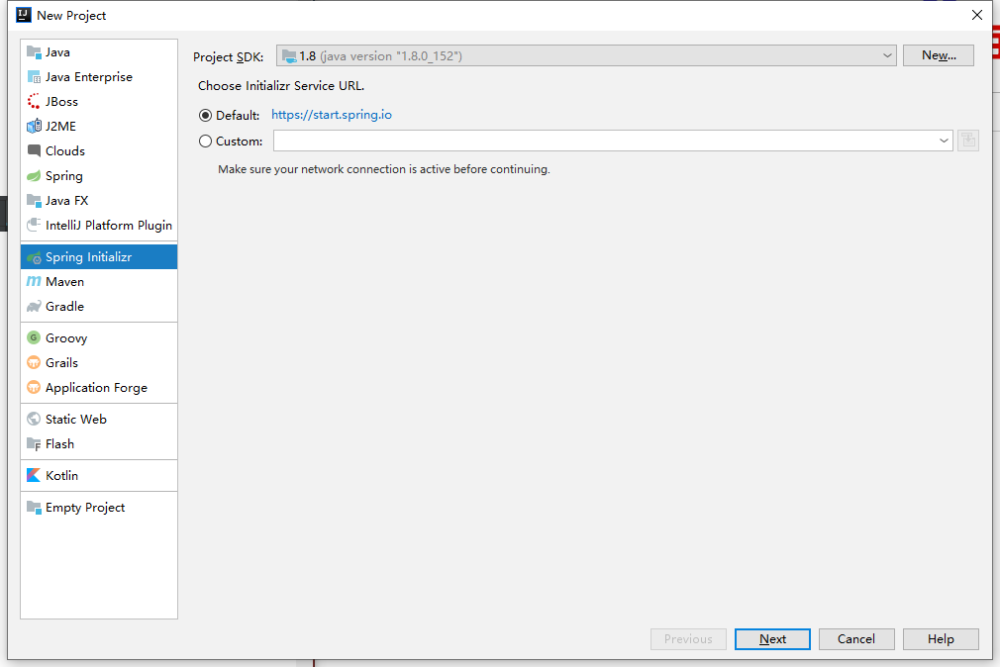
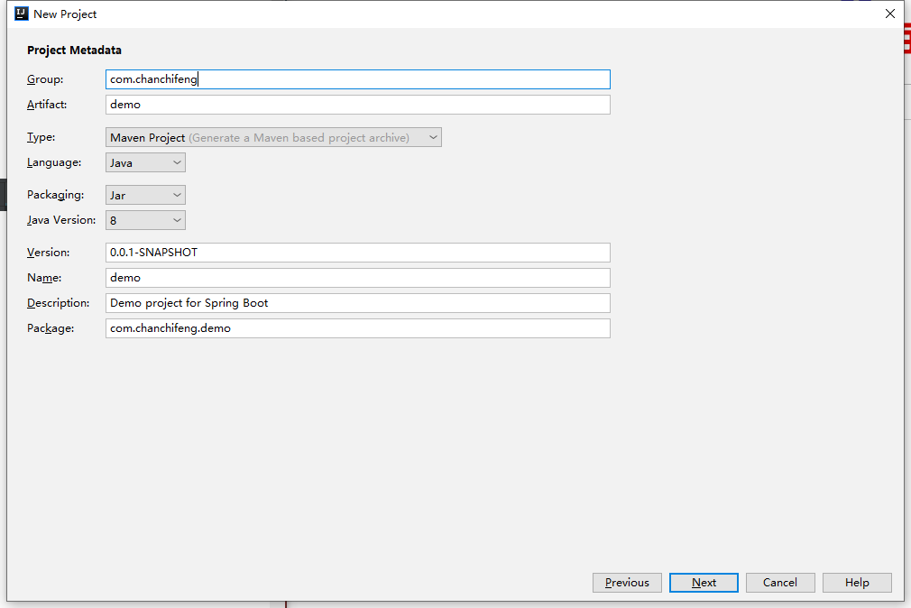
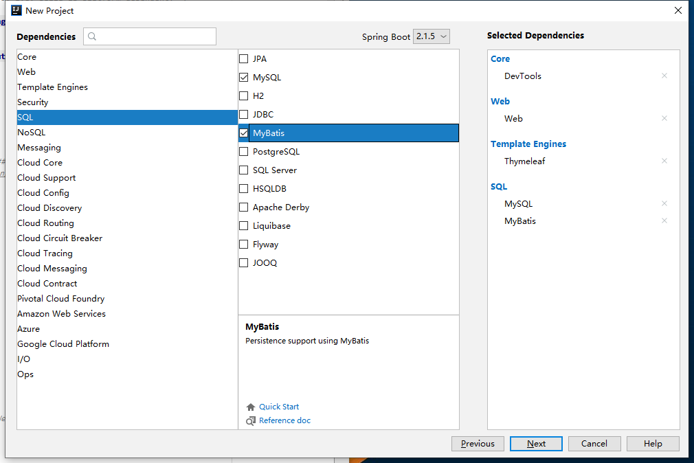
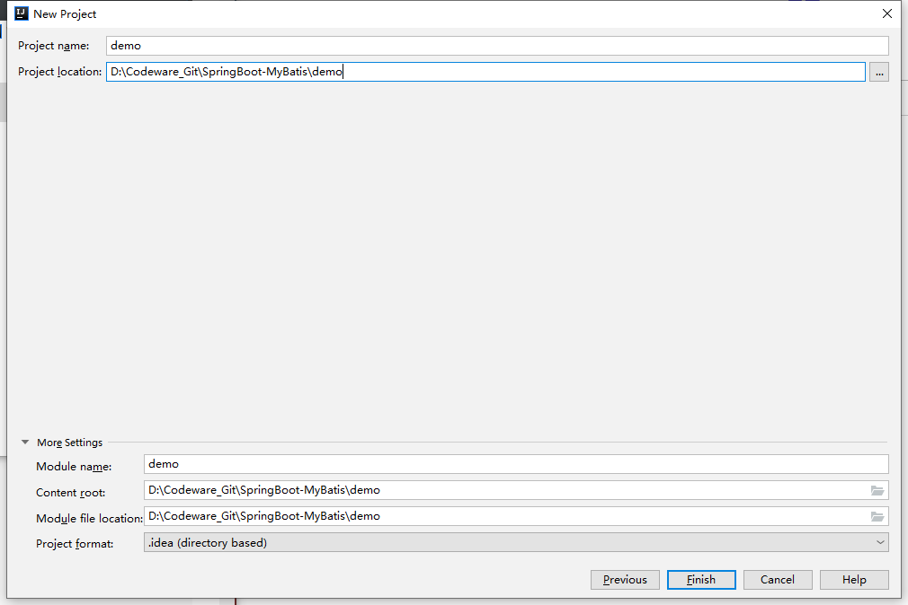
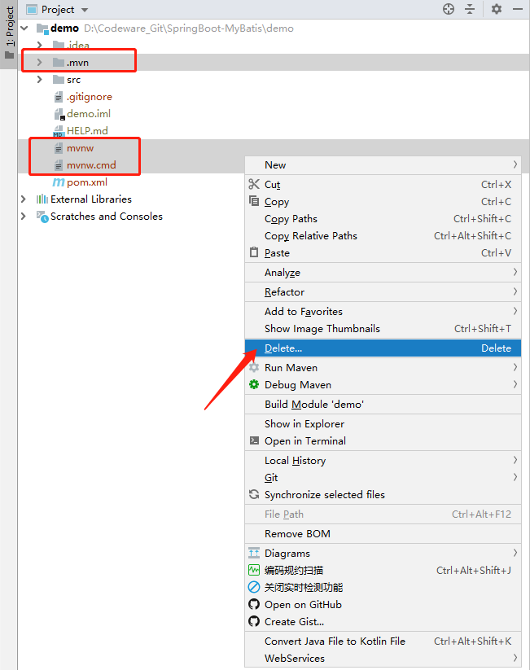
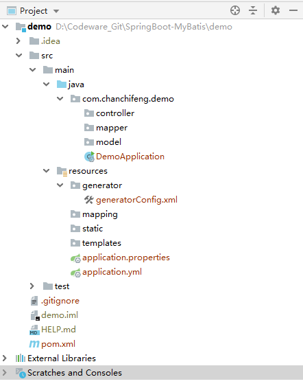
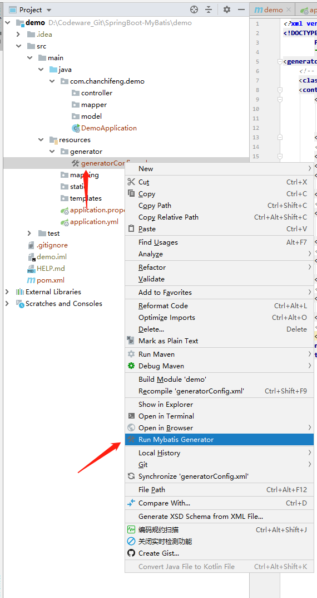
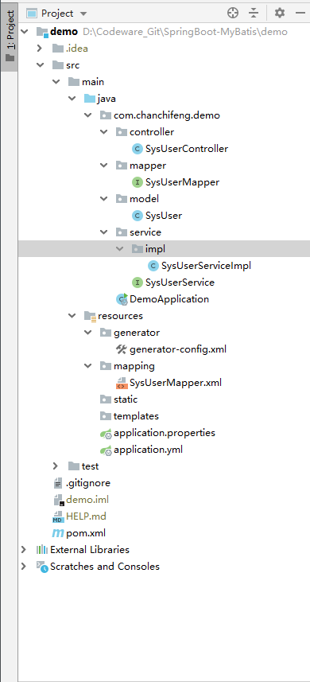
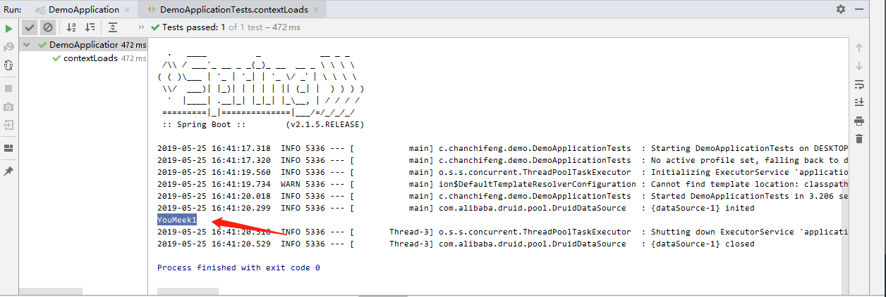
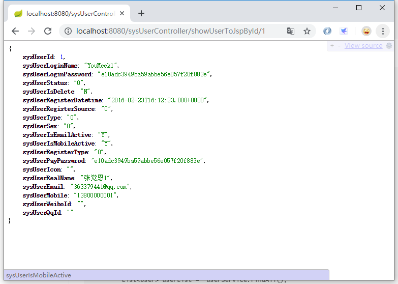

1.新建一个空项目。

2.选择Spring Initializr,操作如下图所示：



3.在Group 和Atrifact 分别填写com.chanchifeng和demo，如下图所示：



4.选择下图需要的依赖，如下图所示：



5.在Project name和Project location中分别填写demo和对于的项目路径，如下图所示：



6.删除maven自动生成的文件，如下图所示：



7.pom.xml:

```xml
<?xml version="1.0" encoding="UTF-8"?>
<project xmlns="http://maven.apache.org/POM/4.0.0" xmlns:xsi="http://www.w3.org/2001/XMLSchema-instance"
         xsi:schemaLocation="http://maven.apache.org/POM/4.0.0 http://maven.apache.org/xsd/maven-4.0.0.xsd">
    <modelVersion>4.0.0</modelVersion>
    <parent>
        <groupId>org.springframework.boot</groupId>
        <artifactId>spring-boot-starter-parent</artifactId>
        <version>2.1.5.RELEASE</version>
        <relativePath/> <!-- lookup parent from repository -->
    </parent>
    <groupId>com.chanchifeng</groupId>
    <artifactId>demo</artifactId>
    <version>0.0.1-SNAPSHOT</version>
    <name>demo</name>
    <description>Demo project for Spring Boot</description>

    <properties>
        <java.version>1.8</java.version>
    </properties>

    <dependencies>
        <dependency>
            <groupId>org.springframework.boot</groupId>
            <artifactId>spring-boot-starter-thymeleaf</artifactId>
        </dependency>
        <dependency>
            <groupId>org.springframework.boot</groupId>
            <artifactId>spring-boot-starter-web</artifactId>
        </dependency>
        <dependency>
            <groupId>org.mybatis.spring.boot</groupId>
            <artifactId>mybatis-spring-boot-starter</artifactId>
            <version>2.0.1</version>
        </dependency>

        <dependency>
            <groupId>org.springframework.boot</groupId>
            <artifactId>spring-boot-devtools</artifactId>
            <scope>runtime</scope>
        </dependency>
        <dependency>
            <groupId>mysql</groupId>
            <artifactId>mysql-connector-java</artifactId>
            <scope>runtime</scope>
        </dependency>
        <dependency>
            <groupId>org.springframework.boot</groupId>
            <artifactId>spring-boot-starter-test</artifactId>
            <scope>test</scope>
        </dependency>

        <!-- 数据库连接池 -->
        <dependency>
            <groupId>com.alibaba</groupId>
            <artifactId>druid</artifactId>
            <version>1.1.10</version>
        </dependency>


    </dependencies>

    <build>
        <plugins>
            <plugin>
                <groupId>org.springframework.boot</groupId>
                <artifactId>spring-boot-maven-plugin</artifactId>
            </plugin>

            <!-- mybatis generator 自动生成代码插件 -->
            <plugin>
                <groupId>org.mybatis.generator</groupId>
                <artifactId>mybatis-generator-maven-plugin</artifactId>
                <version>1.3.2</version>
                <configuration>
                    <!-- 自动生成代码的配置文件地址 -->
                    <configurationFile>${basedir}/src/main/resources/generator/generator-config.xml</configurationFile>
                    <verbose>true</verbose>
                    <overwrite>true</overwrite>
                </configuration>
            </plugin>

        </plugins>
    </build>

</project>

```

8.建立com.chanchifeng.demo下的包，结构如下图所示：



9.在resources/generator下创建generator-config.xml:

```xml
<?xml version="1.0" encoding="UTF-8" ?>
<!DOCTYPE generatorConfiguration PUBLIC
        "-//mybatis.org//DTD MyBatis Generator Configuration 1.0//EN"
        "http://mybatis.org/dtd/mybatis-generator-config_1_0.dtd" >
<generatorConfiguration>

    <!--mybatis生成工具的帮助文档可以看：-->
    <!--英文：http://www.mybatis.org/generator/usage/mysql.html-->
    <!--中文：http://www.mybatis.tk/-->
    <!--中文：http://mbg.cndocs.tk/-->


    <!--添加你本地的驱动jar-->
    <!--    <classPathEntry location="D:\maven\my_local_repository\mysql\mysql-connector-java\5.1.21\mysql-connector-java-5.1.21.jar"/>-->
    <classPathEntry location="C:\Software\maven_repository\mysql\mysql-connector-java\5.1.21\mysql-connector-java-5.1.21.jar"/>

    <context id="context" targetRuntime="MyBatis3">

        <!--设置编码格式-->
        <property name="javaFileEncoding" value="UTF-8"/>

        <commentGenerator>
            <property name="suppressAllComments" value="false"/>
            <property name="suppressDate" value="true"/>
        </commentGenerator>

        <!--添加你的 JDBC 连接信息-->
        <jdbcConnection driverClass="com.mysql.jdbc.Driver" connectionURL="jdbc:mysql://127.0.0.1:3306/smybatisdemo" userId="root" password="1qaz2wsx"/>

        <javaTypeResolver>
            <property name="forceBigDecimals" value="false"/>
        </javaTypeResolver>

        <!--要生成的 pojo 模块位置-->
        <javaModelGenerator targetPackage="com.chanchifeng.demo.model" targetProject="THIS_CONFIGURATION_IS_NOT_REQUIRED">
            <property name="enableSubPackages" value="false"/>
            <property name="trimStrings" value="true"/>
        </javaModelGenerator>

        <!--要生成的 Mapper.xml 文件位置-->
        <sqlMapGenerator targetPackage="mapping" targetProject="src/main/resources/">
            <property name="enableSubPackages" value="false"/>
        </sqlMapGenerator>

        <!--要生成的 Mapper 接口类-->
        <javaClientGenerator targetPackage="com.chanchifeng.demo.mapper" targetProject="THIS_CONFIGURATION_IS_NOT_REQUIRED" type="XMLMAPPER">
            <property name="enableSubPackages" value="false"/>
        </javaClientGenerator>


        <!--要根据哪张表生成，要在这里配置-->
        <!--用百分号表示生成所有表,可以直接省去一个一个写 <table tableName="%" /> -->
        <table tableName="sys_user" enableCountByExample="false" enableDeleteByExample="false" enableSelectByExample="false" enableUpdateByExample="false"/>

    </context>
</generatorConfiguration>
```

10.先创建sjpademo的数据库，再创建user表，SQL语句如下：

```sql
SET NAMES utf8mb4;
SET FOREIGN_KEY_CHECKS = 0;

-- ----------------------------
-- Table structure for user
-- ----------------------------
DROP TABLE IF EXISTS `user`;
CREATE TABLE `user`  (
  `id` int(32) NOT NULL AUTO_INCREMENT COMMENT '主键',
  `name` varchar(10) CHARACTER SET utf8 COLLATE utf8_general_ci NULL DEFAULT NULL COMMENT '用户名',
  `password` varchar(32) CHARACTER SET utf8 COLLATE utf8_general_ci NULL DEFAULT NULL COMMENT '密码',
  PRIMARY KEY (`id`) USING BTREE
) ENGINE = InnoDB AUTO_INCREMENT = 4 CHARACTER SET = utf8 COLLATE = utf8_general_ci ROW_FORMAT = Dynamic;

-- ----------------------------
-- Records of user
-- ----------------------------
INSERT INTO `user` VALUES (1, '李四', 'e10adc3949ba59abbe56e057f20f883e');
INSERT INTO `user` VALUES (2, '张三', 'e10adc3949ba59abbe56e057f20f883e');
INSERT INTO `user` VALUES (3, '阿华', 'e10adc3949ba59abbe56e057f20f883e');

SET FOREIGN_KEY_CHECKS = 1;
```

11.点击xml文件右击，选择Run Mybatis Generator，操作如下图所示：



12.整个项目的目录结构：



13.SysUserController:

```java
import com.chanchifeng.demo.model.SysUser;
import com.chanchifeng.demo.service.SysUserService;
import org.springframework.stereotype.Controller;
import org.springframework.ui.Model;
import org.springframework.web.bind.annotation.PathVariable;
import org.springframework.web.bind.annotation.RequestMapping;
import org.springframework.web.bind.annotation.ResponseBody;

import javax.annotation.Resource;

@Controller
@RequestMapping("/sysUserController")
public class SysUserController {

    @Resource
    private SysUserService sysUserService;

    @RequestMapping("/showUserToJspById/{userId}")
    @ResponseBody
    public SysUser showUser(Model model, @PathVariable("userId") Long userId){
        SysUser user = this.sysUserService.getById(userId);

        return user;
    }
}
```

14.SysUserMapper:

```java
import com.chanchifeng.demo.model.SysUser;

public interface SysUserMapper {
    /**
     * This method was generated by MyBatis Generator.
     * This method corresponds to the database table sys_user
     *
     * @mbg.generated
     */
    int deleteByPrimaryKey(Long sysUserId);

    /**
     * This method was generated by MyBatis Generator.
     * This method corresponds to the database table sys_user
     *
     * @mbg.generated
     */
    int insert(SysUser record);

    /**
     * This method was generated by MyBatis Generator.
     * This method corresponds to the database table sys_user
     *
     * @mbg.generated
     */
    int insertSelective(SysUser record);

    /**
     * This method was generated by MyBatis Generator.
     * This method corresponds to the database table sys_user
     *
     * @mbg.generated
     */
    SysUser selectByPrimaryKey(Long sysUserId);

    /**
     * This method was generated by MyBatis Generator.
     * This method corresponds to the database table sys_user
     *
     * @mbg.generated
     */
    int updateByPrimaryKeySelective(SysUser record);

    /**
     * This method was generated by MyBatis Generator.
     * This method corresponds to the database table sys_user
     *
     * @mbg.generated
     */
    int updateByPrimaryKey(SysUser record);
}
```

15.SysUser:

```java
import java.util.Date;

public class SysUser {
    /**
     *
     * This field was generated by MyBatis Generator.
     * This field corresponds to the database column sys_user.sys_user_id
     *
     * @mbg.generated
     */
    private Long sysUserId;

    /**
     *
     * This field was generated by MyBatis Generator.
     * This field corresponds to the database column sys_user.sys_user_login_name
     *
     * @mbg.generated
     */
    private String sysUserLoginName;

    /**
     *
     * This field was generated by MyBatis Generator.
     * This field corresponds to the database column sys_user.sys_user_login_password
     *
     * @mbg.generated
     */
    private String sysUserLoginPassword;

    /**
     *
     * This field was generated by MyBatis Generator.
     * This field corresponds to the database column sys_user.sys_user_status
     *
     * @mbg.generated
     */
    private String sysUserStatus;

    /**
     *
     * This field was generated by MyBatis Generator.
     * This field corresponds to the database column sys_user.sys_user_is_delete
     *
     * @mbg.generated
     */
    private String sysUserIsDelete;

    /**
     *
     * This field was generated by MyBatis Generator.
     * This field corresponds to the database column sys_user.sys_user_register_datetime
     *
     * @mbg.generated
     */
    private Date sysUserRegisterDatetime;

    /**
     *
     * This field was generated by MyBatis Generator.
     * This field corresponds to the database column sys_user.sys_user_register_source
     *
     * @mbg.generated
     */
    private String sysUserRegisterSource;

    /**
     *
     * This field was generated by MyBatis Generator.
     * This field corresponds to the database column sys_user.sys_user_type
     *
     * @mbg.generated
     */
    private String sysUserType;

    /**
     *
     * This field was generated by MyBatis Generator.
     * This field corresponds to the database column sys_user.sys_user_sex
     *
     * @mbg.generated
     */
    private String sysUserSex;

    /**
     *
     * This field was generated by MyBatis Generator.
     * This field corresponds to the database column sys_user.sys_user_is_email_active
     *
     * @mbg.generated
     */
    private String sysUserIsEmailActive;

    /**
     *
     * This field was generated by MyBatis Generator.
     * This field corresponds to the database column sys_user.sys_user_is_mobile_active
     *
     * @mbg.generated
     */
    private String sysUserIsMobileActive;

    /**
     *
     * This field was generated by MyBatis Generator.
     * This field corresponds to the database column sys_user.sys_user_register_type
     *
     * @mbg.generated
     */
    private String sysUserRegisterType;

    /**
     *
     * This field was generated by MyBatis Generator.
     * This field corresponds to the database column sys_user.sys_user_pay_passwrod
     *
     * @mbg.generated
     */
    private String sysUserPayPasswrod;

    /**
     *
     * This field was generated by MyBatis Generator.
     * This field corresponds to the database column sys_user.sys_user_icon
     *
     * @mbg.generated
     */
    private String sysUserIcon;

    /**
     *
     * This field was generated by MyBatis Generator.
     * This field corresponds to the database column sys_user.sys_user_real_name
     *
     * @mbg.generated
     */
    private String sysUserRealName;

    /**
     *
     * This field was generated by MyBatis Generator.
     * This field corresponds to the database column sys_user.sys_user_email
     *
     * @mbg.generated
     */
    private String sysUserEmail;

    /**
     *
     * This field was generated by MyBatis Generator.
     * This field corresponds to the database column sys_user.sys_user_mobile
     *
     * @mbg.generated
     */
    private String sysUserMobile;

    /**
     *
     * This field was generated by MyBatis Generator.
     * This field corresponds to the database column sys_user.sys_user_weibo_id
     *
     * @mbg.generated
     */
    private String sysUserWeiboId;

    /**
     *
     * This field was generated by MyBatis Generator.
     * This field corresponds to the database column sys_user.sys_user_qq_id
     *
     * @mbg.generated
     */
    private String sysUserQqId;

    /**
     * This method was generated by MyBatis Generator.
     * This method returns the value of the database column sys_user.sys_user_id
     *
     * @return the value of sys_user.sys_user_id
     *
     * @mbg.generated
     */
    public Long getSysUserId() {
        return sysUserId;
    }

    /**
     * This method was generated by MyBatis Generator.
     * This method sets the value of the database column sys_user.sys_user_id
     *
     * @param sysUserId the value for sys_user.sys_user_id
     *
     * @mbg.generated
     */
    public void setSysUserId(Long sysUserId) {
        this.sysUserId = sysUserId;
    }

    /**
     * This method was generated by MyBatis Generator.
     * This method returns the value of the database column sys_user.sys_user_login_name
     *
     * @return the value of sys_user.sys_user_login_name
     *
     * @mbg.generated
     */
    public String getSysUserLoginName() {
        return sysUserLoginName;
    }

    /**
     * This method was generated by MyBatis Generator.
     * This method sets the value of the database column sys_user.sys_user_login_name
     *
     * @param sysUserLoginName the value for sys_user.sys_user_login_name
     *
     * @mbg.generated
     */
    public void setSysUserLoginName(String sysUserLoginName) {
        this.sysUserLoginName = sysUserLoginName == null ? null : sysUserLoginName.trim();
    }

    /**
     * This method was generated by MyBatis Generator.
     * This method returns the value of the database column sys_user.sys_user_login_password
     *
     * @return the value of sys_user.sys_user_login_password
     *
     * @mbg.generated
     */
    public String getSysUserLoginPassword() {
        return sysUserLoginPassword;
    }

    /**
     * This method was generated by MyBatis Generator.
     * This method sets the value of the database column sys_user.sys_user_login_password
     *
     * @param sysUserLoginPassword the value for sys_user.sys_user_login_password
     *
     * @mbg.generated
     */
    public void setSysUserLoginPassword(String sysUserLoginPassword) {
        this.sysUserLoginPassword = sysUserLoginPassword == null ? null : sysUserLoginPassword.trim();
    }

    /**
     * This method was generated by MyBatis Generator.
     * This method returns the value of the database column sys_user.sys_user_status
     *
     * @return the value of sys_user.sys_user_status
     *
     * @mbg.generated
     */
    public String getSysUserStatus() {
        return sysUserStatus;
    }

    /**
     * This method was generated by MyBatis Generator.
     * This method sets the value of the database column sys_user.sys_user_status
     *
     * @param sysUserStatus the value for sys_user.sys_user_status
     *
     * @mbg.generated
     */
    public void setSysUserStatus(String sysUserStatus) {
        this.sysUserStatus = sysUserStatus == null ? null : sysUserStatus.trim();
    }

    /**
     * This method was generated by MyBatis Generator.
     * This method returns the value of the database column sys_user.sys_user_is_delete
     *
     * @return the value of sys_user.sys_user_is_delete
     *
     * @mbg.generated
     */
    public String getSysUserIsDelete() {
        return sysUserIsDelete;
    }

    /**
     * This method was generated by MyBatis Generator.
     * This method sets the value of the database column sys_user.sys_user_is_delete
     *
     * @param sysUserIsDelete the value for sys_user.sys_user_is_delete
     *
     * @mbg.generated
     */
    public void setSysUserIsDelete(String sysUserIsDelete) {
        this.sysUserIsDelete = sysUserIsDelete == null ? null : sysUserIsDelete.trim();
    }

    /**
     * This method was generated by MyBatis Generator.
     * This method returns the value of the database column sys_user.sys_user_register_datetime
     *
     * @return the value of sys_user.sys_user_register_datetime
     *
     * @mbg.generated
     */
    public Date getSysUserRegisterDatetime() {
        return sysUserRegisterDatetime;
    }

    /**
     * This method was generated by MyBatis Generator.
     * This method sets the value of the database column sys_user.sys_user_register_datetime
     *
     * @param sysUserRegisterDatetime the value for sys_user.sys_user_register_datetime
     *
     * @mbg.generated
     */
    public void setSysUserRegisterDatetime(Date sysUserRegisterDatetime) {
        this.sysUserRegisterDatetime = sysUserRegisterDatetime;
    }

    /**
     * This method was generated by MyBatis Generator.
     * This method returns the value of the database column sys_user.sys_user_register_source
     *
     * @return the value of sys_user.sys_user_register_source
     *
     * @mbg.generated
     */
    public String getSysUserRegisterSource() {
        return sysUserRegisterSource;
    }

    /**
     * This method was generated by MyBatis Generator.
     * This method sets the value of the database column sys_user.sys_user_register_source
     *
     * @param sysUserRegisterSource the value for sys_user.sys_user_register_source
     *
     * @mbg.generated
     */
    public void setSysUserRegisterSource(String sysUserRegisterSource) {
        this.sysUserRegisterSource = sysUserRegisterSource == null ? null : sysUserRegisterSource.trim();
    }

    /**
     * This method was generated by MyBatis Generator.
     * This method returns the value of the database column sys_user.sys_user_type
     *
     * @return the value of sys_user.sys_user_type
     *
     * @mbg.generated
     */
    public String getSysUserType() {
        return sysUserType;
    }

    /**
     * This method was generated by MyBatis Generator.
     * This method sets the value of the database column sys_user.sys_user_type
     *
     * @param sysUserType the value for sys_user.sys_user_type
     *
     * @mbg.generated
     */
    public void setSysUserType(String sysUserType) {
        this.sysUserType = sysUserType == null ? null : sysUserType.trim();
    }

    /**
     * This method was generated by MyBatis Generator.
     * This method returns the value of the database column sys_user.sys_user_sex
     *
     * @return the value of sys_user.sys_user_sex
     *
     * @mbg.generated
     */
    public String getSysUserSex() {
        return sysUserSex;
    }

    /**
     * This method was generated by MyBatis Generator.
     * This method sets the value of the database column sys_user.sys_user_sex
     *
     * @param sysUserSex the value for sys_user.sys_user_sex
     *
     * @mbg.generated
     */
    public void setSysUserSex(String sysUserSex) {
        this.sysUserSex = sysUserSex == null ? null : sysUserSex.trim();
    }

    /**
     * This method was generated by MyBatis Generator.
     * This method returns the value of the database column sys_user.sys_user_is_email_active
     *
     * @return the value of sys_user.sys_user_is_email_active
     *
     * @mbg.generated
     */
    public String getSysUserIsEmailActive() {
        return sysUserIsEmailActive;
    }

    /**
     * This method was generated by MyBatis Generator.
     * This method sets the value of the database column sys_user.sys_user_is_email_active
     *
     * @param sysUserIsEmailActive the value for sys_user.sys_user_is_email_active
     *
     * @mbg.generated
     */
    public void setSysUserIsEmailActive(String sysUserIsEmailActive) {
        this.sysUserIsEmailActive = sysUserIsEmailActive == null ? null : sysUserIsEmailActive.trim();
    }

    /**
     * This method was generated by MyBatis Generator.
     * This method returns the value of the database column sys_user.sys_user_is_mobile_active
     *
     * @return the value of sys_user.sys_user_is_mobile_active
     *
     * @mbg.generated
     */
    public String getSysUserIsMobileActive() {
        return sysUserIsMobileActive;
    }

    /**
     * This method was generated by MyBatis Generator.
     * This method sets the value of the database column sys_user.sys_user_is_mobile_active
     *
     * @param sysUserIsMobileActive the value for sys_user.sys_user_is_mobile_active
     *
     * @mbg.generated
     */
    public void setSysUserIsMobileActive(String sysUserIsMobileActive) {
        this.sysUserIsMobileActive = sysUserIsMobileActive == null ? null : sysUserIsMobileActive.trim();
    }

    /**
     * This method was generated by MyBatis Generator.
     * This method returns the value of the database column sys_user.sys_user_register_type
     *
     * @return the value of sys_user.sys_user_register_type
     *
     * @mbg.generated
     */
    public String getSysUserRegisterType() {
        return sysUserRegisterType;
    }

    /**
     * This method was generated by MyBatis Generator.
     * This method sets the value of the database column sys_user.sys_user_register_type
     *
     * @param sysUserRegisterType the value for sys_user.sys_user_register_type
     *
     * @mbg.generated
     */
    public void setSysUserRegisterType(String sysUserRegisterType) {
        this.sysUserRegisterType = sysUserRegisterType == null ? null : sysUserRegisterType.trim();
    }

    /**
     * This method was generated by MyBatis Generator.
     * This method returns the value of the database column sys_user.sys_user_pay_passwrod
     *
     * @return the value of sys_user.sys_user_pay_passwrod
     *
     * @mbg.generated
     */
    public String getSysUserPayPasswrod() {
        return sysUserPayPasswrod;
    }

    /**
     * This method was generated by MyBatis Generator.
     * This method sets the value of the database column sys_user.sys_user_pay_passwrod
     *
     * @param sysUserPayPasswrod the value for sys_user.sys_user_pay_passwrod
     *
     * @mbg.generated
     */
    public void setSysUserPayPasswrod(String sysUserPayPasswrod) {
        this.sysUserPayPasswrod = sysUserPayPasswrod == null ? null : sysUserPayPasswrod.trim();
    }

    /**
     * This method was generated by MyBatis Generator.
     * This method returns the value of the database column sys_user.sys_user_icon
     *
     * @return the value of sys_user.sys_user_icon
     *
     * @mbg.generated
     */
    public String getSysUserIcon() {
        return sysUserIcon;
    }

    /**
     * This method was generated by MyBatis Generator.
     * This method sets the value of the database column sys_user.sys_user_icon
     *
     * @param sysUserIcon the value for sys_user.sys_user_icon
     *
     * @mbg.generated
     */
    public void setSysUserIcon(String sysUserIcon) {
        this.sysUserIcon = sysUserIcon == null ? null : sysUserIcon.trim();
    }

    /**
     * This method was generated by MyBatis Generator.
     * This method returns the value of the database column sys_user.sys_user_real_name
     *
     * @return the value of sys_user.sys_user_real_name
     *
     * @mbg.generated
     */
    public String getSysUserRealName() {
        return sysUserRealName;
    }

    /**
     * This method was generated by MyBatis Generator.
     * This method sets the value of the database column sys_user.sys_user_real_name
     *
     * @param sysUserRealName the value for sys_user.sys_user_real_name
     *
     * @mbg.generated
     */
    public void setSysUserRealName(String sysUserRealName) {
        this.sysUserRealName = sysUserRealName == null ? null : sysUserRealName.trim();
    }

    /**
     * This method was generated by MyBatis Generator.
     * This method returns the value of the database column sys_user.sys_user_email
     *
     * @return the value of sys_user.sys_user_email
     *
     * @mbg.generated
     */
    public String getSysUserEmail() {
        return sysUserEmail;
    }

    /**
     * This method was generated by MyBatis Generator.
     * This method sets the value of the database column sys_user.sys_user_email
     *
     * @param sysUserEmail the value for sys_user.sys_user_email
     *
     * @mbg.generated
     */
    public void setSysUserEmail(String sysUserEmail) {
        this.sysUserEmail = sysUserEmail == null ? null : sysUserEmail.trim();
    }

    /**
     * This method was generated by MyBatis Generator.
     * This method returns the value of the database column sys_user.sys_user_mobile
     *
     * @return the value of sys_user.sys_user_mobile
     *
     * @mbg.generated
     */
    public String getSysUserMobile() {
        return sysUserMobile;
    }

    /**
     * This method was generated by MyBatis Generator.
     * This method sets the value of the database column sys_user.sys_user_mobile
     *
     * @param sysUserMobile the value for sys_user.sys_user_mobile
     *
     * @mbg.generated
     */
    public void setSysUserMobile(String sysUserMobile) {
        this.sysUserMobile = sysUserMobile == null ? null : sysUserMobile.trim();
    }

    /**
     * This method was generated by MyBatis Generator.
     * This method returns the value of the database column sys_user.sys_user_weibo_id
     *
     * @return the value of sys_user.sys_user_weibo_id
     *
     * @mbg.generated
     */
    public String getSysUserWeiboId() {
        return sysUserWeiboId;
    }

    /**
     * This method was generated by MyBatis Generator.
     * This method sets the value of the database column sys_user.sys_user_weibo_id
     *
     * @param sysUserWeiboId the value for sys_user.sys_user_weibo_id
     *
     * @mbg.generated
     */
    public void setSysUserWeiboId(String sysUserWeiboId) {
        this.sysUserWeiboId = sysUserWeiboId == null ? null : sysUserWeiboId.trim();
    }

    /**
     * This method was generated by MyBatis Generator.
     * This method returns the value of the database column sys_user.sys_user_qq_id
     *
     * @return the value of sys_user.sys_user_qq_id
     *
     * @mbg.generated
     */
    public String getSysUserQqId() {
        return sysUserQqId;
    }

    /**
     * This method was generated by MyBatis Generator.
     * This method sets the value of the database column sys_user.sys_user_qq_id
     *
     * @param sysUserQqId the value for sys_user.sys_user_qq_id
     *
     * @mbg.generated
     */
    public void setSysUserQqId(String sysUserQqId) {
        this.sysUserQqId = sysUserQqId == null ? null : sysUserQqId.trim();
    }
}
```

16.SysUserServiceImpl:

```java
import com.chanchifeng.demo.mapper.SysUserMapper;
import com.chanchifeng.demo.model.SysUser;
import com.chanchifeng.demo.service.SysUserService;
import org.springframework.stereotype.Service;

import javax.annotation.Resource;

@Service
public class SysUserServiceImpl implements SysUserService {

    @Resource
    private SysUserMapper sysUserMapper;

    @Override
    public SysUser getById(Long id) {
        return sysUserMapper.selectByPrimaryKey(id);
    }

}
```

17.SysUserService:

```java
import com.chanchifeng.demo.model.SysUser;

public interface SysUserService {
    SysUser getById(Long id);
}
```

18.DemoApplication:

```java
import org.mybatis.spring.annotation.MapperScan;
import org.springframework.boot.SpringApplication;
import org.springframework.boot.autoconfigure.SpringBootApplication;

@MapperScan("com.chanchifeng.demo.mapper")
@SpringBootApplication
public class DemoApplication {

    public static void main(String[] args) {
        SpringApplication.run(DemoApplication.class, args);
    }

}
```

19.SysUserMapper.xml：

```xml
<?xml version="1.0" encoding="UTF-8"?>
<!DOCTYPE mapper PUBLIC "-//mybatis.org//DTD Mapper 3.0//EN" "http://mybatis.org/dtd/mybatis-3-mapper.dtd">
<mapper namespace="com.chanchifeng.demo.mapper.SysUserMapper">
  <resultMap id="BaseResultMap" type="com.chanchifeng.demo.model.SysUser">
    <!--
      WARNING - @mbg.generated
      This element is automatically generated by MyBatis Generator, do not modify.
    -->
    <id column="sys_user_id" jdbcType="BIGINT" property="sysUserId" />
    <result column="sys_user_login_name" jdbcType="VARCHAR" property="sysUserLoginName" />
    <result column="sys_user_login_password" jdbcType="VARCHAR" property="sysUserLoginPassword" />
    <result column="sys_user_status" jdbcType="VARCHAR" property="sysUserStatus" />
    <result column="sys_user_is_delete" jdbcType="VARCHAR" property="sysUserIsDelete" />
    <result column="sys_user_register_datetime" jdbcType="TIMESTAMP" property="sysUserRegisterDatetime" />
    <result column="sys_user_register_source" jdbcType="VARCHAR" property="sysUserRegisterSource" />
    <result column="sys_user_type" jdbcType="VARCHAR" property="sysUserType" />
    <result column="sys_user_sex" jdbcType="VARCHAR" property="sysUserSex" />
    <result column="sys_user_is_email_active" jdbcType="VARCHAR" property="sysUserIsEmailActive" />
    <result column="sys_user_is_mobile_active" jdbcType="VARCHAR" property="sysUserIsMobileActive" />
    <result column="sys_user_register_type" jdbcType="VARCHAR" property="sysUserRegisterType" />
    <result column="sys_user_pay_passwrod" jdbcType="VARCHAR" property="sysUserPayPasswrod" />
    <result column="sys_user_icon" jdbcType="VARCHAR" property="sysUserIcon" />
    <result column="sys_user_real_name" jdbcType="VARCHAR" property="sysUserRealName" />
    <result column="sys_user_email" jdbcType="VARCHAR" property="sysUserEmail" />
    <result column="sys_user_mobile" jdbcType="VARCHAR" property="sysUserMobile" />
    <result column="sys_user_weibo_id" jdbcType="VARCHAR" property="sysUserWeiboId" />
    <result column="sys_user_qq_id" jdbcType="VARCHAR" property="sysUserQqId" />
  </resultMap>
  <sql id="Base_Column_List">
    <!--
      WARNING - @mbg.generated
      This element is automatically generated by MyBatis Generator, do not modify.
    -->
    sys_user_id, sys_user_login_name, sys_user_login_password, sys_user_status, sys_user_is_delete, 
    sys_user_register_datetime, sys_user_register_source, sys_user_type, sys_user_sex, 
    sys_user_is_email_active, sys_user_is_mobile_active, sys_user_register_type, sys_user_pay_passwrod, 
    sys_user_icon, sys_user_real_name, sys_user_email, sys_user_mobile, sys_user_weibo_id, 
    sys_user_qq_id
  </sql>
  <select id="selectByPrimaryKey" parameterType="java.lang.Long" resultMap="BaseResultMap">
    <!--
      WARNING - @mbg.generated
      This element is automatically generated by MyBatis Generator, do not modify.
    -->
    select 
    <include refid="Base_Column_List" />
    from sys_user
    where sys_user_id = #{sysUserId,jdbcType=BIGINT}
  </select>
  <delete id="deleteByPrimaryKey" parameterType="java.lang.Long">
    <!--
      WARNING - @mbg.generated
      This element is automatically generated by MyBatis Generator, do not modify.
    -->
    delete from sys_user
    where sys_user_id = #{sysUserId,jdbcType=BIGINT}
  </delete>
  <insert id="insert" parameterType="com.chanchifeng.demo.model.SysUser">
    <!--
      WARNING - @mbg.generated
      This element is automatically generated by MyBatis Generator, do not modify.
    -->
    insert into sys_user (sys_user_id, sys_user_login_name, sys_user_login_password, 
      sys_user_status, sys_user_is_delete, sys_user_register_datetime, 
      sys_user_register_source, sys_user_type, sys_user_sex, 
      sys_user_is_email_active, sys_user_is_mobile_active, 
      sys_user_register_type, sys_user_pay_passwrod, 
      sys_user_icon, sys_user_real_name, sys_user_email, 
      sys_user_mobile, sys_user_weibo_id, sys_user_qq_id
      )
    values (#{sysUserId,jdbcType=BIGINT}, #{sysUserLoginName,jdbcType=VARCHAR}, #{sysUserLoginPassword,jdbcType=VARCHAR}, 
      #{sysUserStatus,jdbcType=VARCHAR}, #{sysUserIsDelete,jdbcType=VARCHAR}, #{sysUserRegisterDatetime,jdbcType=TIMESTAMP}, 
      #{sysUserRegisterSource,jdbcType=VARCHAR}, #{sysUserType,jdbcType=VARCHAR}, #{sysUserSex,jdbcType=VARCHAR}, 
      #{sysUserIsEmailActive,jdbcType=VARCHAR}, #{sysUserIsMobileActive,jdbcType=VARCHAR}, 
      #{sysUserRegisterType,jdbcType=VARCHAR}, #{sysUserPayPasswrod,jdbcType=VARCHAR}, 
      #{sysUserIcon,jdbcType=VARCHAR}, #{sysUserRealName,jdbcType=VARCHAR}, #{sysUserEmail,jdbcType=VARCHAR}, 
      #{sysUserMobile,jdbcType=VARCHAR}, #{sysUserWeiboId,jdbcType=VARCHAR}, #{sysUserQqId,jdbcType=VARCHAR}
      )
  </insert>
  <insert id="insertSelective" parameterType="com.chanchifeng.demo.model.SysUser">
    <!--
      WARNING - @mbg.generated
      This element is automatically generated by MyBatis Generator, do not modify.
    -->
    insert into sys_user
    <trim prefix="(" suffix=")" suffixOverrides=",">
      <if test="sysUserId != null">
        sys_user_id,
      </if>
      <if test="sysUserLoginName != null">
        sys_user_login_name,
      </if>
      <if test="sysUserLoginPassword != null">
        sys_user_login_password,
      </if>
      <if test="sysUserStatus != null">
        sys_user_status,
      </if>
      <if test="sysUserIsDelete != null">
        sys_user_is_delete,
      </if>
      <if test="sysUserRegisterDatetime != null">
        sys_user_register_datetime,
      </if>
      <if test="sysUserRegisterSource != null">
        sys_user_register_source,
      </if>
      <if test="sysUserType != null">
        sys_user_type,
      </if>
      <if test="sysUserSex != null">
        sys_user_sex,
      </if>
      <if test="sysUserIsEmailActive != null">
        sys_user_is_email_active,
      </if>
      <if test="sysUserIsMobileActive != null">
        sys_user_is_mobile_active,
      </if>
      <if test="sysUserRegisterType != null">
        sys_user_register_type,
      </if>
      <if test="sysUserPayPasswrod != null">
        sys_user_pay_passwrod,
      </if>
      <if test="sysUserIcon != null">
        sys_user_icon,
      </if>
      <if test="sysUserRealName != null">
        sys_user_real_name,
      </if>
      <if test="sysUserEmail != null">
        sys_user_email,
      </if>
      <if test="sysUserMobile != null">
        sys_user_mobile,
      </if>
      <if test="sysUserWeiboId != null">
        sys_user_weibo_id,
      </if>
      <if test="sysUserQqId != null">
        sys_user_qq_id,
      </if>
    </trim>
    <trim prefix="values (" suffix=")" suffixOverrides=",">
      <if test="sysUserId != null">
        #{sysUserId,jdbcType=BIGINT},
      </if>
      <if test="sysUserLoginName != null">
        #{sysUserLoginName,jdbcType=VARCHAR},
      </if>
      <if test="sysUserLoginPassword != null">
        #{sysUserLoginPassword,jdbcType=VARCHAR},
      </if>
      <if test="sysUserStatus != null">
        #{sysUserStatus,jdbcType=VARCHAR},
      </if>
      <if test="sysUserIsDelete != null">
        #{sysUserIsDelete,jdbcType=VARCHAR},
      </if>
      <if test="sysUserRegisterDatetime != null">
        #{sysUserRegisterDatetime,jdbcType=TIMESTAMP},
      </if>
      <if test="sysUserRegisterSource != null">
        #{sysUserRegisterSource,jdbcType=VARCHAR},
      </if>
      <if test="sysUserType != null">
        #{sysUserType,jdbcType=VARCHAR},
      </if>
      <if test="sysUserSex != null">
        #{sysUserSex,jdbcType=VARCHAR},
      </if>
      <if test="sysUserIsEmailActive != null">
        #{sysUserIsEmailActive,jdbcType=VARCHAR},
      </if>
      <if test="sysUserIsMobileActive != null">
        #{sysUserIsMobileActive,jdbcType=VARCHAR},
      </if>
      <if test="sysUserRegisterType != null">
        #{sysUserRegisterType,jdbcType=VARCHAR},
      </if>
      <if test="sysUserPayPasswrod != null">
        #{sysUserPayPasswrod,jdbcType=VARCHAR},
      </if>
      <if test="sysUserIcon != null">
        #{sysUserIcon,jdbcType=VARCHAR},
      </if>
      <if test="sysUserRealName != null">
        #{sysUserRealName,jdbcType=VARCHAR},
      </if>
      <if test="sysUserEmail != null">
        #{sysUserEmail,jdbcType=VARCHAR},
      </if>
      <if test="sysUserMobile != null">
        #{sysUserMobile,jdbcType=VARCHAR},
      </if>
      <if test="sysUserWeiboId != null">
        #{sysUserWeiboId,jdbcType=VARCHAR},
      </if>
      <if test="sysUserQqId != null">
        #{sysUserQqId,jdbcType=VARCHAR},
      </if>
    </trim>
  </insert>
  <update id="updateByPrimaryKeySelective" parameterType="com.chanchifeng.demo.model.SysUser">
    <!--
      WARNING - @mbg.generated
      This element is automatically generated by MyBatis Generator, do not modify.
    -->
    update sys_user
    <set>
      <if test="sysUserLoginName != null">
        sys_user_login_name = #{sysUserLoginName,jdbcType=VARCHAR},
      </if>
      <if test="sysUserLoginPassword != null">
        sys_user_login_password = #{sysUserLoginPassword,jdbcType=VARCHAR},
      </if>
      <if test="sysUserStatus != null">
        sys_user_status = #{sysUserStatus,jdbcType=VARCHAR},
      </if>
      <if test="sysUserIsDelete != null">
        sys_user_is_delete = #{sysUserIsDelete,jdbcType=VARCHAR},
      </if>
      <if test="sysUserRegisterDatetime != null">
        sys_user_register_datetime = #{sysUserRegisterDatetime,jdbcType=TIMESTAMP},
      </if>
      <if test="sysUserRegisterSource != null">
        sys_user_register_source = #{sysUserRegisterSource,jdbcType=VARCHAR},
      </if>
      <if test="sysUserType != null">
        sys_user_type = #{sysUserType,jdbcType=VARCHAR},
      </if>
      <if test="sysUserSex != null">
        sys_user_sex = #{sysUserSex,jdbcType=VARCHAR},
      </if>
      <if test="sysUserIsEmailActive != null">
        sys_user_is_email_active = #{sysUserIsEmailActive,jdbcType=VARCHAR},
      </if>
      <if test="sysUserIsMobileActive != null">
        sys_user_is_mobile_active = #{sysUserIsMobileActive,jdbcType=VARCHAR},
      </if>
      <if test="sysUserRegisterType != null">
        sys_user_register_type = #{sysUserRegisterType,jdbcType=VARCHAR},
      </if>
      <if test="sysUserPayPasswrod != null">
        sys_user_pay_passwrod = #{sysUserPayPasswrod,jdbcType=VARCHAR},
      </if>
      <if test="sysUserIcon != null">
        sys_user_icon = #{sysUserIcon,jdbcType=VARCHAR},
      </if>
      <if test="sysUserRealName != null">
        sys_user_real_name = #{sysUserRealName,jdbcType=VARCHAR},
      </if>
      <if test="sysUserEmail != null">
        sys_user_email = #{sysUserEmail,jdbcType=VARCHAR},
      </if>
      <if test="sysUserMobile != null">
        sys_user_mobile = #{sysUserMobile,jdbcType=VARCHAR},
      </if>
      <if test="sysUserWeiboId != null">
        sys_user_weibo_id = #{sysUserWeiboId,jdbcType=VARCHAR},
      </if>
      <if test="sysUserQqId != null">
        sys_user_qq_id = #{sysUserQqId,jdbcType=VARCHAR},
      </if>
    </set>
    where sys_user_id = #{sysUserId,jdbcType=BIGINT}
  </update>
  <update id="updateByPrimaryKey" parameterType="com.chanchifeng.demo.model.SysUser">
    <!--
      WARNING - @mbg.generated
      This element is automatically generated by MyBatis Generator, do not modify.
    -->
    update sys_user
    set sys_user_login_name = #{sysUserLoginName,jdbcType=VARCHAR},
      sys_user_login_password = #{sysUserLoginPassword,jdbcType=VARCHAR},
      sys_user_status = #{sysUserStatus,jdbcType=VARCHAR},
      sys_user_is_delete = #{sysUserIsDelete,jdbcType=VARCHAR},
      sys_user_register_datetime = #{sysUserRegisterDatetime,jdbcType=TIMESTAMP},
      sys_user_register_source = #{sysUserRegisterSource,jdbcType=VARCHAR},
      sys_user_type = #{sysUserType,jdbcType=VARCHAR},
      sys_user_sex = #{sysUserSex,jdbcType=VARCHAR},
      sys_user_is_email_active = #{sysUserIsEmailActive,jdbcType=VARCHAR},
      sys_user_is_mobile_active = #{sysUserIsMobileActive,jdbcType=VARCHAR},
      sys_user_register_type = #{sysUserRegisterType,jdbcType=VARCHAR},
      sys_user_pay_passwrod = #{sysUserPayPasswrod,jdbcType=VARCHAR},
      sys_user_icon = #{sysUserIcon,jdbcType=VARCHAR},
      sys_user_real_name = #{sysUserRealName,jdbcType=VARCHAR},
      sys_user_email = #{sysUserEmail,jdbcType=VARCHAR},
      sys_user_mobile = #{sysUserMobile,jdbcType=VARCHAR},
      sys_user_weibo_id = #{sysUserWeiboId,jdbcType=VARCHAR},
      sys_user_qq_id = #{sysUserQqId,jdbcType=VARCHAR}
    where sys_user_id = #{sysUserId,jdbcType=BIGINT}
  </update>
</mapper>
```

20.application.yml:

```yml
server:
  port: 8080

spring:
  datasource:
    name: mydata
    url: jdbc:mysql://127.0.0.1:3306/smybatisdemo?serverTimezone=GMT%2B8&useSSL=false
    username: root
    password: 1qaz2wsx
    # 使用druid数据源
    type: com.alibaba.druid.pool.DruidDataSource
    driver-class-name: com.mysql.cj.jdbc.Driver
    filters: stat
    maxActive: 20
    initialSize: 1
    maxWait: 60000
    minIdle: 1
    timeBetweenEvictionRunsMillis: 60000
    minEvictableIdleTimeMillis: 300000
    validationQuery: select 'x'
    testWhileIdle: true
    testOnBorrow: false
    testOnReturn: false
    poolPreparedStatements: true
    maxOpenPreparedStatements: 20

mybatis:
  mapper-locations: classpath:mapping/*.xml  #classpath就是应用程序resources的路径
  type-aliases-package: com.chanchifeng.demo.model
```

21.测试类DemoApplicationTests：

```java
import com.chanchifeng.demo.model.SysUser;
import com.chanchifeng.demo.service.SysUserService;
import org.junit.Test;
import org.junit.runner.RunWith;
import org.springframework.boot.test.context.SpringBootTest;
import org.springframework.test.context.junit4.SpringRunner;

import javax.annotation.Resource;

@RunWith(SpringRunner.class)
@SpringBootTest
public class DemoApplicationTests {

    @Resource
    private SysUserService sysUserService;

    @Test
    public void contextLoads() {
        SysUser byId = sysUserService.getById(1L);
        System.out.println(byId.getSysUserLoginName());
    }

}
```

22.运行DemoApplicationTests.contextLoads，运行效果如下图所示：



23.运行整个项目，在浏览器中输入<http://localhost:8080/sysUserController/showUserToJspById/1>，运行效果如下图所示：



> Github：[SpringBoot-MyBatis/demo](https://github.com/porschan/SpringBoot-MyBatis)