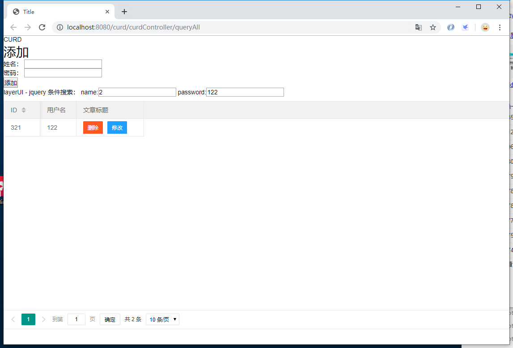

### 模糊搜索 和 分页

> 项目的搭建以在上节完成：[使用 IDEA 中创建 SPRINGBOOT-MYBATIS 的 WEB 项目](https://chanchifeng.com/2019/05/25/springboot-mybatis-demo/)

1.搭建的构成这里不详细讲，详情参考上述文章。

2. CurdController:

```java
import com.chanchifeng.curd.model.SysUser;
import com.chanchifeng.curd.service.SysUserService;
import com.chanchifeng.curd.vo.PageVo;
import org.springframework.stereotype.Controller;
import org.springframework.ui.Model;
import org.springframework.web.bind.annotation.*;

import javax.annotation.Resource;
import java.util.List;

@Controller
@RequestMapping("/curdController")
public class CurdController {

    @Resource
    private SysUserService sysUserService;


    @GetMapping("/queryAll")
    public String queryAll(Model model) {

        List<SysUser> sysUsers = sysUserService.queryAll();
        System.out.println(sysUsers.size() + "!!");

        model.addAttribute("users",sysUsers);

        return "curd/index";
    }

    @RequestMapping("/delete/{userId}")
    public String delete(Model model,@PathVariable("userId") Long userId){

        //删除
        sysUserService.deleteByPrimaryKey(userId);

        return "redirect:/curdController/queryAll";
    }

    @RequestMapping("/queryById/{userId}")
    public String queryById(Model model,@PathVariable("userId") Long userId){

        model.addAttribute("user",sysUserService.selectByPrimaryKey(userId));

        return "curd/update";
    }

    @RequestMapping(value = "/update")
    public String update(SysUser sysUser) {

        System.out.println(sysUser.getSysUserId() + "!!");

        sysUserService.updateByPrimaryKeySelective(sysUser);

        return "redirect:/curdController/queryAll";
    }

    @RequestMapping(value = "/add")
    public String add(SysUser sysUser) {

        System.out.println(sysUser.getSysUserId() + "!!");

        sysUserService.insertSelective(sysUser);

        return "redirect:/curdController/queryAll";
    }


    /* START 模糊查询 & 分页 */

    @RequestMapping(value="/findAllJSON")
    @ResponseBody
    public PageVo<SysUser> findAllJson(SysUser sysUser, @RequestParam("page") int page,@RequestParam("limit") int limit){
        System.out.println("thisss??!");
        PageVo<SysUser> sysUserPageVo = sysUserService.selectAll(sysUser, page, limit);
        return sysUserPageVo;
    }

    /* END 模糊查询 & 分页 */
}
```

3.SysUserMapper:

```java
import com.chanchifeng.curd.model.SysUser;
import org.apache.ibatis.annotations.Param;

import java.util.List;

public interface SysUserMapper {
    /**
     * This method was generated by MyBatis Generator.
     * This method corresponds to the database table sys_user
     *
     * @mbg.generated
     */
    int deleteByPrimaryKey(Long sysUserId);

    /**
     * This method was generated by MyBatis Generator.
     * This method corresponds to the database table sys_user
     *
     * @mbg.generated
     */
    int insert(SysUser record);

    /**
     * This method was generated by MyBatis Generator.
     * This method corresponds to the database table sys_user
     *
     * @mbg.generated
     */
    int insertSelective(SysUser record);

    /**
     * This method was generated by MyBatis Generator.
     * This method corresponds to the database table sys_user
     *
     * @mbg.generated
     */
    SysUser selectByPrimaryKey(Long sysUserId);

    /**
     * This method was generated by MyBatis Generator.
     * This method corresponds to the database table sys_user
     *
     * @mbg.generated
     */
    int updateByPrimaryKeySelective(SysUser record);

    /**
     * This method was generated by MyBatis Generator.
     * This method corresponds to the database table sys_user
     *
     * @mbg.generated
     */
    int updateByPrimaryKey(SysUser record);

    List<SysUser> queryAll();

    List<SysUser> selectAll(@Param("sysUser") SysUser sysUser, @Param("startIndex") int startIndex, @Param("pageSize") int pageSize);

    int count(@Param("sysUser") SysUser sysUser);
}
```

4.SysUserServiceImpl:

```java
import com.chanchifeng.curd.mapper.SysUserMapper;
import com.chanchifeng.curd.model.SysUser;
import com.chanchifeng.curd.service.SysUserService;
import com.chanchifeng.curd.vo.PageVo;
import org.springframework.stereotype.Service;

import javax.annotation.Resource;
import java.util.List;

@Service
public class SysUserServiceImpl implements SysUserService {

    @Resource
    private SysUserMapper sysUserMapper;

    @Override
    public SysUser getById(Long id) {
        return sysUserMapper.selectByPrimaryKey(id);
    }

    /* START CURD */

    @Override
    public List<SysUser> queryAll() {
        return sysUserMapper.queryAll();
    }

    @Override
    public SysUser selectByPrimaryKey(Long sysUserId) {
        return sysUserMapper.selectByPrimaryKey(sysUserId);
    }

    @Override
    public int deleteByPrimaryKey(Long sysUserId) {
        return sysUserMapper.deleteByPrimaryKey(sysUserId);
    }

    @Override
    public int updateByPrimaryKeySelective(SysUser sysUser) {
        return sysUserMapper.updateByPrimaryKeySelective(sysUser);
    }

    @Override
    public int insertSelective(SysUser record) {
        return sysUserMapper.insertSelective(record);
    }
    /* END CURD */

    /* START 模糊搜索 + 分页*/

    @Override
    public PageVo<SysUser> selectAll(SysUser sysUser, int startIndex, int pageSize) {
        int totalNum;
        if(pageSize<=0){
            totalNum = pageSize;
        }else {
            totalNum = sysUserMapper.count(sysUser);
        }
        PageVo<SysUser> pageVo = new PageVo<>(startIndex,pageSize,totalNum);
        pageVo.setItems(sysUserMapper.selectAll(sysUser,pageVo.getStartIndex(),pageSize));
        pageVo.setTotalNum(totalNum);
        return pageVo;
    }

    /* END 模糊搜索 +  分页 */

}
```

5.SysUserService:

```java
import com.chanchifeng.curd.model.SysUser;
import com.chanchifeng.curd.vo.PageVo;
import org.apache.ibatis.annotations.Param;

import java.util.List;

public interface SysUserService {
    SysUser getById(Long id);

    /* START CURD */
    List<SysUser> queryAll();
    SysUser selectByPrimaryKey(Long sysUserId);
    int deleteByPrimaryKey(Long sysUserId);
    int updateByPrimaryKeySelective(SysUser sysUser);
    int insertSelective(SysUser record);
    /* END CURD */

    /* START分页 + 模糊搜索 */

    PageVo<SysUser> selectAll(@Param("sysUser") SysUser sysUser, @Param("startIndex") int startIndex, @Param("pageSize") int pageSize);

    /* END 分页 + 模糊搜索 */
}

```

6.在com.chanchifeng.curd下创建vo包，在其下创建PageVo：

```java
import java.util.List;

public class PageVo<T> {
    private Integer code = 0;   //接口状态码
//    private Integer code = 200;   //接口状态码

    // 当前页
    private Integer currentPage = 1;
    // 每页显示的总条数
    private Integer pageSize = 10;
    // 总条数
    private Integer totalNum;
    // 是否有下一页
    private Integer isMore;
    // 总页数
    private Integer totalPage;
    // 开始索引
    private Integer startIndex;
    // 分页结果
    private List<T> items;

    public PageVo() {
        super();
    }

    public PageVo(Integer currentPage, Integer pageSize, Integer totalNum) {
        super();
        if (currentPage != null && currentPage > 0) {
            this.currentPage = currentPage;
        }
        if (pageSize != null && pageSize > 0) {
            this.pageSize = pageSize;
        }
        this.totalNum = totalNum;
        this.totalPage = (this.totalNum + this.pageSize - 1) / this.pageSize;
        this.startIndex = (this.currentPage - 1) * this.pageSize;
        this.isMore = this.currentPage >= this.totalPage ? 0 : 1;
    }

    public Integer getCurrentPage() {
        return currentPage;
    }

    public void setCurrentPage(Integer currentPage) {
        this.currentPage = currentPage;
    }

    public Integer getPageSize() {
        return pageSize;
    }

    public void setPageSize(Integer pageSize) {
        this.pageSize = pageSize;
    }

    public Integer getTotalNum() {
        return totalNum;
    }

    public void setTotalNum(Integer totalNum) {
        this.totalNum = totalNum;
    }

    public Integer getIsMore() {
        return isMore;
    }

    public void setIsMore(Integer isMore) {
        this.isMore = isMore;
    }

    public Integer getTotalPage() {
        return totalPage;
    }

    public void setTotalPage(Integer totalPage) {
        this.totalPage = totalPage;
    }

    public Integer getStartIndex() {
        return startIndex;
    }

    public void setStartIndex(Integer startIndex) {
        this.startIndex = startIndex;
    }

    public List<T> getItems() {
        return items;
    }

    public void setItems(List<T> items) {
        this.items = items;
    }

    public Integer getCode() {
        return code;
    }

    public void setCode(Integer code) {
        this.code = code;
    }
}
```

7.SysUserMapper.xml:

```xml
<?xml version="1.0" encoding="UTF-8"?>
<!DOCTYPE mapper PUBLIC "-//mybatis.org//DTD Mapper 3.0//EN" "http://mybatis.org/dtd/mybatis-3-mapper.dtd">
<mapper namespace="com.chanchifeng.curd.mapper.SysUserMapper">
  <resultMap id="BaseResultMap" type="com.chanchifeng.curd.model.SysUser">
    <!--
      WARNING - @mbg.generated
      This element is automatically generated by MyBatis Generator, do not modify.
    -->
    <id column="sys_user_id" jdbcType="BIGINT" property="sysUserId" />
    <result column="sys_user_login_name" jdbcType="VARCHAR" property="sysUserLoginName" />
    <result column="sys_user_login_password" jdbcType="VARCHAR" property="sysUserLoginPassword" />
    <result column="sys_user_status" jdbcType="VARCHAR" property="sysUserStatus" />
    <result column="sys_user_is_delete" jdbcType="VARCHAR" property="sysUserIsDelete" />
    <result column="sys_user_register_datetime" jdbcType="TIMESTAMP" property="sysUserRegisterDatetime" />
    <result column="sys_user_register_source" jdbcType="VARCHAR" property="sysUserRegisterSource" />
    <result column="sys_user_type" jdbcType="VARCHAR" property="sysUserType" />
    <result column="sys_user_sex" jdbcType="VARCHAR" property="sysUserSex" />
    <result column="sys_user_is_email_active" jdbcType="VARCHAR" property="sysUserIsEmailActive" />
    <result column="sys_user_is_mobile_active" jdbcType="VARCHAR" property="sysUserIsMobileActive" />
    <result column="sys_user_register_type" jdbcType="VARCHAR" property="sysUserRegisterType" />
    <result column="sys_user_pay_passwrod" jdbcType="VARCHAR" property="sysUserPayPasswrod" />
    <result column="sys_user_icon" jdbcType="VARCHAR" property="sysUserIcon" />
    <result column="sys_user_real_name" jdbcType="VARCHAR" property="sysUserRealName" />
    <result column="sys_user_email" jdbcType="VARCHAR" property="sysUserEmail" />
    <result column="sys_user_mobile" jdbcType="VARCHAR" property="sysUserMobile" />
    <result column="sys_user_weibo_id" jdbcType="VARCHAR" property="sysUserWeiboId" />
    <result column="sys_user_qq_id" jdbcType="VARCHAR" property="sysUserQqId" />
  </resultMap>
  <sql id="Base_Column_List">
    <!--
      WARNING - @mbg.generated
      This element is automatically generated by MyBatis Generator, do not modify.
    -->
    sys_user_id, sys_user_login_name, sys_user_login_password, sys_user_status, sys_user_is_delete, 
    sys_user_register_datetime, sys_user_register_source, sys_user_type, sys_user_sex, 
    sys_user_is_email_active, sys_user_is_mobile_active, sys_user_register_type, sys_user_pay_passwrod, 
    sys_user_icon, sys_user_real_name, sys_user_email, sys_user_mobile, sys_user_weibo_id, 
    sys_user_qq_id
  </sql>

  <select id="queryAll" parameterType="java.lang.Long" resultMap="BaseResultMap">
    <!--
      WARNING - @mbg.generated
      This element is automatically generated by MyBatis Generator, do not modify.
    -->
    select
    <include refid="Base_Column_List" />
    from sys_user
  </select>


  <!-- START 分页 + 模糊搜索-->

  <!-- 全查 分页 模糊-->
  <select id="selectAll" resultMap="BaseResultMap" parameterType="com.chanchifeng.curd.model.SysUser">
    SELECT * FROM sys_user
    <where>
    1=1
      <if test=" sysUser.sysUserLoginName != null and sysUser.sysUserLoginName != '' ">
        <bind name="sysUserLoginName" value=" '%' + sysUser.sysUserLoginName + '%' "></bind>
         AND sys_user_login_name like #{sysUserLoginName}
      </if>
      <if test=" sysUser.sysUserLoginPassword != null and sysUser.sysUserLoginPassword != '' ">
        <bind name="sysUserLoginPassword" value=" '%' + sysUser.sysUserLoginPassword + '%' "></bind>
        AND  sys_user_login_password like #{sysUserLoginPassword}
      </if>
    </where>
    limit #{startIndex},#{pageSize}
  </select>

  <!--统计总数-->
  <select id="count" resultType="int" parameterType="com.chanchifeng.curd.model.SysUser">
    select count(*)
    from sys_user
    <where>
      <if test=" sysUser.sysUserLoginName != null and sysUser.sysUserLoginName != '' ">
        <bind name="sysUserLoginName" value=" '%' + sysUser.sysUserLoginName + '%' "></bind>
        sys_user_login_name like #{sysUserLoginName}
      </if>
    </where>
  </select>

  <!-- END 分页 + 模糊搜索-->


  <select id="selectByPrimaryKey" parameterType="java.lang.Long" resultMap="BaseResultMap">
    <!--
      WARNING - @mbg.generated
      This element is automatically generated by MyBatis Generator, do not modify.
    -->
    select 
    <include refid="Base_Column_List" />
    from sys_user
    where sys_user_id = #{sysUserId,jdbcType=BIGINT}
  </select>
  <delete id="deleteByPrimaryKey" parameterType="java.lang.Long">
    <!--
      WARNING - @mbg.generated
      This element is automatically generated by MyBatis Generator, do not modify.
    -->
    delete from sys_user
    where sys_user_id = #{sysUserId,jdbcType=BIGINT}
  </delete>
  <insert id="insert" parameterType="com.chanchifeng.curd.model.SysUser">
    <!--
      WARNING - @mbg.generated
      This element is automatically generated by MyBatis Generator, do not modify.
    -->
    insert into sys_user (sys_user_id, sys_user_login_name, sys_user_login_password, 
      sys_user_status, sys_user_is_delete, sys_user_register_datetime, 
      sys_user_register_source, sys_user_type, sys_user_sex, 
      sys_user_is_email_active, sys_user_is_mobile_active, 
      sys_user_register_type, sys_user_pay_passwrod, 
      sys_user_icon, sys_user_real_name, sys_user_email, 
      sys_user_mobile, sys_user_weibo_id, sys_user_qq_id
      )
    values (#{sysUserId,jdbcType=BIGINT}, #{sysUserLoginName,jdbcType=VARCHAR}, #{sysUserLoginPassword,jdbcType=VARCHAR}, 
      #{sysUserStatus,jdbcType=VARCHAR}, #{sysUserIsDelete,jdbcType=VARCHAR}, #{sysUserRegisterDatetime,jdbcType=TIMESTAMP}, 
      #{sysUserRegisterSource,jdbcType=VARCHAR}, #{sysUserType,jdbcType=VARCHAR}, #{sysUserSex,jdbcType=VARCHAR}, 
      #{sysUserIsEmailActive,jdbcType=VARCHAR}, #{sysUserIsMobileActive,jdbcType=VARCHAR}, 
      #{sysUserRegisterType,jdbcType=VARCHAR}, #{sysUserPayPasswrod,jdbcType=VARCHAR}, 
      #{sysUserIcon,jdbcType=VARCHAR}, #{sysUserRealName,jdbcType=VARCHAR}, #{sysUserEmail,jdbcType=VARCHAR}, 
      #{sysUserMobile,jdbcType=VARCHAR}, #{sysUserWeiboId,jdbcType=VARCHAR}, #{sysUserQqId,jdbcType=VARCHAR}
      )
  </insert>
  <insert id="insertSelective" parameterType="com.chanchifeng.curd.model.SysUser">
    <!--
      WARNING - @mbg.generated
      This element is automatically generated by MyBatis Generator, do not modify.
    -->
    insert into sys_user
    <trim prefix="(" suffix=")" suffixOverrides=",">
      <if test="sysUserId != null">
        sys_user_id,
      </if>
      <if test="sysUserLoginName != null">
        sys_user_login_name,
      </if>
      <if test="sysUserLoginPassword != null">
        sys_user_login_password,
      </if>
      <if test="sysUserStatus != null">
        sys_user_status,
      </if>
      <if test="sysUserIsDelete != null">
        sys_user_is_delete,
      </if>
      <if test="sysUserRegisterDatetime != null">
        sys_user_register_datetime,
      </if>
      <if test="sysUserRegisterSource != null">
        sys_user_register_source,
      </if>
      <if test="sysUserType != null">
        sys_user_type,
      </if>
      <if test="sysUserSex != null">
        sys_user_sex,
      </if>
      <if test="sysUserIsEmailActive != null">
        sys_user_is_email_active,
      </if>
      <if test="sysUserIsMobileActive != null">
        sys_user_is_mobile_active,
      </if>
      <if test="sysUserRegisterType != null">
        sys_user_register_type,
      </if>
      <if test="sysUserPayPasswrod != null">
        sys_user_pay_passwrod,
      </if>
      <if test="sysUserIcon != null">
        sys_user_icon,
      </if>
      <if test="sysUserRealName != null">
        sys_user_real_name,
      </if>
      <if test="sysUserEmail != null">
        sys_user_email,
      </if>
      <if test="sysUserMobile != null">
        sys_user_mobile,
      </if>
      <if test="sysUserWeiboId != null">
        sys_user_weibo_id,
      </if>
      <if test="sysUserQqId != null">
        sys_user_qq_id,
      </if>
    </trim>
    <trim prefix="values (" suffix=")" suffixOverrides=",">
      <if test="sysUserId != null">
        #{sysUserId,jdbcType=BIGINT},
      </if>
      <if test="sysUserLoginName != null">
        #{sysUserLoginName,jdbcType=VARCHAR},
      </if>
      <if test="sysUserLoginPassword != null">
        #{sysUserLoginPassword,jdbcType=VARCHAR},
      </if>
      <if test="sysUserStatus != null">
        #{sysUserStatus,jdbcType=VARCHAR},
      </if>
      <if test="sysUserIsDelete != null">
        #{sysUserIsDelete,jdbcType=VARCHAR},
      </if>
      <if test="sysUserRegisterDatetime != null">
        #{sysUserRegisterDatetime,jdbcType=TIMESTAMP},
      </if>
      <if test="sysUserRegisterSource != null">
        #{sysUserRegisterSource,jdbcType=VARCHAR},
      </if>
      <if test="sysUserType != null">
        #{sysUserType,jdbcType=VARCHAR},
      </if>
      <if test="sysUserSex != null">
        #{sysUserSex,jdbcType=VARCHAR},
      </if>
      <if test="sysUserIsEmailActive != null">
        #{sysUserIsEmailActive,jdbcType=VARCHAR},
      </if>
      <if test="sysUserIsMobileActive != null">
        #{sysUserIsMobileActive,jdbcType=VARCHAR},
      </if>
      <if test="sysUserRegisterType != null">
        #{sysUserRegisterType,jdbcType=VARCHAR},
      </if>
      <if test="sysUserPayPasswrod != null">
        #{sysUserPayPasswrod,jdbcType=VARCHAR},
      </if>
      <if test="sysUserIcon != null">
        #{sysUserIcon,jdbcType=VARCHAR},
      </if>
      <if test="sysUserRealName != null">
        #{sysUserRealName,jdbcType=VARCHAR},
      </if>
      <if test="sysUserEmail != null">
        #{sysUserEmail,jdbcType=VARCHAR},
      </if>
      <if test="sysUserMobile != null">
        #{sysUserMobile,jdbcType=VARCHAR},
      </if>
      <if test="sysUserWeiboId != null">
        #{sysUserWeiboId,jdbcType=VARCHAR},
      </if>
      <if test="sysUserQqId != null">
        #{sysUserQqId,jdbcType=VARCHAR},
      </if>
    </trim>
  </insert>
  <update id="updateByPrimaryKeySelective" parameterType="com.chanchifeng.curd.model.SysUser">
    <!--
      WARNING - @mbg.generated
      This element is automatically generated by MyBatis Generator, do not modify.
    -->
    update sys_user
    <set>
      <if test="sysUserLoginName != null">
        sys_user_login_name = #{sysUserLoginName,jdbcType=VARCHAR},
      </if>
      <if test="sysUserLoginPassword != null">
        sys_user_login_password = #{sysUserLoginPassword,jdbcType=VARCHAR},
      </if>
      <if test="sysUserStatus != null">
        sys_user_status = #{sysUserStatus,jdbcType=VARCHAR},
      </if>
      <if test="sysUserIsDelete != null">
        sys_user_is_delete = #{sysUserIsDelete,jdbcType=VARCHAR},
      </if>
      <if test="sysUserRegisterDatetime != null">
        sys_user_register_datetime = #{sysUserRegisterDatetime,jdbcType=TIMESTAMP},
      </if>
      <if test="sysUserRegisterSource != null">
        sys_user_register_source = #{sysUserRegisterSource,jdbcType=VARCHAR},
      </if>
      <if test="sysUserType != null">
        sys_user_type = #{sysUserType,jdbcType=VARCHAR},
      </if>
      <if test="sysUserSex != null">
        sys_user_sex = #{sysUserSex,jdbcType=VARCHAR},
      </if>
      <if test="sysUserIsEmailActive != null">
        sys_user_is_email_active = #{sysUserIsEmailActive,jdbcType=VARCHAR},
      </if>
      <if test="sysUserIsMobileActive != null">
        sys_user_is_mobile_active = #{sysUserIsMobileActive,jdbcType=VARCHAR},
      </if>
      <if test="sysUserRegisterType != null">
        sys_user_register_type = #{sysUserRegisterType,jdbcType=VARCHAR},
      </if>
      <if test="sysUserPayPasswrod != null">
        sys_user_pay_passwrod = #{sysUserPayPasswrod,jdbcType=VARCHAR},
      </if>
      <if test="sysUserIcon != null">
        sys_user_icon = #{sysUserIcon,jdbcType=VARCHAR},
      </if>
      <if test="sysUserRealName != null">
        sys_user_real_name = #{sysUserRealName,jdbcType=VARCHAR},
      </if>
      <if test="sysUserEmail != null">
        sys_user_email = #{sysUserEmail,jdbcType=VARCHAR},
      </if>
      <if test="sysUserMobile != null">
        sys_user_mobile = #{sysUserMobile,jdbcType=VARCHAR},
      </if>
      <if test="sysUserWeiboId != null">
        sys_user_weibo_id = #{sysUserWeiboId,jdbcType=VARCHAR},
      </if>
      <if test="sysUserQqId != null">
        sys_user_qq_id = #{sysUserQqId,jdbcType=VARCHAR},
      </if>
    </set>
    where sys_user_id = #{sysUserId,jdbcType=BIGINT}
  </update>
  <update id="updateByPrimaryKey" parameterType="com.chanchifeng.curd.model.SysUser">
    <!--
      WARNING - @mbg.generated
      This element is automatically generated by MyBatis Generator, do not modify.
    -->
    update sys_user
    set sys_user_login_name = #{sysUserLoginName,jdbcType=VARCHAR},
      sys_user_login_password = #{sysUserLoginPassword,jdbcType=VARCHAR},
      sys_user_status = #{sysUserStatus,jdbcType=VARCHAR},
      sys_user_is_delete = #{sysUserIsDelete,jdbcType=VARCHAR},
      sys_user_register_datetime = #{sysUserRegisterDatetime,jdbcType=TIMESTAMP},
      sys_user_register_source = #{sysUserRegisterSource,jdbcType=VARCHAR},
      sys_user_type = #{sysUserType,jdbcType=VARCHAR},
      sys_user_sex = #{sysUserSex,jdbcType=VARCHAR},
      sys_user_is_email_active = #{sysUserIsEmailActive,jdbcType=VARCHAR},
      sys_user_is_mobile_active = #{sysUserIsMobileActive,jdbcType=VARCHAR},
      sys_user_register_type = #{sysUserRegisterType,jdbcType=VARCHAR},
      sys_user_pay_passwrod = #{sysUserPayPasswrod,jdbcType=VARCHAR},
      sys_user_icon = #{sysUserIcon,jdbcType=VARCHAR},
      sys_user_real_name = #{sysUserRealName,jdbcType=VARCHAR},
      sys_user_email = #{sysUserEmail,jdbcType=VARCHAR},
      sys_user_mobile = #{sysUserMobile,jdbcType=VARCHAR},
      sys_user_weibo_id = #{sysUserWeiboId,jdbcType=VARCHAR},
      sys_user_qq_id = #{sysUserQqId,jdbcType=VARCHAR}
    where sys_user_id = #{sysUserId,jdbcType=BIGINT}
  </update>
</mapper>
```

8.修改templates/curd/index.html:

```html
<!DOCTYPE html>
<html lang="en" xmlns:th="http://www.w3.org/1999/xhtml">
<head>
    <meta charset="UTF-8">
    <title>Title</title>
    <link rel="stylesheet" th:href="@{/common/layerui/css/layui.css}" media="all">
</head>
<body>
CURD
<br>

<h1>添加</h1>

<form action="add" method="post">
    <p>
        <label>姓名：</label>
        <input type="text" name="sysUserLoginName" id="sysUserLoginName"/>
    </p>
    <p>
        <label>密码：</label>
        <input type="password" name="sysUserLoginPassword" id="sysUserLoginPassword"/>
    </p>


    <p>
        <input type="submit" value="添加">
    </p>
</form>

<!--<table border="1">-->
<!--    <tr>-->
<!--        <th>ID</th>-->
<!--        <th>姓名</th>-->
<!--        <th>密码</th>-->
<!--        <th>操作</th>-->
<!--    </tr>-->


<!--    <tr th:each="user : ${users}">-->
<!--        <td th:text="${user.sysUserId}"></td>-->
<!--        <td th:text="${user.sysUserLoginName}"></td>-->
<!--        <td th:text="${user.sysUserLoginPassword}"></td>-->
<!--        <td>-->
<!--            <a th:href="@{delete/} + ${user.sysUserId}">删除</a>-->
<!--            <a th:href="@{queryById/} + ${user.sysUserId}">修改</a>-->
<!--        </td>-->
<!--    </tr>-->

<!--</table>-->

layerUI - jquery

条件搜索：
name:<input type="text" id="sysUserLoginNameSearch" value="2">
password:<input type="text" id="sysUserLoginPasswordSearch" value="122">

<table id="demo" lay-filter="test"></table>

<script th:src="@{/js/jquery-3.4.1.min.js}"></script><!-- 你必须先引入jQuery1.8或以上版本 -->
<script th:src="@{/common/layerui/layui.js}"></script>

<script th:inline="none">

    layui.use('table', function(){
        var table = layui.table;

        //第一个实例
        table.render({
            elem: '#demo'
            ,height:510
            ,url: 'findAllJSON' //数据接口
            ,where:{
                sysUserLoginName:$("#sysUserLoginNameSearch").val()
                ,sysUserLoginPassword:$("#sysUserLoginPasswordSearch").val()
            }
            ,response: {
                countName:'totalNum'
                ,dataName: 'items'
                ,statusName: 'code'
            }
            ,page: true //开启分页
            ,limit: 10
            ,cols: [[ //表头
                {field: 'sysUserLoginName', title: 'ID', width:80, sort: true, fixed: 'left'}
                ,{field: 'sysUserLoginPassword', title: '用户名', width:80}

                ,{field:'title', title: '文章标题', width: 150
                    ,templet: function(d){
                        return '<a class="layui-btn layui-btn-sm layui-btn-danger" href="delete/' + d.sysUserId + '">删除</a>' +
                            '<a class="layui-btn layui-btn-sm layui-btn-normal" href="queryById/' + d.sysUserId + '">修改</a>'
                    }
                }
            ]]
        });

    });

</script>
</body>
</html>
```

9.在浏览器中输入<http://localhost:8080/curd/curdController/queryAll>，测试功能模块，效果图如下：



### 上传文件

a.在controller下创建UploadController：

```java
import org.springframework.stereotype.Controller;
import org.springframework.web.bind.annotation.*;
import org.springframework.web.multipart.MultipartFile;

import java.io.File;
import java.io.IOException;

@Controller
@RequestMapping("/uploadController")
public class UploadController {

    @GetMapping("/uploadPage")
    public String upload() {
        return "file/index";
    }

    @PostMapping("/upload")
    @ResponseBody
    public String upload(@RequestParam("file") MultipartFile file) {
        if (file.isEmpty()) {
            return "上传失败，请选择文件";
        }

        String fileName = file.getOriginalFilename();
        String filePath = "D:/";
        File dest = new File(filePath + fileName);
        try {
            file.transferTo(dest);
            System.out.println("上传成功");
            return "上传成功";
        } catch (IOException e) {
            System.err.println(e.toString());
        }
        return "上传失败！";
    }
}
```

b.在templates下创建file文件夹，在file文件夹内创建index.html：

```html
<!DOCTYPE html>
<html>
<head>
    <title>Title</title>
</head>
<body>
<!-- 注意！表单必须添加 enctype 属性，值为"multipart/form-data" -->
<form action="upload" method="post" enctype="multipart/form-data">
    <input type="file" name="file" />
    <input type="submit" value="上传"/>
</form>
</body>
</html>
```

> github：[SpringBoot-MyBatis/curd](https://github.com/porschan/SpringBoot-MyBatis)