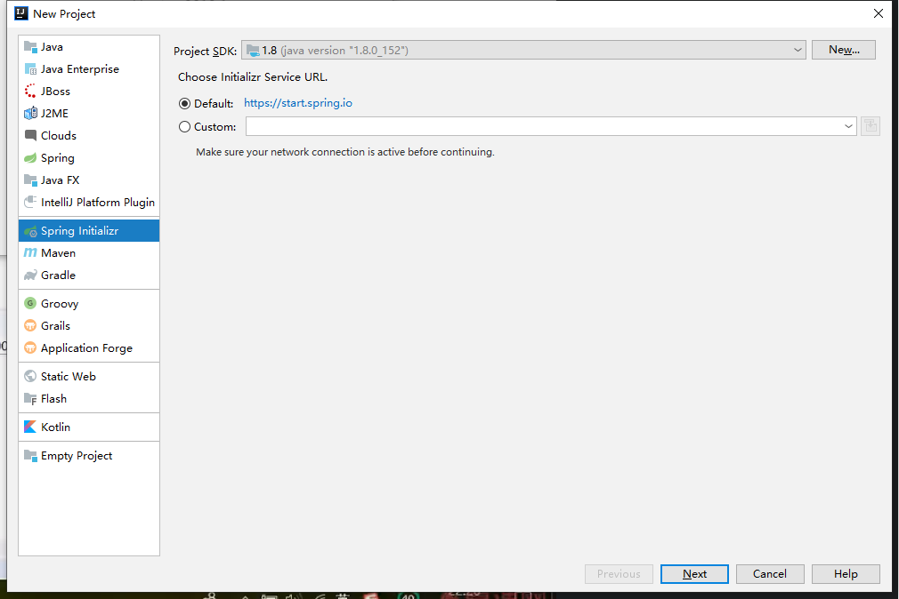
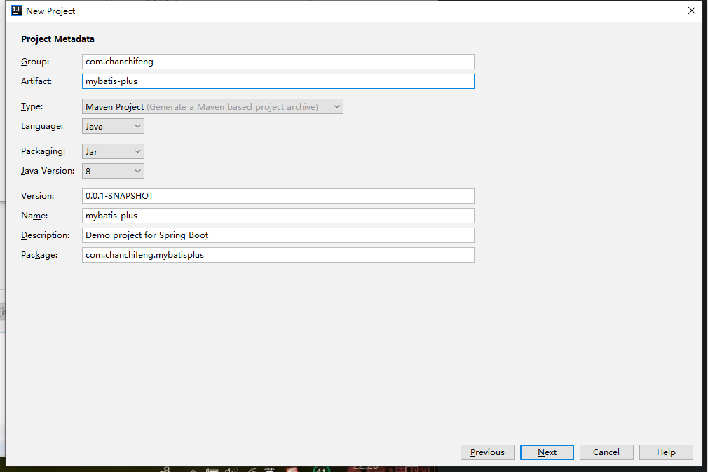
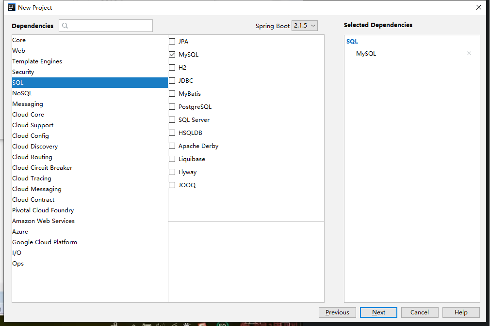
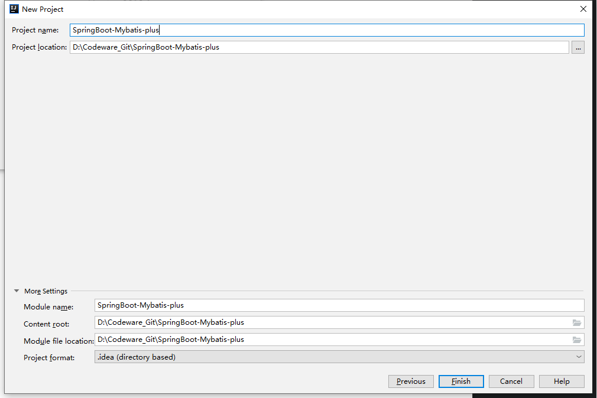
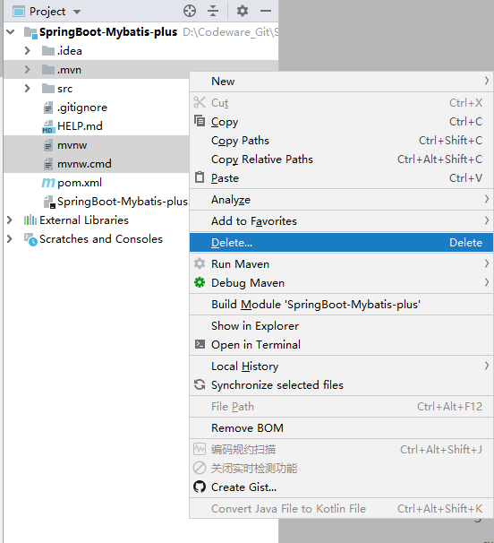

> 需要提前在 IDEA 中安装好 lombok 插件，参考https://chanchifeng.com/2019/02/24/idea-plug/。

1.新建一个空项目。

2.选择Spring Initializr,操作如下图所示：



3.在Group 和Atrifact 分别填写com.chanchifeng和mybatis-plus，如下图所示：



4.选择下图需要的依赖，如下图所示：



5.在Project name和Project location中分别填写SpringBoot-Mybatis-plus和对于的项目路径，如下图所示：



6.删除maven自动生成的文件，如下图所示：



7.项目测试项目中的整体结构，请自行创建包如下图所示：


8.MybatisPlusConfig：

```java
import com.baomidou.mybatisplus.extension.plugins.PaginationInterceptor;
import org.springframework.context.annotation.Bean;
import org.springframework.context.annotation.Configuration;

@Configuration
public class MybatisPlusConfig {

    @Bean
    public PaginationInterceptor paginationInterceptor(){
        return new PaginationInterceptor();
    }

}
```

9.UserMapper:

```java
import com.baomidou.mybatisplus.core.conditions.Wrapper;
import com.baomidou.mybatisplus.core.mapper.BaseMapper;
import com.baomidou.mybatisplus.core.metadata.IPage;
import com.baomidou.mybatisplus.core.toolkit.Constants;
import com.baomidou.mybatisplus.extension.plugins.pagination.Page;
import com.chanchifeng.mybatisplus.entity.User;
import org.apache.ibatis.annotations.Param;

import java.util.List;

public interface UserMapper extends BaseMapper<User> {

//    @Select("select * from user ${ew.customSqlSegment}")
    List<User> selectAll(@Param(Constants.WRAPPER) Wrapper<User> wrapper);

    IPage<User> selectUserPage(Page<User> page,@Param(Constants.WRAPPER) Wrapper<User> wrapper);
}
```

10.User:

```java
import com.baomidou.mybatisplus.extension.activerecord.Model;
import lombok.Data;
import lombok.EqualsAndHashCode;

import java.time.LocalDateTime;

@Data
//@TableName("mp_user")
@EqualsAndHashCode(callSuper = false)
public class User extends Model<User> {


//    @TableId
//    @TableId(type= IdType.AUTO)
    private Long id;

//    @TableField("name")
//    @TableField(condition = SqlCondition.LIKE)
    private String name;
    private Integer age;
    private String email;
    private Long managerId;
    private LocalDateTime createTime;

    //备注，不在表中
    /**
     * 不进行序列号
     * 1.private transient String remark;
     *
     * 2.private static String remark;
     *
     * 3.@TableField(exist = false)
     */

//    @TableField(exist = false)
//    private String remark;

}
```

11.UserServiceImpl:

```java
import com.baomidou.mybatisplus.extension.service.impl.ServiceImpl;
import com.chanchifeng.mybatisplus.dao.UserMapper;
import com.chanchifeng.mybatisplus.entity.User;
import com.chanchifeng.mybatisplus.service.UserService;
import org.springframework.stereotype.Service;

@Service
public class UserServiceImpl extends ServiceImpl<UserMapper, User> implements UserService {

}
```

12.UserService:

```java
import com.baomidou.mybatisplus.extension.service.IService;
import com.chanchifeng.mybatisplus.entity.User;

public interface UserService extends IService<User> {
}
```

13.MybatisPlusApplication:

```java
import org.mybatis.spring.annotation.MapperScan;
import org.springframework.boot.SpringApplication;
import org.springframework.boot.autoconfigure.SpringBootApplication;

@SpringBootApplication
@MapperScan("com.chanchifeng.mybatisplus.dao")
public class MybatisPlusApplication {

    public static void main(String[] args) {
        SpringApplication.run(MybatisPlusApplication.class, args);
    }

}
```

14.UserMapper.xml:

```java
<?xml version="1.0" encoding="UTF-8"?>
<!DOCTYPE mapper PUBLIC "-//mybatis.org//DTD Mapper 3.0//EN" "http://mybatis.org/dtd/mybatis-3-mapper.dtd">
<mapper namespace="com.chanchifeng.mybatisplus.dao.UserMapper">

    <select id="selectAll" resultType="com.chanchifeng.mybatisplus.entity.User">
        select * from user ${ew.customSqlSegment}
    </select>


    <select id="selectUserPage" resultType="com.chanchifeng.mybatisplus.entity.User">
        select * from user ${ew.customSqlSegment}
    </select>

</mapper>
```

15.application.yml:

```yml
spring:
  datasource:
    driver-class-name: com.mysql.cj.jdbc.Driver
    url: jdbc:mysql://localhost:3306/mp?useSSL=false&serverTimezone=GMT%2B8
    username: root
    password: 1qaz2wsx

logging:
  level:
    root: warn
    com.chanchifeng.mybatisplus.dao: trace
  pattern:
    console: '%p%m%n'

mybatis-plus:
  mapper-locations: classpath:mapper/*.xml
#  global-config:
#    db-config:
#      id-type: UUID
#  config-location: classpath*:mybatis-config.xml
#  type-aliases-package: com.chanchifeng.mybatisplus.entity
#  configuration:
#    map-underscore-to-camel-case: true
```

16.mybatis-config.xml

```xml
<?xml version="1.0" encoding="UTF-8"?>
<!DOCTYPE mapper PUBLIC "-//mybatis.org//DTD Mapper 3.0//EN" "http://mybatis.org/dtd/mybatis-3-mapper.dtd">
<mapper namespace="com.chanchifeng.mybatisplus.dao.UserMapper">

    <select id="selectAll" resultType="com.chanchifeng.mybatisplus.entity.User">
        select * from user ${ew.customSqlSegment}
    </select>


    <select id="selectUserPage" resultType="com.chanchifeng.mybatisplus.entity.User">
        select * from user ${ew.customSqlSegment}
    </select>

</mapper>
```

17.MybatisPlusApplicationTests:

```java
import com.baomidou.mybatisplus.core.conditions.query.LambdaQueryWrapper;
import com.baomidou.mybatisplus.core.conditions.query.QueryWrapper;
import com.baomidou.mybatisplus.core.conditions.update.LambdaUpdateWrapper;
import com.baomidou.mybatisplus.core.conditions.update.UpdateWrapper;
import com.baomidou.mybatisplus.core.metadata.IPage;
import com.baomidou.mybatisplus.core.toolkit.StringUtils;
import com.baomidou.mybatisplus.core.toolkit.Wrappers;
import com.baomidou.mybatisplus.extension.plugins.pagination.Page;
import com.baomidou.mybatisplus.extension.service.additional.query.impl.LambdaQueryChainWrapper;
import com.baomidou.mybatisplus.extension.service.additional.update.impl.LambdaUpdateChainWrapper;
import com.chanchifeng.mybatisplus.dao.UserMapper;
import com.chanchifeng.mybatisplus.entity.User;
import com.chanchifeng.mybatisplus.service.UserService;
import org.junit.Assert;
import org.junit.Test;
import org.junit.runner.RunWith;
import org.springframework.beans.factory.annotation.Autowired;
import org.springframework.boot.test.context.SpringBootTest;
import org.springframework.test.context.junit4.SpringRunner;

import javax.annotation.Resource;
import java.time.LocalDateTime;
import java.util.Arrays;
import java.util.HashMap;
import java.util.List;
import java.util.Map;

@RunWith(SpringRunner.class)
@SpringBootTest
public class MybatisPlusApplicationTests {

    @Resource
    private UserMapper userMapper;

    @Test
    public void contextLoads() {

//        User user = userMapper.selectById(53);
//        System.out.println(user.toString());

        List<User> users = userMapper.selectList(null);
        Assert.assertEquals(5,users.size());
        users.forEach(System.out::println);

    }

    @Test
    public void insertTest(){
        User user = new User();
        user.setName("刘敏天4");
        user.setAge(31);
        user.setManagerId(85L);
        user.setCreateTime(LocalDateTime.now());
//        user.setRemark("remark message");


        int insert = userMapper.insert(user);
        System.out.println(insert);
    }

    @Test
    public void selectByIdTest(){
        User user = userMapper.selectById(1132958165867913218L);
        System.out.println(user.toString());
    }

    @Test
    public void selectByIdsTest(){
        List<Long> longs = Arrays.asList(1132958165867913218L, 1132952636261126146L, 85L);
        List<User> users = userMapper.selectBatchIds(longs);
        users.forEach(System.out::println);
    }

    @Test
    public void selectByMapTest(){
        HashMap<String, Object> mapList = new HashMap<>();

        mapList.put("age",31);
        mapList.put("name","张雨琪");
        List<User> users = userMapper.selectByMap(mapList);
        users.forEach(System.out::println);
    }

    @Test
    public void selectByWrapper(){
        //第一种方法
        QueryWrapper<User> queryWrapper = new QueryWrapper<>();

        //第二种方法
        /*QueryWrapper<User> query = Wrappers.<User>query();*/

        queryWrapper.like("name","雨").lt("age",40);

        List<User> users = userMapper.selectList(queryWrapper);
        users.forEach(System.out::println);

    }

    @Test
    public void selectByWrapper2(){
        //第一种方法
        QueryWrapper<User> queryWrapper = new QueryWrapper<>();

        //第二种方法
        /*QueryWrapper<User> query = Wrappers.<User>query();*/

//        queryWrapper.like("name","雨").between("age",20,40).isNotNull("email");
        queryWrapper.like("name","雨").between("age",20,40).isNotNull("email");

        List<User> users = userMapper.selectList(queryWrapper);
        users.forEach(System.out::println);

    }

    @Test
    public void selectByWrapper3(){
        //第一种方法
        QueryWrapper<User> queryWrapper = new QueryWrapper<>();

        //第二种方法
        /*QueryWrapper<User> query = Wrappers.<User>query();*/

        queryWrapper.likeRight("name","王").or().ge("age",25).orderByDesc("age").orderByAsc("id");

        List<User> users = userMapper.selectList(queryWrapper);
        users.forEach(System.out::println);

    }

    @Test
    public void selectByWrapper4(){
        //第一种方法
        QueryWrapper<User> queryWrapper = new QueryWrapper<>();

        //第二种方法
        /*QueryWrapper<User> query = Wrappers.<User>query();*/

        queryWrapper.apply("date_format(create_time,'%Y-%m-%d') = {0}","2019-05-27")
            .inSql("manager_id","SELECT id from user where name like '王%'");

        List<User> users = userMapper.selectList(queryWrapper);
        users.forEach(System.out::println);

    }


    @Test
    public void selectByWrapper5(){
        //第一种方法
        QueryWrapper<User> queryWrapper = new QueryWrapper<>();

        //第二种方法
        /*QueryWrapper<User> query = Wrappers.<User>query();*/

        queryWrapper.likeRight("name","王").and(wq -> wq.lt("age",40).or().isNotNull("email"));

        List<User> users = userMapper.selectList(queryWrapper);
        users.forEach(System.out::println);

    }

    @Test
    public void selectByWrapper6(){
        //第一种方法
        QueryWrapper<User> queryWrapper = new QueryWrapper<>();

        //第二种方法
        /*QueryWrapper<User> query = Wrappers.<User>query();*/

        queryWrapper.likeRight("name","王").or(wq -> wq.lt("age",40).gt("age",20).isNotNull("email"));

        List<User> users = userMapper.selectList(queryWrapper);
        users.forEach(System.out::println);

    }

    @Test
    public void selectByWrapper7(){
        //第一种方法
        QueryWrapper<User> queryWrapper = new QueryWrapper<>();

        //第二种方法
        /*QueryWrapper<User> query = Wrappers.<User>query();*/

        queryWrapper.nested(wq -> wq.lt("age",40).or().isNotNull("email")).likeRight("name","王");

        List<User> users = userMapper.selectList(queryWrapper);
        users.forEach(System.out::println);

    }

    @Test
    public void selectByWrapper8(){
        //第一种方法
        QueryWrapper<User> queryWrapper = new QueryWrapper<>();

        //第二种方法
        /*QueryWrapper<User> query = Wrappers.<User>query();*/

        queryWrapper.in("age",Arrays.asList(30,31,32,34,35));

        List<User> users = userMapper.selectList(queryWrapper);
        users.forEach(System.out::println);

    }

    @Test
    public void selectByWrapper9(){
        //第一种方法
        QueryWrapper<User> queryWrapper = new QueryWrapper<>();

        //第二种方法
        /*QueryWrapper<User> query = Wrappers.<User>query();*/

        queryWrapper.last("limit 1");

        List<User> users = userMapper.selectList(queryWrapper);
        users.forEach(System.out::println);

    }

    @Test
    public void selectByWrapper11(){
        //第一种方法
        QueryWrapper<User> queryWrapper = new QueryWrapper<>();

        //第二种方法
        /*QueryWrapper<User> query = Wrappers.<User>query();*/

        queryWrapper.select("id","name").like("name","雨").lt("age",40);

        List<User> users = userMapper.selectList(queryWrapper);
        users.forEach(System.out::println);

    }

    @Test
    public void selectByWrapper12(){
        //第一种方法
        QueryWrapper<User> queryWrapper = new QueryWrapper<>();

        //第二种方法
        /*QueryWrapper<User> query = Wrappers.<User>query();*/

        queryWrapper.select(User.class,info -> !info.getColumn().equals("create_time") && !info.getColumn().equals("manager_id")).like("name","雨").lt("age",40);

        List<User> users = userMapper.selectList(queryWrapper);
        users.forEach(System.out::println);

    }

    private void condition(String name,String email){

        //第一种方法
        QueryWrapper<User> queryWrapper = new QueryWrapper<>();

        //第二种方法
        /*QueryWrapper<User> query = Wrappers.<User>query();*/

        /* old */
//        if(StringUtils.isNotEmpty(name)){
//            queryWrapper.like("name",name);
//        }
//
//        if(StringUtils.isNotEmpty(email)){
//            queryWrapper.like("email",email);
//        }

        /* new */
        queryWrapper.like(StringUtils.isNotEmpty(name),"name",name)
                .like(StringUtils.isNotEmpty(email),"email",email);

        List<User> users = userMapper.selectList(queryWrapper);
        users.forEach(System.out::println);
    }

    @Test
    public void conditionTest(){
        String name = "";
        String email = "x";
        condition(name,email);
    }

    @Test
    public void selectByWrapper13(){
        User user = new User();
        user.setName("刘红雨");
        user.setAge(32);

        //第一种方法
        QueryWrapper<User> queryWrapper = new QueryWrapper<User>(user);

        //第二种方法
        /*QueryWrapper<User> query = Wrappers.<User>query();*/


        List<User> users = userMapper.selectList(queryWrapper);
        users.forEach(System.out::println);

    }

    @Test
    public void selectByWrapper14(){

        //第一种方法
        QueryWrapper<User> queryWrapper = new QueryWrapper<>();

        //第二种方法
        /*QueryWrapper<User> query = Wrappers.<User>query();*/

        Map<String, Object> params = new HashMap<>();
        params.put("name","王天风");
        params.put("age",null);

//        queryWrapper.allEq(params);
//        queryWrapper.allEq(params,false);

        queryWrapper.allEq((k,v) -> !k.equals("name"),params);

        List<User> users = userMapper.selectList(queryWrapper);
        users.forEach(System.out::println);

    }

    @Test
    public void selectByWrapper15(){

        //第一种方法
        QueryWrapper<User> queryWrapper = new QueryWrapper<>();

        //第二种方法
        /*QueryWrapper<User> query = Wrappers.<User>query();*/

        queryWrapper.select("id","name").like("name","王").lt("age",40);

        List<Map<String, Object>> maps = userMapper.selectMaps(queryWrapper);
        maps.forEach(System.out::println);

    }

    @Test
    public void selectByWrapper16(){

        //第一种方法
        QueryWrapper<User> queryWrapper = new QueryWrapper<>();

        //第二种方法
        /*QueryWrapper<User> query = Wrappers.<User>query();*/

        queryWrapper
                .select("avg(age) avg_age","min(age) min_age","max(age) max_age")
                .groupBy("manager_id").having("sum(age)<{0}",500);

        List<Map<String, Object>> maps = userMapper.selectMaps(queryWrapper);
        maps.forEach(System.out::println);

    }

    @Test
    public void selectByWrapper17(){

        //第一种方法
        QueryWrapper<User> queryWrapper = new QueryWrapper<>();

        //第二种方法
        /*QueryWrapper<User> query = Wrappers.<User>query();*/

        queryWrapper.select("id","name").like("name","王").lt("age",40);

        List<Object> objects = userMapper.selectObjs(queryWrapper);
        objects.forEach(System.out::println);

    }

    @Test
    public void selectByWrapper18(){

        //第一种方法
        QueryWrapper<User> queryWrapper = new QueryWrapper<>();

        //第二种方法
        /*QueryWrapper<User> query = Wrappers.<User>query();*/

        queryWrapper.like("name","王").lt("age",40);

        Integer integer = userMapper.selectCount(queryWrapper);
        System.out.println(integer);

    }

    @Test
    public void selectByWrapper19(){

        //第一种方法
        QueryWrapper<User> queryWrapper = new QueryWrapper<>();

        //第二种方法
        /*QueryWrapper<User> query = Wrappers.<User>query();*/

        queryWrapper.like("name","王").lt("age",40);

        User user = userMapper.selectOne(queryWrapper);
        System.out.println(user);

    }

    @Test
    public void selectByWrapper20(){

        /* 第一种 */
        LambdaQueryWrapper<User> lambda = new QueryWrapper<User>().lambda();

        /* 第二种 */
        LambdaQueryWrapper<User> userLambdaQueryWrapper = new LambdaQueryWrapper<>();

        /* 第三种*/
        LambdaQueryWrapper<User> userLambdaQueryWrapper1 = Wrappers.<User>lambdaQuery();

        userLambdaQueryWrapper1.like(User::getName, "王").lt(User::getAge, 40);

        List<User> users = userMapper.selectList(userLambdaQueryWrapper1);

        users.forEach(System.out::println);

    }

    @Test
    public void selectByWrapper21(){

        /* 第一种 */
        LambdaQueryWrapper<User> lambda = new QueryWrapper<User>().lambda();

        /* 第二种 */
        LambdaQueryWrapper<User> userLambdaQueryWrapper = new LambdaQueryWrapper<>();

        /* 第三种*/
        LambdaQueryWrapper<User> userLambdaQueryWrapper1 = Wrappers.<User>lambdaQuery();

        userLambdaQueryWrapper1.likeRight(User::getName,"王")
                .and(lqw -> lqw.lt(User::getAge,40).or().isNotNull(User::getEmail));

        List<User> users = userMapper.selectList(userLambdaQueryWrapper1);

        users.forEach(System.out::println);

    }

    @Test
    public void selectByWrapper22(){

        /* 第一种 */
        LambdaQueryWrapper<User> lambda = new QueryWrapper<User>().lambda();

        /* 第二种 */
        LambdaQueryWrapper<User> userLambdaQueryWrapper = new LambdaQueryWrapper<>();

        /* 第三种*/
        LambdaQueryWrapper<User> userLambdaQueryWrapper1 = Wrappers.<User>lambdaQuery();

        List<User> users = new LambdaQueryChainWrapper<User>(userMapper)
                .like(User::getName, "王").ge(User::getAge, 40).list();

//        userLambdaQueryWrapper1.likeRight(User::getName,"王")
//                .and(lqw -> lqw.lt(User::getAge,40).or().isNotNull(User::getEmail));
//
//        List<User> users = userMapper.selectList(userLambdaQueryWrapper1);

        users.forEach(System.out::println);

    }

    @Test
    public void selectByWrapper23(){

        /* 第三种*/
        LambdaQueryWrapper<User> userLambdaQueryWrapper1 = Wrappers.<User>lambdaQuery();

        userLambdaQueryWrapper1.likeRight(User::getName,"王")
                .and(lqw -> lqw.lt(User::getAge,40).or().isNotNull(User::getEmail));

        List<User> users = userMapper.selectAll(userLambdaQueryWrapper1);

        users.forEach(System.out::println);

    }

    @Test
    public void selectByWrapper24(){

        //第一种方法
        QueryWrapper<User> queryWrapper = new QueryWrapper<>();
        queryWrapper.ge("age",26);

        Page<User> userPage = new Page<>(1, 2,false);
//
//        IPage<User> userIPage = userMapper.selectPage(userPage, queryWrapper);

//        userIPage.getRecords().forEach(System.out::println);
//
//        System.out.println(userIPage.getTotal());

        IPage<Map<String, Object>> mapIPage = userMapper.selectMapsPage(userPage, queryWrapper);

        List<Map<String, Object>> records = mapIPage.getRecords();
        records.forEach(System.out::println);

    }

    @Test
    public void selectByWrapper25(){

        //第一种方法
        QueryWrapper<User> queryWrapper = new QueryWrapper<>();
        queryWrapper.ge("age",26);

        Page<User> userPage = new Page<>(1, 2,false);

        IPage<User> userIPage = userMapper.selectUserPage(userPage, queryWrapper);

        List<User> records = userIPage.getRecords();
        records.forEach(System.out::println);

    }

    @Test
    public void selectByWrapper26(){
        User user = new User();
        user.setId(1132952636261126146L);
        user.setAge(26);
        user.setEmail("wtf2@baomidou.com");
        int i = userMapper.updateById(user);
        System.out.println(i);
    }

    @Test
    public void selectByWrapper27(){
        UpdateWrapper<User> updateWrapper = new UpdateWrapper<>();

        updateWrapper.eq("name", "李艺伟").eq("age", 28);

        User user = new User();
        user.setEmail("lyw2019@baomidou.com");
        user.setAge(29);
        user.setCreateTime(null);

        userMapper.update(user,updateWrapper);
    }

    @Test
    public void selectByWrapper28(){
        UpdateWrapper<User> updateWrapper = new UpdateWrapper<>();

        updateWrapper.eq("name", "李艺伟").eq("age", 30).set("age",31).set("create_time",null);
//
//        User user = new User();
//        user.setEmail("lyw2019@baomidou.com");
//        user.setAge(29);
//        user.setCreateTime(null);

        userMapper.update(null,updateWrapper);
    }

    @Test
    public void selectByWrapper29(){

        LambdaUpdateWrapper<User> userLambdaUpdateWrapper = Wrappers.<User>lambdaUpdate();

        userLambdaUpdateWrapper.eq(User::getName,"李艺伟").eq(User::getAge,30).set(User::getAge,32).set(User::getCreateTime,LocalDateTime.now());

//        UpdateWrapper<User> updateWrapper = new UpdateWrapper<>();
//
//        updateWrapper.eq("name", "李艺伟").eq("age", 30).set("age",31).set("create_time",null);


        userMapper.update(null,userLambdaUpdateWrapper);
    }

    @Test
    public void selectByWrapper30(){
        boolean update = new LambdaUpdateChainWrapper<>(userMapper).eq(User::getName, "李艺伟").eq(User::getAge, 32).set(User::getAge, 33).set(User::getCreateTime, LocalDateTime.now()).update();

        System.out.println(update);

    }

    @Test
    public void selectByWrapper31(){
        int i = userMapper.deleteById(1132958165867913218L);
        System.out.println("i:" + i);

    }

    @Test
    public void selectByWrapper32(){
        HashMap<String, Object> objectObjectHashMap = new HashMap<>();
        objectObjectHashMap.put("name","刘敏天3");
        objectObjectHashMap.put("age","70");
        int i = userMapper.deleteByMap(objectObjectHashMap);
        System.out.println(i);
    }

    @Test
    public void selectByWrapper33(){
        int i = userMapper.deleteBatchIds(Arrays.asList(1132957739118436353L, 1132957155606843394L, 1132956411579236353L));
        System.out.println("i:" + i);
    }

    @Test
    public void selectByWrapper34(){

        LambdaQueryWrapper<User> userLambdaQueryWrapper = Wrappers.<User>lambdaQuery();

        userLambdaQueryWrapper.eq(User::getAge,70);

        int delete = userMapper.delete(userLambdaQueryWrapper);

        System.out.println("i:" + delete);
    }

    @Test
    public void selectByWrapper35(){
        /* AR */

        User user = new User();
        user.setName("张超吖");
        user.setAge(25);
        user.setEmail("lm@baomidou.com");
        user.setManagerId(1132952636261126146L);
        boolean insert = user.insert();
        System.out.println(insert);

    }

    @Test
    public void selectByWrapper36(){
        User user = new User();
        User user1 = user.selectById(1133173268525596674L);
        System.out.println(user == user1);
        System.out.println(user1);
    }

    @Test
    public void selectByWrapper37(){
        User user = new User();
        user.setId(1133173268525596674L);
        User user1 = user.selectById();
        System.out.println(user == user1);
        System.out.println(user1);
    }

    @Test
    public void selectByWrapper38(){
        User user = new User();
        user.setId(1133173268525596674L);
        user.setName("wodetian");
        boolean b = user.updateById();
        System.out.println(b);
    }

    @Test
    public void selectByWrapper39(){
        User user = new User();
//        user.setId(1133173268525596674L);
        user.setName("wodetian");
        boolean b = user.insertOrUpdate();
        System.out.println(b);
    }

    @Autowired
    private UserService userService;

    @Test
    public void getOneTest(){
        User one = userService.getOne(Wrappers.<User>lambdaQuery().ge(User::getAge, 25),false);
        System.out.println(one);
    }

    @Test
    public void Batch(){
        User user1 = new User();
        user1.setName("tomcat1");
        user1.setAge(28);

        User user2 = new User();
        user2.setName("tomcat22");
        user2.setId(1133191116702490625L);
        user2.setAge(29);

        List<User> users = Arrays.asList(user1, user2);
        boolean b = userService.saveOrUpdateBatch(users);
        System.out.println(b);
    }

    @Test
    public void chainTest(){
        List<User> userList = userService.lambdaQuery().gt(User::getAge, 25).like(User::getName, "雨").list();
        userList.forEach(System.out::println);
    }

    @Test
    public void chainTest1(){
        boolean update = userService.lambdaUpdate().eq(User::getAge, 25).set(User::getAge, 26).update();
        System.out.println(update);
    }

    @Test
    public void chainTest2(){
        boolean remove = userService.lambdaUpdate().eq(User::getAge, 28).remove();
        System.out.println(remove);
    }
}

```

18.pom.xml:

```xml
<?xml version="1.0" encoding="UTF-8"?>
<project xmlns="http://maven.apache.org/POM/4.0.0" xmlns:xsi="http://www.w3.org/2001/XMLSchema-instance"
         xsi:schemaLocation="http://maven.apache.org/POM/4.0.0 http://maven.apache.org/xsd/maven-4.0.0.xsd">
    <modelVersion>4.0.0</modelVersion>
    <parent>
        <groupId>org.springframework.boot</groupId>
        <artifactId>spring-boot-starter-parent</artifactId>
        <version>2.1.5.RELEASE</version>
        <relativePath/> <!-- lookup parent from repository -->
    </parent>
    <groupId>com.chanchifeng</groupId>
    <artifactId>mybatis-plus</artifactId>
    <version>0.0.1-SNAPSHOT</version>
    <name>mybatis-plus</name>
    <description>Demo project for Spring Boot</description>

    <properties>
        <java.version>1.8</java.version>
    </properties>

    <dependencies>

        <dependency>
            <groupId>org.springframework.boot</groupId>
            <artifactId>spring-boot-starter</artifactId>
        </dependency>

        <dependency>
            <groupId>org.springframework.boot</groupId>
            <artifactId>spring-boot-starter-test</artifactId>
            <scope>test</scope>
        </dependency>

        <dependency>
            <groupId>mysql</groupId>
            <artifactId>mysql-connector-java</artifactId>
<!--            <version>5.1.46</version>-->
<!--            <scope>runtime</scope>-->
        </dependency>

<!--        <dependency>-->
<!--            <groupId>org.mybatis.spring.boot</groupId>-->
<!--            <artifactId>mybatis-spring-boot-starter</artifactId>-->
<!--            <version>2.0.0</version>-->
<!--        </dependency>-->

        <!-- https://mvnrepository.com/artifact/org.projectlombok/lombok -->
        <dependency>
            <groupId>org.projectlombok</groupId>
            <artifactId>lombok</artifactId>
            <version>1.18.4</version>
            <scope>provided</scope>
        </dependency>

        <dependency>
            <groupId>com.baomidou</groupId>
            <artifactId>mybatis-plus-boot-starter</artifactId>
            <version>3.1.1</version>
        </dependency>

    </dependencies>

    <build>
        <plugins>
            <plugin>
                <groupId>org.springframework.boot</groupId>
                <artifactId>spring-boot-maven-plugin</artifactId>
            </plugin>
        </plugins>
    </build>

</project>

```

19.测试的数据库命名为mp：

```sql
/*
 Navicat Premium Data Transfer

 Source Server         : localhost_mysql
 Source Server Type    : MySQL
 Source Server Version : 50717
 Source Host           : localhost:3306
 Source Schema         : mp

 Target Server Type    : MySQL
 Target Server Version : 50717
 File Encoding         : 65001

 Date: 28/05/2019 23:10:33
*/

SET NAMES utf8mb4;
SET FOREIGN_KEY_CHECKS = 0;

-- ----------------------------
-- Table structure for user
-- ----------------------------
DROP TABLE IF EXISTS `user`;
CREATE TABLE `user`  (
  `id` bigint(20) NOT NULL COMMENT '主键',
  `name` varchar(30) CHARACTER SET utf8 COLLATE utf8_general_ci NULL DEFAULT NULL COMMENT '姓名',
  `age` int(11) NULL DEFAULT NULL COMMENT '年龄',
  `email` varchar(50) CHARACTER SET utf8 COLLATE utf8_general_ci NULL DEFAULT NULL COMMENT '邮箱',
  `manager_id` bigint(20) NULL DEFAULT NULL COMMENT '直属上级id',
  `create_time` datetime(0) NULL DEFAULT NULL COMMENT '创建时间',
  PRIMARY KEY (`id`) USING BTREE,
  INDEX `manager_fk`(`manager_id`) USING BTREE,
  CONSTRAINT `manager_fk` FOREIGN KEY (`manager_id`) REFERENCES `user` (`id`) ON DELETE RESTRICT ON UPDATE RESTRICT
) ENGINE = InnoDB CHARACTER SET = utf8 COLLATE = utf8_general_ci ROW_FORMAT = Dynamic;

-- ----------------------------
-- Records of user
-- ----------------------------
INSERT INTO `user` VALUES (53, '大boss', 40, 'boss@baomidou.com', NULL, '2019-05-27 16:54:13');
INSERT INTO `user` VALUES (66, '刘红雨', 32, 'lhy@baomidou.com', 85, '2019-05-27 16:54:13');
INSERT INTO `user` VALUES (70, '张雨琪', 31, 'jyq@baomidou.com', 85, '2019-05-27 16:54:13');
INSERT INTO `user` VALUES (85, '王天风', 26, 'wtf@baomidou.com', 53, '2019-05-27 16:54:13');
INSERT INTO `user` VALUES (1133191116702490625, 'tomcat22', 29, NULL, NULL, NULL);

SET FOREIGN_KEY_CHECKS = 1;

```

> 慕课教学视频：[https://www.imooc.com/learn/1130)
> MyBatis-Plus 快速入门：[https://mp.baomidou.com/guide/)